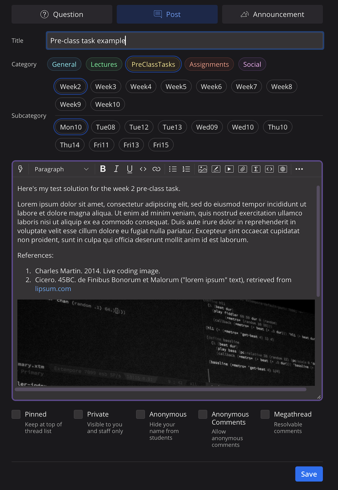

## Outline

- **Due date**: due at the start of _your_ tutorial
- **Mark weighting**: 1% per tutorial (total of 10%)
- **Submission**: submit your pre-lab tasks on [Edstem discussions](https://edstem.org/au/courses/24905/discussion)
- **Policies**: late submissions not accepted without an extension

## Description

_Pre-class_ and _In-class_ tasks are due in each tutorial. There are 10 tutorials in this course and one set of pre- and in-class tasks associated with each one.

The pre-class task includes a weekly post on the course forum (100-200 words) which will be discussed and developed during class.

In-class tasks are the main content of the tutorials which include conceptualising and discussing HCI topics, experimenting with prototyping and research methods, and collaborating with other students to develop and evaluate interactive system designs.

## Specification

Each week's pre-class task must:

- be no more than 200 words and no less than 100 words
- be a public post on the course forum in the appropriate category
- include an image if required by the task
- have a minimum of two references in [ACM reference format](https://www.acm.org/publications/authors/reference-formatting)
- include citation for any and all external sources, code, media, use of generative AI, or anything that you did not create yourself

## Submission Process

_Before_ your tutorial for the week:

1. Read the weekly tutorial materials to find out what specific tasks are required. You can find the pre-class tasks in a section under the heading "Pre-Class Tasks" and the in-class tasks in a section under the heading "In-Class Tasks".
2. Go to the course forum ([Edstem discussions](https://edstem.org/au/courses/24905/discussion))
3. Create a new post the category of your post set to "Tutorials" and the subcategory set to the correct week (e.g., "Week2") so that we can find it easily.
4. Don't forget to add any necessary images and at least two references.

For grading, note that:

- The pre-class task is graded on the basis of your post and discussion of this post in class.
- The in-class task is graded on your completion of tasks from the the tutorial material during class.

Your post might look like this:

## Notes

Note that if you do not attend class, you will not gain marks for either pre- or in-class tasks as both involve active discussion and collaboration with students in your tutorial group.

If you have a good reason that you cannot attend class and wish to attend a different tutorial instead you need to apply for an extension before the date of your tutorial.

## Marking Rubric

The Pre- and Post-Tutorial Tasks are worth 1 mark in each tutorial. The mark will be given by your tutor, following this rubric:

- 0: did not attend class, or attended with pre- or in-class tasks not completed to a satisfactory standard.
- 0.25: attended and attempted one task to a satisfactory or good standard.
- 0.5: attended and attempted both tasks to a satisfactory or good standard.
- 0.75: attended and completed both tasks with at least one at a very good or excellent standard.
- 1.0: attended and completed both tasks to a very good or excellent standard.

As there are 10 tutorials, the pre- and post-class tasks are worth a total of 10% of your final course grade.
