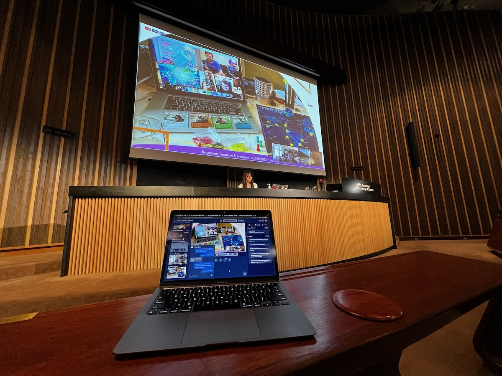

## Acknowledgement of Country

{ width=70% }

## Charles Martin (that's me!) {background-image="img/2016-charlesmartin-synth-profile.jpg"}

Senior Lecturer, ANU School of Computing

computer musician, percussionist, computer scientist

[homepage](https://charlesmartin.au)

[SMCCLAB: Sound, Music, and Creative Computing Lab](https://smcclab.github.io)

<!--  -->

# What is HCI?

:::::::::::::: {.columns}
::: {.column width="50%"}
It's "Human Computer Interaction".

> But what does that mean?
:::
::: {.column width="50%"}

:::
::::::::::::::

## What is Human Computer Interaction

Research that:

- considers how humans can and do use computers
- proposes computer systems (incl. software) that can be better used by humans
- uncovers the needs of different kinds of computer users
- works out how people can participate in designing computer systems
- understands the roles of computer systems in society, politics, social movements and beyond.

## Interdisciplinary Research

All HCI research is interdisciplinary:

- Computer Science
- Engineering
- Human Factors / Ergonomics
- Cognitive Science / Psychology
- Social Science
- Design

## A brief history of HCI...

:::::::::::::: {.columns}
::: {.column width="50%"}
Starting with **ergonomics & human factors**.

- 20th Century: Humans started to operate complex machines
- Post 1945: engineering focus on operator’s cognition, response, decisions, perceptions, etc
- Ergonomics or human factors coined in 1950s to describe the human requirements for designing machines and systems.
:::
::: {.column width="50%"}

:::
::::::::::::::

## HCI history: The computer

:::::::::::::: {.columns}
::: {.column width="50%"}
- Computing in the 1950s-70s meant mainframes and batch processing—normal people didn’t use computers!
- 1968: Douglas Engelbart introduced prototype concepts for interactive computing as we know it:
  - Mouse
  - GUI
  - Collaboration 
- Called the “mother of all demos”: <https://youtu.be/yJDv-zdhzMY>
:::
::: {.column width="50%"}

:::
::::::::::::::

## HCI history: The start of "users"

:::::::::::::: {.columns}
::: {.column width="50%"}
- ~1980s: big interest in using  computers in workplaces and homes
- Demand for computers to work for normal people (not just trained operators)
- 1983: first annual ACM [SIGCHI](https://sigchi.org) Conference (Special Interest Group on Computer-Human Interaction)

Now:

- SIGCHI publishes [~5000 publications per year](https://medium.com/sigchi/sigchi-annual-report-a147d5f98eeb) (more than 2x any other ACM SIG) across 26 conferences including _CHI_ (the big one).
:::
::: {.column width="50%"}

:::
::::::::::::::

## HCI history: The "wave" theory

- First wave: Human Factors in Computing (1980-1992)
  - Optimising/measuring efficiency, cognitive psychology approach, studying individual users. Lab setting.
- Second wave: Cognitive revolution — mind and computer coupled (1992-2006)
  - Optimise interactions, hypothesis testing, affordances, activity theory, user-centred design. Work environments.
- Third wave: Situated perspectives ([Bødker 2015](https://doi.org/10.1145/2804405)) (2006-)
  - Consumer tech, participation and sharing, pervasive computing, AR, tangible interaction, home environments,
- Fourth wave: Entanglement HCI ([Frauenberger 2019](https://doi.org/10.1145/3364998)) (2019-)
  - Computer and humans entangled in society: focus on values, accessibility, diversity, policy, law, ethics, individuals’ and society’s responsibilities

## What does HCI research involve?

:::::::::::::: {.columns}
::: {.column width="50%"}
- Understanding how computers are used in society.
- Working with people to understand how they use computers.
- Designing new human-computer interfaces (applications).
- Working with people (users) to design and evaluate the above.
:::
::: {.column width="50%"}

:::
::::::::::::::

# COMP3900/6390 Course Structure

- 12 lectures: every week, Kambri Cinema, here with **me!**
  - theory, content, explanation of skills, discussion, questions, comfy chairs!
- 10 tutorials: weeks 2--11, with your **tutor!**
  - activities, practice, discussion, _making_, _researching_, _doing_.
  - Pre-class and in-class tasks! (worth 1% of course mark for each tutorial, 10% total)
- 3 assignments/projects: by **yourself**
  - Prototype: _create a prototype that solves a problem_ (20%, due Monday week 5)
  - User Research: _conduct a small-scale user study_ (30%, due Monday week 9)
  - Final Project: _design a prototype and evaluate it with users_ (40%, due Monday week 13)

## Pre-class and in-class tasks

There are 10 tutorials in this course and one set of **marked** pre- and in-class tasks associated with each one. Worth 1% each week = 10% total over the semester.

- Pre-class task: a weekly post on the course forum (100-200 words) which will be discussed and developed during class
  - see the weekly tutorial description for the task specification
- In-class tasks: main content of the tutorials which includes 
  - conceptualising and discussing HCI topics, 
  - experimenting with prototyping and research methods, 
  - collaborating with other students,
  - **developing and evaluating interactive system designs**
- **In-person assessment.** If you don't attend your tutorial you will not get a mark without an extension.

## Assignments

- individual tasks, but require some collaboration
  - that is: you need to _study people_ in User Research and the Final Project, you will find people in your tutorial to study! (they will also find you!)
- assignments will involve 
  - _making_ (prototyping, sketching, coding, building, constructing, **designing**, soldering?)
  - _researching_ (reading, asking, analysing, measuring, discovering, finding, concluding)
  - _communicating_ (reflecting, discussing, referencing, writing, **presenting**)
- no late submissions permitted without an extension
- all submission is through [Gitlab](https://gitlab.cecs.anu.edu.au/comp3900/)

## last thing: referencing

Every assessment submission has a place for references.

You **must** provide at least two references

You **must** reference any code/ideas taken from other places (internet, books, classmates)

You **must** use ACM referencing format, look on the assessment pages for examples.

This is about integrity: **respect** for your **sources** and your **classmates**.

## who has a question?

