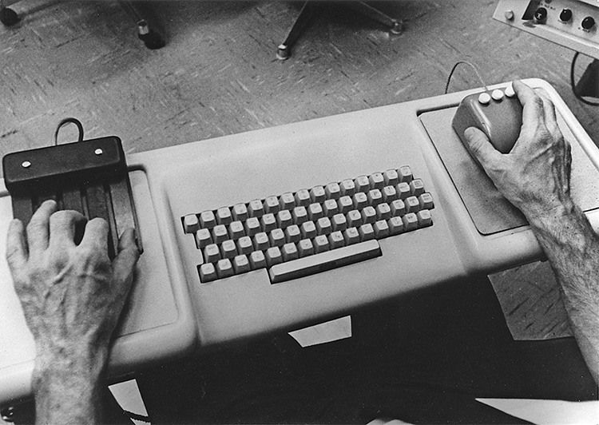
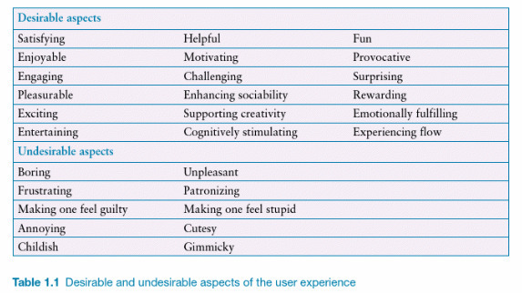
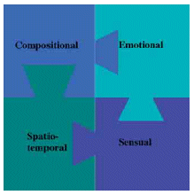
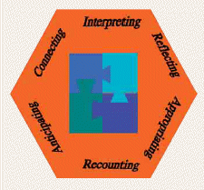
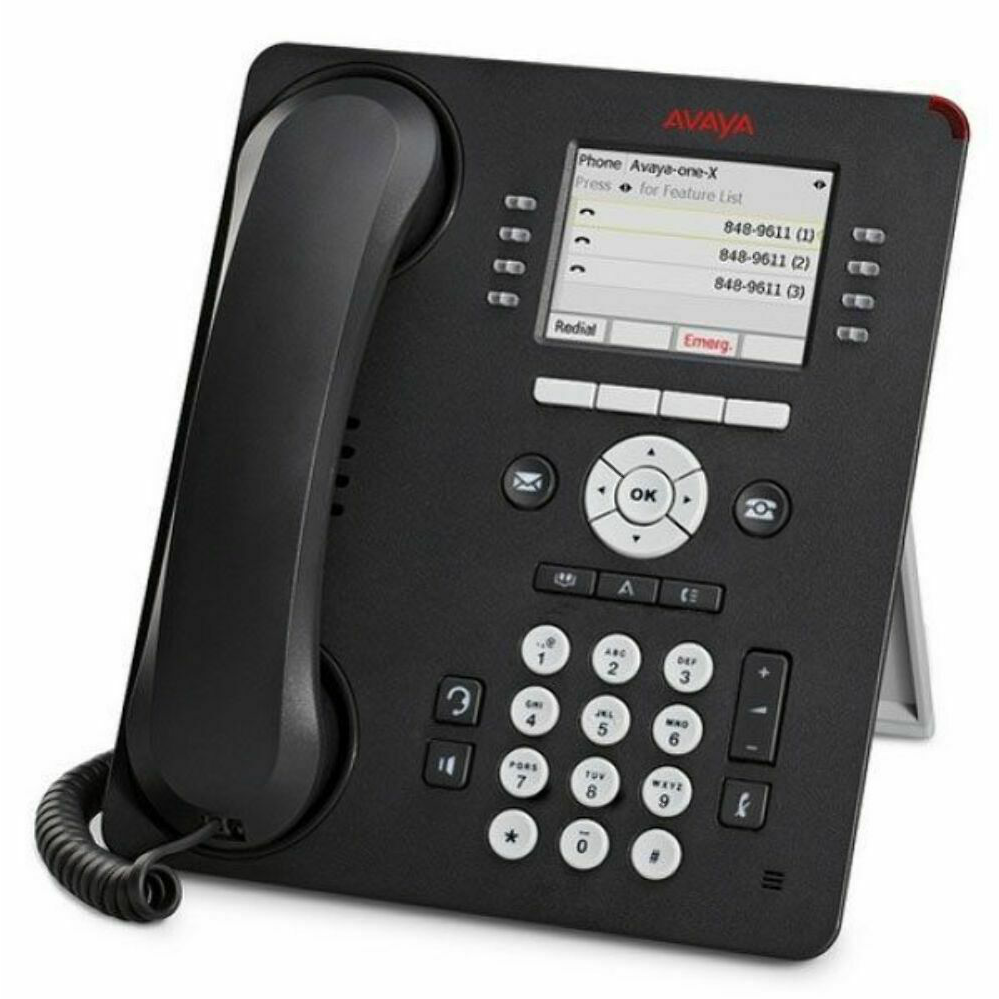

## Acknowledgement of Country

{ width=70% }

## Charles Martin (that's me!) {background-image="img/2016-charlesmartin-synth-profile.jpg"}

Senior Lecturer, ANU School of Computing

computer musician, percussionist, computer scientist

[homepage](https://charlesmartin.au)

[SMCCLAB: Sound, Music, and Creative Computing Lab](https://smcclab.github.io)

<!--  -->

# What is HCI?

:::::::::::::: {.columns}
::: {.column width="50%"}
It's "Human Computer Interaction".

> But what does that mean?
:::
::: {.column width="50%"}

:::
::::::::::::::

## What is Human Computer Interaction

Research that:

- considers how humans can and do use computers
- proposes computer systems (incl. software) that can be better used by humans
- uncovers the needs of different kinds of computer users
- works out how people can participate in designing computer systems
- understands the roles of computer systems in society, politics, social movements and beyond.

## Interdisciplinary Research

All HCI research is interdisciplinary:

- Computer Science
- Engineering
- Human Factors / Ergonomics
- Cognitive Science / Psychology
- Social Science
- Design

## A brief history of HCI...

:::::::::::::: {.columns}
::: {.column width="50%"}
Starting with **ergonomics & human factors**.

- 20th Century: Humans started to operate complex machines
- Post 1945: engineering focus on operator’s cognition, response, decisions, perceptions, etc
- Ergonomics or human factors coined in 1950s to describe the human requirements for designing machines and systems.
:::
::: {.column width="50%"}

:::
::::::::::::::

## HCI history: The computer

:::::::::::::: {.columns}
::: {.column width="50%"}
- Computing in the 1950s-70s meant mainframes and batch processing—normal people didn’t use computers!
- 1968: Douglas Engelbart introduced prototype concepts for interactive computing as we know it:
  - Mouse
  - GUI
  - Collaboration 
- Called the “mother of all demos”: <https://youtu.be/yJDv-zdhzMY>
:::
::: {.column width="50%"}

:::
::::::::::::::

## HCI history: The start of "users"

:::::::::::::: {.columns}
::: {.column width="50%"}
- ~1980s: big interest in using  computers in workplaces and homes
- Demand for computers to work for normal people (not just trained operators)
- 1983: first annual ACM [SIGCHI](https://sigchi.org) Conference (Special Interest Group on Computer-Human Interaction)

Now:

- SIGCHI publishes [~5000 publications per year](https://medium.com/sigchi/sigchi-annual-report-a147d5f98eeb) (more than 2x any other ACM SIG) across 26 conferences including _CHI_ (the big one).
:::
::: {.column width="50%"}

:::
::::::::::::::

## HCI history: The "wave" theory

- First wave: Human Factors in Computing (1980-1992)
  - Optimising/measuring efficiency, cognitive psychology approach, studying individual users. Lab setting.
- Second wave: Cognitive revolution — mind and computer coupled (1992-2006)
  - Optimise interactions, hypothesis testing, affordances, activity theory, user-centred design. Work environments.
- Third wave: Situated perspectives ([Bødker 2015](https://doi.org/10.1145/2804405)) (2006-)
  - Consumer tech, participation and sharing, pervasive computing, AR, tangible interaction, home environments,
- Fourth wave: Entanglement HCI ([Frauenberger 2019](https://doi.org/10.1145/3364998)) (2019-)
  - Computer and humans entangled in society: focus on values, accessibility, diversity, policy, law, ethics, individuals’ and society’s responsibilities

## What does HCI research involve?

:::::::::::::: {.columns}
::: {.column width="50%"}
- Understanding how computers are used in society.
- Working with people to understand how they use computers.
- Designing new human-computer interfaces (applications).
- Working with people (users) to design and evaluate the above.
:::
::: {.column width="50%"}

:::
::::::::::::::

# COMP3900/6390 Course Structure

- 12 lectures: every week, Kambri Cinema, here with **me!**
  - theory, content, explanation of skills, discussion, questions, comfy chairs!
- 10 tutorials: weeks 2--11, with your **tutor!**
  - activities, practice, discussion, _making_, _researching_, _doing_.
  - Pre-class and in-class tasks! (worth 1% of course mark for each tutorial, 10% total)
- 3 assignments/projects: by **yourself**
  - Prototype: _create a prototype that solves a problem_ (20%, due Monday week 5)
  - User Research: _conduct a small-scale user study_ (30%, due Monday week 9)
  - Final Project: _design a prototype and evaluate it with users_ (40%, due Monday week 13)

## Pre-class and in-class tasks

There are 10 tutorials in this course and one set of **marked** pre- and in-class tasks associated with each one. Worth 1% each week = 10% total over the semester.

- Pre-class task: a weekly post on the course forum (100-200 words) which will be discussed and developed during class
  - see the weekly tutorial description for the task specification
- In-class tasks: main content of the tutorials which includes 
  - conceptualising and discussing HCI topics, 
  - experimenting with prototyping and research methods, 
  - collaborating with other students,
  - **developing and evaluating interactive system designs**
- **In-person assessment.** If you don't attend your tutorial you will not get a mark without an extension.

## Assignments

- individual tasks, but require some collaboration
  - that is: you need to _study people_ in User Research and the Final Project, you will find people in your tutorial to study! (they will also find you!)
- assignments will involve 
  - _making_ (prototyping, sketching, coding, building, constructing, **designing**, soldering?)
  - _researching_ (reading, asking, analysing, measuring, discovering, finding, concluding)
  - _communicating_ (reflecting, discussing, referencing, writing, **presenting**)
- no late submissions permitted without an extension
- all submission is through [Gitlab](https://gitlab.cecs.anu.edu.au/comp3900/)

## last thing: referencing

Every assessment submission has a place for references.

You **must** provide at least two references

You **must** reference any code/ideas taken from other places (internet, books, classmates)

You **must** use ACM referencing format, look on the assessment pages for examples.

This is about integrity: **respect** for your **sources** and your **classmates**.

## who has a question?

> ????

# Usability And User Experience

---

## Activity: Positive and Negative Experiences with Technology

Can you talk about: 

> An example of a technology you find easy/interesting /enjoyable to use (and why)

and:

> An example of a technology you find difficult/annoying/ frustrating to use (and why)

---

## Two designs for a voicemail system

. Image Source: Sharp, Preece, and Rogers 2019, p.3](img/01_01_usability_1.png)

 on [Unsplash](https://unsplash.com/s/photos/landline)](img/01_01_usability_2.jpg)

---

## Poll Time!

> Is the marble answering machine a good design?

- Yes?
- No?
- Maybe?

---

## How do we design with users in mind?

* Not a simple yes or no question:
* Depends on the users, settings, contexts, and activities in which it is used
* Thinking about:
  * The  __people __ who are going to use our design
  * The ways in which people  __think, work, play, interact__
  * The  __places and settings __ in which the design is used
  * The  __tasks or activities __ for which the design will be used
  * The  __interfaces and devices __ that people already use
  * People’s  __needs, values, and aspirations__

---

## What is interaction design?

> “Designing interactive products to support the way people communicate and interact in their everyday and working lives”

(Sharp, Preece, and Rogers 2019, p.9)

---

## User experience

> “How people feel about a product and their pleasure and satisfaction when using it, looking at it, holding it, and opening and closing it” (Sharp et al. 2019, p.13).

---

## The Experience of using an interactive system

> “It is not enough that we build products that function, that are understandable and usable, we also need to build joy and excitement, pleasure and fun, and yes, beauty into people’s lives" (Norman, 2004)

 on [Unsplash](https://unsplash.com/s/photos/user-experience)](img/01_01_usability_5.jpg)

---

## Technology as Experience Framework 

Source: [Technology as experience (McCarthy and Wright, 2004)](https://dl.acm.org/doi/10.1145/1015530.1015549)

::: notes
Threads of experience

- Compositional: How do the elements of an experience fit together to form a coherent whole?
- Sensual: What does the design and texture and the overall atmosphere make us feel?
- Emotional: What emotions color the experience for us?
- Spatio-temporal: What effects do place and time have on our experience?

Processes

- Anticipating: We never come to technology unprejudiced.
- Connecting: We make a judgment in an instant and without much thought.
- Interpreting: We work out what's going on and how we feel about it.
- Reflecting: We examine and evaluate what is happening in an interaction.
- Appropriating: We work out how a new experience fits with other experiences we have had and with our sense of self.
- Recounting: We enjoy storytelling and make sense of experience in stories.
:::

---

## Usability and Usability Goals

- Effective to use (effectiveness)
- Efficient to use (efficiency)
- Safe to use (safety)
- Having good utility (utility)
- Easy to learn (learnability)
- Easy to remember how to use (memorability)

---

## Usability Goal 1: Effectiveness

> “How good a product is at doing what it is supposed to do” (Sharp et al. 2019, p.19)

> “Is the product capable of allowing people to learn, carry out their work efficiently, access the information that they need, or buy the goods that they want?” (ibid)

---

## Usability Goal 2: Efficiency

> “The way a product support users in carrying out their tasks” (Sharp et al. 2019, p.20)
> “Once users have learned how to use a product to carry out their tasks, can they sustain a high level of productivity?” (ibid)

 on [Unsplash](https://unsplash.com/s/photos/touch-id)](img/01_01_usability_10.png)

---

## Usability Goal 3: Safety

> “Protecting users from dangerous conditions and undesirable situations” (Sharp et al. 2019, p.20)
> “What is the range of errors that are possible using the product, and what measures are there to permit users to recover easily from them?” (ibid)

---

## Usability Goal 4: Utility

> “The extent to which a product provides the right kind of functionality so users can do what they want to do” (Sharp et al. 2019, p.20)
> “Does the product provide an appropriate set of functions that will enable users to carry out all of their tasks in the way they want to do them?” (ibid)

 on [Unsplash](https://unsplash.com/s/photos/graphic-design)](img/01_01_usability_14.jpg)

---

## Usability Goal 5: Learnability

> “How easy a system is to learn to use” (Sharp et al. 2019, p.20)
> “Is it possible for the user to work out how to use the product by exploring the interface and trying certain actions? How hard will it be to learn the whole set of functions in this way?” (ibid)

](img/01_01_usability_15.jpg)

](img/01_01_usability_16.jpg)

---

## Usability Goal 6: Memorability

> “How easy a product is to remember how to use, once learned” (Sharp et al. 2019, p.21)
> “What types of interface support have been provided to help users remember how to carry out tasks, especially for products and operations they use infrequently?” (ibid)

](img/01_01_usability_17.png)

---

## Video: Usefulness, Utility, Usability

](img/01_01_usability_18.png)

---

## Design Principles

- Visibility
- Feedback
- Constraints
- Consistency
- Affordances

(Sharp, Preece, and Rogers 2019, pp.26-32)

---

## Understanding Users

- Users are not all the same
- Different ages, cultures, backgrounds, abilities, interests
- Various qualitative design research methods available for understanding users and their contexts
- Don’t assume; research and find out.
- Accessibility and inclusivity are important

Images from the paper “Never Too Old: Engaging Retired People Inventing the Future with MaKey MaKey” (Rogers et al 2014)
