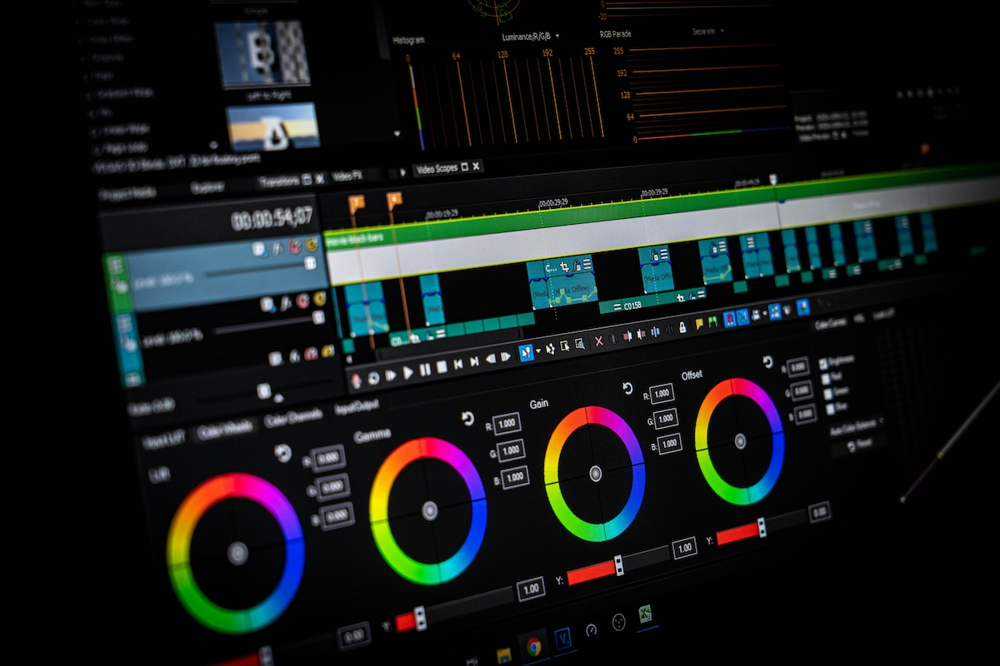

## Acknowledgement of Country

{ width=70% }

## Charles Martin (that's me!) {background-image="img/2016-charlesmartin-synth-profile.jpg"}

Senior Lecturer, ANU School of Computing

computer musician, percussionist, computer scientist

[homepage](https://charlesmartin.au)

[SMCCLAB: Sound, Music, and Creative Computing Lab](https://smcclab.github.io)

<!--  -->

# What is HCI?

:::::::::::::: {.columns}
::: {.column width="50%"}
It's "Human Computer Interaction".

> But what does that mean?
:::
::: {.column width="50%"}

:::
::::::::::::::

## What is Human Computer Interaction

Research that:

- considers how humans can and do use computers
- proposes computer systems (incl. software) that can be better used by humans
- uncovers the needs of different kinds of computer users
- works out how people can participate in designing computer systems
- understands the roles of computer systems in society, politics, social movements and beyond.

## Interdisciplinary Research

All HCI research is interdisciplinary:

- Computer Science
- Engineering
- Human Factors / Ergonomics
- Cognitive Science / Psychology
- Social Science
- Design

## A brief history of HCI...

:::::::::::::: {.columns}
::: {.column width="50%"}
Starting with **ergonomics & human factors**.

- 20th Century: Humans started to operate complex machines
- Post 1945: engineering focus on operator’s cognition, response, decisions, perceptions, etc
- Ergonomics or human factors coined in 1950s to describe the human requirements for designing machines and systems.
:::
::: {.column width="50%"}
{width=40%}
:::
::::::::::::::

## HCI history: The computer

:::::::::::::: {.columns}
::: {.column width="50%"}
- Computing in the 1950s-70s meant mainframes and batch processing—normal people didn’t use computers!
- 1968: Douglas Engelbart introduced prototype concepts for interactive computing as we know it:
  - Mouse
  - GUI
  - Collaboration 
- Called the “mother of all demos”: <https://youtu.be/yJDv-zdhzMY>
:::
::: {.column width="50%"}

:::
::::::::::::::

## HCI history: The start of "users"

:::::::::::::: {.columns}
::: {.column width="50%"}
- ~1980s: big interest in using  computers in workplaces and homes
- Demand for computers to work for normal people (not just trained operators)
- 1983: first annual ACM [SIGCHI](https://sigchi.org) Conference (Special Interest Group on Computer-Human Interaction)

Now:

- SIGCHI publishes [~5000 publications per year](https://medium.com/sigchi/sigchi-annual-report-a147d5f98eeb) (more than 2x any other ACM SIG) across 26 conferences including _CHI_ (the big one).
:::
::: {.column width="50%"}
{width=50%}
:::
::::::::::::::

## HCI history: The "wave" theory

- First wave: Human Factors in Computing (1980-1992)
  - Optimising/measuring efficiency, cognitive psychology approach, studying individual users. Lab setting.
- Second wave: Cognitive revolution — mind and computer coupled (1992-2006)
  - Optimise interactions, hypothesis testing, affordances, activity theory, user-centred design. Work environments.
- Third wave: Situated perspectives ([Bødker 2015](https://doi.org/10.1145/2804405)) (2006-)
  - Consumer tech, participation and sharing, pervasive computing, AR, tangible interaction, home environments,
- Fourth wave: Entanglement HCI ([Frauenberger 2019](https://doi.org/10.1145/3364998)) (2019-)
  - Computer and humans entangled in society: focus on values, accessibility, diversity, policy, law, ethics, individuals’ and society’s responsibilities

## What does HCI research involve?

:::::::::::::: {.columns}
::: {.column width="50%"}
- Understanding how computers are used in society.
- Working with people to understand how they use computers.
- Designing new human-computer interfaces (applications).
- Working with people (users) to design and evaluate the above.
:::
::: {.column width="50%"}

:::
::::::::::::::

## HCI again in fewer words...

_In short, this is what we will do in this course._

1. Understanding people

2. Designing interfaces

3. Evaluating interfaces

# COMP3900/6390 Course Structure

- 12 lectures: every week, Kambri Cinema, here with **me!**
  - theory, content, explanation of skills, discussion, questions, comfy chairs!
- 10 tutorials: weeks 2--11, with your **tutor!**
  - activities, practice, discussion, _making_, _researching_, _doing_.
  - Pre-class and in-class tasks! (worth 1% of course mark for each tutorial, 10% total)
- 3 assignments/projects: by **yourself**
  - Prototype: _create a prototype that solves a problem_ (20%, due Monday week 5)
  - User Research: _conduct a small-scale user study_ (30%, due Monday week 9)
  - Final Project: _design a prototype and evaluate it with users_ (40%, due Monday week 13)

## Pre-class and in-class tasks

There are 10 tutorials in this course and one set of **marked** pre- and in-class tasks associated with each one. Worth 1% each week = 10% total over the semester.

- Pre-class task: a weekly post on the course forum (100-200 words) which will be discussed and developed during class
  - see the weekly tutorial description for the task specification
- In-class tasks: main content of the tutorials which includes 
  - conceptualising and discussing HCI topics, 
  - experimenting with prototyping and research methods, 
  - collaborating with other students,
  - **developing and evaluating interactive system designs**
- **In-person assessment.** If you don't attend your tutorial you will not get a mark without an extension.

## Week 2 Tutorial: Making

### Pre-class task: 

Choose a computer or digital technology that played an important role in your early life. It could be a device, an application, or a website. Upload an image of this technology on the forum. You can upload a photo, sketch, or an image found online (remember to provide a reference). Write a reflective post (100-200 words) about this technology (see prompts on canvas)

### In-class tasks:

1. talk about an interactive technology that is meaningful to you
2. think and talk about usability and user experience
3. do some arts and crafts (make zines) to reflect on this to start off the semester

## Assignments

- individual tasks, but require some collaboration
  - that is: you need to _study people_ in User Research and the Final Project, you will find people in your tutorial to study! (they will also find you!)
- assignments will involve 
  - _making_ (prototyping, sketching, coding, building, constructing, **designing**, soldering?)
  - _researching_ (reading, asking, analysing, measuring, discovering, finding, concluding)
  - _communicating_ (reflecting, discussing, referencing, writing, **presenting**)
- no late submissions permitted without an extension
- all submission is through [Gitlab](https://gitlab.cecs.anu.edu.au/comp3900/)

## Assignment 1: Prototype an Animal Computer Interaction

TL;DR: Animals are smart now. Sketch and prototype a computer system for an everyday task that works for one kind of animal as well as humans. More details on Canvas.

{width=40%}

## last thing: referencing

Every assessment submission has a place for references.

You **must** provide at least two references

You **must** reference any code/ideas taken from other places (internet, books, classmates)

You **must** use ACM referencing format, look on the assessment pages for examples

You **must** reference any text/code/ideas drawn from generative AI systems

This is about integrity: **respect** for your **sources** and your **classmates**.

## who has a question?

> ????

# Usability

{width=60%}

## Another interface

{width=60%}

## A Week 1 favourite for ANU lecturers...

{width=60%}

## More interfaces...

{width=60%}

## Activity: Positive and Negative Experiences with Technology

Turn to the person next to you, find out their name, and then discuss:

> An example of a technology you find easy/interesting/enjoyable to use (and why)

and:

> An example of a technology you find difficult/annoying/frustrating to use (and why)

We'll chat for 3 minutes and then share a few with the room.

## How do we create computing systems for people?

Depends on the users, settings, contexts, and activities. Need to consider:

- __people__ who are going to use our system
- how they __think, work, play, interact__
- __places and settings__ in which the system is used
- __tasks or activities__ for which the system will be used
- __interfaces and devices__ that people already use
- people's __needs, values, and aspirations__

<!-- ## What is interaction design?

> “Designing interactive products to support the way people communicate and interact in their everyday and working lives” [@rogers-beyond-hci:2023, p.9] -->

## Usability Goals (Designing User Interfaces)

Some practical goals that can be tested:

1. Time to learn
2. Speed of performance
3. Rate of errors
4. Retention over time
5. Subjective satisfaction

[@shneiderman-hci:2018] (one version, another coming right up...)

## Usability Goals (Interaction Design, Beyond HCI)

:::::::::::::: {.columns}
::: {.column width="50%"}
- Effective to use (effectiveness)
- Efficient to use (efficiency)
- Safe to use (safety)
- Having good utility (utility)
- Easy to learn (learnability)
- Easy to remember how to use (memorability)

This version from: [@rogers-beyond-hci:2023]
:::
::: {.column width="40%"}
{width=100%}
:::
::::::::::::::

## Usability Goal 1: Effectiveness

:::::::::::::: {.columns}
::: {.column width="50%"}
- That it _works_, the task can be completed.
- How well can the task be completed?
- Think quality of the output.
:::
::: {.column width="50%"}
 on [Unsplash](https://unsplash.com/s/photos/landline)](img/01_01_usability_2.jpg){width=80%}
:::
::::::::::::::

## Usability Goal 2: Efficiency

:::::::::::::: {.columns}
::: {.column width="40%"}
- The _way_ the product supports the task.
- Support high productivity?
- Use less energy?
:::
::: {.column width="60%"}
{width=100%}
:::
::::::::::::::

## Usability Goal 3: Safety

:::::::::::::: {.columns}
::: {.column width="40%"}
- Protecting users from errors
- Preventing undesirable outcomes
- Recovering when mistakes are made (if not when!)
:::
::: {.column width="60%"}
{width=100%}
:::
::::::::::::::

## Usability Goal 4: Utility

:::::::::::::: {.columns}
::: {.column width="40%"}
- The right kind of functionality for the user's needs.
- Appropriate functions to carry out tasks
- The tasks can be completed in the right way.
:::
::: {.column width="60%"}
](img/01_01_usability_14.jpg){width=100%}
:::
::::::::::::::

## Usability Goal 5: Learnability

:::::::::::::: {.columns}
::: {.column width="40%"}
- How easy is it to learn the system?
- Is it _intuitive_?
- Does it take time/training?
:::
::: {.column width="60%"}
{width=100%}
:::
::::::::::::::

## Usability Goal 6: Memorability

:::::::::::::: {.columns}
::: {.column width="40%"}
- Will users remember how to use it later?
- Are there supports for infrequent functions?
:::
::: {.column width="60%"}
](img/01_01_usability_17.png){width=100%}
:::
::::::::::::::

# User Experience

{width=60%}

## Usability vs Joy

:::::::::::::: {.columns}
::: {.column width="40%"}
> “It is not enough that we build products that function, that are understandable and usable, we also need to build joy and excitement, pleasure and fun, and yes, beauty into people’s lives" [@Norman:2013]

How can we test for joy? Is this compatible with the usability goals?
:::
::: {.column width="60%"}
{width=100%}

<!--  on [Unsplash](https://unsplash.com/s/photos/user-experience)](img/01_01_usability_5.jpg){width=100%} -->
:::
::::::::::::::

## Another example...

{width=60%}

## User experience

> “How people feel about a product and their pleasure and satisfaction when using it, looking at it, holding it, and opening and closing it” [@rogers-beyond-hci:2023, p.13]

**Desirable aspects:** Satisfying, Helpful, Fun, Enjoyable, Motivating, Provocative, Engaging, Challenging, Surprising, Pleasurable, Enhances Socialibility, Rewarding, Exciting, Supporting creativity, Emotionally fulfilling, Cognitively stimulating, Experiencing flow.

**Undesirable aspects:** Boring, Unpleasant, Frustrating, Patronising, Makes you feel guilty, Annoying, Cutesy, Childish, Gimmicky.

## Usability vs User Experience

Rogers/Sharpe/Preece illustrate user experience as surrounding usability.

{width=35%}

## Thinking about Technology as Experience

Can we unpack how we [experience technology?](https://dl.acm.org/doi/10.1145/1015530.1015549) [@mccarthy-wright:2004] 

:::::::::::::: {.columns}
::: {.column width="50%"}

{width=50%}

Compositional, Sensual, Emotional, Spatio-temporal.
:::
::: {.column width="50%"}

{width=50%}

Anticipating, Connecting, Interpreting, Reflecting, Appropriating, Recounting.
:::
::::::::::::::

::: notes
Threads of experience

- Compositional: How do the elements of an experience fit together to form a coherent whole?
- Sensual: What does the design and texture and the overall atmosphere make us feel?
- Emotional: What emotions color the experience for us?
- Spatio-temporal: What effects do place and time have on our experience?

Processes

- Anticipating: We never come to technology unprejudiced.
- Connecting: We make a judgment in an instant and without much thought.
- Interpreting: We work out what's going on and how we feel about it.
- Reflecting: We examine and evaluate what is happening in an interaction.
- Appropriating: We work out how a new experience fits with other experiences we have had and with our sense of self.
- Recounting: We enjoy storytelling and make sense of experience in stories.
:::

## Threads of Experience:

- Compositional: How do the elements of an experience fit together to form a coherent whole?
- Sensual: What does the design and texture and the overall atmosphere make us feel?
- Emotional: What emotions color the experience for us?
- Spatio-temporal: What effects do place and time have on our experience?

## Experience Processes

- Anticipating: We never come to technology unprejudiced.
- Connecting: We make a judgment in an instant and without much thought.
- Interpreting: We work out what's going on and how we feel about it.
- Reflecting: We examine and evaluate what is happening in an interaction.
- Appropriating: We work out how a new experience fits with other experiences we have had and with our sense of self.
- Recounting: We enjoy storytelling and make sense of experience in stories.

## Two designs for a voicemail system

:::::::::::::: {.columns}
::: {.column width="50%"}
. (Durrell Bishop, 1992)](img/01_01_usability_1.png){width=100%}
:::
::: {.column width="50%"}
 on [Unsplash](https://unsplash.com/s/photos/landline)](img/01_01_usability_2.jpg){width=100%}
:::
::::::::::::::

## Poll Time!

> Is the marble answering machine a good design?

- Yes?
- No?
- Maybe?

> Why?

## Video: Usefulness, Utility, Usability

](img/01_01_usability_18.png){width=60%}

# Improving Usability and Experience

What can we do to ensure good usability **and** good user experience?

## Design Principles

:::::::::::::: {.columns}
::: {.column width="50%"}
- Visibility
- Feedback
- Constraints
- Mapping
- Consistency
- Affordances

From Design of Everyday things [@Norman:2013]
:::
::: {.column width="50%"}

Which mapping is _natural_? (Source: Wikimedia)
:::
::::::::::::::

## Understanding Users

:::::::::::::: {.columns}
::: {.column width="50%"}
- Users are not all the same
- Different ages, cultures, backgrounds, abilities, interests
- Various research methods available for understanding users and their contexts
- Don’t assume; research and find out.
- Accessibility and inclusivity are important
:::
::: {.column width="50%"}
{width=40%}
{width=40%}

Images from the paper “Never Too Old: Engaging Retired People Inventing the Future with MaKey MaKey” [@rogers-never-old:2014]
:::
::::::::::::::

## Conceptual Models

:::::::::::::: {.columns}
::: {.column width="40%"}
- **Model:** a simplified description of a system or process
- **Conceptual model:** high-level description of how a system is organized and operates
- Includes:
  - Metaphors, analogies
  - Concepts and their relationships
  - Mappings
- These elements inform the interaction design and user experiences
:::
::: {.column width="60%"}
](img/01_02_conceptualising_interaction_1.png)
:::
::::::::::::::

## Video: What is a conceptual model?

](img/01_02_conceptualising_interaction_0.png)

## Interface Metaphors

:::::::::::::: {.columns}
::: {.column width="40%"}
Exploit similarities to user's knowledge of other domains. E.g., 

- **Cards:**  Familiar, strong associations (playing, business, credit), flick through, sort, themed, structured
- **Desktop** and **Recycle bin**
- **Shopping trolley** and **checkout**
- **_Surfing the web_**
:::
::: {.column width="60%"}
![A highly metaphorical interface. [@gentner-anti-mac:1996]](img/gentner-anti-mac-interface.jpg){width=100%}
:::
::::::::::::::

## Interaction Types

:::::::::::::: {.columns}
::: {.column width="40%"}
Five types of interaction models:

- Instructing
- Conversing
- Manipulating
- Exploring
- Responding
:::
::: {.column width="60%"}
](img/01_02_conceptualising_interaction_7.jpg){width=30%}
](img/01_02_conceptualising_interaction_8.jpg){width=30%}
](img/01_02_conceptualising_interaction_9.jpg){width=30%}
:::
::::::::::::::

## Questions

Who has a question?

# References {.allowframebreaks}
