## Announcements

## Plan for the class

- Design
- Ideation
- Prototyping

# The Interaction Design Process

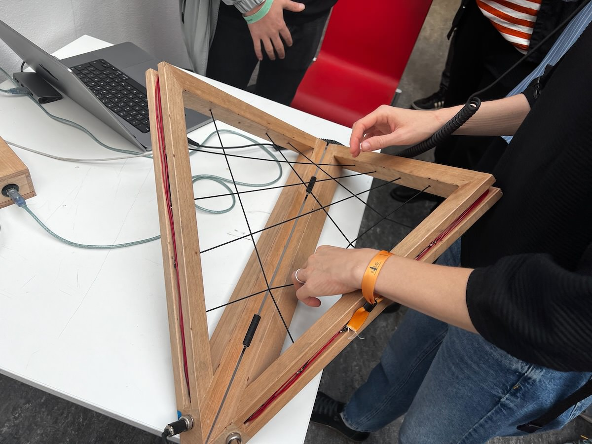{width=50%}

## Creating systems that work for people

:::::::::::::: {.columns}
::: {.column width="40%"}
Interaction design involves creating systems that work for people.

- discovering requirements
- defining needs
- ideating possible solutions
- producing prototypes
- evaluating systems
:::
::: {.column width="60%"}
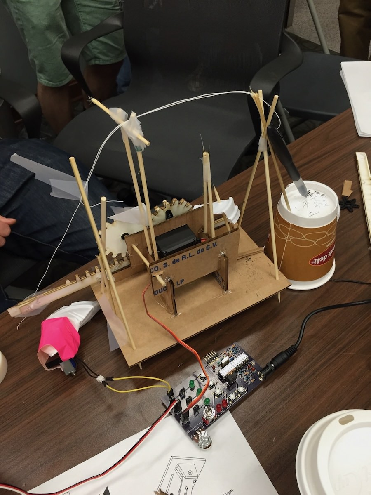{width=50%}
:::
::::::::::::::

## Double Diamond Model

![The double diamond model of design [adapted from @double-diamond-model]](img/hci-design-double-diamond.png){width=80%}

## Design Stages

:::::::::::::: {.columns}
::: {.column width="40%"}
1. _Discover_: understand the problem and the people affected
2. _Define_: define the problem clearly so that it can be addressed
3. _Develop_: create ideas, prototypes, sketches, etc, that might address the problem
4. _Deliver_: test potential solutions to find promising directions, and iterate
:::
::: {.column width="60%"}
![The double diamond model of design [adapted from @double-diamond-model]](img/hci-design-double-diamond.png){width=100%}
:::
::::::::::::::

## Who is involved in design?

Usually a wide range of people are involved or affected by a design process. We call them _stakeholders_. Stakeholders includes not just the potential users of a system, but others who are not.

For example:

- **users**
- customers
- developers
- researchers
- managers / product owners
- government bodies
- non-government organisations (NGOs)

## Degrees of Involvement

:::::::::::::: {.columns}
::: {.column width="55%"}
- _Personas_: limited involvement with users, but use "fake" user personas to help frame design.

- _Face-to-face involvement_: small groups or individuals take part in information-gathering or evaluation settings[^1]

- _Crowd-sourced involvement_: involvement from large numbers of people (at a distance) through surveys, distributed projects, crowd-sourcing, community engagement

- _Participatory design:_ users/stakeholders are highly involved and central to creation activities. That is, the users are actually ideating and making the prototypes (also called co-design, co-creation).

[^1]: This one is pretty normal in academic HCI research.
:::
::: {.column width="45%"}
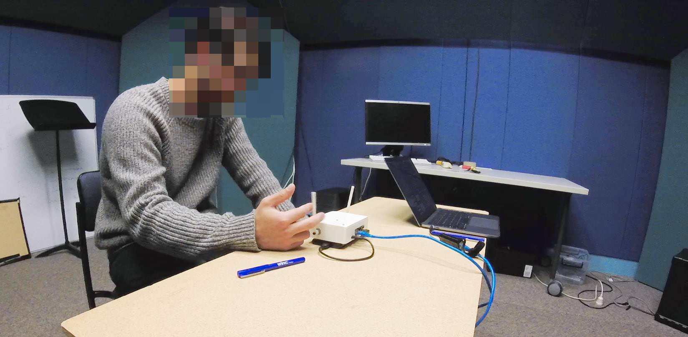{width=100%}
:::
::::::::::::::

## User-centred design principles

From _Designing for Usability: Key Principles and What Designers Think_ [@gould-usability:1985]

- _Early focus on users and tasks_: who are the users? what are they like? what are the tasks?

- _Empirical measurement_: users should **use** simulations and prototypes to carry out work. observe, record, and analyse.

- _Iterative design_: when problems are found in testing, they must be fixed. design, test, measure, repeat.

## People-centred design

:::::::::::::: {.columns}
::: {.column width="60%"}
Expanding from "users" to "people" with more details [@rogers-beyond-hci:2023]

- Peoples's tasks and goals are the driving force behind development.
- People's behaviour and context of use are studied, and the system is designed to support them.
- People's characteristics are captured and designed for.
- Users and other stakeholders are consulted throughout development from earliest phases to the latest.
- All design decisions are taken within the context of use, people's activities, and their environment.
:::
::: {.column width="40%"}

:::
::::::::::::::

## Interaction Design Lifecycle

![An interaction design lifecycle [adapted from @rogers-beyond-hci:2023]](img/hci-design-lifecycle.png){width=60%}

## Connecting to HCI

:::::::::::::: {.columns}
::: {.column width="50%"}
Design and HCI are _related_ but _not the same_.

In the double diamond model:

- _Discover_ and _Define_ stages are highly related to "uncovers the needs of different kinds of computer users" (from week 1)
- _Develop_ and _Deliver_ are more related to "proposes computer systems (incl. software) that can be better used by humans"

Some HCI research doesn't fit well into double diamond, it might be more technical and speculative, inventing technologies for computing systems that are _not yet common or popular_ [e.g. @je-elevate:2021].
:::
::: {.column width="50%"}
![A VR walkable interface [@je-elevate:2021]](img/elevate_je2021.png){width=80%}
:::
::::::::::::::

# Discovering Requirements

![Image: [@rogers-beyond-hci:2023, s11.2]](img/05_03_discovering_requirements_0.png){width=50%}

## What is a requirement?

:::::::::::::: {.columns}
::: {.column width="50%"}
> “A statement about an intended product that specifies what it is expected to do and how it will perform” [@rogers-beyond-hci:2023, p.387]

- Discovered through targeted activities or tangentially throughout the design process
- Evolve during design
- Different levels of abstraction and detail
- Needed to avoid misunderstanding and miscommunication
:::
::: {.column width="40%"}
![Image: [@rogers-beyond-hci:2023, s11.2]](img/05_03_discovering_requirements_0.png)
:::
::::::::::::::

## Defining a requirement

:::::::::::::: {.columns}
::: {.column width="50%"}
- Requirements can be captured casually, e.g., "app needs to be fast"
- Can be useful to have more details, precision about the requirements, who needs them, and why.
- Formal methods exist for capturing requirements in complex projects
- Epics, user stories in Agile methodologies
- Volere "Atomic Requirements Shell" (see figure)
- _"Description, Rationale, Source, Fit criterion, Customer satisfaction..."_ 
:::
::: {.column width="50%"}
![[@rogers-beyond-hci:2023, s11.3]](img/05_03_discovering_requirements_2.png){width=60%}
:::
::::::::::::::

## User stories

Communicates a requirements between stakeholders. Have the generic form:

`As a <role>, I want <behaviour> so that I can <benefit>`

e.g.,:

- "As a student, I want to select choose a tutorial time that doesn't clash with other activities, so that I can attend all my classes in a week."
- "As a lecturer, I want to adjust the number of students in tutorials, so that I can provide a good learning experience."

A user story is a simple way to connect a requirement to a particular type of user in a particular situation. In agile, user stories can be grouped into larger arrangements called "epics" and even bigger groups called "initiatives".

## Types of requirements

- _Functional requirements_: What the product will do

- _Data requirements_: type, properties of data involved in an interactive system

- _Environmental requirements_: context of use, what are the circumstances in which interaction happens?

  - _Phsyical environment_: noise, lighting, movement, etc
  - _Social environment_: sharing data, collaboration
  - _Support environment_: assistance, training or help available or integrated
  - _Technical environment_: technologies available for the system (phone, watch, laptop, supercomputer?) or technical limitations

- _User characteristics_: abilities, skills, attributes of users

- _Usability and user experience goals_: what goals (see last week) prioritised and tracked?

## Activity

Let's think of some design requirements:

> A voice-activated smart home assistant that helps individuals control lighting and temperature.

> A phone-based ordering system for a restaurant.

> A humanoid robot for assisting computer science students in computer labs.

## Data Gathering

There are lots of ways to discover requirements, some examples are below:

- **Observation and Ethnography**: observing people in real situations
- **Diaries and interviews**: (aka, asking), talk to people about their requirements, or ask them to record information
- **Focus Group, User Study**: talking with one or multiple people
- **Questionnaires**: asking people to answer specific questions
- **Cultural Probes**: sending arts & crafts materials to users to find out about their life/needs [@gaver-cultural-probes]
- **Contextual Inquiry**: researcher immersed in context of use, visits the participant and interviews them in context [@contextual-design:1997]

In this course we focus on _interviews_ and _user studies_ as methods for data gathering. Our focus is on the evaluation stage of design, but these methods can work at the discovery stage as well.

## Personas and Scenarios

:::::::::::::: {.columns}
::: {.column width="50%"}
More detailed that a user story, separating out:

- the person, their characteristics, motivations, etc (**persona**)
- their story, when, where, how, as a sequence of events (**scenario**)
- the goal, needs to fulfil, reason to interact with a system (**goal**)
:::
::: {.column width="50%"}
 (© Smashing Magazine)](img/persona-scenario.jpg){width=100%}
:::
::::::::::::::

## Personas

:::::::::::::: {.columns}
::: {.column width="50%"}
- Rich descriptions of typical users
- Don’t describe specific people but realistic
- Describe goals, behaviours, activities, environment
- How would this person use this product?

Examples on [Usability.gov](https://www.usability.gov/how-to-and-tools/methods/personas.html)
:::
::: {.column width="50%"}
](img/05_03_discovering_requirements_6.jpg){width=60%}
:::
::::::::::::::

## Personas: example, Julien the university worker

![Example of a persona from research into autonomous taxi services [@hallewell2022deriving] ](img/persona-hallewell-example.jpg){width=65%}

## Personas: examples

:::::::::::::: {.columns}
::: {.column width="50%"}
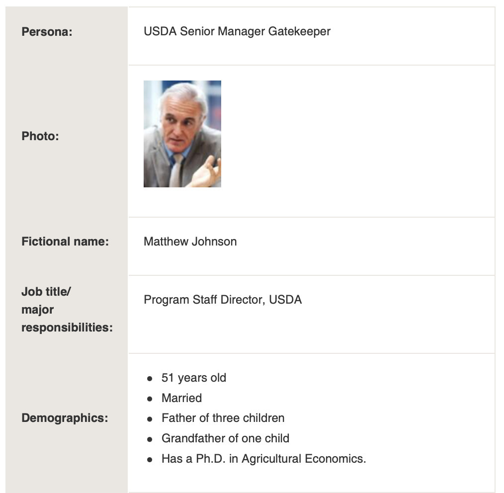{width=80%}
:::
::: {.column width="50%"}
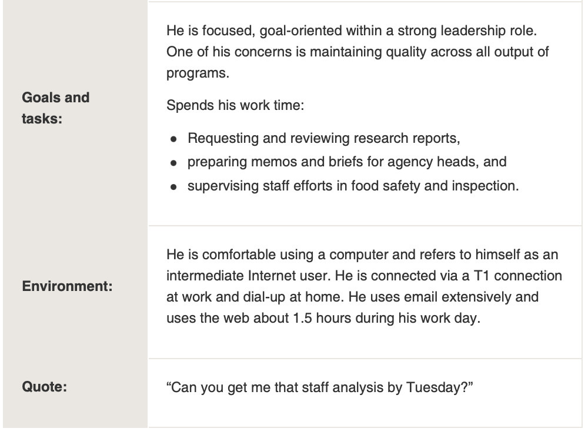{width=80%}
:::
::::::::::::::

## Scenarios

:::::::::::::: {.columns}
::: {.column width="40%"}
- A narrative describing human activities or tasks.
- Allows exploration and discussion of contexts, needs, and requirements.
- Doesn't necessarily describe the software/technology used
- Core: goal, steps to reach the goal, who the user is (persona)
- Extra: other details that might be useful.
:::
::: {.column width="60%"}
- "Nia is a sound designer working in the automotive industry."
- "When tasked with creating sound signals for automotive applications, Nia needs to consider the cognitive flow of users, particularly how different chords interact and influence user attention. To support this logic-making process, Nia uses an AI-powered tool that helps her design a storyboard, select suitable chords, and assign them to the relevant phases."
- "After establishing the storyboard, Nia transitions to another MIDI software via the tool’s connected API for sound creation and refinement."

Example scenario excerpt from Minsik Choi's ANU research [@choi2024scenario].
:::
::::::::::::::

<!-- ## Journey Map

](img/05_03_discovering_requirements_11.png)

> “A journey map is a visualization of the process that a person goes through in order to accomplish a goal.” [@gibbons-journey-mapping-101]

Components:

- Actor
- Scenario/Expectations
- Journey Phases
- Actions, Mindsets, Emotions
- Opportunities -->

# Ideation

## What is Ideation?

> “Ideation is the mode of the design process in which you concentrate on idea generation. Mentally it represents a process of “going wide” in terms of concepts and outcomes. Ideation provides both the fuel and also the source material for building prototypes and getting innovative solutions into the hands of your users.” (d.school, An Introduction to Design Thinking PROCESS GUIDE)

## What is Ideation?

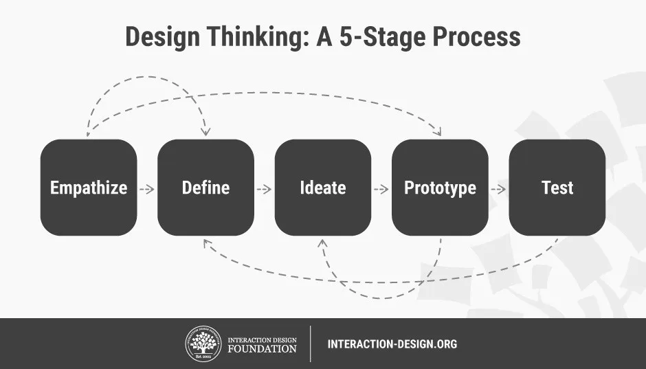{}

## Why Ideation is Important

](img/06_ideation_1.png)

## Choosing a Technique

- Match the type of ideas you want to generate
- Match the needs of the ideation team
- States of creative productivity
- Experience in ideation sessions

## Techniques

| 1. Brainstorm | 8.  __Sketch/Sketchstorm__ | 15.  __Gamestorming__ |
| :-: | :-: | :-: |
| 2. Braindump | 9.  __Storyboard__ | 16.  __Cheatstorm__ |
| 3. Brainwrite | 10.  __Bodystorm__ | 17.  __Crowdstorm__ |
| 4. Brainwalk | 11.  __Analogies__ | 18.  __Co-Creation Workshops__ |
| 5. Worst Possible Idea | 12.  __Provocation__ |  |
| 6. Challenge Assumptions | 13.  __SCAMPER__ | __19. Prototype__ |
| 7.  __Mindmap__ | 14.  __Movement__ | 20. Creative Pause |
loo
## How Ideation Techniques Can Help with Creative Blocks

](img/06_ideation_2.png)

## 1. Brainstorm / 2. Braindump

- Brainstorm - leverage the synergy of the group
- New ideas by building on others’ ideas
- Blend ideas to create good ideas
- Discuss ideas without fear of criticism
- Embrace wild ideas
- Reach further than a simply logical approach to a problem
- Braindump - similar, but individual
- Write ideas on post-its, then share ideas with group

## 3. Brainwrite / 4. Brainwalk

- Brainwrite - similar to Brainstorm
- Write down ideas individually for a few minutes
- Pass ideas to another participant
- Elaborate on the first person’s ideas
- Then pass to the next person and so on
- After 15 mins, collect the papers and discuss them
- Brainwalk - walk around room to “ideation stations”

## 5. Worst Possible Idea

- Flips brainstorming on its head
- Come up with the worst ideas you can think of
- Takes the pressure off
- Playful, fun, adventurous, effective
- Know that ideas won’t be scrutinised for being wrong

## Bad Ideas

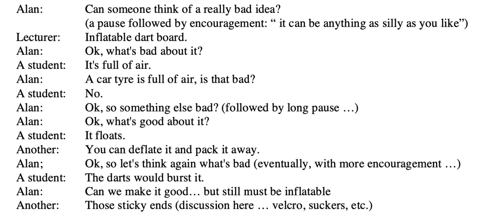

(Dix, 2006) [https://alandix.com/academic/papers/HCIed2006-badideas/HCIED2006-badideas-CRC-v2.pdf](https://alandix.com/academic/papers/HCIed2006-badideas/HCIED2006-badideas-CRC-v2.pdf)

## Bad Ideas

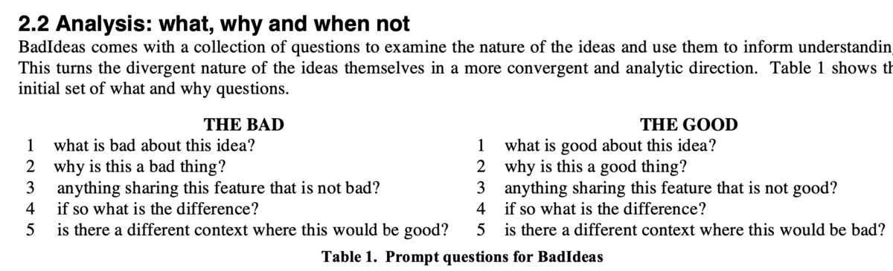

(Dix, 2006) [https://alandix.com/academic/papers/HCIed2006-badideas/HCIED2006-badideas-CRC-v2.pdf](https://alandix.com/academic/papers/HCIed2006-badideas/HCIED2006-badideas-CRC-v2.pdf)

## 6. Challenge Assumptions

- Take a step back from the challenge
- Ask questions about the assumptions you have made
- Effective when you are stuck
- Maybe to re-boot a struggling ideation session
- Are the things you assume to be true about your users, context, activities really accurate and important?

## 7. Mindmap

- Graphical technique
- Build a web of relationships
- Write a problem statement in the middle of the page
- Then write solutions and ideas on the same page
- Then connect solutions and ideas with lines
- To previous or following fact or idea

](img/06_ideation_5.png)

## 8. Sketch / Sketchstorm

- Useful to express ideas as diagrams or sketches
- Visuals can provoke further ideas
- Sketches should be simple and rough
- Enough detail to convey meaning, not get attached
- Think more openly / creatively about ideas
- Record lots of ideas quickly, don’t worry about quality
- Easier to discuss, critique, share ideas with others

## 9. Storyboard

- Stories a key medium for communication, learning, exploring
- Storyboard = visual story about problem, design, solution
- Can add life, show time progression, explore dynamics
- Understand people’s lives and draw out stories
- Represent research - scenarios with pictures and user quotes
- Ideation - play with ideas, develop storyline, actors, plot
- Build tension, surprises, emotions, struggle, resolution

## Storyboards Visualise Ideas

](img/06_ideation_6.png)

## 10. Bodystorm

- Physically acting out processes, scenarios, events
- Express solutions to ideas through physical activity
- Enact some of the problem scenarios
- Get physically involved in theorising about the problems
- Combines empathy, brainstorming, prototyping
- Increased energy and movement
- Could include a space with props and artefacts

## 11. Analogies / 12. Provocation

- Analogies - comparison between two things
- Powerful tool for communication and sparking ideas
- Express ideas / complex matters - understandable
- Provocation - lateral thinking technique
- Challenges the status quo, explore new realities
- [UX ideation techniques to try out (justinmind)](https://www.justinmind.com/blog/8-ux-ideation-techniques-to-try-out/)

## 13. SCAMPER

> __S__ ubstitute,  __C__ ombine,  __A__ dapt,  __M__ odify,  __P__ ut to another use,  __E__ liminate,  __R__ everse (SCAMPER)

- Lateral ideation technique, utilises action verbs as stimuli
- Asks seven kinds of questions to generate ideas
- Take a product/service, work through the list and ask questions, are any of the answers viable?
- [Scamper: How to Use the Best Ideation Methods (Interaction Design Foundation)](https://www.interaction-design.org/literature/article/learn-how-to-use-the-best-ideation-methods-scamper)

## 14. Movement

- Help if blocked in idea generation
- Follows on from lateral thinking techniques
- Might not result in concrete/usable ideas
- Create a range of thinking stimuli
- Making use of stimuli requires movement
- Movement is a process to turn provocation into usable ideas
- [https://thoughtegg.com/provocations-creative-technique/](https://thoughtegg.com/provocations-creative-technique/)

## 15. Gamestorming

Gamified ideation aimed to increase engagement, energy, collaboration (gamified versions of other methods), e.g.,

- Fishbowl - inner and outer circles with different roles
- Anti-Problem - flips the problem to consider the opposite
- Cover Story - use a template to generate a cover story
- More here:  _[https://gamestorming.com/](https://gamestorming.com/)_

## 16. Cheatstorm

- Less about coming up with new ideas
- Takes existing ideas and leverages as input or stimulus
- Most ideation methods involve discarding most ideas
- Cheatstorming is about reusing previous ideas
- [https://blog.humancomputation.com/?p=5345](https://blog.humancomputation.com/?p=5345)

## 17. Crowdstorm

- Involves target audience generates/approves ideas
- Can be helpful to involve users in ideation process
- Methods include social media, customer surveys, focus groups, co-design workshops
- Can provide insights on which ideas to choose
- Can find ideas that the team might have missed

## 18. Co-Creation Workshops

- Combines different methods over hours, days, or weeks
- Can be condensed into full day workshops
- Full day workshops usually follow a sequence like:
- Introductions and Icebreakers, Vision and Values Exercises, Empathy Exercises, Insight Mining, Challenge Framing, Ideation, Prototyping

## 19. Prototype

- Prototyping can be an ideation technique
- Creating a physical object requires decisions to be made
- Encourages generation of new ideas
- Explore alternative solutions
- Building to think, thinking by doing

## 20. Creative Pause

- Sometimes we get stuck in unconstructive thinking patterns
- Seemingly impenetrable brick wall challenge
- Anchored to an early idea or stream of thought
- Get caught up in negative thoughts
- Creative pause: step back, reflect, extract ourselves
- Re-approach challenge with renewed freshness
- Proactive thinking, not reactive (can be negative)

## Online Ideation Tools

- Miro:  _[https://miro.com/online-brainstorm-tool/](https://miro.com/online-brainstorm-tool/)_
- Mural:  _[https://www.mural.co/](https://www.mural.co/)_
- Collections and Templates:
- _[https://www.sessionlab.com/library/idea_generation](https://www.sessionlab.com/library/idea_generation)_
- _[https://uxdesign.cc/the-master-online-ideation-toolbox-part-1-2-47401c3ad861](https://uxdesign.cc/the-master-online-ideation-toolbox-part-1-2-47401c3ad861)_
- _[https://uxdesign.cc/the-master-online-ideation-toolbox-part-2-2-414f5122f8b7](https://uxdesign.cc/the-master-online-ideation-toolbox-part-2-2-414f5122f8b7)_

## Five Golden Rules of Ideation (Salvi 2020)

- There are no bad ideas 🙅🏽
- Quantity over quality ✏️
- Document everything 👀
- Use & enrich others’ input for stronger ideas 🤜🏾🤛
- Keep an open mind and a non-judgemental attitude 😎”
- <https://uxdesign.cc/the-master-online-ideation-toolbox-part-1-2-47401c3ad861>

# Sketching Design Ideas

- What is a sketch?
- What makes something a sketch?

## What is a sketch?

- Quick
- Timely
- Inexpensive
- Disposable
- Plentiful
- Clear vocabulary
- Distinct gesture
- Minimal detail
- Appropriate degree of refinement
- Suggest and explore rather than confirm
- Ambiguity

(Buxton 2007, p.111-113)

## What should a sketch include?

- Title
- Annotations
- Short description (1-2 sentences)

## Is a sketch a prototype?

No.

](img/06_ideation_9.jpg)

## How to Choose your Best Ideas

](img/06_ideation_10.png)

## Ten Principles of Good Design

](img/06_ideation_11.jpg)

## How to choose your Best Ideas

- High-Fidelity Prototype – Design Idea EXCEPTIONAL
- Design idea is original, creative, and interesting.
- Connection to design opportunities identified in project 2 is clear and compelling.
- Design could be seamlessly used in the chosen activity in ways that enrich the making practice.

## Getting the Right Design vs Getting the Design Right

](img/06_ideation_12.png)

Bill Buxton sez! So do it! 

## Readings / References

- Bill Buxton. 2007.  _Sketching User Experiences._ San Francisco: Elsevier
- R.F. Dam & T.Y. Siang. 2020.  [_Introduction to the Essential Ideation Techniques which are the Heart of Design Thinking_](https://www.interaction-design.org/literature/article/introduction-to-the-essential-ideation-techniques-which-are-the-heart-of-design-thinking) . Interaction Design Foundation.  
- R.F. Dam & T.Y. Siang. 2020.  _Learn How to Use the Best Ideation Methods: SCAMPER_ .  <https://www.interaction-design.org/literature/article/>
- H. Faste. 2013. C _HAINSTORMING! CHEATSTORMING!_   <https://blog.humancomputation.com/?p=5345>
- Gamestorming.  _[https://gamestorming.com](https://gamestorming.com/)_
- Justinmind. 2018.  _8 UX ideation techniques to try out_ .  <https://www.justinmind.com/blog/8-ux-ideation-techniques-to-try-out/>
- R. Riley.  _The Provocation Creative Technique_ . Thought Egg. <https://thoughtegg.com/provocations-creative-technique/>
- Helen Sharp, Jenny Preece, and Yvonne Rogers. 2019. Interaction Design: Beyond Human-Computer Interaction. West Sussex: Wiley.

# Prototyping

## Double Diamond

](img/07_prototyping_0.png)

- Discover
- Define
- Develop
- Deliver

## Introduction

- Design, prototyping, construction - Design phase
- Solutions are created, prototyped, tested, iterated
- Repeated design-evaluation-redesign cycles with users
- Two aspects to design - conceptual and concrete

## Prototyping - What

- Concrete manifestation of an idea
- Allows stakeholders to interact and explore
- Take many forms for different purposes
- 3D printing is commonly used now

## Prototyping – Why?

> Discussion question: Why do we prototype?

## Prototyping - Why

- Communication device
- Discuss/evaluate/explore ideas
- Important in many design disciplines
- Answer questions, help choose between alternatives
- Serve many purposes
- Product prototype versus service prototype (Saffer, 2010)
- Move on from ‘bad ideas’

## Prototyping - Example

- Paper-based prototype to help a child with autism to communicate
- Functions and buttons
- Positioning and labels
- Shape of the device
- No actual functionality

## Prototyping - Filters & Manifestations

Youn-Kyung Lim et al. (2008)
3 key principles

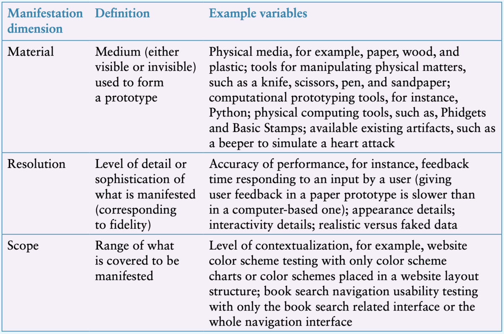
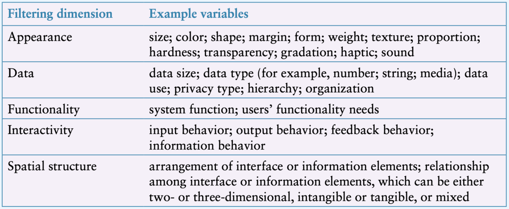

## Prototyping - Spectrum

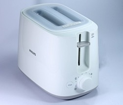

High Fidelity Prototype

Low Fidelity Prototype

[https://collection.maas.museum/object/115505](https://collection.maas.museum/object/115505)

Photo by [Manik Roy](https://unsplash.com/@pixnum) on [Unsplash](https://unsplash.com/s/photos/toaster)

[https://www.youtube.com/watch?v=k_9Q-KDSb9o](https://www.youtube.com/watch?v=k_9Q-KDSb9o)

## Prototyping - Low-Fidelity

- Don’t look/act like the final product
- Simple, cheap, quick to produce/modify
- Support exploration of alternative designs/ideas
- Important in early stages - exploration/modification
- Not meant to be kept and used for the final product
- Storyboarding, Sketching, Index Cards, Wizard of Oz

## Low-Fidelity Prototyping: Storyboards

- Storyboarding - series of sketches or scenes
- How a user can perform a task
- Use in conjunction with a scenario
- Stakeholders role-play, step through the scenario

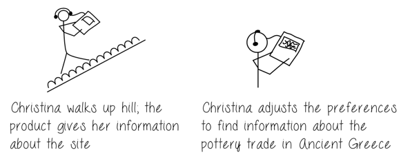
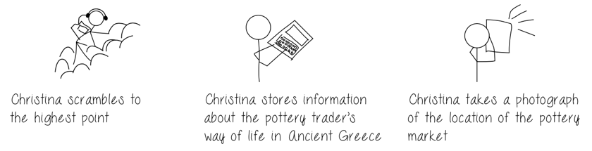

## Low-Fidelity Prototyping: Generating Storyboards

- A scenario is one story
- A storyboard represents a sequence of events
- Generated from scenario
- Break the story into steps
- Thinking through process
- Think about design issues

## Low-Fidelity Prototyping: The Role of Sketching

- Sketching - a key part of low-fidelity prototyping
- “Sketching is not about drawing. Rather, it is about design” Saul Greenberg et al. (2012)
- Sketching vocabulary, required elements
- BUT a sketch itself is not a prototype

## Low-Fidelity Prototyping: Card-Based Prototypes

- Index cards (Small pieces of cardboard: 3x5 inches)
- Each card represents one element of the interaction
- A screen, icon, menu, dialog exchanges
- User can step through the cards
- Pretending to perform the task while interacting

## Low-Fidelity Prototyping: Card-Based Prototypes

- Capture and explore elements of interaction
- Can be manipulated and moved
- Evaluation or design process
- Step through a use case
- Elaborate concrete design
- Explore user experience

## Low-Fidelity Prototyping: Paper and Cardboard Prototypes

](img/07_prototyping_16.jpg)

](img/07_prototyping_17.jpg)

## Paper Prototyping: It’s not just the prototypes, but how you use them!

](img/07_prototyping_18.png)

## Low-Fi Prototyping: Wireframes

](img/07_prototyping_19.png)

## Prototypes vs Wireframes

](img/07_prototyping_21.png)

## Wizard of Oz

- Wizard of Oz
  - Assumes a software-based prototype
- User interacts with the software
  - A human simulates the software’s response

](img/07_prototyping_23.jpg)

## Making Hardware Prototypes

- Build _working_ prototype systems in hardware
- [micro:bit](https://microbit.org) - cheap, small, with IO on the board (hello comp2300!)
- [arduino](https://arduino.cc), big ecosystem, not-as-good boards.
- [raspberry pi](https://www.raspberrypi.com), cheap way to get Linux into a prototype
- [Bela](https://bela.io) (charles' friends!), pricey but hard realtime OS is good for audio interactions.

## Makey Makey

- Alligator clip to connect switches / sensors
- Works as a keyboard
- e.g., [banana spacebar](https://www.youtube.com/watch?v=rfQqh7iCcOU)

## Prototyping - High-Fidelity

- Looks and acts more like the final product
- Continuum between low and high fidelity
- answer design questions, learn about constraints
- Evolve through stages of fidelity
- design-evaluate-redesign cycles
- Modify/integrate existing components / tools / kits

## A High-fidelity prototype

](img/07_prototyping_34.jpg)

## Concrete Design

Visual appearance (colour, layout, graphics, fonts etc).
Interface types – design principles and guidelines
Interaction modalities including input and output
Accessibility and inclusivity

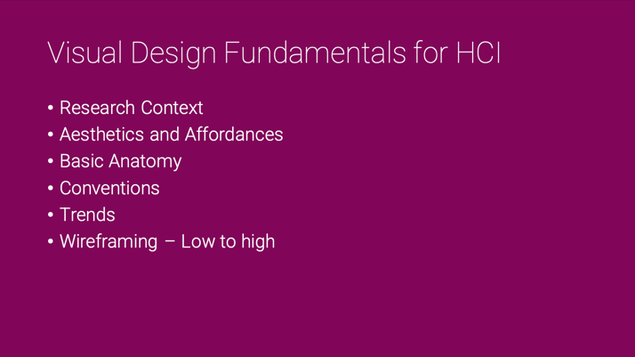

## Prototyping - Filters & Manifestations

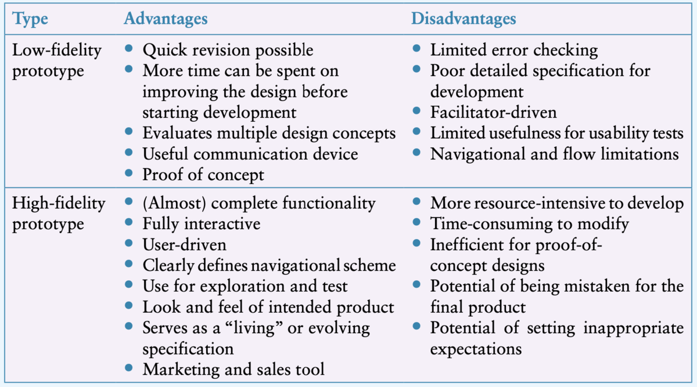

## Prototyping - Compromises

- Compromise is inherent to prototyping
- Make something quickly to test a particular aspect
- Prototype must be built with the key issues in mind
- Horizontal vs vertical prototyping
- Robustness vs changeability

## Prototyping Tools and Resources

- Crafting materials
- Digital wireframing and prototyping tools e.g. [Figma, Miro, Wireframe.cc](https://www.interaction-design.org/literature/topics/wireframing)
- Microsoft PowerPoint- a powerful prototyping tool!!
- Physical computing devices (e.g., Arduino, Makey Makey)
- Design patterns, open source resources, interaction design tools- See Sharp et al. 2019, Sections 13.3-13.5

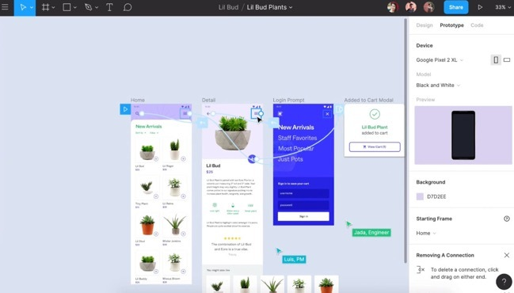

## Conceptual Design

- Developing a Conceptual Model
- An outline of what people can do and what concepts are needed to understand how to interact
- Need to understand the problem space and users
- Generate ideas based on understanding
- Explore ideas with tutorial groups

## Conceptual Model

- Metaphor, analogies, concepts, relationships, mappings
- How to choose  __interface metaphors__ that will help users understand the product?
- Which  __interaction types__ would best support the users’ activities?
- Do different  __interface types__ suggest alternative design insights or options?

## Interface Metaphors

Choosing metaphors (Erikson, 1990)

1. Identify functional requirements (what it will do)
2. Which parts are likely to cause users problems?
3. Generate metaphors

Evaluate metaphors: Structure, Relevance, Representation, Understandable, Extensible (Sharp et al., p. 440-441 for example)

## Interaction Types

Instructing, conversing, manipulating, exploring, responding

- Which is best, depends on the design
- Most models will include a combination
- Different parts will have different types

## Interface Types

- Prompt and support different user experiences / behaviour
- Prototyping will require an interface type or candidates
- Depends on product constraints from requirements
- Input and output modes <- user/context requirements

## Take away messages

- Prototyping can serve many purposes in HCI research, and support different stages of the design process
- There is more than one way to prototype a single design concept (low fi and hi fi)
- Prototypes help you  __to learn __ about your users’ interactions and experiences with your design artifact
- Your choice of prototyping approach depends on what you are trying to learn and why

## Readings/ References

- Helen Sharp, Jenny Preece, and Yvonne Rogers. 2019. Interaction Design: Beyond Human-Computer Interaction. West Sussex: Wiley. (Chapter 12)
- R.K. Dam and T.Y. Siang. 2020. Design Thinking: Get Started with Prototyping. [(link)](https://www.interaction-design.org/literature/article/design-thinking-get-started-with-prototyping)
- Erickson, T. D. 1990. Working with Interface Metaphors. In B. Laurel (ed.) The Art of Human–Computer Interface Design. Addison-Wesley, Boston.
- Lim, Y.-K., Stolterman, E., and Tenenburg, J. 2008. The Anatomy of Prototypes: Prototypes as Filters, Prototypes as Manifestations of Design Ideas, ACM Transactions on Computer-Human Interaction, 15(2).
- Saffer, D. 2010. Designing for Interaction: Creating Smart Applications and Clever Devices(2nd edn). New Riders Press, Indianapolis, IN.
