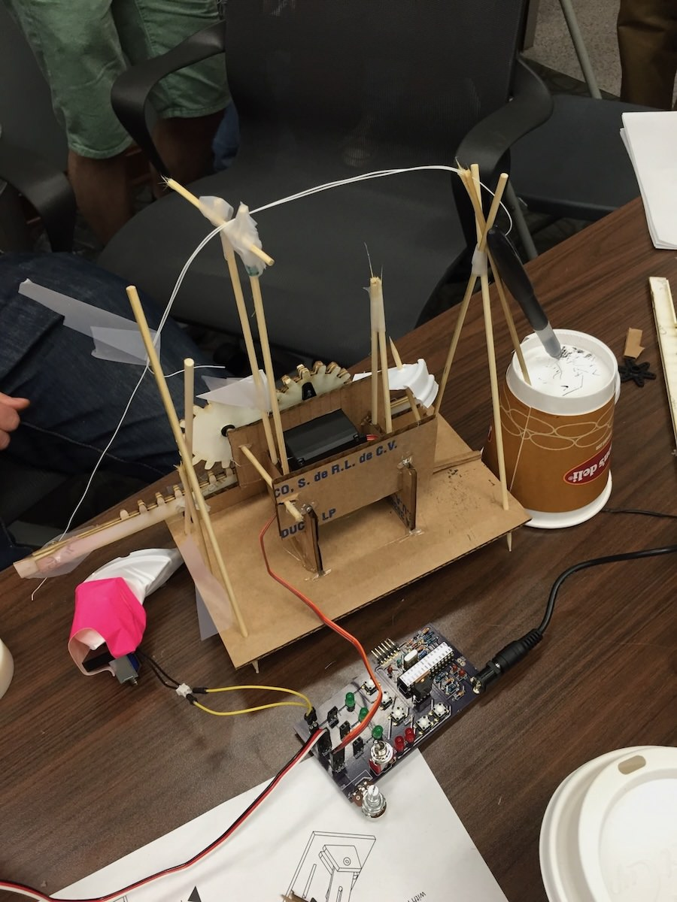
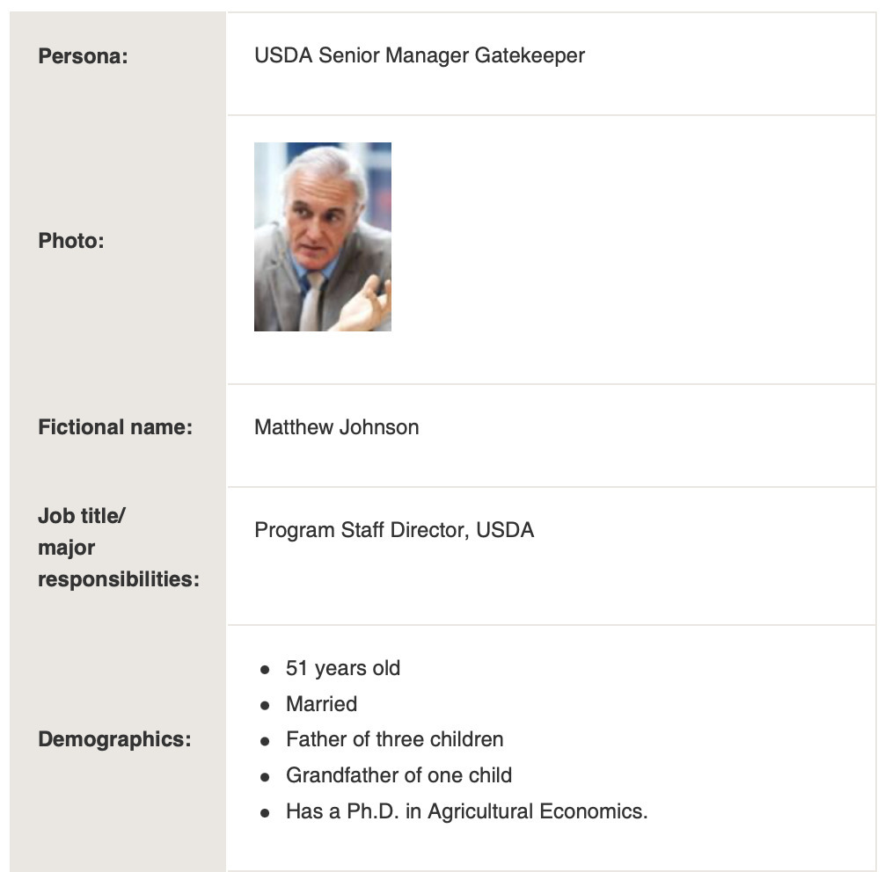
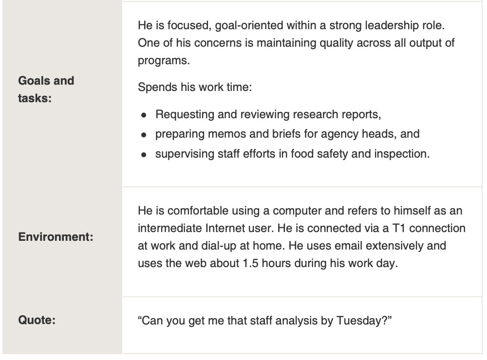
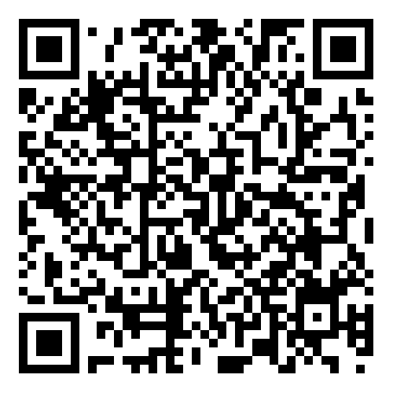
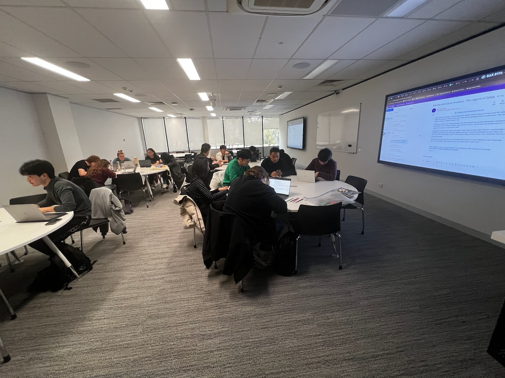
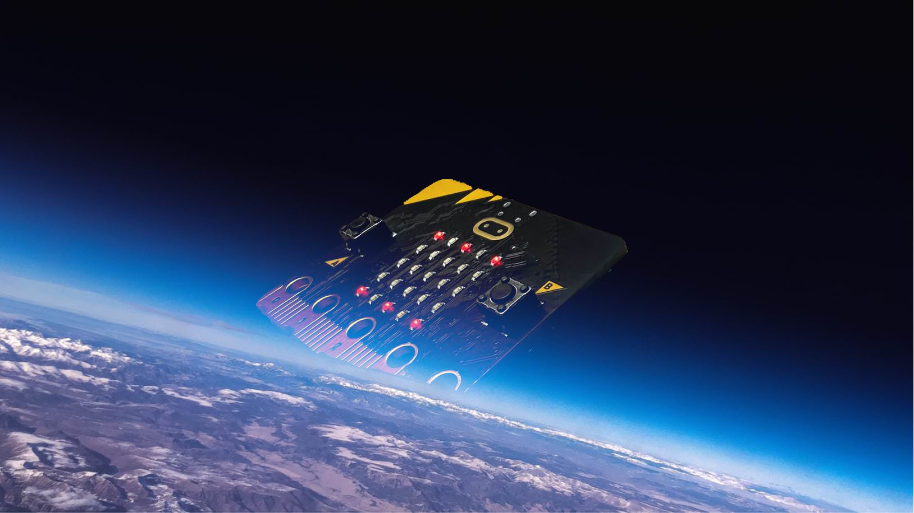
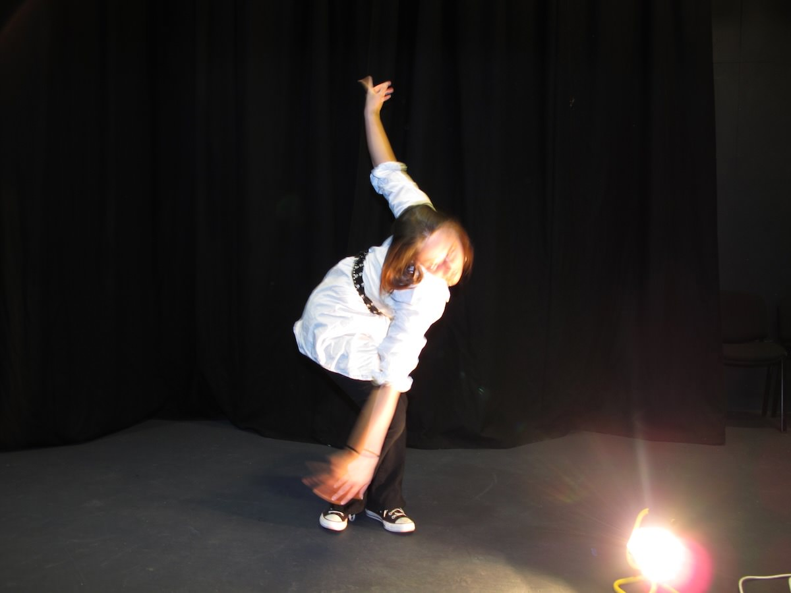
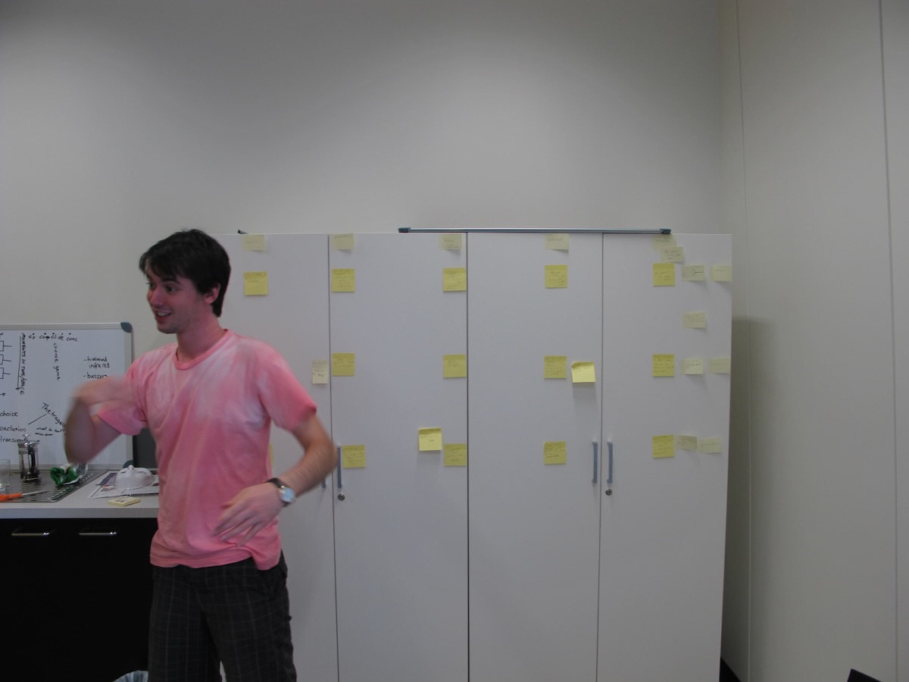
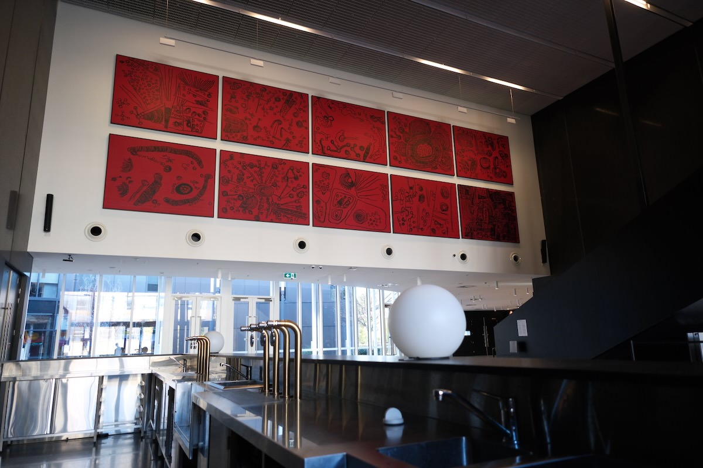

## Announcements

- **Class reps!** Needed now! (need at least 2 in total, ~1-2 UG and ~1-2 PG)
  - If you would like to nominate as a class rep, please make a private post on the class forum.
- **Tutorial 1**: Making, this week make a zine!
- **Big class!**
  - keep showing up,
  - keep asking questions,
  - stay constructive and positive (especially with your tutors!)

## Plan for the class

- Design Processes
- Discovering Requirements
- Ideation

# The Interaction Design Process {background-image="img/nime2024-elastic-prototype.jpg" background-size="cover" background-opacity="0.5"}

How do you get from a problem to something people can actually use?

## Creating systems that work for people

:::::::::::::: {.columns}
::: {.column width="40%"}
Interaction design involves creating systems that work for people.

- discovering requirements
- defining needs
- ideating possible solutions
- producing prototypes
- evaluating systems
:::
::: {.column width="60%"}
{width=50%}
:::
::::::::::::::

## Double Diamond Model

![The double diamond model of design [adapted from @double-diamond-model]](img/hci-design-double-diamond.png){width=80%}

## Design Stages

:::::::::::::: {.columns}
::: {.column width="40%"}
1. _Discover_: understand the problem and the people affected
2. _Define_: define the problem clearly so that it can be addressed
3. _Develop_: create ideas, prototypes, sketches, etc, that might address the problem
4. _Deliver_: test potential solutions to find promising directions, and iterate
:::
::: {.column width="60%"}
![The double diamond model of design [adapted from @double-diamond-model]](img/hci-design-double-diamond.png){width=100%}
:::
::::::::::::::

## Who is involved in design?

Usually a wide range of people are involved or affected by a design process. We call them _stakeholders_. Stakeholders includes not just the potential users of a system, but others who are not.

For example:

- **users**
- customers
- developers
- researchers
- managers / product owners
- government bodies
- non-government organisations (NGOs)

## Degrees of Involvement

:::::::::::::: {.columns}
::: {.column width="55%"}
- _Personas_: limited/no real users, "fake" user personas to help frame design
- _Face-to-face:_ small groups or individuals in information-gathering or evaluation settings[^1]
- _Crowd-sourced:_ large surveys, crowd-sourcing, community engagement
- _Participatory:_ users central to planning, ideating, prototyping (co-design, co-creation)

[^1]: This one is pretty normal in academic HCI research.
:::
::: {.column width="45%"}
{width=100%}
:::
::::::::::::::

## User-centred design principles

From _Designing for Usability: Key Principles and What Designers Think_ [@gould-usability:1985]

- _Early focus on users and tasks_: who are the users? what are they like? what are the tasks?

- _Empirical measurement_: users should **use** simulations and prototypes to carry out work. observe, record, and analyse.

- _Iterative design_: when problems are found in testing, they must be fixed. design, test, measure, repeat.

## People-centred design

:::::::::::::: {.columns}
::: {.column width="60%"}
Expanding from "users" to "people" with more details [@rogers-beyond-hci:2023]

- tasks and goals drive development
- behaviour and context of use are studied
- people's characteristics included
- stakeholders are consulted throughout development
- design decisions consider context of use, people's activities, and their environment
:::
::: {.column width="40%"}

:::
::::::::::::::

## Activity: People vs Users

::: {.talk-box}
**Talk:** 🙋🏽‍♀️🤷💁🏻🧠🗣️ Find someone near you, ask who they are, and discuss:

1. Who is the most important stakeholder? Users? Managers? People? And why?
2. How would you get information from this stakeholder?

Chat for 3 minutes and we'll hear a few responses.
:::

## Interaction Design Lifecycle

![An interaction design lifecycle [adapted from @rogers-beyond-hci:2023]](img/hci-design-lifecycle.png){width=60%}

## Connecting to HCI

:::::::::::::: {.columns}
::: {.column width="50%"}
Design and HCI _related_ but _not the same_:

- _Discover_ and _Define_ stages are highly related to "uncovers the needs of different kinds of computer users" (from week 1)
- _Develop_ and _Deliver_ are more related to "proposes computer systems (incl. software) that can be better used by humans"

Some HCI research is technical or speculative, inventing technologies that are _not yet common or popular_
:::
::: {.column width="50%"}
![An uncommon technology: a VR walkable interface [@je-elevate:2021]](img/elevate_je2021.png){width=80%}
:::
::::::::::::::

## Research through Design

Design isn't only the thing we _study_, it can be the _way the research is done_ [@frayling-research-art-design:1993]:

_In research **through** design: **making** the artefact _is_ the enquiry_

- Zimmerman et al. argued this counts as a method for HCI
- build something that **reframes** a messy problem and embodies a preferred future
- then judge it on _process, invention, relevance_ and _extensibility_ [@zimmerman-research-through-design:2007].
- the formality of this process is still argued [@zimmerman-rtd-critique:2010].

Gaver's caution: what RtD produces is **provisional, contingent and aspirational;** a portfolio of artefacts and annotations, not one tidy truth [@gaver-expectations-rtd:2012].

# Design Rationales {background-image="img/sketch-2010.jpg" background-size="cover" background-opacity="0.35"}

The assignment asks you to write a _design rationale_, but what is that?

## What is a Design Rationale? {#design-rationale}

- A design rationale is the **argument** behind your design: why **this** design and not other options [@maclean-argument-behind-artifact:1989]
- Contrast with a _description_ of what you made.

A design is one point in a _space_ of possibilities. The rationale is what maps the space [@maclean-qoc:1991].

> "A Design Rationale is **not a record of the design process** --- it is a co-product of design along with the artifact and itself has to be designed." [@maclean-argument-behind-artifact:1989]

## A quick unit test

_could a reader disagree with you?_

- **Not a rationale:** "the button is paw-sized, because dogs have paws" (nothing here to argue with)
- **A rationale:** "I chose paw contact over nose contact because _..._, accepting that _..._" (now we can argue)

## Sketches as argument

Bill Gaver and John Bowers argued that an **annotated** portfolio of design work carries knowledge that _doesn't_ reduce to a list of findings [@gaver-annotated-portfolios:2012].

- annotations capture the **family resemblances** between designs --- "a mesh of similarities and differences"
- a _set_ of artefacts with commentary supports an argument that one might be a better choice than another.
- three sketches with commentary is evidence of a design space you actually explored [@buxton-sketching:2007]

Your sketches are the **evidence** that your writing interprets, not just decoration.

## Components of a rationale

1. **Questions:** what did you actually have to decide? (not "how do I design for cows", but "how does a cow select from a list?")
2. **Options:** what _could_ you have done? At least two per question.
3. **Criteria:** what did you judge them on? _This is where HCI concepts earn their place._
4. **Trade-offs:** what did you give up? Every choice has limitations.

Questions/options/criteria come from design space analysis [@maclean-qoc:1991]. The insistence on writing the **downside** of every feature alongside its upside comes from claims analysis [@carroll-task-artifact:1992].

## You're allowed to tidy up

Real design is messy. You double back, change your mind, and often discover the real problem while solving the wrong one. Our tidy lifecycle diagram is a _tidied-up_ version of a scruffy reality.

Your rationale does **not** have to reproduce that mess chronologically. Parnas and Clements: we will never design in a perfectly rational way, but we can _present_ the work as though we had [@parnas-fake-it:1986].

- **Do** reconstruct your reasoning clearly, so a reader can follow it and challenge it
- **Do** report dead ends that taught you something --- they are evidence of a space explored
- **Don't** invent a process you didn't follow, tidying is not the same as fabrication

In **Assignment 1**: your _portfolio_ (sketches, prototype photos) shows the process. Your _rationale_ makes the argument.

# Discovering Requirements {background-image="img/2015-study-observation.jpg" background-size="cover" background-opacity="0.5"}

Where do requirements come from?

## What is a requirement?

:::::::::::::: {.columns}
::: {.column width="50%"}
> “A statement about an intended product that specifies what it is expected to do and how it will perform” [@rogers-beyond-hci:2023, p.387]

- Discovered through targeted activities or tangentially throughout the design process
- Evolve during design
- Different levels of abstraction and detail
- Needed to avoid misunderstanding and miscommunication
:::
::: {.column width="40%"}
![Image: [@rogers-beyond-hci:2023, s11.2]](img/design_1_requirements.png)
:::
::::::::::::::

## Defining a requirement

:::::::::::::: {.columns}
::: {.column width="50%"}

- Requirements can be captured casually, e.g., "app needs to be fast"
- Can be useful to have more details, precision about the requirements, who needs them, and why.
- Formal methods exist for capturing requirements in complex projects
- Epics, user stories in Agile methodologies
- Volere "Atomic Requirements Shell" (see figure)
- _"Description, Rationale, Source, Fit criterion, Customer satisfaction..."_
:::
::: {.column width="50%"}
![[@rogers-beyond-hci:2023, s11.3]](img/design_2_volere.png){width=60%}
:::
::::::::::::::

## User stories

Communicates a requirements between stakeholders. Have the generic form:

`As a <role>, I want <behaviour> so that I can <benefit>`

e.g.,:

- "As a student, I want to choose a tutorial time that doesn't clash with other activities, so that I can attend all my classes in a week."
- "As a lecturer, I want to adjust the number of students in tutorials, so that I can provide a good learning experience."

A user story is a simple way to connect a requirement to a particular type of user in a particular situation. In agile, user stories can be grouped into larger arrangements called "epics" and even bigger groups called "initiatives".

## Types of requirements

- _Functional requirements_: What the product will do

- _Data requirements_: type, properties of data involved in an interactive system

- _Environmental requirements_: context of use, what are the circumstances in which interaction happens?

  - _Phsyical environment_: noise, lighting, movement, etc
  - _Social environment_: sharing data, collaboration
  - _Support environment_: assistance, training or help available or integrated
  - _Technical environment_: technologies available for the system (phone, watch, laptop, supercomputer?) or technical limitations

- _User characteristics_: abilities, skills, attributes of users

- _Usability and user experience goals_: what goals (see last week) prioritised and tracked?

## Activity: Requirements

::: {.think-box}
**Think:** Come up with a design requirement for **one** of the following products:

- 🗣️ A voice-activated smart home assistant that helps individuals control lighting and temperature.

- 📲 A phone-based ordering system for a restaurant.

- 🤖 A humanoid robot for assisting computer science students in computer labs.

Spend 2-3 minutes developing one requirement and then let's hear a few. 🎤🎤🎤
:::

## Data Gathering

There are lots of ways to discover requirements, some examples are below:

- **Observation and Ethnography**: observing people in real situations
- **Diaries and interviews**: (aka, asking), talk to people about their requirements, or ask them to record information
- **Focus Group, User Study**: talking with one or multiple people
- **Questionnaires**: asking people to answer specific questions
- **Cultural Probes**: sending arts & crafts materials to users to find out about their life/needs [@gaver-cultural-probes]
- **Contextual Inquiry**: researcher immersed in context of use, visits the participant and interviews them in context [@contextual-design:1997]

In this course we focus on _interviews_ and _user studies_ as methods for data gathering. Our focus is on the evaluation stage of design, but these methods can work at the discovery stage as well.

## Personas and Scenarios

:::::::::::::: {.columns}
::: {.column width="50%"}
More detailed than a user story, includes:

- the person, their characteristics, motivations, etc (**persona**)
- their story, when, where, how, as a sequence of events (**scenario**)
- the goal, needs to fulfil, reason to interact with a system (**goal**)
:::
::: {.column width="50%"}
 (© Smashing Magazine)](img/persona-scenario.jpg){width=100%}
:::
::::::::::::::

## Personas

:::::::::::::: {.columns}
::: {.column width="50%"}
- Rich descriptions of typical users
- Don't describe specific people but realistic
- Describe goals, behaviours, activities, environment
- How would this person use this product?

Examples on [Usability.gov](https://www.usability.gov/how-to-and-tools/methods/personas.html)
:::
::: {.column width="50%"}
](img/05_03_discovering_requirements_6.jpg){width=60%}
:::
::::::::::::::

## Personas: example, Julien the university worker

![Example of a persona from research into autonomous taxi services [@hallewell2022deriving] ](img/persona-hallewell-example.jpg){width=65%}

## Personas: examples

:::::::::::::: {.columns}
::: {.column width="50%"}
{width=80%}
:::
::: {.column width="50%"}
{width=80%}
:::
::::::::::::::

## Scenarios

:::::::::::::: {.columns}
::: {.column width="40%"}
- A narrative describing human activities or tasks.
- Allows exploration and discussion of contexts, needs, and requirements.
- Doesn't necessarily describe the software/technology used
- Core: goal, steps to reach the goal, who the user is (persona)
- Extra: other details that might be useful.
:::
::: {.column width="60%"}
- "Nia is a sound designer working in the automotive industry."
- "When tasked with creating sound signals for automotive applications, Nia needs to consider the cognitive flow of users, particularly how different chords interact and influence user attention. To support this logic-making process, Nia uses an AI-powered tool that helps her design a storyboard, select suitable chords, and assign them to the relevant phases."
- "After establishing the storyboard, Nia transitions to another MIDI software via the tool's connected API for sound creation and refinement."

Example scenario excerpt from Minsik Choi's ANU research [@choi2024scenario].
:::
::::::::::::::

<!-- ## Journey Map

](img/05_03_discovering_requirements_11.png)

> “A journey map is a visualization of the process that a person goes through in order to accomplish a goal.” [@gibbons-journey-mapping-101]

Components:

- Actor
- Scenario/Expectations
- Journey Phases
- Actions, Mindsets, Emotions
- Opportunities -->

## Scenario Mapping: Design Ideation Using Personas

:::::::::::::: {.columns}
::: {.column width="60%"}
[Scenario mapping](https://www.nngroup.com/articles/scenario-mapping-personas/) is a group activity for generating ideas for a product or system using personas and a specific scenario. (PS: you'll do a similar activity in next week's tutorial).

- choose a scenario and persona,
- split a scenario up into steps (use sticky notes)
- choose categories for ideas, e.g.: design ideas, questions, problems, friction points, comments
- brainstorm ideas under specific categories
:::
::: {.column width="40%"}
](img/scenario-mapping.jpg)
:::
::::::::::::::

## Activity: Scenario Mapping Example

:::::::::::::: {.columns}
::: {.column width="50%"}
:::: {.activity}
**Activity:** Let's scenario map 🗺️💁🏻🎤

- Have a look at the following miro board and add a post it. (how many students are here? can we break miro?)

- <https://miro.com/app/board/uXjVJa-m2gU=/?share_link_id=689171092569>
::::
:::
::: {.column width="50%"}
{width=80%}
:::
::::::::::::::

# Ideation {background-image="img/nime2024-ideating.jpg" background-size="cover" background-opacity="0.5"}

How do you get from one idea to many?

## What is Ideation?

We've already done some ideation today! But what do I mean by that?

> **Ideation** is the process of **generating a broad set of ideas on a given topic**, with no attempt to judge or evaluate them. ([Aurora Harley, nngroup](https://www.nngroup.com/articles/ux-ideation/))

## Fundamentals of Ideation

:::::::::::::: {.columns}
::: {.column width="40%"}
- ideas are _not_ evaluated
- ideas are recorded and documented
- collaboration leads to diverse ideas

Generating **many** ideas: high probability that _at least one_ is close to ideal.

[Ideation for Everyday Design Challenges, nngroup](https://www.nngroup.com/articles/ux-ideation/)
:::
::: {.column width="60%"}
](img/06_ideation_1.png){width=100%}
:::
::::::::::::::

## Choosing a Technique

:::::::::::::: {.columns}
::: {.column width="50%"}
**Eight most used by professional designers** [@hornbaek-intro-hci:2025, section 31.2]:

1. Brainstorming
2. Morphological analysis
3. Scenarios
4. Conceptual maps
5. Checklists
6. Analogies
7. Metaphors
8. Storyboards
:::
::: {.column width="50%"}
**Variants:**

Braindump, brainwrite, brainwalk, **worst possible idea**, challenge assumptions, mindmap, sketchstorm, **bodystorm**, provocation, SCAMPER, movement, gamestorming, cheatstorm, crowdstorm, co-creation, prototyping, creative pause
:::
::::::::::::::

## Three ways ideation methods differ

Three dials to turn [@hornbaek-intro-hci:2025, section 31.2]:

1. **How far you reach for associations.** The further out, the more novel the ideas, but the value might decrease
2. **How other people are involved.** Groups can generate more ideas but very large groups are difficult to manage.
3. **What representation you use.** Brainstorming is mostly **verbal**; sketching and storyboarding are **visuospatial**; bodystorming is **physical**.

## Brainstorming and its variants

:::::::::::::: {.columns}
::: {.column width="55%"}
Shared principles across nearly all the variants:

- **Postpone criticism:** don't throttle the generative phase
- **Divergence:** encourage wild, diverse ideas
- **Quantity:** as many as possible
- **Build** on others' ideas
- **Equal significance:** every participant and idea counts

The named variants mostly change *who writes when*: **braindump** (individually, then share), **brainwrite** (write, pass on, elaborate), **brainwalk** (move between ideation stations).
:::
::: {.column width="45%"}

:::
::::::::::::::

## How to run a brainstorm

Some ecommendations [@hornbaek-intro-hci:2025, section 31.2]:

:::::::::::::: {.columns}
::: {.column width="50%"}

1. **Sharpen the focus:** clear, but not so narrow it limits solutions
2. **Playful rules:** no criticism, no debating the brief
3. **Number your ideas:** aim for ~100 in an hour
4. **Build and jump:** when the rate drops, jump to another part of the problem
:::
::: {.column width="50%"}
5. **Use the space to remember:** spread ideas over tables, walls, whiteboards
6. **Stretch first:** warm up with a word game
7. **Props:** bring physical props, materials, competitors' products

:::
::::::::::::::

## Lateral Thinking: Worst Possible Idea

:::::::::::::: {.columns}
::: {.column width="50%"}

Is this the opposite of brainstorming?

- Come up with the worst ideas you can think of
- Playful, fun, adventurous, effective
- Know that ideas won't be scrutinised for being wrong

Dix argued that _bad is the new good_ [@dix2006bad] using this as a class exercise.

:::
::: {.column width="50%"}
{width=100%}
:::
::::::::::::::

## Activity: What's the worst possible idea {background-image="img/andre-hunter-5otlbgWJlLs-unsplash.jpg" background-size="cover" background-opacity="0.3"}

::: {.think-box}
**Think:** (let's try it!) What's the worst idea for:

> A way to help students balance work and study.

Think for a minute or two and then we'll hear some answers. ⭐️🎙️🗣️

Prepare for this question: "Why is that bad?"
:::

## Does lateral thinking work?

Not everybody likes lateral thinking.

- **Lateral thinking** techniques (provocation, random words, worst possible idea) are a bit controversial [@hornbaek-intro-hci:2025, section 31.2]
- Wild ideas can be easy to find, but it's not clear that they are valuable.
- Forced ideas are often variations on existing solutions.

So why do we do it? Because it gets a room talking and lowers the stakes for contributing; but it may not lead to better designs.

## Analogies and metaphors

:::::::::::::: {.columns}
::: {.column width="50%"}
- **Analogy:** a comparison between two things --- powerful for both communication and sparking ideas
- **Metaphor:** carry a structure from a domain the user *already knows* into your interface
- **Provocation:** challenge the status quo to explore new realities (a lateral thinking technique)

Both analogy and metaphor are in the professional top eight --- these are not warm-up games.
:::
::: {.column width="50%"}

:::
::::::::::::::

## Analogies in practice: interface metaphors

:::::::::::::: {.columns}
::: {.column width="40%"}
Exploit similarities to user's knowledge of other domains. E.g.,

- **Cards:**  Familiar, strong associations (playing, business, credit), flick through, sort, themed, structured
- **Desktop** and **Recycle bin**
- **Shopping trolley** and **checkout**
- **_Surfing the web_**

We'll come back to design metaphors for AI in week 12.
:::
::: {.column width="60%"}
![A highly metaphorical interface. [@gentner-anti-mac:1996]](img/gentner-anti-mac-interface.jpg){width=100%}
:::
::::::::::::::

## Inspiration cards

:::::::::::::: {.columns}
::: {.column width="55%"}
A structured way to force distant associations [@hornbaek-intro-hci:2025, section 31.2]:

- **Technology cards** --- a technical opportunity or threat
- **Domain cards** --- an experience or activity from users' lives
- Draw at random, **pair them**, and ideate from the collision

E.g., *distributed smart speakers* × *a family dinner*.

Keeps ideas metaphorical **and** technically realistic. Card decks are a real HCI research contribution --- see the SMeFT Decks for hybrid boardgames [@rogerson-smeft-decks:2022].
:::
::: {.column width="45%"}
{width=100%}
:::
::::::::::::::

## Ideating in other representations

Not everything is a sticky note.

:::::::::::::: {.columns}
::: {.column width="50%"}

- **Sketch:** simple, rough, quantity over quality enough detail to convey meaning, no more (much more next week)
- **Storyboard:** a visual story
- **Prototype:** building forces decisions and provokes new ideas. Thinking by doing.
- **Bodystorm:** physically act out the scenario, with props --- combines empathy, brainstorming and prototyping

:::
::: {.column width="50%"}

:::
::::::::::::::

## Unsticking a blocked session

Ideation gets stuck: you hit a wall, or anchor on an early idea (**design fixation**, more next week).

:::::::::::::: {.columns}
::: {.column width="50%"}

- **Challenge assumptions:** what did we assume about users, context, activities? Are those accurate *and* important?
- **Mindmap:** problem in the middle, ideas around it, connect with lines
- **[SCAMPER](https://www.interaction-design.org/literature/article/learn-how-to-use-the-best-ideation-methods-scamper):** Substitute, Combine, Adapt, Modify, Put to another use, Eliminate, Reverse
- **[Movement](https://thoughtegg.com/provocations-creative-technique/):** turn a provocation into something usable
- **Creative pause:** step back, reflect, go outside. Proactive rather than reactive thinking
:::
::: {.column width="50%"}

](img/06_ideation_2.png)
:::
::::::::::::::

## Involving other people

:::::::::::::: {.columns}
::: {.column width="50%"}

- **[Gamestorming](https://gamestorming.com/):** gamified ideation for energy and engagement --- Fishbowl, Anti-Problem, Cover Story
- **[Cheatstorm](https://www.interaction-design.org/literature/topics/cheatstorming):** reuse ideas from earlier sessions as stimulus
- **Crowdstorm:** the target audience generates or approves ideas --- social media, surveys, focus groups
- **Co-creation workshops:** combine methods over hours or days --- icebreakers, vision, empathy, insight mining, framing, ideation, prototyping
:::
::: {.column width="50%"}

:::
::::::::::::::

<!-- ## Online Ideation Tools

- Miro:  _[https://miro.com/online-brainstorm-tool/](https://miro.com/online-brainstorm-tool/)_
- Mural:  _[https://www.mural.co/](https://www.mural.co/)_

Collections and Templates:

- _[https://www.sessionlab.com/library/idea_generation](https://www.sessionlab.com/library/idea_generation)_
- _[https://uxdesign.cc/the-master-online-ideation-toolbox-part-1-2-47401c3ad861](https://uxdesign.cc/the-master-online-ideation-toolbox-part-1-2-47401c3ad861)_
- _[https://uxdesign.cc/the-master-online-ideation-toolbox-part-2-2-414f5122f8b7](https://uxdesign.cc/the-master-online-ideation-toolbox-part-2-2-414f5122f8b7)_ -->

## Questions: Who has a question?

:::::::::::::: {.columns}
::: {.column width="60%"}
:::: {.questions}
**Who has a question?**

- I can take _cathchbox_ question up until end of the lecture
- For after class questions: meet me outside the classroom at the bar (for 30 minutes)
- Feel free to ask about **any aspect of the course**
- Also feel free to ask about **any aspect of computing at ANU**! I may not be able to help, but I can listen.
::::

:::
::: {.column width="40%"}

:::
::::::::::::::

# References {.allowframebreaks}
