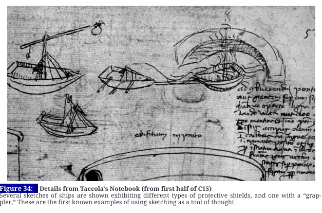

## Announcements

## Plan for the class

- Ideation
- Prototyping

# Ideation

## What is Ideation?

> “Ideation is the mode of the design process in which you concentrate on idea generation. Mentally it represents a process of “going wide” in terms of concepts and outcomes. Ideation provides both the fuel and also the source material for building prototypes and getting innovative solutions into the hands of your users.” (d.school, An Introduction to Design Thinking PROCESS GUIDE)

## What is Ideation?

## Why Ideation is Important

](img/06_ideation_1.png)

## Choosing a Technique

- Match the type of ideas you want to generate
- Match the needs of the ideation team
- States of creative productivity
- Experience in ideation sessions

## Techniques

| 1. Brainstorm | 8.  __Sketch/Sketchstorm__ | 15.  __Gamestorming__ |
| :-: | :-: | :-: |
| 2. Braindump | 9.  __Storyboard__ | 16.  __Cheatstorm__ |
| 3. Brainwrite | 10.  __Bodystorm__ | 17.  __Crowdstorm__ |
| 4. Brainwalk | 11.  __Analogies__ | 18.  __Co-Creation Workshops__ |
| 5. Worst Possible Idea | 12.  __Provocation__ |  |
| 6. Challenge Assumptions | 13.  __SCAMPER__ | __19. Prototype__ |
| 7.  __Mindmap__ | 14.  __Movement__ | 20. Creative Pause |

## How Ideation Techniques Can Help with Creative Blocks

](img/06_ideation_2.png)

## 1. Brainstorm / 2. Braindump

- Brainstorm - leverage the synergy of the group
- New ideas by building on others’ ideas
- Blend ideas to create good ideas
- Discuss ideas without fear of criticism
- Embrace wild ideas
- Reach further than a simply logical approach to a problem
- Braindump - similar, but individual
- Write ideas on post-its, then share ideas with group

## 3. Brainwrite / 4. Brainwalk

- Brainwrite - similar to Brainstorm
- Write down ideas individually for a few minutes
- Pass ideas to another participant
- Elaborate on the first person’s ideas
- Then pass to the next person and so on
- After 15 mins, collect the papers and discuss them
- Brainwalk - walk around room to “ideation stations”

## 5. Worst Possible Idea

- Flips brainstorming on its head
- Come up with the worst ideas you can think of
- Takes the pressure off
- Playful, fun, adventurous, effective
- Know that ideas won’t be scrutinised for being wrong

## Bad Ideas

(Dix, 2006) [https://alandix.com/academic/papers/HCIed2006-badideas/HCIED2006-badideas-CRC-v2.pdf](https://alandix.com/academic/papers/HCIed2006-badideas/HCIED2006-badideas-CRC-v2.pdf)

## Bad Ideas

(Dix, 2006) [https://alandix.com/academic/papers/HCIed2006-badideas/HCIED2006-badideas-CRC-v2.pdf](https://alandix.com/academic/papers/HCIed2006-badideas/HCIED2006-badideas-CRC-v2.pdf)

## 6. Challenge Assumptions

- Take a step back from the challenge
- Ask questions about the assumptions you have made
- Effective when you are stuck
- Maybe to re-boot a struggling ideation session
- Are the things you assume to be true about your users, context, activities really accurate and important?

## 7. Mindmap

- Graphical technique
- Build a web of relationships
- Write a problem statement in the middle of the page
- Then write solutions and ideas on the same page
- Then connect solutions and ideas with lines
- To previous or following fact or idea

](img/06_ideation_5.png)

## 8. Sketch / Sketchstorm

- Useful to express ideas as diagrams or sketches
- Visuals can provoke further ideas
- Sketches should be simple and rough
- Enough detail to convey meaning, not get attached
- Think more openly / creatively about ideas
- Record lots of ideas quickly, don’t worry about quality
- Easier to discuss, critique, share ideas with others

## 9. Storyboard

- Stories a key medium for communication, learning, exploring
- Storyboard = visual story about problem, design, solution
- Can add life, show time progression, explore dynamics
- Understand people’s lives and draw out stories
- Represent research - scenarios with pictures and user quotes
- Ideation - play with ideas, develop storyline, actors, plot
- Build tension, surprises, emotions, struggle, resolution

## Storyboards Visualise Ideas

](img/06_ideation_6.png)

## 10. Bodystorm

- Physically acting out processes, scenarios, events
- Express solutions to ideas through physical activity
- Enact some of the problem scenarios
- Get physically involved in theorising about the problems
- Combines empathy, brainstorming, prototyping
- Increased energy and movement
- Could include a space with props and artefacts

## 11. Analogies / 12. Provocation

- Analogies - comparison between two things
- Powerful tool for communication and sparking ideas
- Express ideas / complex matters - understandable
- Provocation - lateral thinking technique
- Challenges the status quo, explore new realities
- [UX ideation techniques to try out (justinmind)](https://www.justinmind.com/blog/8-ux-ideation-techniques-to-try-out/)

## 13. SCAMPER

> __S__ ubstitute,  __C__ ombine,  __A__ dapt,  __M__ odify,  __P__ ut to another use,  __E__ liminate,  __R__ everse (SCAMPER)

- Lateral ideation technique, utilises action verbs as stimuli
- Asks seven kinds of questions to generate ideas
- Take a product/service, work through the list and ask questions, are any of the answers viable?
- [Scamper: How to Use the Best Ideation Methods (Interaction Design Foundation)](https://www.interaction-design.org/literature/article/learn-how-to-use-the-best-ideation-methods-scamper)

## 14. Movement

- Help if blocked in idea generation
- Follows on from lateral thinking techniques
- Might not result in concrete/usable ideas
- Create a range of thinking stimuli
- Making use of stimuli requires movement
- Movement is a process to turn provocation into usable ideas
- [https://thoughtegg.com/provocations-creative-technique/](https://thoughtegg.com/provocations-creative-technique/)

## 15. Gamestorming

Gamified ideation aimed to increase engagement, energy, collaboration (gamified versions of other methods), e.g.,

- Fishbowl - inner and outer circles with different roles
- Anti-Problem - flips the problem to consider the opposite
- Cover Story - use a template to generate a cover story
- More here:  _[https://gamestorming.com/](https://gamestorming.com/)_

## 16. Cheatstorm

- Less about coming up with new ideas
- Takes existing ideas and leverages as input or stimulus
- Most ideation methods involve discarding most ideas
- Cheatstorming is about reusing previous ideas
- [https://blog.humancomputation.com/?p=5345](https://blog.humancomputation.com/?p=5345)

## 17. Crowdstorm

- Involves target audience generates/approves ideas
- Can be helpful to involve users in ideation process
- Methods include social media, customer surveys, focus groups, co-design workshops
- Can provide insights on which ideas to choose
- Can find ideas that the team might have missed

## 18. Co-Creation Workshops

- Combines different methods over hours, days, or weeks
- Can be condensed into full day workshops
- Full day workshops usually follow a sequence like:
- Introductions and Icebreakers, Vision and Values Exercises, Empathy Exercises, Insight Mining, Challenge Framing, Ideation, Prototyping

## 19. Prototype

- Prototyping can be an ideation technique
- Creating a physical object requires decisions to be made
- Encourages generation of new ideas
- Explore alternative solutions
- Building to think, thinking by doing

## 20. Creative Pause

- Sometimes we get stuck in unconstructive thinking patterns
- Seemingly impenetrable brick wall challenge
- Anchored to an early idea or stream of thought
- Get caught up in negative thoughts
- Creative pause: step back, reflect, extract ourselves
- Re-approach challenge with renewed freshness
- Proactive thinking, not reactive (can be negative)

## Online Ideation Tools

- Miro:  _[https://miro.com/online-brainstorm-tool/](https://miro.com/online-brainstorm-tool/)_
- Mural:  _[https://www.mural.co/](https://www.mural.co/)_
- Collections and Templates:
- _[https://www.sessionlab.com/library/idea_generation](https://www.sessionlab.com/library/idea_generation)_
- _[https://uxdesign.cc/the-master-online-ideation-toolbox-part-1-2-47401c3ad861](https://uxdesign.cc/the-master-online-ideation-toolbox-part-1-2-47401c3ad861)_
- _[https://uxdesign.cc/the-master-online-ideation-toolbox-part-2-2-414f5122f8b7](https://uxdesign.cc/the-master-online-ideation-toolbox-part-2-2-414f5122f8b7)_

## Five Golden Rules of Ideation (Salvi 2020)

- There are no bad ideas 🙅🏽
- Quantity over quality ✏️
- Document everything 👀
- Use & enrich others’ input for stronger ideas 🤜🏾🤛
- Keep an open mind and a non-judgemental attitude 😎”
- <https://uxdesign.cc/the-master-online-ideation-toolbox-part-1-2-47401c3ad861>

# Sketching Design Ideas

- What is a sketch?
- What makes something a sketch?

## What is a sketch?

- Quick
- Timely
- Inexpensive
- Disposable
- Plentiful
- Clear vocabulary
- Distinct gesture
- Minimal detail
- Appropriate degree of refinement
- Suggest and explore rather than confirm
- Ambiguity

(Buxton 2007, p.111-113)

## What should a sketch include?

- Title
- Annotations
- Short description (1-2 sentences)

## Is a sketch a prototype?

No.

](img/06_ideation_9.jpg)

## How to Choose your Best Ideas

](img/06_ideation_10.png)

## Ten Principles of Good Design

](img/06_ideation_11.jpg)

## How to choose your Best Ideas

- High-Fidelity Prototype – Design Idea EXCEPTIONAL
- Design idea is original, creative, and interesting.
- Connection to design opportunities identified in project 2 is clear and compelling.
- Design could be seamlessly used in the chosen activity in ways that enrich the making practice.

## Getting the Right Design vs Getting the Design Right

](img/06_ideation_12.png)

Bill Buxton sez! So do it! 

## Readings / References

- Bill Buxton. 2007.  _Sketching User Experiences._ San Francisco: Elsevier
- R.F. Dam & T.Y. Siang. 2020.  [_Introduction to the Essential Ideation Techniques which are the Heart of Design Thinking_](https://www.interaction-design.org/literature/article/introduction-to-the-essential-ideation-techniques-which-are-the-heart-of-design-thinking) . Interaction Design Foundation.  
- R.F. Dam & T.Y. Siang. 2020.  _Learn How to Use the Best Ideation Methods: SCAMPER_ .  <https://www.interaction-design.org/literature/article/>
- H. Faste. 2013. C _HAINSTORMING! CHEATSTORMING!_   <https://blog.humancomputation.com/?p=5345>
- Gamestorming.  _[https://gamestorming.com](https://gamestorming.com/)_
- Justinmind. 2018.  _8 UX ideation techniques to try out_ .  <https://www.justinmind.com/blog/8-ux-ideation-techniques-to-try-out/>
- R. Riley.  _The Provocation Creative Technique_ . Thought Egg. <https://thoughtegg.com/provocations-creative-technique/>
- Helen Sharp, Jenny Preece, and Yvonne Rogers. 2019. Interaction Design: Beyond Human-Computer Interaction. West Sussex: Wiley.
