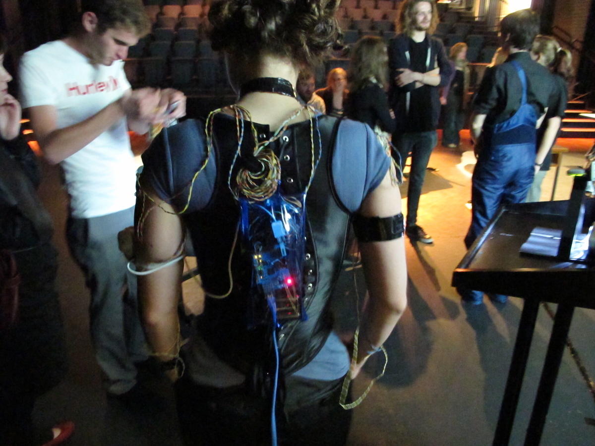

## Announcements

- **Assignment updates**:
  - template repo will be available this afternoon I promise
  - class reps: I'll get invites out this afternoon I promise!
  - questions on the forum welcome, look in the "assignments" category.

Apology: I completely changed what I planned to do in this lecture. This will be more fun / relevant to the assignment.

## Plan for the class

- Sketch
- Prototype
- Make

## Making

:::::::::::::: {.columns}
::: {.column width="60%"}
Last week I talked a bit about _identity_ in HCI.

The _maker_ identity is really relevant to me.

Making things to find out what, whether, how, and why.

Making as research methodology.

The framing this week around _sketches_ and _prototypes_ as different things with **rules** may not be something I agree with!

:::
::: {.column width="40%"}
, 2005. (Charles was 2nd year maths/music student at ANU)](img/make-magazine.jpg){width=60%}
:::
::::::::::::::

# Sketching Design Ideas

:::::::::::::: {.columns}
::: {.column width="60%"}
- What is a sketch?
- What makes something a sketch?
:::
::: {.column width="40%"}

:::
::::::::::::::

## What is a sketch?

:::::::::::::: {.columns}
::: {.column width="60%"}
- quick
- timely
- inexpensive
- disposable
- plentiful
- clear vocabulary
- distinct gesture
- minimal detail
- appropriate degree of refinement
- suggest and explore rather than confirm

(@buxton-sketching:2007, p.111-113)
:::
::: {.column width="40%"}
{width=80%}
:::
::::::::::::::

<!-- 
## What does a sketch do?

:::::::::::::: {.columns}
::: {.column width="60%"}
- **mind**: (new) knowledge
- **sketch**: representation
:::
::: {.column width="40%"}

:::
:::::::::::::: -->

## What should a sketch include?

:::::::::::::: {.columns}
::: {.column width="60%"}
This is up to you, but it could have

- title
- annotations
- short description
- a drawing

> Design Idea: An AR app on a mobile phone that allows mosaic makers to preview tiles before gluing. This can help to choose colours and preview placement and positioning before being fixed.
:::
::: {.column width="40%"}

:::
::::::::::::::

## Activity: Sketching toolkit?

What's your sketching toolkit? How do you develop ideas?

- Discuss with someone for 2 minutes then we'll hear some answers.

I give you permission to buy expensive notebooks and pens for this course.

## Is a sketch a prototype?

No (apparently).

](img/06_ideation_9.jpg)

<!-- ## How to Choose your Best Ideas

](img/06_ideation_10.png)

## Ten Principles of Good Design

](img/06_ideation_11.jpg) -->

<!-- ## How to choose your Best Ideas

- High-Fidelity Prototype – Design Idea EXCEPTIONAL
- Design idea is original, creative, and interesting.
- Connection to design opportunities identified in project 2 is clear and compelling.
- Design could be seamlessly used in the chosen activity in ways that enrich the making practice. -->

## Getting the Right Design vs Getting the Design Right

](img/06_ideation_12.png)

Bill Buxton sez! So do it! [@buxton-sketching:2007]

## Activity: Sketch Demo

:::::::::::::: {.columns}
::: {.column width="60%"}
Let's sketch something:

> How can tutors keep track of student questions, pain-points and successes during a tutorial?

1. Suggest a design idea on PollEverywhere: https://PollEv.com​/charlesmarti205
2. Help me sketch it.

:::
::: {.column width="40%"}

<!-- {width=70%} -->
:::
::::::::::::::

# Prototyping

{width=50%}

## What is a prototype

:::::::::::::: {.columns}
::: {.column width="60%"}
- _"primitive form"_
- the form that comes before... something.
- in this context: 
  - a _testable_ form
  - a form we can _experience_
- enables evaluation and iteration
- _primitive_: should be somehow rough or limited
:::
::: {.column width="40%"}

:::
::::::::::::::

## More of what a prototype is

:::::::::::::: {.columns}
::: {.column width="40%"}
manifestation of an idea [@design-thinking-bootleg:2018], e.g.:

- a wall of post-its
- a role-playing game
- an activity
- an object
- a program
- a website
- an app
:::
::: {.column width="60%"}
![[@rogers-beyond-hci:2023] Figure 12.2: (a) model jet engine, (b) moving and sensing dress, (c) a teddy bear printed from a wireframe design](img/07_prototyping_1.png){width=80%}
:::
::::::::::::::

## Why make prototypes

:::::::::::::: {.columns}
::: {.column width="60%"}
- empathy gaining
- exploration (build to think)
- testing
- inspiration
- learn
- solve disagreements
- start a conversation
- fail quickly and cheaply
- manage solution-building [@design-thinking-bootleg:2018]
:::
::: {.column width="40%"}
{width=50%}
:::
::::::::::::::

## Game

{width=30%}

## EMPI (embodied musical predictive interface)

:::::::::::::: {.columns}
::: {.column width="50%"}
{width=50%}
:::
::: {.column width="50%"}
![A later prototype (2019) [@martin-empi:2020]](img/prototype-impsy-2019.jpg){width=100%}
:::
::::::::::::::

## Charades: Waterbottle Stamp (2025)

![[@adiwangsa-charades:2025]](img/prototype-charades-2025.png)

## Storyboard

{width=45%}

## Wireframe

{width=60%}

## FaderJam (2016)

{width=40%}

## Wireframe App

:::::::::::::: {.columns}
::: {.column width="40%"}
- Paper-based prototype to help a child with autism to communicate
- Functions and buttons
- Positioning and labels
- Shape of the device
- No actual functionality
:::
::: {.column width="60%"}

:::
::::::::::::::

## Kinds of Prototypes

- all of the above were used to _test_ ideas and drive evaluation
- some are more like a final product
- we use the word "fidelity" to mean how close a prototype is like a final product
- _low-fidelity:_ (low-fi) rough, quick, not like a final product
- _high-fidelity:_ (high-fi) more polished, slower to make, more like a final product

# Prototype Definitions and Analysis

## Filters and Manifestations

:::::::::::::: {.columns}
::: {.column width="50%"}
**Filters:** emphasise some aspects of a design, omit others. [@lim-prototypes:2008], [@rogers-beyond-hci:2023 Box 12.2]

- **Appearance:** size, colour, shape, form, texture, sound
- **Data:** size, type, use, privacy, organisation
- **Functionality:** needs, features
- **Interactivity:** input, output, feedback
- **Spatial Structure:** arrangement of interface, intangible, tangible, 2D, 3D
:::
::: {.column width="50%"}
**Manifestations:** an external representation of the design [@lim-prototypes:2008], [@rogers-beyond-hci:2023 Box 12.2]

- **Material:** media used, physical, code, hardware etc
- **Resolution:** level of detail and sophistication (fidelity)
- **Scope:** range of functionality, needs addressed
:::
::::::::::::::

## The prototyping spectrum

:::::::::::::: {.columns}
::: {.column width="50%"}
- High Fidelity Prototype
- Low Fidelity Prototype
- [https://collection.maas.museum/object/115505](https://collection.maas.museum/object/115505)
- [https://www.youtube.com/watch?v=k_9Q-KDSb9o](https://www.youtube.com/watch?v=k_9Q-KDSb9o)
:::
::: {.column width="50%"}

 on [Unsplash](https://unsplash.com/s/photos/toaster)
](img/07_prototyping_8.jpg)
:::
::::::::::::::

## Prototyping - Low-Fidelity

:::::::::::::: {.columns}
::: {.column width="40%"}
- Don't look/act like the final product
- Simple, cheap, quick to produce/modify
- Support exploration of alternative designs/ideas
- Important in early stages - exploration/modification
- Not meant to be kept and used for the final product
- Storyboarding, Sketching, Index Cards, Wizard of Oz
:::
::: {.column width="60%"}
{width=100%}
:::
::::::::::::::

## Low-Fi: Storyboards

:::::::::::::: {.columns}
::: {.column width="40%"}
- a scenario is one story
- a storyboard represents a sequence of events (can be sketches)
- generated from scenario
- break the story into steps
- thinking through process
- think about design issues
:::
::: {.column width="60%"}

:::
::::::::::::::

## Low-Fi: The Role of Sketching

:::::::::::::: {.columns}
::: {.column width="40%"}
- Sketching - a key part of low-fidelity prototyping
- “Sketching is not about drawing. Rather, it is about design” Saul Greenberg et al. (2012)
- Sketching vocabulary, required elements

So a sketch _is_ a prototype? Which is it?
:::
::: {.column width="60%"}

:::
::::::::::::::

## Low-Fi: Card-Based Prototypes

:::::::::::::: {.columns}
::: {.column width="40%"}
- Index cards (Small pieces of cardboard: 3x5 inches)
- Each card represents one element of the interaction
- A screen, icon, menu, dialog exchanges
- User can step through the cards
- Pretending to perform the task while interacting
- Explore user experience
:::
::: {.column width="60%"}

:::
::::::::::::::

## Low-Fi: Paper and Cardboard Prototypes

:::::::::::::: {.columns}
::: {.column width="40%"}
](img/07_prototyping_16.jpg)
:::
::: {.column width="60%"}
](img/07_prototyping_17.jpg)
:::
::::::::::::::

## Paper Prototyping 

It's not just the prototypes, but how you use them!

](img/07_prototyping_18.png)

## Low-Fi: Wireframes

:::::::::::::: {.columns}
::: {.column width="50%"}
](img/07_prototyping_19.png)
:::
::: {.column width="50%"}

:::
::::::::::::::

## Prototypes vs Wireframes

](img/07_prototyping_21.png)

## Wizard of Oz Experiments

:::::::::::::: {.columns}
::: {.column width="40%"}
Can we test a product that doesn't exist?

- user interacts with the software
- a human simulates the software's response
- assumes a software product or app

:::
::: {.column width="60%"}
](img/07_prototyping_23.jpg){width=70%}
:::
::::::::::::::

## Making Hardware Prototypes

:::::::::::::: {.columns}
::: {.column width="60%"}
- Build _working_ prototype systems in hardware
- [micro:bit](https://microbit.org) - cheap, small, with IO on the board (hello comp2300!)
- [arduino](https://arduino.cc), big ecosystem, not-as-good boards.
- [raspberry pi](https://www.raspberrypi.com), cheap way to get Linux into a prototype
- [Bela](https://bela.io) (charles' friends!), pricey but hard realtime OS is good for audio interactions.
:::
::: {.column width="40%"}
{width=100%}
:::
::::::::::::::

## Makey Makey

:::::::::::::: {.columns}
::: {.column width="40%"}
- alligator clip to connect switches / sensors
- works as a keyboard
- e.g., [banana spacebar](https://www.youtube.com/watch?v=rfQqh7iCcOU)
- programmable arduino-like microcontroller
:::
::: {.column width="60%"}
{width=50%}
:::
::::::::::::::

## High-Fidelity

:::::::::::::: {.columns}
::: {.column width="60%"}
- looks and acts more like the final product
- answer design questions, learn about constraints
- evolve through stages of fidelity
- can be used in a real application setting
- design-evaluate-redesign cycles
- modify/integrate existing components / tools / kits
:::
::: {.column width="40%"}
](img/07_prototyping_34.jpg){width=100%}
:::
::::::::::::::

## low- versus high-fidelity

| Type | Advantages | Disadvantages |
|---|---|---|
| low-fi | - quick revision - multiple ideas - good for communication - good proof of concept | - limited error checking - poor specification for dev - facilitator driven - usability not clear - flow limitations |
| high-fi | - more functionality - more interactive - user driven - exploration and test - look and feel - marketing/convincing | - hard work - time consuming to fix - inefficient for proof of concepts - could be mistaken for a product - could set poor expectations |

## Compromises

- compromise is inherent to prototyping
- make something quickly to test a particular aspect
- prototype must be built with the key issues in mind
<!-- - horizontal vs vertical prototyping -->
- robustness vs flexibility

# Prototyping Starter Kit

{width=50%}

## Post-its, notebooks, arts and craft materials

:::::::::::::: {.columns}
::: {.column width="60%"}
- take one step up from sketching
- paper version of your work _testable_
- low tech, low-fi, low risk, low cost
- from storyboards to cardboard mockups with moving parts

**You'll do this in the tutorial next week!**
:::
::: {.column width="40%"}
{width=70%}
:::
::::::::::::::

## Digital Wireframe

:::::::::::::: {.columns}
::: {.column width="60%"}
[wireframes](https://www.interaction-design.org/literature/topics/wireframe) are visual plans for a user interface focussed on structure.

- [Figma](https://www.figma.com)
- [wireframe.cc](https://wireframe.cc/)

Established part of UX design process. Can walk through details of an interactive system with stakeholders.

:::
::: {.column width="40%"}
{width=70%}
:::
::::::::::::::

## p5.js or Processing

:::::::::::::: {.columns}
::: {.column width="60%"}
Make interactive systems quickly with a "sketching in code" mindset.

- Processing is the original (Java-based)
- includes a [simple IDE](https://processing.org) and library system
- p5.js is a javascript port
- includes an [online editor](https://editor.p5js.org)

Fast, interactive, not good for "normal" web design.
:::
::: {.column width="40%"}
](img/prototype-p5js.png)
:::
::::::::::::::

## Hardware Prototyping

:::::::::::::: {.columns}
::: {.column width="60%"}
Sketch in hardware.

- Arduino, Microbit, Bela
- soldering and circuit design
- 3D printing
- fun, frustrating
- can be expensive

Convincing to test with a "real" product, can be used in real-world experiences.
:::
::: {.column width="40%"}
.](img/prototype-carillon-2019.jpg)
:::
::::::::::::::

## Web or Application Stack (of your choice)

:::::::::::::: {.columns}
::: {.column width="60%"}
Everybody has different skills and areas of interest. 

- where are you comfortable to experiment?
- where do you want to build experience?
- for Charles it's usually:
  - Python/Flask/Bootstrap
  - or iOS/iPadOS, libpd (for sound)

Need to be careful to focus on _prototyping_. What does a prototype _not need_?
:::
::: {.column width="40%"}
{width=100%}
:::
::::::::::::::

## Vibe Coding

:::::::::::::: {.columns}
::: {.column width="60%"}
GenAI is pretty good at making interactive websites!

- just ask chattie to build a prototype of your idea.
- fast, cheap
- possibly a bit broken (bad if you don't know how to fix)
- risks?
- problems?
- affordances?

Not necessarily bad in HCI: can we vibe code _way more_ prototypes than we could afford to build?
:::
::: {.column width="40%"}

 Source: MIT Technology Review, April 2025.](img/prototyping-vibecoding.png){width=100%}
:::
::::::::::::::

## Activity: prototyping by request

:::::::::::::: {.columns}
::: {.column width="60%"}
Can we live-code a prototype before the end of this lecture?

1. Choose a prototype idea on PollEverywhere: <PollEv.com​/charlesmarti205>
2. Help me figure out how to prototype it.
3. ???
4. 💸💸💰💲

:::
::: {.column width="40%"}

<!-- {width=70%} -->
:::
::::::::::::::

## Sketching and Prototyping in your Assessment

- in your assessments, sketches and prototypes are differentiated by role in a design process.
  - **sketches:** part of ideation process, quickly find lots of ideas, explore the needs and solutions
  - **prototypes:** lead to something _testable_, should articulate an interaction

###  **Highest-fidelity is not necessarily better!**

- best prototypes demonstrate a design process
- allow the important aspects of interaction to be evaluated
- I want to see evidence (through your prototypes) of a considered design process
- different prototypes may be appropriate for different designs

## Questions

Who has a question?

# References {.allowframebreaks}
