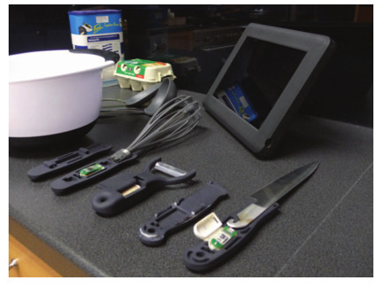
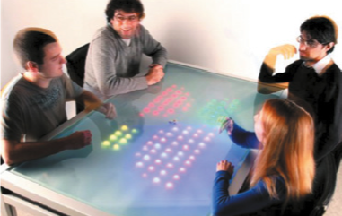
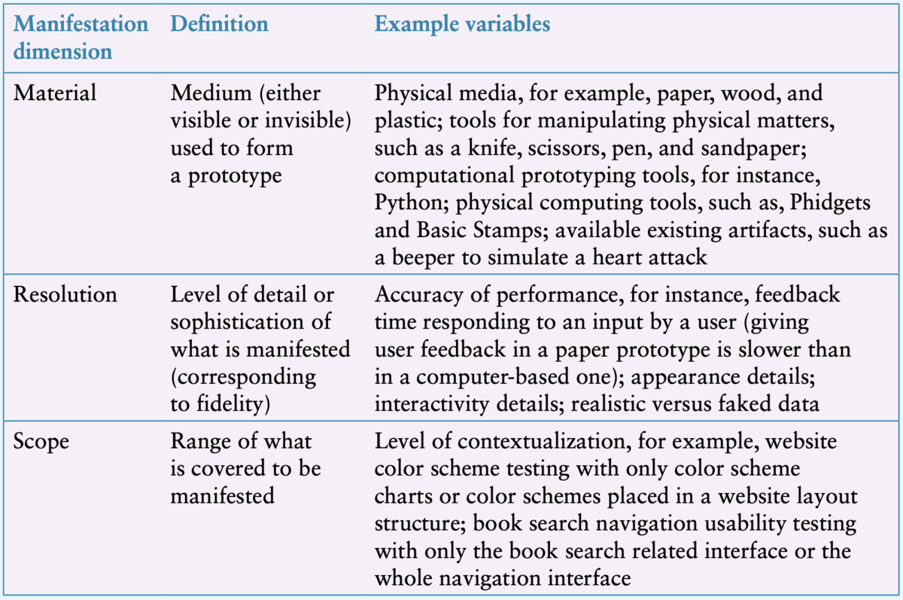
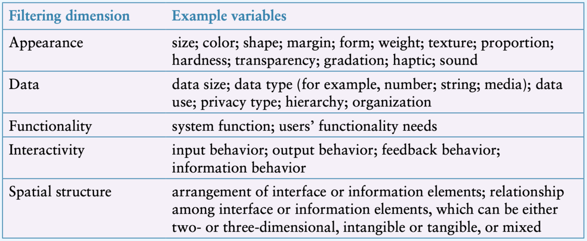
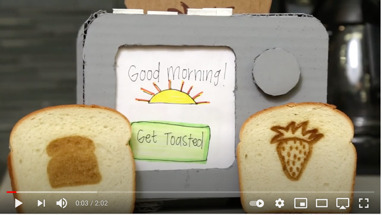
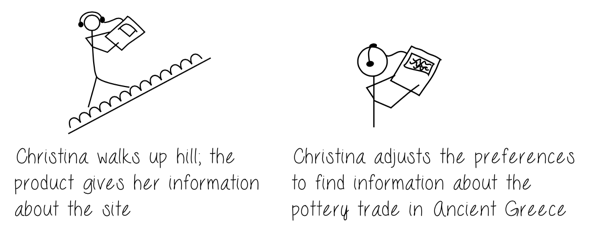
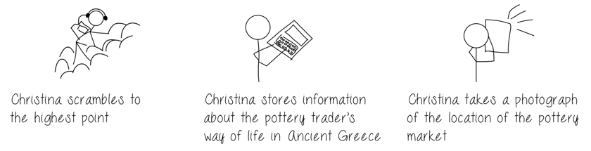
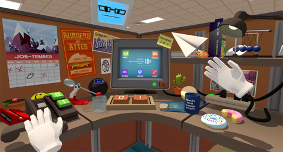

## Plan for the class

What is interaction?

- Cognitive
- Social
- Emotional

# Cognitive Aspects

## Cognition

- What is cognition?
  - A definition from Oxford English Dictionary

Source: "cognition, n."  _OED Online_ , Oxford University Press, June 2022, www.oed.com/view/Entry/35876. Accessed 31 July 2022.

## Cognitive processes

Cognitive processes can change depending on the problem:

- __Experiential Cognition__: 2 + 2 =
- __Reflective Cognition__: 21 x 19 =

## What are cognitive processes?

Processes of Cognition (Eysenck and Brysbaert 2018)

1. Attention
2. Perception
3. Memory
4. Learning
5. Reading, speaking, listening
6. Problem solving, planning, reasoning, decision making

## 1. Attention

- “It involves selecting things on which to concentrate, at a point in time, from a range of the possibilities available, allowing us to focus on information that is relevant to what we are doing.” (Sharp et al. 2019, p. 103)
    - Clear goals (directed searching vs browsing)
    - Information presentation (structure and layout in the interface)
    - Multitasking and attention
      - Depends on individuals and context
      - Relevance of distractions
      - Effort to task switch
      - Designing to support effective multitasking

## 1. Attention

## 2. Perception

- “[…] how information is acquired from the environment via the five sense organs (vision, hearing, taste, smell, and touch) and transformed into experiences of objects, events, senses, and tastes” (Roth, 1986 in Sharp et al. 2019, p. 109)
- Proprioception: Awareness of position and movement of body through muscles and joints
- Vision -> hearing -> touch (sighted individuals)

## 2. Perception

## 3. Memory

> “Memory involves recalling various kinds of knowledge that allow people to act appropriately. ” (Sharp et al. 2019, p. 111)

- Brain filters what to remember and what to forget to avoid overload – but not always in the way we want to!
- Filtering into memory – depends on encoding process (e.g., active vs passive learning) and context (e.g., seeing someone in a different context)
- People are better at recognition than recall
- Relying on technology rather than memory (e.g., car navigation system, “let me Google that…”)
- Personal information management – folder scanning and search engines
- Remembering passwords and multifactor authentication

](img/02_theory_and_concepts_8.jpg)

## 3. Memory

(Sharp et al. 2019, p.119)

## 4. Learning

> “accumulation of skills and knowledge that would be impossible to achieve without memory” (Sharp et al. 2019 p.119)

- Incidental learning vs intentional learning
- Learning by reading vs learning by doing
- Learning through collaboration
- Micro-learning
- Multimodal learning through new and emerging technologies e.g., Augmented reality and virtual reality

## 5. Reading, Speaking, Listening

- Communication skills
- Meaning the same across modes
- Writing – permanent, speaking = transient
- Reading quicker than listening
- Listening less cognitive effort than reading
- Some more grammatical than others
- Interactive books, speech technologies, natural language processing, tactile interfaces, assistive technologies

](img/02_theory_and_concepts_12.png) 
](img/02_theory_and_concepts_13.jpg)

## 5. Learning and Communication Design Implications

## 6. Problem- Solving, Planning, Reasoning, Decision-Making

- Involve “reflective cognition” in relation to actions, choices, consequences

How do you make purchasing decisions? What role does technology play?

# Cognitive Frameworks

- Mental models
- __Gulfs of Execution and Evaluation__
- Information Processing
- __Distributed Cognition__
- __External Cognition__
- Embodied Interaction

## Gulfs of Execution and Evaluation (Don Norman)

[The two UX Gulfs: Evaluation and Execution](https://www.nngroup.com/articles/two-ux-gulfs-evaluation-execution/)

## External Cognition (Scaife and Rogers 1996 in Sharp et al. 2019)

- Internal representations (in the head) and external representations (artefacts in the world) and how they interact
- Combined with tools (e.g., pens, calculators, spreadsheets) to support cognitive activities
- External cognition: “the cognitive processes involved when we interact with different external representations” (Sharp et al. 2019, p.129)
- Reducing memory load, computational offloading, annotating, cognitive tracing

(Sharp et al. 2019, p.129)

](img/02_theory_and_concepts_20.jpg)
](img/02_theory_and_concepts_21.jpg)
](img/02_theory_and_concepts_22.jpg)

## Distributed Cognition

- Also about interactions between people, artefacts, and internal and external representations
- Event-driven, systems as the unit of analysis, collective behaviours
- Information flows and transformations through the system
- Different levels of granularity
- Analysis addresses problem solving, communication (verbal and non-verbal), coordination mechanisms, accessing and sharing knowledge
- Analysis can inform design implications and decision-making in designing to support distributed cognition

(Sharp et al. 2019, p.120; Rogers 2012 pp.38-39)

# Social Interaction

> What are the kinds of situations in which you would phone someone?

> What are the kinds of situations in which you would send someone a text message?

## Face-to-Face Conversations

- Conversational rules from  __Conversational Analysis __ (Sacks 1987):
- Adjacency pairs – setting up an expectation of a response (Schegloff and Sacks 1973)
- Breakdowns and repairs: Breaking rules or missing cues
- Designing conversational user interfaces and to support face-to-face communication

- Collaborative activity involving social skills, rules, norms, and conventions
  - Often tacit – people are not actively aware of, or thinking about, following them
  - People have different communication styles, backgrounds, and abilities -  __inclusive design is important__
- Different ways of opening, maintaining, and closing a conversation – implicit and explicit rules

## Remote Conversations

Image: Susan Lechelt in Sharp et al. 2019, p.147, (Sharp et al. 2019, pp. 143-149)

- Phone to video conferencing
- "Telepresence”:  “The perception of being there while physically remote” (Sharp et al. 2019, p.144)
- Telepresence rooms, robots, virtual reality
- Features of interaction design can establish a sense of presence and facilitate remote conversation
- “Social presence”: “the feeling of being there with a real person in virtual reality” (p.146)

## Co-Presence

> “supporting people in their activities when they are interacting in the same physical space” (Sharp et al. 2019, p.150)

- Supporting effective collaboration
- Physical coordination– hand gestures, body language, use of objects such as wands and batons
- Awareness – knowing what is going on around you, functioning as “close-knit teams”
- Shareable interfaces e.g., whiteboards, touch screens
- Social translucence: “designing communication systems to enable participants and their activities to be visible to one another” (p.155)
- Lots of good examples in the textbook

](img/02_theory_and_concepts_30.png)

## Social Engagement

- “Participation in the activities of a social group (Anderson and Binstock, 2012). Often involves some form of social exchange where people give and receive something from others […] voluntary and unpaid” (Sharp et al. 2019, p.158)
- Connecting people with a common interest – e.g., Twitter battles, viral posts. Digital volunteering – disaster information sharing, citizen science

# Emotional Interaction

](img/02_theory_and_concepts_49.jpg)

## Three Levels of Emotion

## Expressive Interfaces and Emotional Design

- Design features that seek to create an emotional connection with users or elicit emotional responses in users
- Denoting the system state
- Expressivity through animated icons, sonofications (sound effects), vibrotactile feedback (e.g., mobile phone or watch buzzing)
- Nice looking design affects people’s perceptions of the usability + they are pleasurable to use
- Annoying interfaces elicit negative emotional responses (e.g., unable to do the task, feeling patronised, unhelpful, time-consuming to use, intrusive, passive-aggressive)
- (in Sharp et al. 2019, p.172-178)

## Affective Computing

](img/02_theory_and_concepts_54.png)

## Emotional AI

- Automating the measurement of feelings and behaviours by using AI technologies
- Various sensors and measures
- Six fundamental emotions classified by Affdex: Anger, contempt, disgust, fear, joy, sadness
- Applications such as improving driver safety (e.g., improving mood and concentration, detecting drowsiness)
- Eye-tracking, words and phrases, biometric data (e.g., heart rate)

## Contextual Factors

Think about the setting and context in which interaction takes place:

- Who, what, when, where, why, how of your activity
- How technology extends spatial and temporal dimensions
- What the explicit and unwritten rules, norms, conventions, practices are
- How people interact with tools, technologies, and their environment
- How the setting shape the activity and outputs – “situated actions and practices” (Suchman 1987)

](img/02_theory_and_concepts_63.jpg)

## References

- Zhifa Chen, Yichen Lu, Mika P. Nieminen, and Andrés Lucero. 2020. Creating a Chatbot for and with Migrants: Chatbot Personality Drives Co-Design Activities. In Proceedings of the 2020 ACM Designing Interactive Systems Conference (DIS '20). Association for Computing Machinery, New York, NY, USA, 219–230. [https://doi-org.virtual.anu.edu.au/10.1145/3357236.3395495](https://doi-org.virtual.anu.edu.au/10.1145/3357236.3395495)
- Alan Cheng, Lei Yang, and Erik Andersen. 2017. Teaching Language and Culture through a Virtual Reality Game. Chi 2017: 541–549. https://doi.org/10.1145/3025453.3025857
- Clare J. Hooper, Patrick Olivier, Anne Preston, Madeline Balaam, Paul Seedhouse, Daniel Jackson, Cuong Pham, Cassim Ladha, Karim Ladha, and Thomas Plötz. 2012. The french kitchen. Proceedings of the 2012 ACM Conference on Ubiquitous Computing - UbiComp ’12: 193. https://doi.org/10.1145/2370216.2370246
- Rogers Y (2012) HCI Theory: Classical, Modern, and Contemporary, Morgan and Claypool Publishers. https://doi.org/10.2200/S00418ED1V01Y201205HCI014
- Helen Sharp, Jenny Preece, and Yvonne Rogers. 2019. Interaction Design: Beyond Human-Computer Interaction. West Sussex: Wiley.
- Suchman, L.A., 1987.  _Plans and situated actions: The problem of human-machine communication_ . Cambridge university press.

# Sketching Design Ideas

- What is a sketch?
- What makes something a sketch?

## What is a sketch?

- Quick
- Timely
- Inexpensive
- Disposable
- Plentiful
- Clear vocabulary
- Distinct gesture
- Minimal detail
- Appropriate degree of refinement
- Suggest and explore rather than confirm
- Ambiguity

(Buxton 2007, p.111-113)

## What should a sketch include?

- Title
- Annotations
- Short description (1-2 sentences)

## Is a sketch a prototype?

No.

](img/06_ideation_9.jpg)

## How to Choose your Best Ideas

](img/06_ideation_10.png)

## Ten Principles of Good Design

](img/06_ideation_11.jpg)

## How to choose your Best Ideas

- High-Fidelity Prototype – Design Idea EXCEPTIONAL
- Design idea is original, creative, and interesting.
- Connection to design opportunities identified in project 2 is clear and compelling.
- Design could be seamlessly used in the chosen activity in ways that enrich the making practice.

## Getting the Right Design vs Getting the Design Right

](img/06_ideation_12.png)

Bill Buxton sez! So do it! 

## Readings / References

- Bill Buxton. 2007.  _Sketching User Experiences._ San Francisco: Elsevier
- R.F. Dam & T.Y. Siang. 2020.  [_Introduction to the Essential Ideation Techniques which are the Heart of Design Thinking_](https://www.interaction-design.org/literature/article/introduction-to-the-essential-ideation-techniques-which-are-the-heart-of-design-thinking) . Interaction Design Foundation.  
- R.F. Dam & T.Y. Siang. 2020.  _Learn How to Use the Best Ideation Methods: SCAMPER_ .  <https://www.interaction-design.org/literature/article/>
- H. Faste. 2013. C _HAINSTORMING! CHEATSTORMING!_   <https://blog.humancomputation.com/?p=5345>
- Gamestorming.  _[https://gamestorming.com](https://gamestorming.com/)_
- Justinmind. 2018.  _8 UX ideation techniques to try out_ .  <https://www.justinmind.com/blog/8-ux-ideation-techniques-to-try-out/>
- R. Riley.  _The Provocation Creative Technique_ . Thought Egg. <https://thoughtegg.com/provocations-creative-technique/>
- Helen Sharp, Jenny Preece, and Yvonne Rogers. 2019. Interaction Design: Beyond Human-Computer Interaction. West Sussex: Wiley.

# Prototyping

## Introduction

- Design, prototyping, construction - Design phase
- Solutions are created, prototyped, tested, iterated
- Repeated design-evaluation-redesign cycles with users
- Two aspects to design - conceptual and concrete

## Prototyping - What

:::::::::::::: {.columns}
::: {.column width="40%"}
- Concrete manifestation of an idea
- Allows stakeholders to interact and explore
- Take many forms for different purposes
- 3D printing is commonly used now
:::
::: {.column width="60%"}

:::
::::::::::::::

## Prototyping – Why?

> Discussion question: Why do we prototype?

## Prototyping - Why

- Communication device
- Discuss/evaluate/explore ideas
- Important in many design disciplines
- Answer questions, help choose between alternatives
- Serve many purposes
- Product prototype versus service prototype (Saffer, 2010)
- Move on from ‘bad ideas’

## Prototyping - Example

:::::::::::::: {.columns}
::: {.column width="40%"}

- Paper-based prototype to help a child with autism to communicate
- Functions and buttons
- Positioning and labels
- Shape of the device
- No actual functionality
:::
::: {.column width="60%"}

:::
::::::::::::::

## Prototyping - Filters & Manifestations

:::::::::::::: {.columns}
::: {.column width="50%"}

Youn-Kyung Lim et al. (2008)
3 key principles
:::
::: {.column width="50%"}

:::
::::::::::::::

## Prototyping - Spectrum

:::::::::::::: {.columns}
::: {.column width="40%"}
- High Fidelity Prototype
- Low Fidelity Prototype
- [https://collection.maas.museum/object/115505](https://collection.maas.museum/object/115505)
- [https://www.youtube.com/watch?v=k_9Q-KDSb9o](https://www.youtube.com/watch?v=k_9Q-KDSb9o)
:::
::: {.column width="60%"}

 on [Unsplash](https://unsplash.com/s/photos/toaster)
](img/07_prototyping_8.jpg)
:::
::::::::::::::

## Prototyping - Low-Fidelity

:::::::::::::: {.columns}
::: {.column width="40%"}
- Don’t look/act like the final product
- Simple, cheap, quick to produce/modify
- Support exploration of alternative designs/ideas
- Important in early stages - exploration/modification
- Not meant to be kept and used for the final product
- Storyboarding, Sketching, Index Cards, Wizard of Oz
:::
::: {.column width="60%"}

:::
::::::::::::::

## Low-Fidelity Prototyping: Storyboards

:::::::::::::: {.columns}
::: {.column width="40%"}
- Storyboarding - series of sketches or scenes
- How a user can perform a task
- Use in conjunction with a scenario
- Stakeholders role-play, step through the scenario
:::
::: {.column width="60%"}

:::
::::::::::::::

## Low-Fidelity Prototyping: Generating Storyboards

:::::::::::::: {.columns}
::: {.column width="40%"}
- A scenario is one story
- A storyboard represents a sequence of events
- Generated from scenario
- Break the story into steps
- Thinking through process
- Think about design issues
:::
::: {.column width="60%"}

:::
::::::::::::::

## Low-Fidelity Prototyping: The Role of Sketching

:::::::::::::: {.columns}
::: {.column width="40%"}
- Sketching - a key part of low-fidelity prototyping
- “Sketching is not about drawing. Rather, it is about design” Saul Greenberg et al. (2012)
- Sketching vocabulary, required elements
- BUT a sketch itself is not a prototype
:::
::: {.column width="60%"}

:::
::::::::::::::

## Low-Fidelity Prototyping: Card-Based Prototypes

- Index cards (Small pieces of cardboard: 3x5 inches)
- Each card represents one element of the interaction
- A screen, icon, menu, dialog exchanges
- User can step through the cards
- Pretending to perform the task while interacting

## Low-Fidelity Prototyping: Card-Based Prototypes

:::::::::::::: {.columns}
::: {.column width="40%"}
- Capture and explore elements of interaction
- Can be manipulated and moved
- Evaluation or design process
- Step through a use case
- Elaborate concrete design
- Explore user experience
:::
::: {.column width="60%"}

:::
::::::::::::::

## Low-Fidelity Prototyping: Paper and Cardboard Prototypes

:::::::::::::: {.columns}
::: {.column width="40%"}
](img/07_prototyping_16.jpg)
:::
::: {.column width="60%"}
](img/07_prototyping_17.jpg)
:::
::::::::::::::

## Paper Prototyping: It’s not just the prototypes, but how you use them!

](img/07_prototyping_18.png)

## Low-Fi Prototyping: Wireframes

:::::::::::::: {.columns}
::: {.column width="50%"}
](img/07_prototyping_19.png)
:::
::: {.column width="50%"}

:::
::::::::::::::

## Prototypes vs Wireframes

](img/07_prototyping_21.png)

## Wizard of Oz

:::::::::::::: {.columns}
::: {.column width="40%"}
- Assumes a software-based prototype
- User interacts with the software
- A human simulates the software’s response
:::
::: {.column width="60%"}
](img/07_prototyping_23.jpg)
:::
::::::::::::::

## Making Hardware Prototypes

- Build _working_ prototype systems in hardware
- [micro:bit](https://microbit.org) - cheap, small, with IO on the board (hello comp2300!)
- [arduino](https://arduino.cc), big ecosystem, not-as-good boards.
- [raspberry pi](https://www.raspberrypi.com), cheap way to get Linux into a prototype
- [Bela](https://bela.io) (charles' friends!), pricey but hard realtime OS is good for audio interactions.

## Makey Makey

:::::::::::::: {.columns}
::: {.column width="40%"}
- Alligator clip to connect switches / sensors
- Works as a keyboard
- e.g., [banana spacebar](https://www.youtube.com/watch?v=rfQqh7iCcOU)

:::
::: {.column width="60%"}

:::
::::::::::::::

## Prototyping - High-Fidelity

- Looks and acts more like the final product
- Continuum between low and high fidelity
- answer design questions, learn about constraints
- Evolve through stages of fidelity
- design-evaluate-redesign cycles
- Modify/integrate existing components / tools / kits

## A High-fidelity prototype

](img/07_prototyping_34.jpg)

## Concrete Design

Visual appearance (colour, layout, graphics, fonts etc).
Interface types – design principles and guidelines
Interaction modalities including input and output
Accessibility and inclusivity

## Prototyping - Filters & Manifestations

## Prototyping - Compromises

- Compromise is inherent to prototyping
- Make something quickly to test a particular aspect
- Prototype must be built with the key issues in mind
- Horizontal vs vertical prototyping
- Robustness vs changeability

## Prototyping Tools and Resources

:::::::::::::: {.columns}
::: {.column width="40%"}
- Crafting materials
- Digital wireframing and prototyping tools e.g. [Figma, Miro, Wireframe.cc](https://www.interaction-design.org/literature/topics/wireframing)
- Microsoft PowerPoint- a powerful prototyping tool!!
- Physical computing devices (e.g., Arduino, Makey Makey)
- Design patterns, open source resources, interaction design tools- See Sharp et al. 2019, Sections 13.3-13.5
:::
::: {.column width="60%"}

:::
::::::::::::::

## Conceptual Design

- Developing a Conceptual Model
- An outline of what people can do and what concepts are needed to understand how to interact
- Need to understand the problem space and users
- Generate ideas based on understanding
- Explore ideas with tutorial groups

## Conceptual Model

- Metaphor, analogies, concepts, relationships, mappings
- How to choose  __interface metaphors__ that will help users understand the product?
- Which  __interaction types__ would best support the users’ activities?
- Do different  __interface types__ suggest alternative design insights or options?

## Interface Metaphors

Choosing metaphors (Erikson, 1990)

1. Identify functional requirements (what it will do)
2. Which parts are likely to cause users problems?
3. Generate metaphors

Evaluate metaphors: Structure, Relevance, Representation, Understandable, Extensible (Sharp et al., p. 440-441 for example)

## Interaction Types

:::::::::::::: {.columns}
::: {.column width="40%"}
Instructing, conversing, manipulating, exploring, responding

- Which is best, depends on the design
- Most models will include a combination
- Different parts will have different types
:::
::: {.column width="60%"}

:::
::::::::::::::

## Interface Types

:::::::::::::: {.columns}
::: {.column width="40%"}
- Prompt and support different user experiences / behaviour
- Prototyping will require an interface type or candidates
- Depends on product constraints from requirements
- Input and output modes <- user/context requirements
:::
::: {.column width="60%"}

:::
::::::::::::::

## Take away messages

- Prototyping can serve many purposes in HCI research, and support different stages of the design process
- There is more than one way to prototype a single design concept (low fi and hi fi)
- Prototypes help you  __to learn __ about your users’ interactions and experiences with your design artifact
- Your choice of prototyping approach depends on what you are trying to learn and why

## Readings

- R.K. Dam and T.Y. Siang. 2020. Design Thinking: Get Started with Prototyping. [(link)](https://www.interaction-design.org/literature/article/design-thinking-get-started-with-prototyping)
- Erickson, T. D. 1990. Working with Interface Metaphors. In B. Laurel (ed.) The Art of Human–Computer Interface Design. Addison-Wesley, Boston.
- Lim, Y.-K., Stolterman, E., and Tenenburg, J. 2008. The Anatomy of Prototypes: Prototypes as Filters, Prototypes as Manifestations of Design Ideas, ACM Transactions on Computer-Human Interaction, 15(2).
- Saffer, D. 2010. Designing for Interaction: Creating Smart Applications and Clever Devices(2nd edn). New Riders Press, Indianapolis, IN.

## Questions

Who has a question?

# References {.allowframebreaks}
