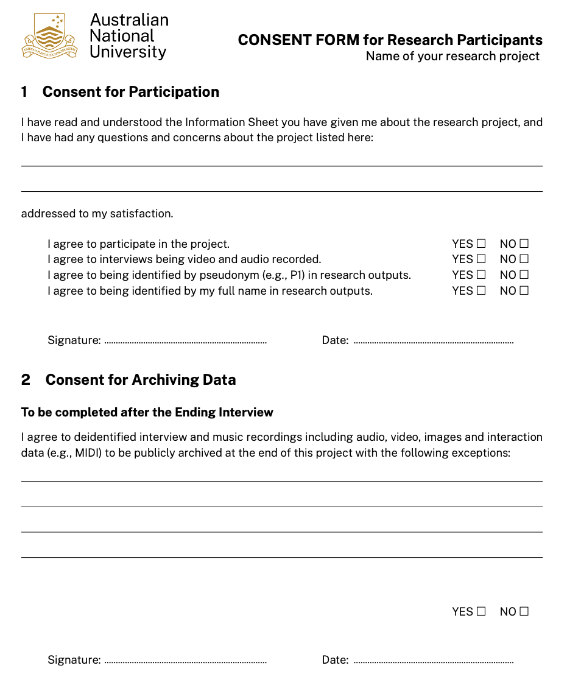
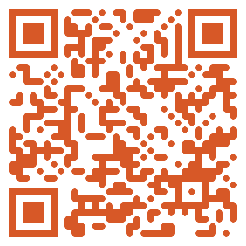
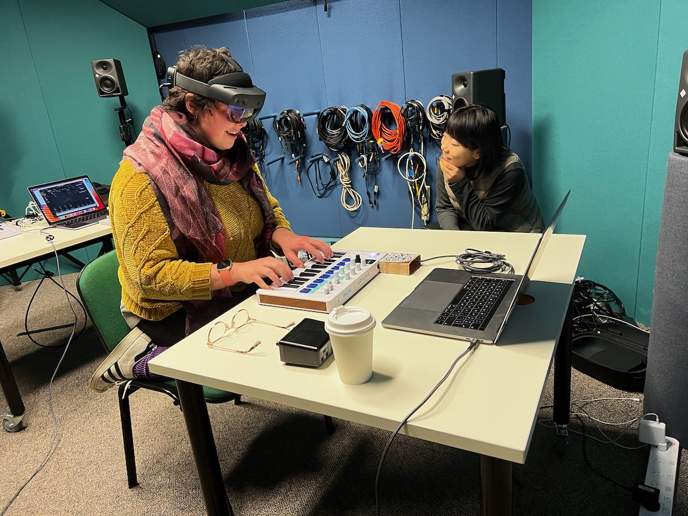

## Announcements

- template for assignment 1 is [available](https://gitlab.cecs.anu.edu.au/comp3900/2025/comp3900-2025-prototyping)
- assignment 1 [due **Monday 18 August, 23:59 on GitLab**](https://canvas.anu.edu.au/courses/2781/assignments/11544)
- assignment 2 specification will be published next week, [you can see the "main idea" already on Canvas](https://canvas.anu.edu.au/courses/2781/assignments/11550)
- keep attending labs, if issues, apply for an [extension (see course policies on Canvas)](https://canvas.anu.edu.au/courses/2781/pages/policies)
- any questions, problems, [**use the forum**](https://edstem.org/au/courses/24905/discussion)!
- lab marks come out weekly via Canvas

**Who has a question about assignment 1?**

## Plan for the class

**New module: user research,  data, analysis, evaluation**

1. Plan and run data gathering sessions
2. Plan and run an interview
3. Design a questionnaire
4. Plan and carry out observation

# Main issues in data gathering

:::::::::::::: {.columns}
::: {.column width="60%"}
- why and how is data gathered? 
- what kind of data? (just ratings or more?)
- necessary both for discovering requirements and evaluation
- today: introduce the main issues and techniques
- later weeks: look at how to structure evaluation and analyse different kinds of data
:::
::: {.column width="40%"}

:::
::::::::::::::

## Setting Goals

:::::::::::::: {.columns}
::: {.column width="60%"}
Get information about people, their behaviour and experiences with technology.

- What information and why?
- Depends on research problem and phase of research/design process, e.g.,
    - Comparing two alternative interfaces
    - Understanding a context of use
    - Measure time taken to complete a task
    - Discover how users interact with an existing system
:::
::: {.column width="40%"}

:::
::::::::::::::

## Identifying Participants

:::::::::::::: {.columns}
::: {.column width="60%"}
Who are the participants? How many are needed?

- Small group of stakeholders
- Criteria for involvement ("plays video games regularly")
- Random sampling from large population
- Convenience/volunteer sampling from those available
- Users with specific skills/needs
- Snowball sampling (participants help find more)
- Researchers make a justified choice
- Number of participants: most common in HCI is 12 [@caine-sample-size:2016]
:::
::: {.column width="40%"}

:::
::::::::::::::

## Relationship between collector and provider

:::::::::::::: {.columns}
::: {.column width="60%"}
A data provider _gives_ us data. What do they get back?

- Conduct research openly, ethically, [responsibly](https://policies.anu.edu.au/ppl/document/ANUP_007402)
- Informed consent
- Clear communication of benefits and risks
- Respect and acknowledgement
- Particular care for some groups, e.g., Aboriginal and Torres Strait Islander communities.
- Practical: building rapport and understanding (not just taking)
:::
::: {.column width="40%"}
{width=70%}
:::
::::::::::::::

## Ethical Considerations for Data

:::::::::::::: {.columns}
::: {.column width="60%"}
- data can have strings attached 
- privacy
- personal information (including **name!**)
- sensitive information (embarrassing or harmful)
- storage requirements
- do we just use Google drive for everything?
- research needs a data management plan
:::
::: {.column width="40%"}

:::
::::::::::::::

## Triangulation

:::::::::::::: {.columns}
::: {.column width="60%"}
- _data triangulation:_ data is drawn from different sources, times, places, people, etc
- _investigator triangulation:_ different researchers (observers, interviewers, etc)
- _triangulation of theories:_ different theoretical frameworks
- _methodological triangulation:_ different data gathering or research techniques
:::
::: {.column width="40%"}

:::
::::::::::::::

## Pilot Studies

:::::::::::::: {.columns}
::: {.column width="60%"}
A small initial study to help plan a larger study.

- Could involve limited number of participants
- Limited interface or study parameters
- Checks that _expected_ data can be obtained
- Can be called a "formative study" (to form the goals of the main study)
- E.g., assess the game platform used in a larger study [@mohaddesi-pilot-studies:2020]
:::
::: {.column width="40%"}

:::
::::::::::::::

# Interviews {background-image="img/sam-mcghee-KieCLNzKoBo-unsplash.jpg"}

> Conversation with a purpose [@kahn1957dynamics]

## Ask the users

:::::::::::::: {.columns}
::: {.column width="50%"}
- Interviews make a lot of sense in HCI
- What should a system do? Just ask.
- How should it work? Just ask.
- Did it work well? Ask away.
- How would you change it? Ask.
:::
::: {.column width="50%"}

:::
::::::::::::::

## Unstructured Interviews

:::::::::::::: {.columns}
::: {.column width="60%"}
- exploratory, similar to conversations
- go into depth on experiences
- questions are open: no expectation on the content of answers or subsequent questions
- **probing:** can you tell me more about ...?
- benefit: generate rich, complex data
- limitation: time consuming to analyse
:::
::: {.column width="40%"}
> Could you tell me about your experience using the NewWidgetApp?

> You mentioned that you enjoyed (feature X), why was that?

> Can you explain more about what happened when you used (feature X)?
:::
::::::::::::::

## Structured Interviews

:::::::::::::: {.columns}
::: {.column width="60%"}
- questions are **predetermined**
- questions need to be short and clear
- questions can be closed (answers from specific options)
- typically, whole interview is scripted
- low skill to deliver
- fast to deliver
- useful when goals are clearly understood and questions and responses can be identified
:::
::: {.column width="40%"}
> What is your most used code editor: VSCode, nvim, emacs, notepad.exe, or something else?

> How often do you push your assessments to Gitlab: every minute, every hour, every day, just once?
:::
::::::::::::::

## Semi-structured Interviews

:::::::::::::: {.columns}
::: {.column width="60%"}
- features of both **structured** and **unstructured**
- typically: script with questions on main topics but discussion and probing follows each question
- intended to be somewhat replicable
- **probe:** neutral questions to gain more detail
- **prompt:** reminder of some part of the topic to gain specific information
- careful: prompting can preempt answers (bias!)
:::
::: {.column width="40%"}
> How are things going with the interaction experience?

> Are there any \[initial\] impressions you want to share?

> Can you describe the connections between your movements and the resulting sound? 

[@reed2023imagining]
:::
::::::::::::::

## Focus Groups

:::::::::::::: {.columns}
::: {.column width="60%"}
- interview with multiple participants (could be called a group interview)
- facilitator prompts discussion
- group members can influence each other (good or bad?)
- good for talking to lots of people.
- raising diverse viewpoints
- **facilitation:** need to be careful
- **groupthink:** generally considered harmful

(I don’t find the “Focus Group” term super useful in my academic research—but they are widely used in industrial/government research.)
:::
::: {.column width="40%"}

:::
::::::::::::::

## Activity: Plan interview questions

:::::::::::::: {.columns}
::: {.column width="60%"}
Let's plan a _semi-structured_ interview!

> We need to understand student's user experience with the "catchbox": a soft microphone used during lectures.

Use the poll everywhere link to suggest interview questions and vote on the best ones.

**Ideate** for 2-3 minutes, **vote** for 1 minute, then let's discuss.
:::
::: {.column width="40%"}

:::
::::::::::::::

## Developing Interview Questions

- long questions are confusing
- jargon / technical language may be confusing (e.g., popover, jumbotron, nav bar, onboarding popup)
- keep questions neutral (e.g., "How much do you love this lecture?" is a leading question)
- questions need to support data gathering **goals**
- may not need to ask questions not related to goals

Easy to (accidentally) write bad interview questions!

## Running the Interview

:::::::::::::: {.columns}
::: {.column width="60%"}
- usually have a script for introductions, consent, etc (read verbatim)
- listen more than talk
- respond with sympathy but without bias
- enjoy the experience
- interviewing is **hard work**!
:::
::: {.column width="40%"}

:::
::::::::::::::

## Capturing Data

:::::::::::::: {.columns}
::: {.column width="60%"}
- usually interviewing involves a combination of:
  - notes
  - audio
  - video
- different data have different issues and needs
  - notes: type up, handwriting (bias?)
  - audio: convert format, [transcribe (suggest Aiko)](https://sindresorhus.com/aiko)
  - video: edit, store (large file sizes, anonymity)
:::
::: {.column width="40%"}

:::
::::::::::::::

# Questionnaires

{width=60%}

## Structure and Format

:::::::::::::: {.columns}
::: {.column width="60%"}
- written method of gathering structured data
- sometimes called a "survey", technically a survey is the whole study
- _questionnaire_ or _survey instrument_ is the paper form with questions
- questions can be open or closed
- often questionnaire used for demographic data
- standard survey instruments are often questionnaires
:::
::: {.column width="40%"}

:::
::::::::::::::

## Open text questions

:::::::::::::: {.columns}
::: {.column width="60%"}
Questions might be something like: 

> What were the strengths of this course?

> Please provide any suggestions about how this course could be improved?

- the researcher might have little control over how seriously these questions are taken.
- potential to gather rich data
- **careful:** use these only with really open concepts
:::
::: {.column width="40%"}

:::
::::::::::::::

## Closed form questions

:::::::::::::: {.columns}
::: {.column width="60%"}
- closed form questions have preset responses from which the respondent must select.
- unordered responses
- rating scale questions
- **careful:** closed form questions design should be neutral and include most likely or relevant responses
:::
::: {.column width="40%"}
>  What is your favourite fruit (select one answer): plum, tomato, pineapple”

> How interesting is this lecture? Select a number from 1 (interesting) to 10 (amazingly interesting).
:::
::::::::::::::

## Likert or Lump It

:::::::::::::: {.columns}
::: {.column width="50%"}
- Likert scale questions are very common in questionnaires
- named after [Rensis Likert](https://en.wikipedia.org/wiki/Rensis_Likert) (social scientist) [@likert1932technique]
- The question includes a statement, e.g.: “The workload was appropriate for this course”
- A number of levels of agreement are provided, e.g.: “strongly disagree, disagree, neutral, agree, strongly agree.”
- 5-points is common, 3, 7, 9 or a continuous slider is also possible.
:::
::: {.column width="50%"}

:::
::::::::::::::

## Semantic Differential Scale

:::::::::::::: {.columns}
::: {.column width="60%"}
- ratings of an object, concept, situation, etc
- the answer is a point between two opposite concepts
- e.g., describe your experience of using the (insert system here)
  - difficult to use --- easy to use
  - boring --- fun
  - slow to learn --- fast to learn
:::
::: {.column width="40%"}
![Example of semantic differential scales [image from @rogers-beyond-hci:2023]](img/semantic-differential-scale.png)
:::
::::::::::::::

## Existing Survey Instruments

- Researchers sometimes choose to use well-known existing survey instruments rather than create their own.
- Existing surveys may be validated by having been tested and applied in many other studies.
- Sometimes the survey instrument comes with built-in instructions for analysing results.
- Let's look at some examples that are typical in HCI:
  - System Usability Scale (SUS) [@brooke-sus:1995; @uiuxtrend2024sus]
  - NASA Task Load Index (TLX) 

  <!-- TODO - Creativity Support Index -->

<!-- https://www.nngroup.com/articles/measuring-perceived-usability/ -->

<!-- TODO Net Promoter Score NPS https://www.nngroup.com/articles/nps-ux/ -->

## System Usability Scale Questions

:::::::::::::: {.columns}
::: {.column width="50%"}
1. I think that I would like to use this system frequently.
2. I found the system unnecessarily complex.
3. I thought the system was easy to use.
4. I think that I would need the support of a technical person to be able to use this system.
5. I found the various functions in this system were well integrated.
:::
::: {.column width="50%"}
6. I thought there was too much inconsistency in this system.
7. I would imagine that most people would learn to use this system very quickly.
8. I found the system very cumbersome to use.
9. I felt very confident using the system.
10. I needed to learn a lot of things before I could get going with this system.
:::
::::::::::::::

## NASA Task Load Index Questions

:::::::::::::: {.columns}
::: {.column width="60%"}
1. How mentally demanding was the task?
2. How physically demanding was the task?
3. How hurried or rushed was the pace of the task?
4. How successful were you in accomplishing what you were asked to do?
5. How hard did you have to work to accomplish your level of performance?
6. How insecure, discouraged, irritated, stressed and annoyed were you?

[Worksheets provided!](https://ntrs.nasa.gov/citations/20000021488), [@hart-nasa-tlx:1988]
:::
::: {.column width="40%"}

:::
::::::::::::::

## Questionnaire Tips

:::::::::::::: {.columns}
::: {.column width="60%"}
- It’s hard to write survey questions! It may be good for beginners to use a standard questionnaire.
- The more questions you ask, the more work it can be to analyse. It can be counter-productive to have lots of questions without a way to aggregate them.
- Rating scale data is generally not continuous and so you need to use non-parametric significance tests. 
- The distribution of survey data is usually important, good to use plots such as box plots rather than a mean and standard error chart.
:::
::: {.column width="40%"}

:::
::::::::::::::

## Activity: Write a questionnaire

:::::::::::::: {.columns}
::: {.column width="60%"}
Let's write a questionnaire about ANU students' class enrolment experience.

- What questions should we ask?

Talk for 2-3 minutes then let's have some discussion.
:::
::: {.column width="40%"}

:::
::::::::::::::

# Observation

{width=50%}

## Direct Observation in the Wild

:::::::::::::: {.columns}
::: {.column width="60%"}
- watching people for science
- using system or technology in the normal context of use
  - e.g., a researcher joins a tour group to observe use of a travel navigation app
  - e.g., a researcher watches a concert carefully to observe the performer's use of music technology

### Example framework:

- **The person:** who is using the technology at any given point?
- **The place:** where are they using it?
- **The thing:** what are they doing with it?
:::
::: {.column width="40%"}

:::
::::::::::::::

## Ethnography

:::::::::::::: {.columns}
::: {.column width="60%"}
- Literally “study of culture”
- immersion and participation in a research context.
- e.g., to create a factory management system, a researcher might embed themself in a factory, talk to workers and perform tasks
- ethnography is often used in relation to specific workplaces, e.g.: factories, hospitals etc
- being within the context of the participants rather than bringing them to a lab/classroom for study
- ethnography as a methodology connected with anthropology (i.e., as “the study of culture”), but it’s not identical
:::
::: {.column width="40%"}

:::
::::::::::::::

## Direct Observation in Controlled Environments

:::::::::::::: {.columns}
::: {.column width="60%"}
- observation in a lab-based setting
- could be possible to identify close details
- record all aspects of technology use
- record data, audio, video as well as observations
:::
::: {.column width="40%"}

:::
::::::::::::::

## Think-Aloud Technique

- **Problem:** observers don't know what participants are thinking
- **Solution:** ask participants to say everything they are thinking and trying to do when using an interface, so we know!
- can produce very useful data
- hard work for the participant
- needs careful facilitation from the observer

- more: [Thinking aloud, the #1 usability tool](https://www.nngroup.com/articles/thinking-aloud-the-1-usability-tool/)

## Video-cued Recall

:::::::::::::: {.columns}
::: {.column width="60%"}
- it can be difficult to remember details from a long sequence of tasks.
- techniques like video cued recall can help participants provide a commentary on an experience.
- the idea is: you record video of the participant completing an an interaction and then have an open-ended discussion while watching it back.
:::
::: {.column width="40%"}

:::
::::::::::::::

## Indirect Observation

- We can observe without being present
- Useful for 
  - embedding systems in people's everyday life
  - interacting with participants remotely
  - tracking more participants than you could directly observe

## Diaries

:::::::::::::: {.columns}
::: {.column width="60%"}
- participants write about their experiences with a system regularly in a diary
- easy for the researcher at the collection stage
- takes continuous effort from the participants (reminders? structure?)
- relies on participant's memory and subjective account
- video and photos can reinforce written accounts
:::
::: {.column width="40%"}

:::
::::::::::::::

## Logs, Analytics, Scraping

:::::::::::::: {.columns}
::: {.column width="60%"}
- **Interaction log:** a log of data captured from a system showing exactly what the participant did at any given time
- e.g.: key presses, mouse movements, interactions with GUI components, sensor data
- time spent on actions or using software (e.g., playing a game, using instagram)
- unobtrusive, automatic
- lots of data, should be visualised or analysed to develop findings
- scraping data from public sources (e.g., social media) can be observation

**N.B. scraping large amounts of data raises ethical concerns!**
:::
::: {.column width="40%"}
{width=100%}
:::
::::::::::::::

## Activity: Would you rather (observation edition)

Would you rather:

1. observe / be observed directly in the wild
2. observe / be observed directly in a lab
3. observe / be observed indirectly through a diary
4. observe / be observed indirectly through a data analytics

Discuss for 2-3 minutes in groups and then we will hear some responses!

# Data Gathering in Practice

:::::::::::::: {.columns}
::: {.column width="60%"}
Back to our issues:

1. goals
2. participants
3. ethics, consent with participants
4. ethics of data
5. triangulation
6. pilot studies vs main studies
:::
::: {.column width="40%"}

:::
::::::::::::::

## Choosing Techniques [@rogers-beyond-hci:2023]

| technique | good For | kind of data | issues |
|---|---|---|---|
| interviews | exploring issues | mostly qualitative | skilled work but high value|
| focus groups | multiple viewpoints | mostly qualitative | efficient, groupthink risk |
| questionnaires | specific questions | quantitative and qualitative | lots of participants, hard to design  |
| direct observation in the wild | context of use | mostly qualitative | very useful data, very time consuming |
| direct observation in a controlled environment | capturing details | quantitative and qualitative | situation can be artificial/unrealistic |
| indirect observation | automatic or remote | quantitative and qualitative | hard to analyse lots of data, can be authentic |

## Adapting for Different Participants

:::::::::::::: {.columns}
::: {.column width="60%"}
- data gathering should adapt to different participants
- **children:** think and react differently to adults, e.g., adapt scales to visual representations [@putnam-sus-children:2020]
- **people with disabilities:** caregivers might be involved to adapt interview questions
- **animals(!):** hard to interpret behaviour, need to design interfaces to work without hurting animals [@mancini-aci:2017]
:::
::: {.column width="40%"}

:::
::::::::::::::

## Gathering Data Remotely

:::::::::::::: {.columns}
::: {.column width="60%"}
- expectations for remote data gathering changed completely during pandemic!
- can access participants in different countries, age groups, abilities, specific or expert users
- observation could be recorded and then analysed later
- best practices might include [@mastrianni-remote:2021]:
  - running pilot tests before conducting sessions
  - have backups in place in case of issues
  - informing participants of technical requierments
  - use respective questioning if issues with think-aloud.
:::
::: {.column width="40%"}

:::
::::::::::::::

## Questionnaires vs Interviews

- Questionnaires, while very useful can only tell us information that we know to ask about.
- Interviews let us find out information that didn’t know to begin with.
- Questionnaires are fast and can address lots of participants---a broad approach
- Interviews are slow but are a deep approach.
- Interviews also require good conversational skills and experience to conduct well.

## Questions

Who has a question?

# References {.allowframebreaks}
