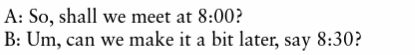

## Plan for the class

# Universal Usability

Creating technologies that are accessible and effective for a broad range of users. [@shneiderman-universal-usability:2000]

(Shneiderman Chapter 2) 

## Activity: Question

> Does everybody in Australia have equal access to computer systems?

> Does everybody at ANU have equal access to computer systems?

> What about the interface limits access?

## Variations in Physical Abilities and Workplaces

## Diverse Cognitive and Perceptual Abilities

## Personality Differences

## Cultural and International Diversity

## Users with Disabilities

## Older Adult Users

## Children

## Accomodating Diversity

- Shneiderman 2.9

# Social Interaction

## Activity

- What are the kinds of situations in which you would phone someone?
- What are the kinds of situations in which you would send someone a text message?
- What leads to the difference?

Introduce yourself to someone nearby, talk for 2-3 minutes, and we'll hear some answers.

## Face-to-Face Conversations

:::::::::::::: {.columns}
::: {.column width="60%"}
- Conversational rules from Conversational Analysis (Sacks 1987):
- Adjacency pairs – setting up an expectation of a response (Schegloff and Sacks 1973)
- Breakdowns and repairs: Breaking rules or missing cues
- Designing conversational user interfaces and to support face-to-face communication

:::
::: {.column width="40%"}
- Collaborative activity involving social skills, rules, norms, and conventions
- Often tacit – people are not actively aware of, or thinking about, following them
- People have different communication styles, backgrounds, and abilities
- Different ways of opening, maintaining, and closing a conversation – implicit and explicit rules

:::
::::::::::::::

## Remote Conversations

:::::::::::::: {.columns}
::: {.column width="60%"}
- phone and video conferencing
- telepresence:  “The perception of being there while physically remote” (@rogers-beyond-hci:2023 p.144)
- telepresence rooms, robots, virtual reality
- features of interaction design can establish a sense of presence and facilitate remote conversation
- social presence: the feeling of _being there_
:::
::: {.column width="40%"}
TODO
:::
::::::::::::::

## Co-Presence

:::::::::::::: {.columns}
::: {.column width="60%"}
> “supporting people in their activities when they are interacting in the same physical space” (@rogers-beyond-hci:2023 p.150)

- supporting effective collaboration
- hand gestures, body language, use of objects
- awareness: knowing what is going on around you, functioning as “close-knit teams”
- shareable interfaces: whiteboards, touch screens
- social translucence: enabling participants adn activities to be visible
:::
::: {.column width="40%"}

:::
::::::::::::::

## Social Engagement

:::::::::::::: {.columns}
::: {.column width="60%"}
- “Participation in the activities of a social group (Anderson and Binstock, 2012). Often involves some form of social exchange where people give and receive something from others […] voluntary and unpaid” (@rogers-beyond-hci:2023 p.158)
- Connecting people with a common interest – e.g., Twitter battles, viral posts. Digital volunteering – disaster information sharing, citizen science
:::
::: {.column width="40%"}

:::
::::::::::::::

# Emotional Interaction

](img/02_theory_and_concepts_49.jpg){width=60%}

## A Model of Emotional Design

:::::::::::::: {.columns}
::: {.column width="60%"}
- visceral: look, feel, sound
- behavioural: use (usability)
- reflective: meaning, personal value, culture
:::
::: {.column width="40%"}

:::
::::::::::::::

## Expressive Interfaces and Emotional Design

:::::::::::::: {.columns}
::: {.column width="60%"}
- design features that seek to create an emotional connection with users or elicit emotional responses in users
- denoting the system state
- expressivity through animated icons, sonofications (sound effects), vibrotactile feedback (e.g., mobile phone or watch buzzing)
- nice looking design affects people’s perceptions of the usability + they are pleasurable to use
- annoying interfaces elicit negative emotional responses (e.g., unable to do the task, feeling patronised, unhelpful, time-consuming to use, intrusive, passive-aggressive)
:::
::: {.column width="40%"}
{width=60%}

{width=60%}
:::
::::::::::::::

## Affective Computing

](img/02_theory_and_concepts_54.png){width=60%}

## Emotional AI

:::::::::::::: {.columns}
::: {.column width="60%"}
- automating the measurement of feelings and behaviours by using AI technologies
- various sensors and measures
- six fundamental emotions classified by Affdex: Anger, contempt, disgust, fear, joy, sadness
- applications such as improving driver safety (e.g., improving mood and concentration, detecting drowsiness)
- eye-tracking, words and phrases, biometric data (e.g., heart rate)
:::
::: {.column width="40%"}

:::
::::::::::::::

## Contextual Factors

:::::::::::::: {.columns}
::: {.column width="60%"}
Think about the setting and context in which interaction takes place:

- Who, what, when, where, why, how of your activity
- How technology extends spatial and temporal dimensions
- What the explicit and unwritten rules, norms, conventions, practices are
- How people interact with tools, technologies, and their environment
- How the setting shape the activity and outputs – “situated actions and practices” [@suchman:1987]
:::
::: {.column width="40%"}
](img/02_theory_and_concepts_63.jpg)
:::
::::::::::::::

## Questions

Who has a question?

# References {.allowframebreaks}
