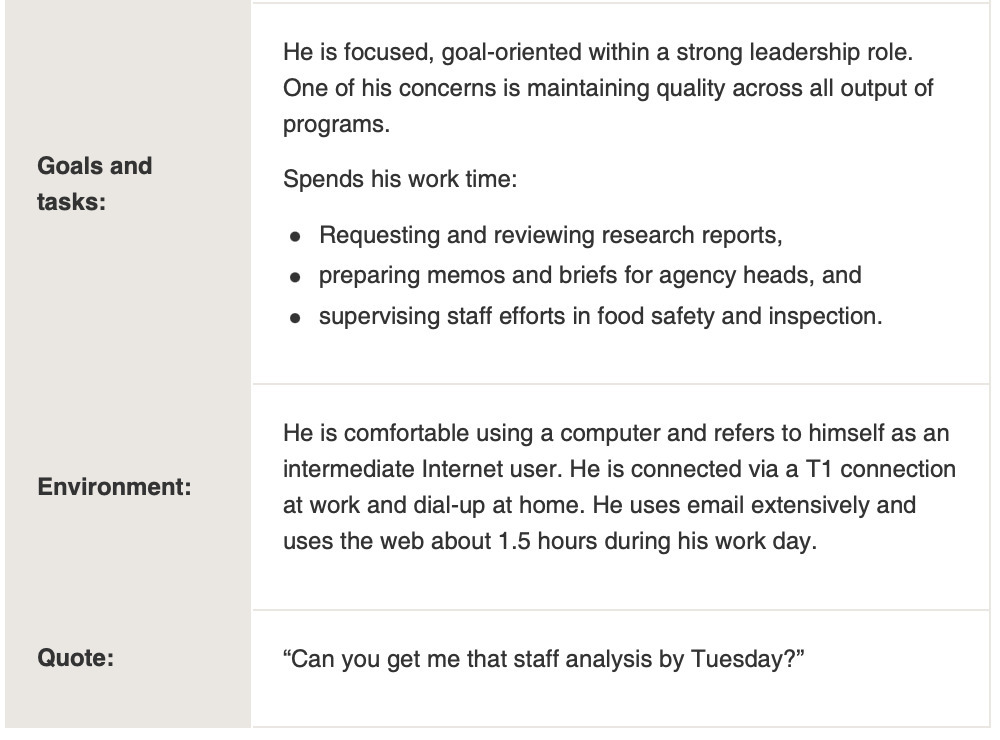

## Plan for the class

# Universal Usability

Creating technologies that are accessible and effective for a broad range of users. [@shneiderman-universal-usability:2000]

(Shneiderman Chapter 2) 

## Activity: Question

> Does everybody in Australia have equal access to computer systems?

> Does everybody at ANU have equal access to computer systems?

> What about the interface limits access?

## Variations in Physical Abilities and Workplaces

## Diverse Cognitive and Perceptual Abilities

## Personality Differences

## Cultural and International Diversity

## Users with Disabilities

## Older Adult Users

## Children

## Accomodating Diversity

- Shneiderman 2.9

# Discovering Requirements

> “A statement about an intended product that specifies what it is expected to do and how it will perform” (Sharp et al. 2019, p387)

- First two stages of the double diamond
- Discovered through “targeted activities” or “tangentially” through-out the design process
- Not static but EVOLVE during design
- There are many different types of requirements and ways of presenting and communicating requirements
- Want to avoid misunderstanding and miscommunication

## Interaction Design Processes

## Atomic Requirements Shell

## Types of requirements

## User stories

- “Represents a unit of customer-visible functionality”
- “Starting point for a conversation to extend and clarify requirements”
- Functionality, user experience, usability goals

## Design Implications/Recommendations

## Bringing requirements to life: Personas

](img/05_03_discovering_requirements_6.jpg)

- Rich descriptions of typical users
- Don’t describe specific people but realistic
- Describe goals, behaviours, activities, environment
- How would this person use this product?

## Personas: example

## Personas: example (cont.)

## Scenarios

Narrative that “describes human activities or tasks in a story that allows exploration and discussion of contexts, needs, and requirements” (Sharp et al. 2019, p.408).

## Journey Map (Gibbons 2018)

](img/05_03_discovering_requirements_11.png)

> “A journey map is a visualization of the process that a person goes through in order to accomplish a goal.” (Gibbons 2018)

Components:

- Actor
- Scenario/Expectations
- Journey Phases
- Actions, Mindsets, Emotions
- Opportunities

## References

- Gibbons, S (2018) Journey Mapping 101, NN/g Nielson Norman Group, accessed 6 July 2022. https://www.nngroup.com/articles/journey-mapping-101/
- Sharp H, Preece J and Rogers Y (2019) Interaction Design: Beyond Human-Computer Interaction. ProQuest Ebook Edition, Wiley & Sons, West Sussex. https://ebookcentral-proquestcom.virtual.anu.edu.au/lib/anu/detail.action?docID=5746446
