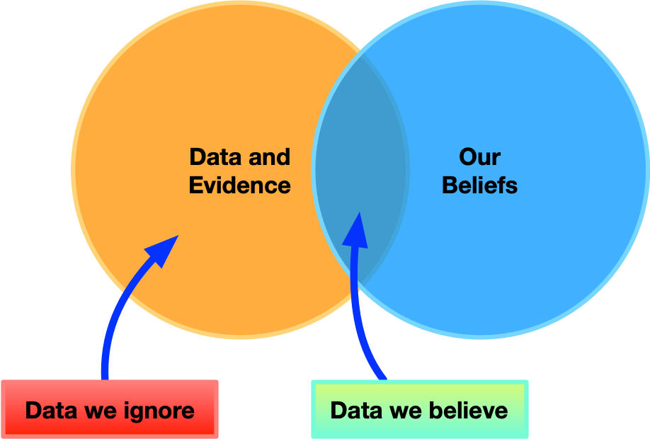
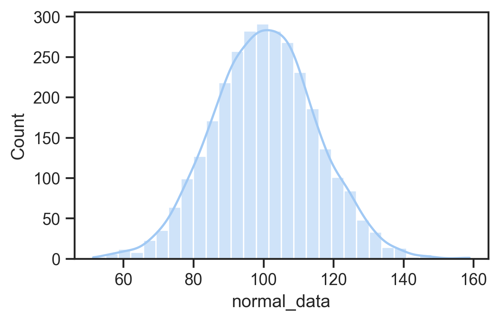
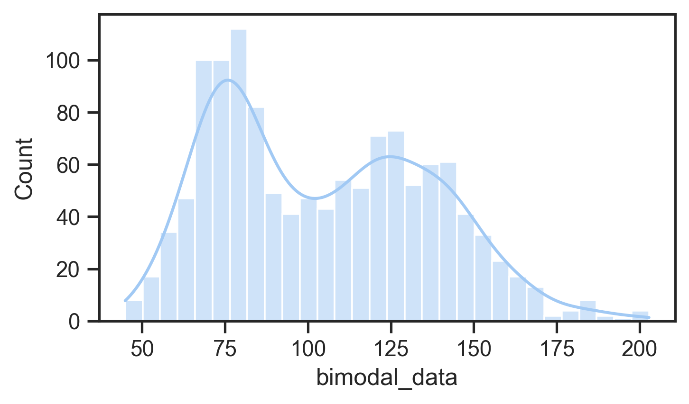
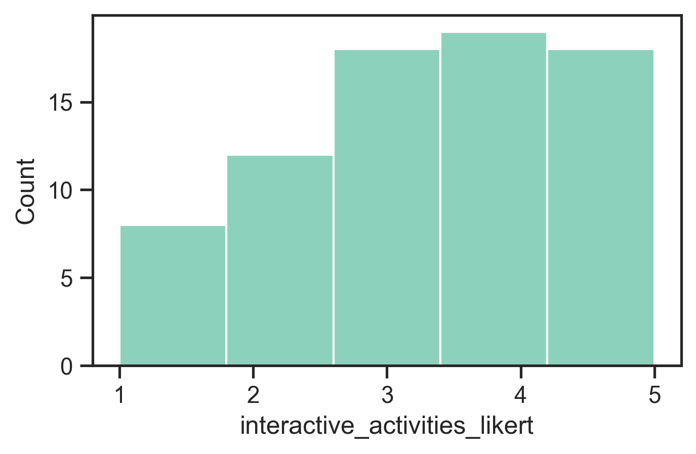
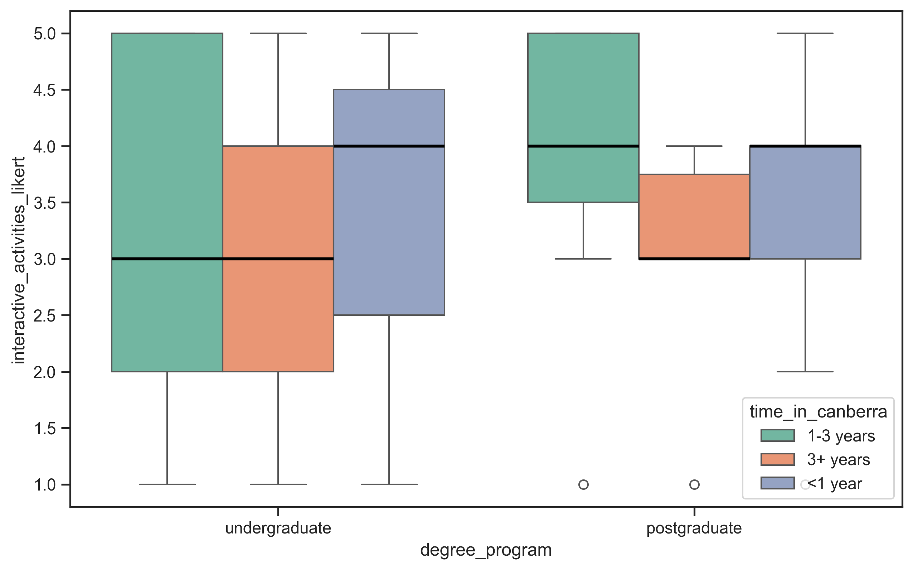
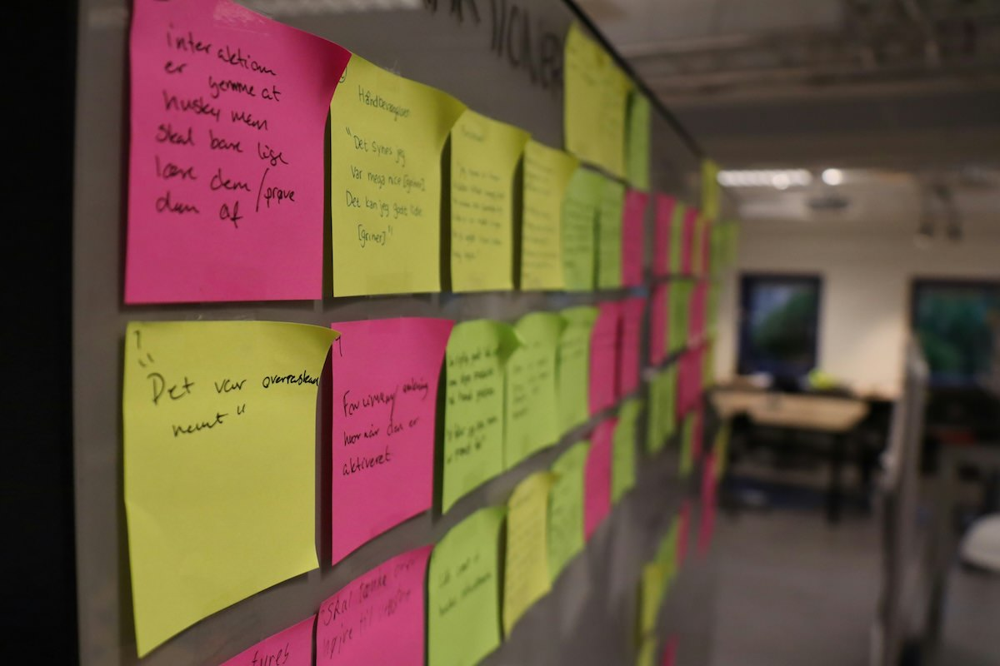
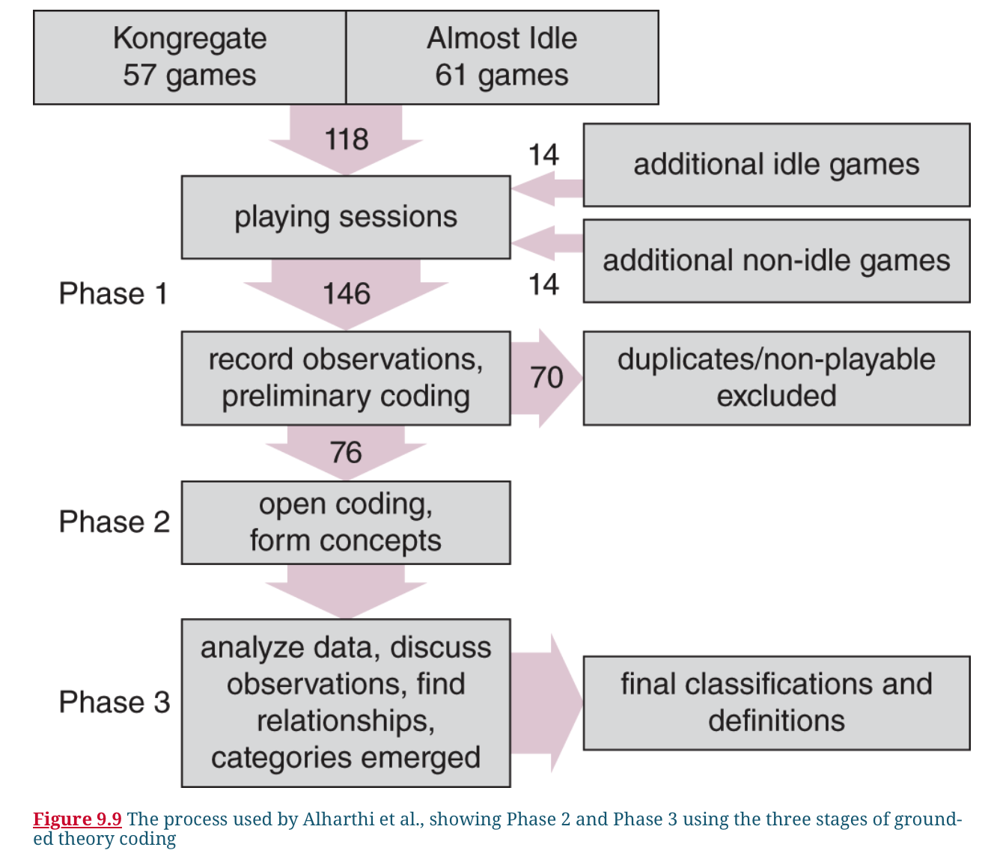
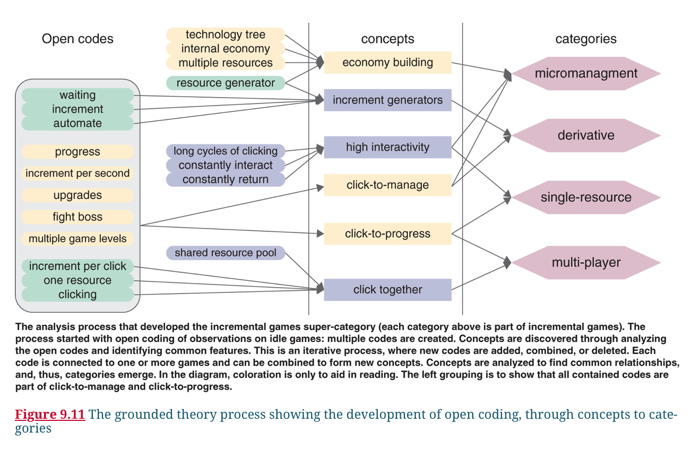

## Announcements

- **TODAY: **assignment 1 [due **Monday 18 August, 23:59 on GitLab**](https://canvas.anu.edu.au/courses/2781/assignments/11544) ([template](https://gitlab.cecs.anu.edu.au/comp3900/2025/comp3900-2025-prototyping))
- assignment 2 specification will be published soon, [you can see the "main idea" already on Canvas](https://canvas.anu.edu.au/courses/2781/assignments/11550)
- keep attending labs, if issues, apply for an [extension (see course policies on Canvas)](https://canvas.anu.edu.au/courses/2781/pages/policies)
- any questions, problems, [**use the forum**](https://edstem.org/au/courses/24905/discussion) - more questions allowed (no limits!), public questions preferred.
- lab marks come out weekly via Canvas

## Plan for the class

- Overview of analysis, interpretation, presentation
- Quantitative Analysis (demos!)
- Qualitative Analysis (demos!)
- Analytical Frameworks
- Interpreting and Presenting Findings

# Analysis, Interpretation, Presentation

- last week we talked about getting data
- once we have it, what can we do with it?
- quantitative approaches
- qualitative approaches
- or a combination (common in HCI!)

## Processes

- (data gathering)
- data cleaning
    - e.g., `age = 999`
- analysis and interpretation
    - different tasks, but often parallel
- presentation

## Bias in Analysis and Interpretation

- **bias:** influence affecting objective judgement and decision making
- integrating new data with past experience (**bias is normal!**)
- **conscious:** we know about them and their effect on us
- **unconscious:** subtle effects that we don't know about

## Specific Biases

:::::::::::::: {.columns}
::: {.column width="60%"}
- **familiarity bias:** do what we know best
    - ignore unfamiliar methods
    - ignore unfamiliar data sources
- **self-attribution bias:** giving ourselves too much credit
    - falsely attribute improvements to our design and not external factors, user learning, etc
    - overlook alternative explanations
- **confirmation bias:** discarding information that contradicts existing belief
    - more on [confirmation bias](https://www.nngroup.com/articles/confirmation-bias-ux/)
    - ignore non-supporting evidence
    - analyse for confirmation, not for discovery
    - overlook alternative analyses and sources
:::
::: {.column width="40%"}

:::
::::::::::::::

## Quantitative and Qualitative

- typical categorisation of data
- **Quantitative data:** form of numbers or easily translated into numbers
    - years experience
    - number of minutes to perform a task
- **Qualitative data:** words, images, sound
    - descriptions
    - interview transcripts
    - photos
- Some data can be represented as both
    - e.g., digital text, sound, images can be represented and analysed numerically (is this useful?)

## Quantitative and Qualitative Methods

**Quantitative Analysis:** find magnitude, amounts or size of _something_ and make rigorous comparisons

**Qualitative Analysis:** find the nature of things, themes, patterns, stories

## Use and Misuse of Data

- It's easy to misuse numerical data and the results of analyses
- This can particularly happen when transforming the type of data (e.g., agreement ratings to a numerical code)
- Qualitative data can also be misused, e.g., content of questions reported as a finding.

### Some example problems

- "50% of users took longer than 30 minutes" vs "2 out of 4 users..."
- The mean agreement was 3.67
- (In a study about mobile phone use with many questions about mobile phones) "Participants noted frequent use of mobile phones for many tasks".

## First Steps

- Interviews: transcribe (e.g., using [Aiko](https://sindresorhus.com/aiko)), expand notes, enter closed questions into spreadsheets (treated as quantitative)
- Questionnaires: enter into spreadsheets, clean up data, filter into datasets
- Observations: expand notes, transcribe recordings, edit videos, synchronise and clean up interaction data

# Basic Quantitative Analysis

What do we do with quantitative data once we have some?

## Centre of a set of data

_what's the average_ of a set of values?

- **Mean:** sum of the values divided by the number of entries.
- **Median:** order the set numerically and find the value in the middle (or if even number of entries, halfway between the two middle entries)
- **Mode:** the most common entry

Example: `[2, 2, 3, 4, 873]`

Example shows that outliers mess up _mean_, so _median_ is often more useful.

## Spread of data

_how spread out_ is a set of values?

- **Range:** `max - min`
- **Standard Deviation:** the _typical distance_ of a value from the mean
- **Interquartile range:** range of the middle 50% of the data

Similarly to central measures, **interquartile range** is robust against weird outliers

## Normal vs non-normal distributions

:::::::::::::: {.columns}
::: {.column width="60%"}
The distribution of the data is how it is spread out and where it is bunched up.

- **normal distribution:** a.k.a. bell curve, Gaussian distribution, mean, median, mode are the same, and the data evenly falls either side of the mean
- **skewed distributions:** data with a weirdly long tail in either direction
- **multi-modal distributions:** data that seems to have multiple bumps

This matters because statistical tests often assume data is _normal_ so findings might be misleading.
:::
::: {.column width="40%"}
{width=70%}

{width=70%}
:::
::::::::::::::

## Looking at the data

First think to do after loading it in. May not be the most helpful approach... but still important to check it's not garbled and the columns make sense.

| interactive activities | attend in person | watch online | degree        | time in CBR |
|------------------------|------------------|--------------|---------------|-------------|
| 5                      | 2                | 2            | undergraduate | 1-3 years   |
| 3                      | 5                | 1            | postgraduate  | 3+ years    |
| 4                      | 5                | 1            | postgraduate  | <1 year     |
| 5                      | 2                | 4            | undergraduate | <1 year     |
| 4                      | 3                | 1            | undergraduate | <1 year     |

## Descriptive Statistics

:::::::::::::: {.columns}
::: {.column width="60%"}
Second thing to do when loading up data for analysis, calculate:

- minimum, maximum
- lower and upper quartile
- median and mean
- number of data points (count)

**Ask:** are these values what you expected? do they suggest any _interesting_ points about your data?
:::
::: {.column width="40%"}
| stat  | interactive activities | attend in person | watch online |
|-------|------------------------|------------------|--------------|
| count | 75                     | 75               | 75           |
| mean  | 3.36                   | 3.15             | 2.84         |
| std   | 1.30                   | 1.24             | 1.39         |
| min   | 1                      | 1                | 1            |
| 25%   | 2                      | 2                | 2            |
| 50%   | 3                      | 3                | 3            |
| 75%   | 4                      | 4                | 4            |
| max   | 5                      | 5                | 5            |
:::
::::::::::::::


## Plotting Data

:::::::::::::: {.columns}
::: {.column width="60%"}
Third thing to do when loading data

- Plot the data to see the distribution and compare data points
- **Scatter plot:** see all the data! good for checking outliers and comparing aspects of data
- **Histogram:** useful to check distribution
- **Boxplot:** useful to compare distributions clearly (more abstract) **charles approved plot!**
- **Bar plots:** really just show one value (mean), may not be useful (too abstract!)
- **Line plot:** useful for showing data over time, not distributions

If plots show something _interesting_ then you can investigate.
:::
::: {.column width="40%"}
{width=70%}

{width=70%}
:::
::::::::::::::

## More complex plots

You can get _more plots_ into one plot. Good for surfacing contrasts or telling a story about the data graphically.

:::::::::::::: {.columns}
::: {.column width="60%"}
```python
sns.set_theme(style="ticks", palette="Set2")
plt.figure(figsize=(10, 6))
sns.boxplot(data=survey_data, x='degree_program', 
            y='interactive_activities_likert', 
            hue='time_in_canberra', 
            medianprops={'linewidth': 2, 'color': 'black'})
plt.savefig('plots/fake_data_complex_boxplot.png', 
            bbox_inches='tight', dpi=300)
plt.show()
```
:::
::: {.column width="40%"}

:::
::::::::::::::


## Comparing data and tests

- You can compare two sets of data by finding the difference between their centres or other descriptive statistics but **is the difference meaningful?**
- We use statistical significance to help ascertain meaningful differences that might be a research finding.
- A classic test is the _t_-test which compares the _means_ of two sets of data, the output of a _t_-test can tell us how likely differences are to be random or **significant** (meaningful)

### Signficance test notes

- we will come back to this later...
- _t_-tests assume normality and can only compare simple situations
- other tests can be used on any non-normal data 📊 and complex datasets (e.g., multiple values from each participants, multiple experimental conditions)

## Quantitative Analysis with Python

Lots of ways to do data analysis: 

- Excel/spreadsheets can do this a bit, but inferior to coding approaches
- Special programming languages exist: SPSS (1968--), S (1976--), R (1993--), Python (1991) + pandas (2008), julia (2012)
- R is where the statisticians, social scientists and psychologists live, Python and Julia are more where computer science folks hangout.

In this class we'll use Python, numpy, pandas, scipy, seaborn, and matplotlib as a default stack for data analysis (yes, libraries are a problem in python...)

## Demo time: analysing and plotting data in Python

:::::::::::::: {.columns}
::: {.column width="60%"}
Let's do some _data analysis_

1. Deploy a short questionnaire on PollEverywhere
2. Download the data from pollev and load it into Google Colab
3. View descriptive statistics
4. Plot the data in a few ways
:::
::: {.column width="40%"}

:::
::::::::::::::


# Basic Qualitative Analysis

{width=50%}

## Coding in Qualitative Analysis

:::::::::::::: {.columns}
::: {.column width="60%"}
- in **qualitative research** the word _coding_ has nothing to do with programming
- **coding:** annotating data with key words or phrases that provide a means for analysis over a large corpus
- codes can be inductive (bottom up, from the data) or deductive (top-down start with a framework of codes)
- challenges: creating meaningful, non-overlapping codes that are clearly defined and determining granularity
- inter-rater reliability measures the clarity and reliability of the coding scheme rather than correctness of analysis
- can be done with a text editor or dedicated software (NVivo, MAXQDA)
:::
::: {.column width="40%"}
)](img/maxqda-coding.png)
:::
::::::::::::::

## Analysing Video Material

:::::::::::::: {.columns}
::: {.column width="60%"}
- initial viewing involves watching entire recording while writing high-level narrative and noting timestamps of interesting events
- chronological and video times used to index events
- data augmentation: video plus screen captures, interaction logs, transcriptions
- coding schemes applied systematically to ensure reliability and consistency
- team-based coding can address subjectivity, ambiguity, and potential errors
- expert knowledge can help with unclear codes and supports interpretation
:::
::: {.column width="40%"}
{width=70%}
:::
::::::::::::::

## Identifying Themes

:::::::::::::: {.columns}
::: {.column width="60%"}
- Many qualitative research approaches distill _themes_ from collected data.
- code the data (apply labels) and then create higher level themes from codes.
- (Reflexive) Thematic Analysis (RTA) [@braun-thematic-analysis:2022] is a well-known and accessible methodology.

### Typical process
 
1. Familiarise with the data
2. Coding (short labels, multiple rounds)
3. Generating initial themes
4. Developing, reviewing, and refining themes
:::
::: {.column width="40%"}
's thematic analysis (2025)](img/reflexive-thematic-analysis-yichen-wang-miro-2025.png)
:::
::::::::::::::

## What is a theme, and why does it matter?

A theme is a high level finding from qualitative analysis, but what that means can differ.

- **Two kinds of theme:** patterns of meaning (uncovering implicit meaning behind words) versus data summaries (summarising responses across participants) [@braun-reflexive-thematic-analysis:2019]
- themes can emerge organically from the data through interpretation, or follow predetermined frameworks and categories
- no one way is correct, but need to be deliberate in methodology in particular to be careful about:
    - whether themes are a summary or reflect hidden or implicit meaning
    - whether themes arise from data or come from a pre-determined framework
    - whether we want "correct" codes, or to ensure that codes are clearly defined and interpreted consistently (can use multiple researchers to help)

## Affinity Diagram

:::::::::::::: {.columns}
::: {.column width="60%"}
- **affinity diagrams** used for organising large amounts of data and identifying themes and overall narratives
- both digital (e.g., Miro) and physical (e.g., sticky notes) diagramming approaches
- not necessarily a lot to this: summarise the data on notes, and arrange to find relationships between them.
- my PhD/master/Honours students tend to do this with Miro
- See [this resource](https://www.interaction-design.org/literature/article/affinity-diagrams-learn-how-to-cluster-and-bundle-ideas-and-facts) for a guide.
:::
::: {.column width="40%"}

:::
::::::::::::::

## Categorising Data

- deductive analysis applies pre-existing theoretical frameworks or categories to analyse data
- data is systematically coded to segment and categorise specific elements, allowing for pattern identification and quantitative analysis
- e.g.: take a specific categorisation scheme from previous research (interface problems, or design recommendations), apply to new situation
- taking a quantitative approach: counting occurrences of categories per participant, identifying specific situations or issues

## Critical Incident Analysis

- focus on significant behavioral incidents rather than general impressions
- identifying specific moments that are pivotal in either positive or negative ways
- makes data analysis more manageable and focused
- can be identified by 
    - participants during retrospective discussions, 
    - observers through real-time monitoring
    - through video analysis of recorded sessions
- more info: [nngroup](https://www.nngroup.com/articles/critical-incident-technique/), [usability bok](https://www.usabilitybok.org/critical-incident-technique)

# Analytical Frameworks

:::::::::::::: {.columns}
::: {.column width="60%"}
- different approaches can guide qualitative analysis 
- **granularity:** from fine-grained detailed analysis to broader scope examinations
- conversation analysis: fine granularity, examines detailed interactions in short conversation fragments
- systems-based frameworks: coarse granularity, broad group or organisation level analysis
- useful depending on the research goals
:::
::: {.column width="40%"}

:::
::::::::::::::

## Conversation Analysis (CA)

:::::::::::::: {.columns}
::: {.column width="60%"}
- **CA:** examines the semantics of conversations, e.g., turn-taking and interaction
- e.g., compare conversations in different settings
- markup with syntax to capture detailed interactions and speech patterns
- **Square brackets [ ]** indicate overlapping talk between speakers
- **Round brackets ( )** show pauses in conversation with timing details (e.g., (1.1) = 1.1 second pause)
- **Physical spacing** represents temporal sequencing to show exactly when things are said in relation to each other
- aims to reveal subtle cues and conversational mechanisms that might otherwise be missed
:::
::: {.column width="40%"}
```
01  SUS i'd like to play beat the intro in a minute
02  LIA   [ oh no: ]
03  SUS [ alexa ][ (1.1)  ] beat the in[tro
04  CAR      [ °yeah°; ]
05  LIA                 [°no:::…°
06  CAR (0.6) it' mother's day? (0.4)
07  SUS it's (   ) yep (.) listen (.) you need to keep
08    on eating your orange stuff (.) liam
09    (0.7)
10  CAR and your green stuff
11  SUS alexa (1.3) alexa (0.5)=
12  CAR             =°and your brown stuff
13  SUS play beat the intro
```

Conversation with family members and Amazon Alexa with markup from [@porcheron-voice-interfaces:2018]
:::
::::::::::::::

## Discourse Analysis

- Analysing dialogue: what is said, how words convey meaning
- Interpreting context, psychological and social aspects of words.
- Language as social reality, open to interpretation
- [**Constructivist approach:**](https://www.open.edu/openlearn/health-sports-psychology/critically-exploring-psychology/content-section-3.1) Language as a constructive tool: analyse the process of world construction
- Identify subtle and implicit meaning between sources

## Content Analysis

:::::::::::::: {.columns}
::: {.column width="60%"}
- Classifies data into categories and studying frequency of occurrences
- Applicable to diverse media formats including text, video, images, etc
- can involve predefined frameworks or classification systems to systematically examine content across specified dimensions
- can be combined with other analytical techniques such as sentiment analysis
:::
::: {.column width="40%"}

:::
::::::::::::::


## Interaction Analysis [@jordan-interaction-analysis:1995]

- investigate human interactions with each other, artifacts, and technologies using video recordings of naturally occurring activities 
- can be teamwork: researchers watch videos together, discuss in real-time 
- coding and annotation through repeated video playing
- hypotheses based on observable participant actions and behaviors
- find patterns inductively by assembling instances of salient events

## Grounded Theory

Grounded Theory (GT) is an _old and important_ qualitative analysis technique [@glaser-strauss-grounded-theory:1967; @corbin-strauss-grounded-theory:2014]

- main idea: identify _categories_ (a kind of theme) through iterative data collection and analysis.
- any kind of data but often ethnographic and interview data
- analysis procedure:
    - _open coding_: categories, properties and dimensions discovered inn data
    - _axial coding_: systematically establishing categories/sub-categories
    - _selective coding_: refine and integrating categories

- _heavier and less flexible in comparison to Reflexive Thematic Analysis_ (not suggested for first-timers)
- @rogers-beyond-hci:2023 claim that GT "uses reflexive thematic analysis", which I guess is accurate.

## Grounded Theory Example: Idle Games

:::::::::::::: {.columns}
::: {.column width="50%"}


GT process for @alharthi-idle-games:2018
:::
::: {.column width="50%"}


Codes and categories.
:::
::::::::::::::

## Systems-Based Frameworks

:::::::::::::: {.columns}
::: {.column width="60%"}
- large projects involve many sources of data and stakeholders
- e.g., hospital, corporation, local council, airport, (or university...)
- need ways to understand how the system works together
- manage complex interdependencies
- common theme of management speak: "systems thinking"
:::
::: {.column width="40%"}

:::
::::::::::::::

## Socio-technical Systems Theory (STS)

- **STS:** technology and people in a work system are interdependent [@klein-sociotechnical:2014]
- treat the whole system as a whole, applied in complex work places.
- More of a philosophy than a methodology, a holistic perspective to address challenges.

### Notable aspects:

1. Task interdependence
2. Socio-technical systems are "open systems": influenced by environmental factors
3. Heterogeneity of system components: subsystems have different technical components
4. Practical contributions: analysing systems, evaluating changes, designing co-optimised systems
5. Fragmentation of design processes


## Distributed Cognition of Teamwork (DiCoT)

- Distributed cognition unpacks how multiple people and technologies interact complete tasks and solve problems.
- DiCoT framework supports this concept with models:
    - **information flow model**
    - **physical model**
    - **artifact model**
    - **social structure model**
    - **system evolution model**
- models have underlying principles, e.g., for physical model:
    - **horizon of observation:** What an individual can see or hear.
    - **perceptual:** How spatial representations aid computation.
    - **arrangement of equipment:** How the physical arrangement of the environment affects access to information.
- may be particularly useful in collaboration contexts, e.g., software development, medicine

## Which Analytical Framework to Use? 

| framework | data | focus | outcomes | granularity |
|---|---|---|---|---|
| conversation analysis | spoken conversation recordings | process of conversations  | how conversations are processed and progress | words or smaller |
| discourse analysis | speech or writing | how words convey meaning | implicit or hidden meanings in text | word, phrase |
| content analysis | written text, video, audio, images | how often something is featured or is spoken about | frequency of items in text | words to artefacts or people |
| interaction analysis | video of activities | interactions between people and artefacts | how knowledge and action are used in an activity | artifact, dialogue, gesture |
| grounded theory | empirical data of any kind | building theory from a phenomenon | theory grounded in data | varying levels |
| systems-based frameworks | large-scale and heterogeneous data | large scale systems of people and technology | organisational insights | macro, organisational level |

adapted from @rogers-beyond-hci:2023 table 9.6

# Interpreting and Presenting Findings

{width=50%}

## Biggest Research Writing Tip: Cite your methods

- Applies to research projects at Honours, master, PhD and workplace
- Work with supervisors/mentors/managers to choose methodology and analytical frameworks
- Read and understand the framework from (recent) scholarly sources (not just `nngroup.com`)
- Change and evolution is allowed, but understand that there is a wealth of example and established approaches
- Paraphrase from academic reviewer comments: _"this work cites Braun and Clarke (2006) for reflexive thematic analysis but does not consider newer understandings of this methodology, e.g., Braun and Clarke (2019)..."_

## Structured Notations

- presenting information through formal notations related to particular domains
- e.g., music applications might involve musical notation or symbolic data formats
- could be related to an analytical framework (e.g., conversation analysis)
- tradeoff between precision and flexibility; structured notation can be precise but potentially less accessible to a reader or limited in scope

## Using Stories

Context of use and examples of user experience can be seen as stories or narratives.

- Participants tell stories during data gathering which can illustrate research findings.
- Observations can be framed as stories
- Stories can be written or in the form of storyboards or videos.
- Can be used to support research findings and provide authenticity.

## Summarising Findings

Overall advice about findings...

- Multi-modal is often good: combine styles such as stories, plots, data excerpts, numerical tables
- Developing plots and visualisations is critical and hard work, just like crafting text. We spend hours getting it right in Python/R!
- Important to balance the weight of a **claimed finding** against supporting evidence; however, doesn't mean that small studies are not useful.
- Reviewers hate over-generalisation: careful with terms like "most," "all," "majority," and "none" without justification
- Statistical claims require care to avoid misleading the reader

## Questions: Who has a question?

:::::::::::::: {.columns}
::: {.column width="60%"}
**Who has a question?**

- I can take _cathchbox_ question up until 2:55
- For after class questions: meet me outside the classroom at the bar (for 30 minutes)
- Feel free to ask about **any aspect of the course**
- Also feel free to ask about **any aspect of computing at ANU**! I may not be able to help, but I can listen.

:::
::: {.column width="40%"}

:::
::::::::::::::

# References {.allowframebreaks}
