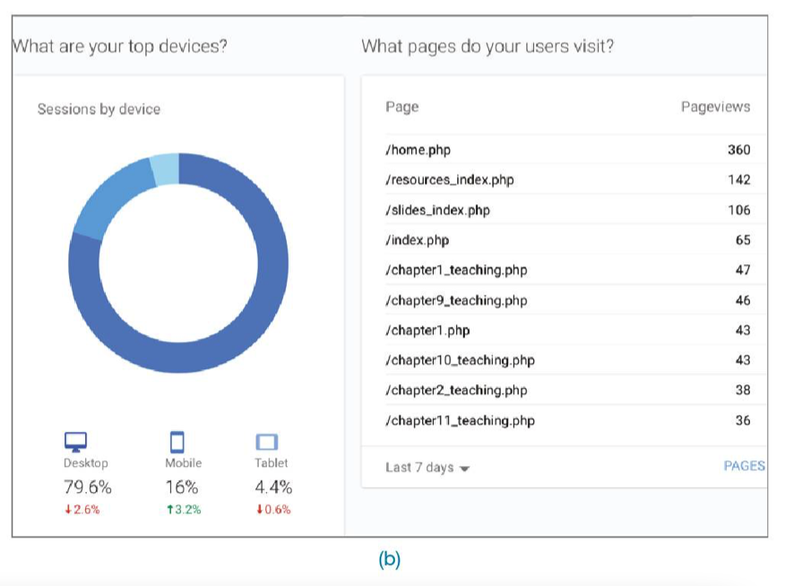
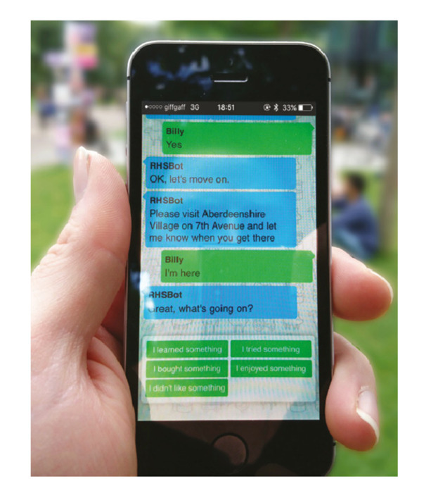

## Plan for the class

# Evaluation

Sharp et al. 2019 Textbook: Chapters 14-16

---

## What is evaluation?

- Evaluation “involves collecting and analyzing data about users’ or potential users’ experiences when interacting with a design artefact” (Sharp et al. 2019, p. 496)
- Key Goal: “To improve the artefact’s design” (Sharp et al. 2019, p. 496)
- Addresses both usability and user experience (Sharp et al. 2019, p. 496) – not just about functionality
- Can be carried out on artefacts and prototypes of all different kinds (Sharp et al. 2019, p. 496)
- Methods are chosen depending on the goal of the evaluation  (Sharp et al. 2019, p. 496)

---

## Why is evaluation important?

- Understanding users: Your users may not have the same experiences or perspectives as you do
- “Different users may use the same software in different ways” (Sharp et al. 2019)
- Ensuring that you/your team/your company are investing in the right idea
- Allowing you to address issues before the product ‘goes live’/is commercially available

---

## What should you evaluate/measure?

> “Does the design do what the users need and want”?

Examples:

- __Game App Developers:__ Whether young adults find their game fun and engaging compared to other games
- __Government authority:__ Whether their online service is accessible to users with a disability
- __Children’s talking toy designers:__ Whether six-year-olds enjoy the voice, feel of the soft toy, and can use safely

---

## Usability and Usability Goals

Six usability goals:

- Effective to use (effectiveness)
- Efficient to use (efficiency)
- Safe to use (safety)
- Having good utility (utility)
- Easy to learn (learnability)
- Easy to remember how to use (memorability)

---

## Where should you evaluate your design?

- Depends on your evaluation goal
- Lab studies (controlled settings)
- In-the-wild studies (natural settings)
- Remote studies (online behaviour)
- Discussion question: evaluating a children’s toy

(Sharp et al. 2019, Chapter 14)

---

## When should you evaluate?

Evaluation serves different purposes at different stages of the design process

__Formative evaluation: Assessing__ whether a product continues to meet users’ needs during a design process (early or late stages)

__Summative evaluation: Assessing__ whether a finished product is successful

Feeds into an iterative design process

[https://www.youtube.com/watch?v=730UiP7dZeo](https://www.youtube.com/watch?v=730UiP7dZeo)

(adapted from Sharp et al. 2019, p.500)

---

# Types of Evaluation: Controlled settings (e.g., Usability testing)

Image Source: https://www.interaction-design.org/literature/article/the-basics-of-recruiting-users-for-usability-testing

---

## Usability Testing

- Measures: Can involve numbers and time (e.g., number of task completion, number of errors made, time taken to complete task)
- Methods: Can involve a mixture of methods e.g., think aloud, observation, interviews, questionnaires, data logging and analytics
- Data: Can collect a variety of data depending on the methods used (e.g., video, audio, facial expressions, key presses, verbal feedback)
- Settings: Usability lab + observation room vs mobile usability kit
- Number of participants: 5-12 baseline but more is better
- Read the textbook for other kinds of experimental design

(Sharp et al. 2019, Chapter 15)

---

## Usability Testing Example

)
](img/09_evaluation_foundations_6.png)

__Anastasia Schaadhardt, Alexis Hiniker, and Jacob O. Wobbrock. 2021. Understanding Blind Screen-Reader Users’ Experiences of Digital Artboards. In Proc. CHI '21. [DOI: 10.1145/3411764.3445242](https://dl.acm.org/doi/10.1145/3411764.3445242)__

---

## Types of Evaluation: Natural settings (e.g., Field studies)

Goals of field studies:

- Help identify opportunities for new technology
- Establish the requirements for a new design
- Facilitate the introduction of technology or inform deployment of existing technology in new contexts

---

## Field Studies

- Goals:
    - Understanding how people interact with technologies in “messy worlds”, how technologies will be integrated into contexts
    - Studying use of existing technologies and impacts of introducing new ones
- Methods: Emphasis on qualitative methods rather than statistical measures e.g., Observations, interviews, diaries, interaction logging
- Duration: No fixed length- can be seconds, months, years
- Paying attention to: Use situations, problems/errors, distractions, patterns of behaviours
- How does your presence and involvement shape engagement? Observation vs participant observation
- Findings: Used for creating thematic analysis, vignettes, narratives, critical incident analysis etc.

---

## Field Studies Example

Sarah Webber, Marcus Carter, Wally Smith, and Frank Vetere. 2020. Co-Designing with Orangutans: Enhancing the Design of Enrichment for Animals. In Proc. DIS '20. 1713–1725. [DOI: 10.1145/3357236.3395559](https://doi-org.virtual.anu.edu.au/10.1145/3357236.3395559)

---

## Expert Evaluation

- Conducted by designers and design “experts” rather than with end users
- Inspection methods – expert role plays user
- __Heuristic evaluation:__ Researchers evaluate whether aspects design adhere to established usability principles (see over)
- __Cognitive walkthroughs:__ Simulating user reasoning and problem solving at each step in an interaction sequence (evidence, availability, accessibility of correct action)
- __Analytics:__ Understanding user demographics and tracing activities (e.g., number of clicks, duration of sessions etc.)
- __A/B Testing:__ Large number of users assigned Design A or B and compare use to test “variable of interest” (e.g., number of clicks on advertising during test period)

---

## Types of Evaluation: Settings not involving Users (e.g., Heuristic Evaluation)

](img/09_evaluation_foundations_10.png)

---

## Usability Heuristics

](img/09_evaluation_foundations_11.png)

---

## Usability Heuristics pt. 2

](img/09_evaluation_foundations_12.png)

---

## Web Design Heuristics/Issues

---

## Web Design Heuristics/Issues

---

## Shneiderman’s “Eight Golden Rules of Design”

1. Strive for consistency
2. Seek universal usability
3. Offer informative feedback
4. Design dialogs to yield closure
5. Prevent errors
6. Permit easy reversal of actions
7. Keep users in control
8. Reduce short-term memory load

---

## Google Analytics: What can you learn?

---

## Evaluation after deployment: adoption, use, and non-use

- Adoption/Appropriation/Design-in-use (Ehn 2008)
- Technology acceptance (Davis 1989)
- Non-use (Satchell & Dourish 2009)
- Technology habitation (Soro et al. 2016)
- Technology individuation (Ambe et al. 2017)

---

# Issues involving evaluation

- Ethical dimensions and consent
- Evaluation design and conduct:
    - __Reliability:__  “how well it produces the same results on separate occasions under the same circumstances”
    - __Validity: __ “whether the evaluation method measures what it intended to measure”
    - __Ecological validity:__  “how the environment in which an evaluation is conducted influences or distorts results”
    - __Bias: __ “occurs when the results are distorted”
    - __Scope: __ “how much of the findings can be generalised”

---

## Developing an evaluation plan

- Evaluation Goal/Aims
- Participants
- Setting
- Data to collect
- Methods
- Ethical Considerations/Consent Process
- Data capture/recording/storage
- Analysis method
- Output(s) of evaluation process

---

# References

- Ambe, AH, Brereton, M, Soro, A & Roe, P 2017, ‘Technology Individuation: The Foibles of Augmented Everyday Objects’, in  _Proceedings of the 2017 CHI Conference on Human Factors in Computing Systems_ , CHI ’17, Association for Computing Machinery, New York City, New York, pp. 6632–6644, accessed from <https://doi.org/10.1145/3025453.3025770>.
- Davis, F 1989, ‘Perceived Usefulness, Perceived Ease of Use, and User Acceptance of Information Technology’,  _MIS Quarterly_ , vol. 13, no. 3, pp. 319–340.
- Ehn, P 2008, ‘Participation in Design Things’, in  _PDC 2008. Proceedings of the Tenth Anniversary Conference on Participatory Design_ , Association for Computing Machinery, New York City, New York, pp. 92–101, accessed from <http://portal.acm.org/citation.cfm?id=1795248>.
- GARDNER, M. 2019.  _Teaching Students to Give Peer Feedback _ [Online]. George Lucas Educational Foundation. Available: https://www.edutopia.org/article/teaching-students-give-peer-feedback [Accessed 3 October 2022].
- Raffaele, R., Carvalho, B., Lins, A., Marques, L., Soares, M.M. (2016). Digital Game for Teaching and Learning: An Analysis of Usability and Experience of Educational Games. In: Marcus, A. (eds) Design, User Experience, and Usability: Novel User Experiences . DUXU 2016. Lecture Notes in Computer Science(), vol 9747. Springer, Cham. [https://doi.org/10.1007/978-3-319-40355-7_29](https://doi.org/10.1007/978-3-319-40355-7_29)
- Satchell, C & Dourish, P 2009, ‘Beyond The User: Use And Non-Use in HCI’, in  _Proceedings of the 21st Annual Conference of the Australian Computer-Human Interaction Special Interest Group: Design: Open 24/7 (OZCHI ’09)_ , Association for Computing Machinery, New York City, New York, pp. 9–16.
- Sharp, H, Preece, J & Rogers, Y 2019,  _Interaction Design: Beyond Human-Computer Interaction_  ProQuest E., Wiley & Sons, West Sussex, accessed from [https://ebookcentral-proquest-com.virtual.anu.edu.au/lib/anu/detail.action?docID=5746446.](https://ebookcentral-proquest-com.virtual.anu.edu.au/lib/anu/detail.action?docID=5746446.)

---

# References (cont.)

- Soro, A, Brereton, M & Roe, P 2016, ‘Towards an Analysis Framework of Technology Habituation by Older Users’, in  _Proceedings of the 2016 ACM Conference on Designing Interactive Systems_ , DIS ’16, Association for Computing Machinery, New York, NY, USA, pp. 1021–1033, accessed from [https://doi.org/10.1145/2901790.2901806](https://doi.org/10.1145/2901790.2901806).
- Anastasia Schaadhardt, Alexis Hiniker, and Jacob O. Wobbrock. 2021. Understanding Blind Screen-Reader Users’ Experiences of Digital Artboards. In Proceedings of the 2021 CHI Conference on Human Factors in Computing Systems (CHI '21). Association for Computing Machinery, New York, NY, USA, Article 270, 1–19. https://doi-org.virtual.anu.edu.au/10.1145/3411764.3445242
- The Open University. 2021.  _Giving and Receiving Powerful Feedback _ [Online]. Milton Keynes: The Open University.  [Accessed 3 October 2022].
- University of Technology Sydney. 2013.  _Giving and receiving feedback _ [Online]. Sydney: University of Technology Sydney. Available: https://www.uts.edu.au/research-and-teaching/learning-and-teaching/assessment-futures/key-assessment-elements/giving-and-receiving-feedback [Accessed 3 October 2022].
- University of Technology Sydney. n.d.  _Giving and Receiving Feedback: A Guide to the Use of Peers in Self Assessment _ [Online]. Sydney: University of Technology Sydney. Available: https://www.uts.edu.au/sites/default/files/Giving-and-Receiving-Feedback.pdf [Accessed 3 October 2022].
- Sarah Webber, Marcus Carter, Wally Smith, and Frank Vetere. 2020. Co-Designing with Orangutans: Enhancing the Design of Enrichment for Animals. In Proceedings of the 2020 ACM Designing Interactive Systems Conference (DIS '20). Association for Computing Machinery, New York, NY, USA, 1713–1725. https://doi-org.virtual.anu.edu.au/10.1145/3357236.3395559

