## Plan for the class

- Direct Manipulation and Immersive Environments
- Thematic Analysis (research method)
- Reflexivity (writing method)

# Direct Manipulation and Immersive Environments

[@shneiderman-hci:2018, S7.1]

## What is Direct Manipulation?

1. Continuous representation of objects and actions with visual metaphors
2. Physical actions (i.e., buttons) instead of complex syntax
3. Rapid, incremental, reversible actions with immediate visibility

E.g., drawing with MS Paint vs typing [SVG commands](https://developer.mozilla.org/en-US/docs/Web/SVG/Tutorials/SVG_from_scratch/Basic_shapes):

`<path d="M20,230 Q40,205 50,230 T90,230" fill="none" stroke="blue" stroke-width="5"/>`

## Examples of Direct Manipulation

- Geographical systems (e.g., Google Maps)
- Video games
- Computer-aided design (CAD), and fabrication (e.g., 3D printing)

## 2D and 3D Interfaces

## Teleoperation and Presence

_Studied but less accepted before 2020!_

- telehealth
- robotic surgery
- telepresence robots
- teleconferencing (Zoom)
- virtual co-presence (e.g., Discord, v.s. Gather Town)

## Augmented and Virtual Reality

Interfaces can sit on a spectrum between fully virtual and fully real interaction [@milgram-mr:1994].

- The big middle area includes "mixed reality" (MR) interfaces
- Augmented reality usually closer to "real" reality.
- eXtended reality (XR) is a more recent term.

## Augmented Reality

## Virtual Reality

# Thematic analysis

> “Thematic analysis is a method for identifying, analysing and reporting patterns (themes) within data. It minimally organizes and describes your data set in (rich) detail” (Braun and Clarke 2006, p.79)

- Family of qualitative data analysis techniques
- “Can be applied across a range of theoretical and epistemological approaches” (Braun and Clarke 2006, p.78)
- Not an objective process

## Stages of thematic analysis

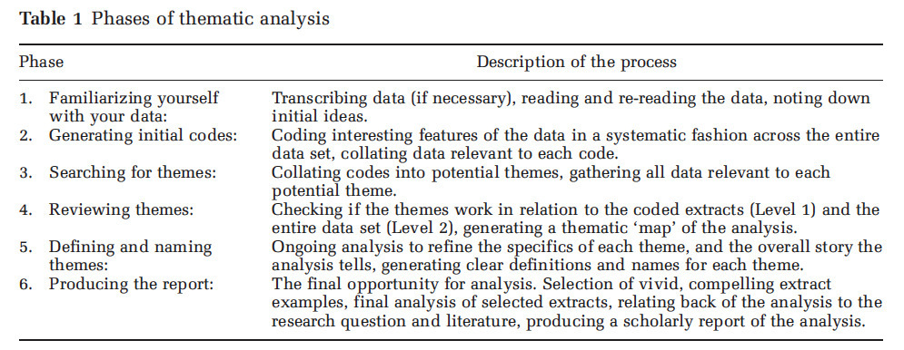

## Step 1: Familiarise yourself with your data

- Analysis starts as soon as data collection starts
- After each interview, allow time for reflection on data and method
  - What were the key findings of this interview?
  - What was similar/different to previous interviews?
  - What issues were unexpected or surprising?
  - What would you do differently for the next interview? How would you adjust your interview script?
- Note down and mind map any key quotes, examples, or stories from your data

## (Step 1) Transcribing audio/video recordings

- Start of data collection
- Introductory note/context
- Formatting to help distinguish speakers

](img/05_02_thematic_analysis_1.jpg)

## (Step 1) Initial reading

- Immerse yourself in the data: read and re-read transcripts
- Read data in an active way: search for meaning, patterns etc., take notes about ideas for coding.
- But don’t try to code the data yet.

## Step 2: Generate initial codes

“interacting with data, making comparisons between data, and so on, and in doing so, deriving concepts to stand for those data, then developing those concepts in terms of their properties and dimensions” (Corbin & Strauss 2014)

“emergent coding” (your projects) vs “a priori coding” (Lazar et al. 2017, p.304)

## Step 2: What is a code?

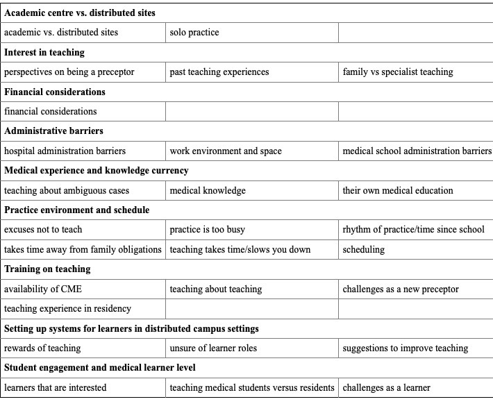

- A code: Short phrase to describe piece of data
- Identify important features to your research aims
- Subject or nature of comment
- Each item can have multiple codes

(Piggott & Lee-Poy, 2015)

## (Step 2) What to look for when coding?

- Look for specific items
- Ask questions about the data
- Make comparisons at different levels

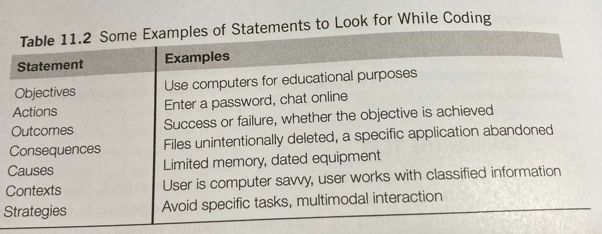

(Lazar et al. 2017, p.312)

## (Step 2) Coding your data: Word/Excel

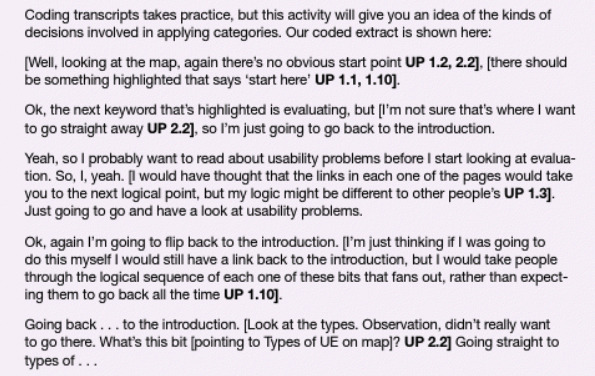
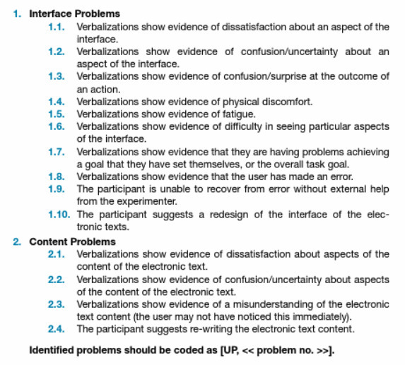

(Sharp et. 2019)

## (Step 2) Developing codes

- “In-vivo codes” vs “researcher-denoted concepts”
- __In-vivo: __ e.g., “hot-rodder,” “old-fashioned guy” (Given 2008)
- __Researcher-denoted: __ “My son just sits there and sobs when the computer does not do what he wants. He becomes irritated and keeps pushing the Enter button when the web page loads slowly” e.g. Frustration (Lazar et al. 2017, p.306)

## (Step 2) Coding your data: NVivo

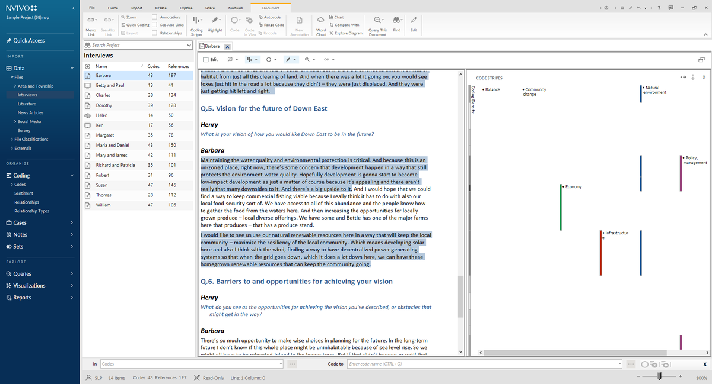

__Image source: https://www.qsrinternational.com/nvivo-qualitative-data-analysis-software/upgrade-nvivo__

## (Step 2) Code book

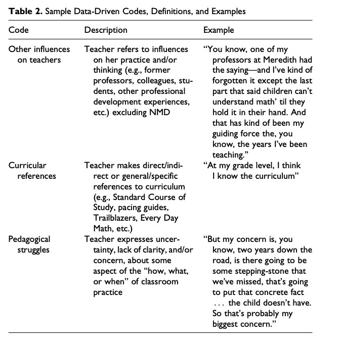

(DeCuir-Gunby 2011, p.147)

## Step 3: Search for themes

> A theme: “A theme captures something important about the data in relation to the research question, and represents some level of patterned response or meaning within the data set” (Braun and Clarke 2006, p.82)

__Semantic__  vs latent themes
Can relate to “a behaviour, a user group, events, places, situations” (Sharp et al. 2019, p.322)
Use affinity diagrams to sort codes into group

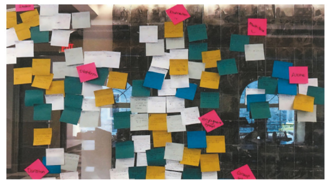

(Sharp et al 2019, p.322)

## (Step 3) Example code structure

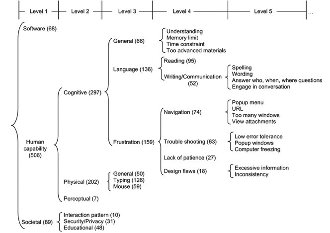

(Lazar et al. 2017, p.310)

## Step 4: Review themes

- Are themes supported all by the data?
- Can some themes be grouped together?
- Does all the data within the theme describe it?
- Do the themes reflect the overall meaning of the data set?

(Braun and Clarke, 2006)

## Step 5: Refine and name themes

- Does your theme name reflect its ‘essence’?
- Does the theme contain subthemes?
- Are your theme names descriptive but concise?
- Can you summarise your theme in a couple of sentences?

(Braun and Clarke, 2006)

## Step 6: Produce the report

- Determine the narrative for your themes
- Include quotes and examples from your data
- Include analysis- “make an argument in relation to your research question”
- In your projects: Present design implications arising from the themes

(Braun and Clarke, 2006)
(Ljungblad et al. 2021, p.6)

## References

- Braun, V & Clarke, V 2006, ‘Using thematic analysis in psychology’,  _Qualitative Research in Psychology_ , vol. 3, no. May 2015, pp. 77–101.
- Corbin, J & Strauss, A 2008,  _Basics of Qualitative Research_  3rd edn, Sage Publications Inc, Thousand Oaks, CA.
- DeCuir-Gunby, JT, Marshall, PL & McCulloch, AW 2011, ‘Developing and Using a Codebook for the Analysis of Interview Data: An Example from a Professional Development Research Project’,  _Field Methods_ , vol. 23, no. 2, pp. 136–155, accessed from <https://doi.org/10.1177/1525822X10388468>.
- Given, L. M. (2008). In vivo coding. In  _The SAGE encyclopedia of qualitative research methods_  (Vol. 1, pp. 473-474). SAGE Publications, Inc., [https://www-doi-org.virtual.anu.edu.au/10.4135/9781412963909.n240](https://www-doi-org.virtual.anu.edu.au/10.4135/9781412963909.n240)
- Lazar, J, Feng, JH & Hochheiser, H 2017,  _Research Methods in Human-Computer Interaction_ , Elsevier Science & Technology, San Francisco, accessed from <http://ebookcentral.proquest.com/lib/anu/detail.action?docID=4851896>.
- Ljungblad, S, Man, Y, Baytacs, MA, Gamboa, M, Obaid, M & Fjeld, M 2021, ‘What Matters in Professional Drone Pilots’ Practice? An Interview Study to Understand the Complexity of Their Work and Inform Human-Drone Interaction Research’, in  _Proceedings of the 2021 CHI Conference on Human Factors in Computing Systems_ , Association for Computing Machinery, New York, NY, USA, accessed from <https://doi.org/10.1145/3411764.3445737>.
- Piggott, T, Morris, C & Lee-Poy, M 2015, ‘Preceptor engagement in distributed medical school campuses’,  _Canadian medical education journal_ , vol. 6, no. 2, pp. e20–e28, accessed from <https://pubmed.ncbi.nlm.nih.gov/27004073>.
- Sharp, H, Preece, J & Rogers, Y 2019,  _Interaction Design: Beyond Human-Computer Interaction_  ProQuest E., Wiley & Sons, West Sussex, accessed from <https://ebookcentral-proquest-com.virtual.anu.edu.au/lib/anu/detail.action?docID=5746446.>.

# Reflexivity

## Back to defining HCI

> “the design, evaluation, and implementation of interactive computer systems for human use” 

_and_

> “the study of major phenomena surrounding them”

(ACM SIGCHI, 1992)

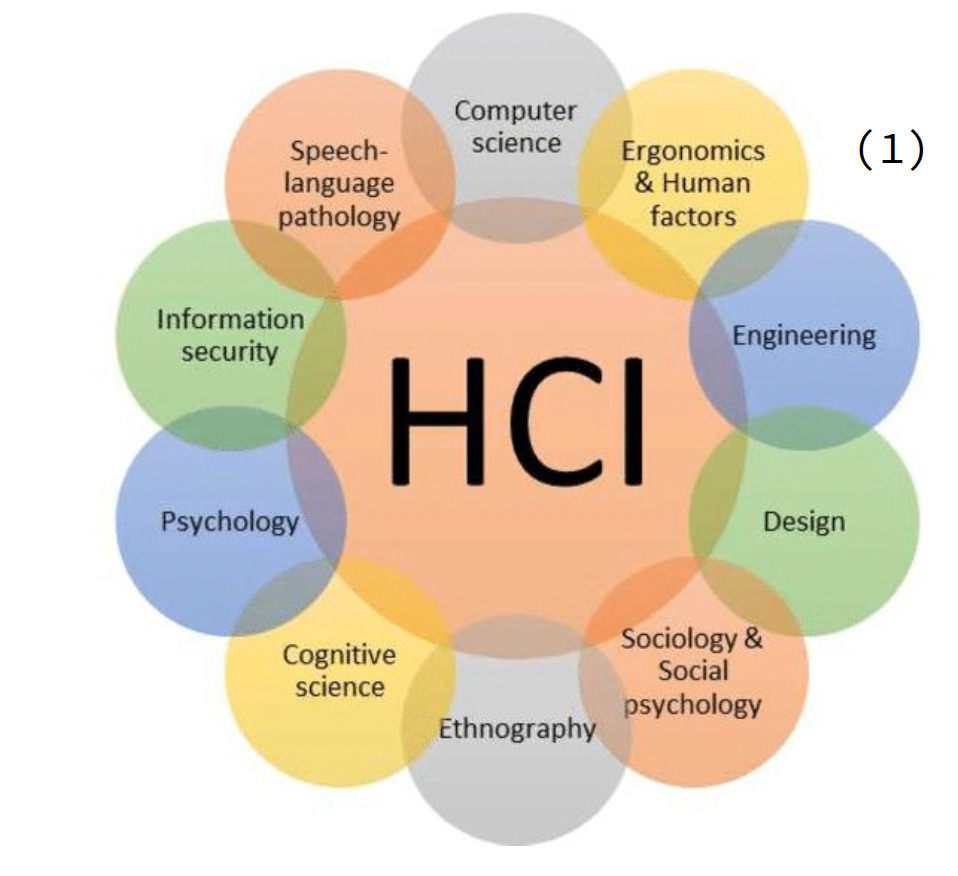

## What kinds of interfaces are HCI researchers and practitioners working on?

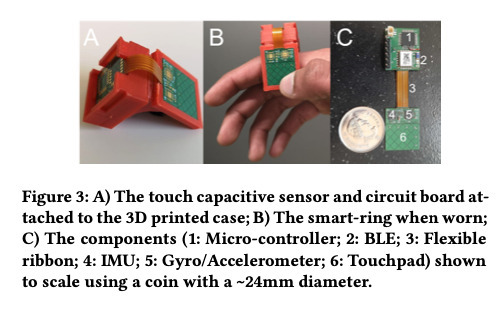

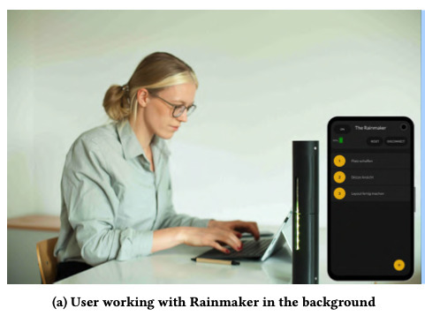

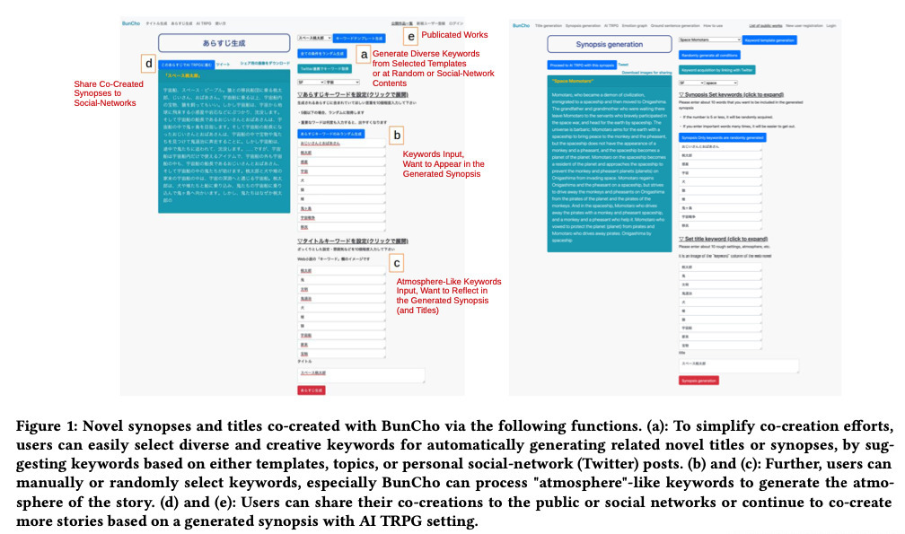

## How are HCI paper usually structured?

- Introduction
- Related work/literature review
- Methodology and methods
- Study design
- Findings (e.g., themes, design implications)
- Discussion
- Conclusions
- Limitations and future work

## What makes HCI different from other fields of computing?

- Addresses a broad range of technology users, interfaces, and methods
- Publications often focus on interaction and experience design rather than specifics of implementation (unless the device is novel)
- Qualitative and quantitative research methods
- Often involves human research through evaluating technologies with people
- Different kinds of contributions that HCI research can make: (1)  _empirical_ , (2)  _artifact_ , (3)  _methodological_ , (4)  _theoretical_ , (5)  _benchmark / dataset_ , (6)  _survey_ , and (7)  _opinion_ .  (Wobbrock 2012)

## What is reflexivity?

- Olmos-Vega et al. 2022
- Francisco M. Olmos-Vega, Renée E. Stalmeijer, Lara Varpio & Renate Kahlke (2022) A practical guide to reflexivity in qualitative research: AMEE Guide No. 149, Medical Teacher, DOI:  _[10.1080/0142159X.2022.2057287](https://doi.org/10.1080/0142159X.2022.2057287)_

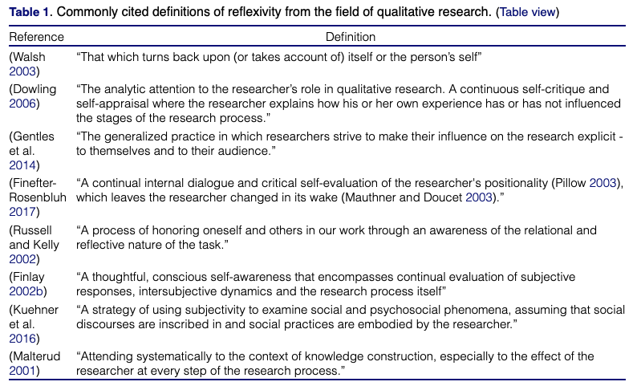

## What is reflexivity in HCI?

- Liang et al. 2021
- Calvin A. Liang, Sean A. Munson, and Julie A. Kientz. 2021. Embracing Four Tensions in Human-Computer Interaction Research with Marginalized People. ACM Trans. Comput.-Hum. Interact. 28, 2, Article 14 (April 2021), 47 pages. https://doi-org.virtual.anu.edu.au/10.1145/3443686
- Research is not objective – researcher as instrument
- __Western Feminism is Standpoint Theory__ – “an individual’s experiences and background make up a unique perspective on the world [63, 78]. Because of this, a researcher’s identity influences how they interact with participants …” (Liang et al. 2021, p. 14:6)
- “Reflexivity calls upon researchers to self-reflect and understand their own possible biases, their role in power relations, and how these factors might manifest in their work” (Liang et al. 2021, p. 14:7)
- __Positionality__  - “how a researcher’s perspective compares to others’ perspectives” (Liang et al. 2021, p. 14:7)
- __Positionality is not necessarily about disclosing your identity__
- “[it] doesn’t necessarily mean they have to include an identity disclosure (unless you really really think it’s important). You can talk about privilege, ethics, power, values, all of the above.” - [link](https://medium.com/@caliang/reflexivity-positionality-and-disclosure-in-hci-3d95007e9916)

## What is reflexivity in HCI?

- Rode 2011
- Jennifer A. Rode. 2011. Reflexivity in digital anthropology. In Proceedings of the SIGCHI Conference on Human Factors in Computing Systems (CHI '11). Association for Computing Machinery, New York, NY, USA, 123–132. https://doi-org.virtual.anu.edu.au/10.1145/1978942.1978961

**Burroway’s definition (in Rode 2011):**

“First, reflexivity, unlike positivism, embraces intervention as a data gathering opportunity.

Second, reflective texts aim to understand how data gathering impacts the quality of the data itself. This approach “commands the observer to unpack those situational experiences by moving with the participants through their time and space” [9. , p14].

Third, reflexive practitioners attempt to find structural patterns in what they have observed, and fourth, in doing so they extend theory [9. ].” (p. 124)

## Types of reflexivity

- Olmos-Vega et al. 2022
- Francisco M. Olmos-Vega, Renée E. Stalmeijer, Lara Varpio & Renate Kahlke (2022) A practical guide to reflexivity in qualitative research: AMEE Guide No. 149, Medical Teacher, DOI:  _[10.1080/0142159X.2022.2057287](https://doi.org/10.1080/0142159X.2022.2057287)_
  - “ __Personal Reflexivity -__   __Ask yourself__ : how are our unique perspectives influencing the research?”
  - __“Interpersonal Reflexivity: Power - Ask yourself__ : what relationships exist and how are they influencing the research and the people involved? What power dynamics are at play?”
  - __“Methodological Reflexivity - Ask yourself__ :  How are we making methodological decisions and what are their implications?”
  - __“Contextual Reflexivity - Ask yourself: __ How are aspects of context influencing the research and people involved?” (Olmos-Vega et al. 2022)

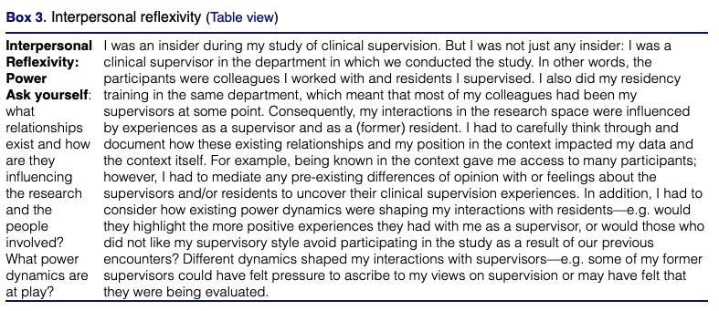

## Statement of Positionality – Example 1

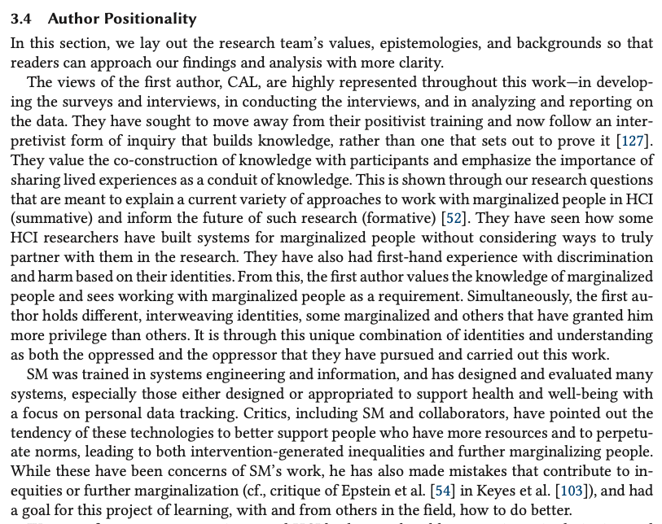

- Liang et al. 2021
- Calvin A. Liang, Sean A. Munson, and Julie A. Kientz. 2021. Embracing Four Tensions in Human-Computer Interaction Research with Marginalized People. ACM Trans. Comput.-Hum. Interact. 28, 2, Article 14 (April 2021), 47 pages. https://doi-org.virtual.anu.edu.au/10.1145/3443686

## Statement of Positionality – Example 1 (cont)

- Liang et al. 2021
- Calvin A. Liang, Sean A. Munson, and Julie A. Kientz. 2021. Embracing Four Tensions in Human-Computer Interaction Research with Marginalized People. ACM Trans. Comput.-Hum. Interact. 28, 2, Article 14 (April 2021), 47 pages. https://doi-org.virtual.anu.edu.au/10.1145/3443686

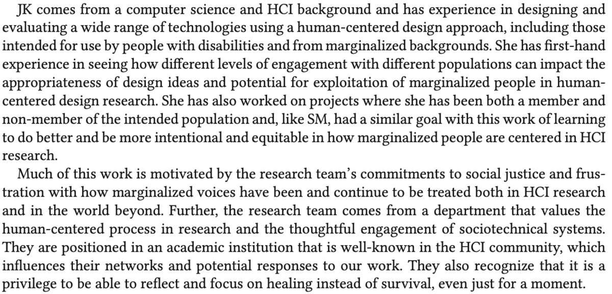

## Conceptualising Interaction

- Articulating the proposed solution as a conceptual model
- Orientation
- Open-Mindedness
- Common Ground
- What are the underlying assumptions and claims?
- Write them down
- Try to defend/support them

## Further Readings

- Jack Carroll. 2004. Beyond Fun, Interactions 11 (5), 38–40.
- John M. Carroll. 2014. Chapter 2: Human Computer Interaction - brief intro. The Encyclopedia of Human-Computer Interaction, 2nd Ed. https://www.interaction-design.org/literature/book/the-encyclopedia-of-human-computer-interaction-2nd-ed
- Kate Finn and Jeff Johnson. 2016. Designing for an Aging Population: Toward Universal Design. In Proceedings of the 2016 CHI Conference Extended Abstracts on Human Factors in Computing Systems (CHI EA '16), 1011–1012. DOI: [https://doi.org/10.1145/2851581.2856669](https://doi.org/10.1145/2851581.2856669)
- Harrison, S., Tatar, D., & Sengers, P. (2007, April). The three paradigms of HCI. In  _Alt CHI. Session at the SIGCHI Conference on Human Factors in Computing Systems San Jose, California, USA_  (pp. 1-18)
- Marc Hassenzahl. 2014. Chapter 3: User Experience and Experience Design. The Encyclopedia of Human-Computer Interaction, 2nd Ed. https://www.interaction-design.org/literature/book/the-encyclopedia-of-human-computer-interaction-2nd-ed
- John McCarthy and Peter Wright. 2004. Technology as Experience. Interactions 11, 5. https://interactions.acm.org/archive/view/september-october-2004/technology-as-experience1
- Don Norman. 2013. The design of everyday things: Revised and expanded edition. Basic books.
- Lillian Xiao. 2017. [A Brief History of Human-Computer Interaction (HCI)](https://blog.prototypr.io/the-rise-of-human-computer-interaction-hci-823dd6286e1d).

## Readings / References

- Sandra Bardot, Surya Rawat, Duy Thai Nguyen, Sawyer Rempel, Huizhe Zheng, Bradley Rey, Jun Li, Kevin Fan, Da-Yuan Huang, Wei Li, and Pourang Irani. 2021. ARO: Exploring the Design of Smart-Ring Interactions for Encumbered Hands. In Proceedings of the 23rd International Conference on Mobile Human-Computer Interaction (MobileHCI '21). Association for Computing Machinery, New York, NY, USA, Article 12, 1–11. [https://doi.org/10.1145/3447526.3472037](https://doi.org/10.1145/3447526.3472037)
- Hiroyuki Osone, Jun-Li Lu, and Yoichi Ochiai. 2021. BunCho: AI Supported Story Co-Creation via Unsupervised Multitask Learning to Increase Writers’ Creativity in Japanese. In Extended Abstracts of the 2021 CHI Conference on Human Factors in Computing Systems (CHI EA '21). Association for Computing Machinery, New York, NY, USA, Article 19, 1–10. https://doi.org/10.1145/3411763.3450391
- Anke Verena Reinschluessel, Thomas Muender, Tanja Döring, Verena Nicole Uslar, Thomas Lück, Dirk Weyhe, Andrea Schenk, and Rainer Malaka. 2021. A Study on the Size of Tangible Organ-shaped Controllers for Exploring Medical Data in VR. In Extended Abstracts of the 2021 CHI Conference on Human Factors in Computing Systems (CHI EA '21). Association for Computing Machinery, New York, NY, USA, Article 261, 1–7. [https://doi.org/10.1145/3411763.3451594](https://doi.org/10.1145/3411763.3451594)
- Sujay Shalawadi, Anas Alnayef, Niels van Berkel, Jesper Kjeldskov, and Florian Echtler. 2021. Rainmaker: A Tangible Work-Companion for the Personal Office Space. In Proceedings of the 23rd International Conference on Mobile Human-Computer Interaction (MobileHCI '21). Association for Computing Machinery, New York, NY, USA, Article 39, 1–13. https://doi.org/10.1145/3447526.3472032
- Wobbrock, J.O. and Kientz, J.A., 2016. Research contributions in human-computer interaction. interactions, 23(3), pp.38-44.

## Questions

Who has a question?

# References {.allowframebreaks}
