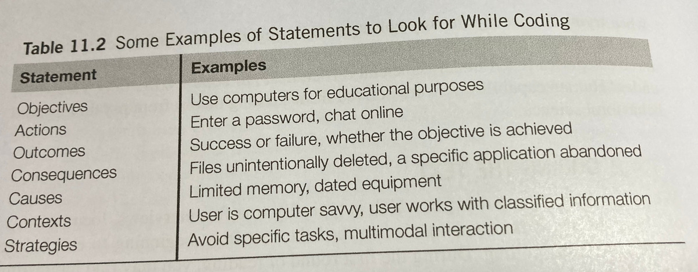
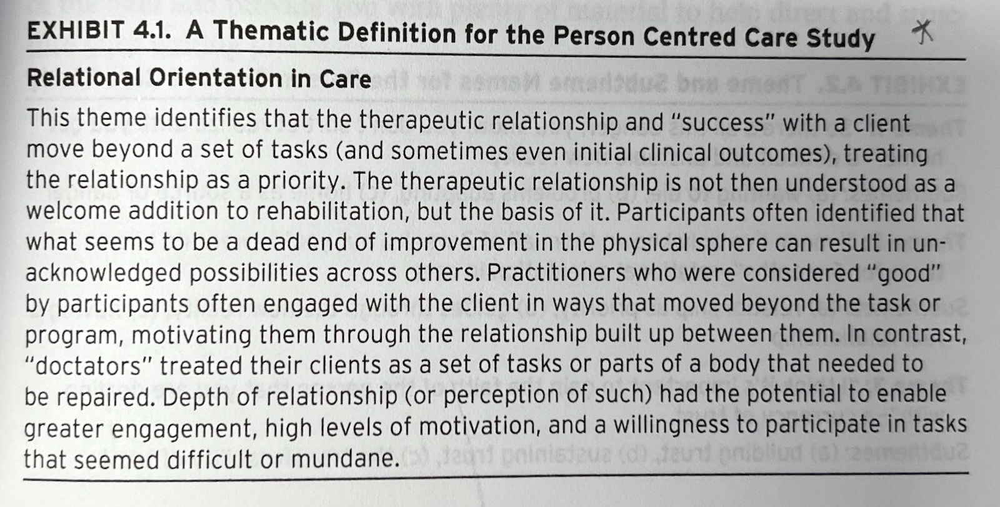

## Announcements

assignment 2 published [on Canvas](https://canvas.anu.edu.au/courses/2781/assignments/11550):

> Your challenge is choose **one existing AI-integrated interactive computer system or interface** and run a user research study with 3--5 participants. You will answer the research question: "How do users' mental model of the AI system align with the behaviour of the system and what usability issues arise from any misalignments?"

- collect and analyse data and present research findings
- apply quantitative and qualitative data analysis
- research **other students** in this class (do not research folks outside the class)
- participant matching in labs/drop-ins
- **new:** clearer instructions to complete the assignment, [Markdown linter](https://github.com/igorshubovych/markdownlint-cli) provided in GitLab CI.

## Plan for the class

- Analytical frameworks (qualitative analysis)
- Interpreting and presenting findings
- Deep dive on _Reflexive Thematic Analysis_ (needed for the assignment)
- Reflexivity and positionality statements

# Analytical Frameworks

:::::::::::::: {.columns}
::: {.column width="60%"}
- different approaches can guide qualitative analysis 
- **granularity:** from fine-grained detailed analysis to broader scope examinations
- conversation analysis: fine granularity, examines detailed interactions in short conversation fragments
- systems-based frameworks: coarse granularity, broad group or organisation level analysis
- useful depending on the research goals
:::
::: {.column width="40%"}

:::
::::::::::::::

## Conversation Analysis (CA)

:::::::::::::: {.columns}
::: {.column width="60%"}
- **CA:** examines the semantics of conversations, e.g., turn-taking and interaction
- e.g., compare conversations in different settings
- markup with syntax to capture detailed interactions and speech patterns
- **Square brackets [ ]** indicate overlapping talk between speakers
- **Round brackets ( )** show pauses in conversation with timing details (e.g., (1.1) = 1.1 second pause)
- **Physical spacing** represents temporal sequencing to show exactly when things are said in relation to each other
- aims to reveal subtle cues and conversational mechanisms that might otherwise be missed
:::
::: {.column width="40%"}
```
01  SUS i'd like to play beat the intro in a minute
02  LIA   [ oh no: ]
03  SUS [ alexa ][ (1.1)  ] beat the in[tro
04  CAR      [ °yeah°; ]
05  LIA                 [°no:::…°
06  CAR (0.6) it' mother's day? (0.4)
07  SUS it's (   ) yep (.) listen (.) you need to keep
08    on eating your orange stuff (.) liam
09    (0.7)
10  CAR and your green stuff
11  SUS alexa (1.3) alexa (0.5)=
12  CAR             =°and your brown stuff
13  SUS play beat the intro
```

Conversation with family members and Amazon Alexa with markup from [@porcheron-voice-interfaces:2018]
:::
::::::::::::::

## Discourse Analysis

- Analysing dialogue: what is said, how words convey meaning
- Interpreting context, psychological and social aspects of words.
- Language as social reality, open to interpretation
- [**Constructivist approach:**](https://www.open.edu/openlearn/health-sports-psychology/critically-exploring-psychology/content-section-3.1) Language as a constructive tool: analyse the process of world construction
- Identify subtle and implicit meaning between sources

## Content Analysis

:::::::::::::: {.columns}
::: {.column width="60%"}
- Classifies data into categories and studying frequency of occurrences
- Applicable to diverse media formats including text, video, images, etc
- can involve predefined frameworks or classification systems to systematically examine content across specified dimensions
- can be combined with other analytical techniques such as sentiment analysis
:::
::: {.column width="40%"}

:::
::::::::::::::

## Interaction Analysis [@jordan-interaction-analysis:1995]

- investigate human interactions with each other, artifacts, and technologies using video recordings of naturally occurring activities 
- can be teamwork: researchers watch videos together, discuss in real-time 
- coding and annotation through repeated video playing
- hypotheses based on observable participant actions and behaviors
- find patterns inductively by assembling instances of salient events

## Grounded Theory

Grounded Theory (GT) is an _old and important_ qualitative analysis technique [@glaser-strauss-grounded-theory:1967; @corbin-strauss-grounded-theory:2014]

- main idea: identify _categories_ (a kind of theme) through iterative data collection and analysis.
- any kind of data but often ethnographic and interview data
- analysis procedure:
    - _open coding_: categories, properties and dimensions discovered inn data
    - _axial coding_: systematically establishing categories/sub-categories
    - _selective coding_: refine and integrating categories

- _heavier and less flexible in comparison to Reflexive Thematic Analysis_ (not suggested for first-timers)
- @rogers-beyond-hci:2023 claim that GT "uses reflexive thematic analysis", which I guess is accurate.

## Grounded Theory Example: Idle Games

:::::::::::::: {.columns}
::: {.column width="50%"}

:::
::: {.column width="50%"}

:::
::::::::::::::

## Systems-Based Frameworks

:::::::::::::: {.columns}
::: {.column width="60%"}
- large projects involve many sources of data and stakeholders
- e.g., hospital, corporation, local council, airport, (or university...)
- need ways to understand how the system works together
- manage complex interdependencies
- common theme of management speak: "systems thinking"
:::
::: {.column width="40%"}

:::
::::::::::::::

## Socio-technical Systems Theory (STS)

- **STS:** technology and people in a work system are interdependent [@klein-sociotechnical:2014]
- treat the whole system as a whole, applied in complex work places.
- More of a philosophy than a methodology, a holistic perspective to address challenges.

### Notable aspects:

1. Task interdependence
2. Socio-technical systems are "open systems": influenced by environmental factors
3. Heterogeneity of system components: subsystems have different technical components
4. Practical contributions: analysing systems, evaluating changes, designing co-optimised systems
5. Fragmentation of design processes


## Distributed Cognition of Teamwork (DiCoT)

- Distributed cognition unpacks how multiple people and technologies interact complete tasks and solve problems.
    - **information flow model**
    - **physical model**
    - **artifact model**
    - **social structure model**
    - **system evolution model**
- models have underlying principles, e.g., for physical model:
    - **horizon of observation:** What an individual can see or hear
    - **perceptual:** How spatial representations aid computation
    - **arrangement of equipment:** arrangement of the environment affects access to information
- useful in collaboration contexts, e.g., software development, medicine

## Which Analytical Framework to Use? 

::: {.small-table}

| framework | data | focus | outcomes | granularity |
|---|---|---|---|---|
| conversation analysis | spoken conversation recordings | process of conversations  | how conversations are processed and progress | words or smaller |
| discourse analysis | speech or writing | how words convey meaning | implicit or hidden meanings in text | word, phrase |
| content analysis | written text, video, audio, images | how often something is featured or is spoken about | frequency of items in text | words to artefacts or people |
| interaction analysis | video of activities | interactions between people and artefacts | how knowledge and action are used in an activity | artifact, dialogue, gesture |
| grounded theory | empirical data of any kind | building theory from a phenomenon | theory grounded in data | varying levels |
| systems-based frameworks | large-scale and heterogeneous data | large scale systems of people and technology | organisational insights | macro, organisational level |

:::

adapted from @rogers-beyond-hci:2023 table 9.6

# Interpreting and Presenting Findings

{width=50%}

## Big Research Writing Tip: Cite your methods

- Applies to research projects in this class and at Honours, master, PhD and research-focussed workplace
- Work with supervisors/mentors/managers to choose methodology and analytical frameworks
- Read and understand the framework from (recent) scholarly sources (not just `nngroup.com`)
- Change and evolution is allowed, but understand that there is a wealth of example and established approaches

## Structured Notations

Specific interaction information can be represented in a formal/structured way when presented.

- presenting information through formal notations related to particular domains
- e.g., music applications might involve musical notation or symbolic data formats
- could be related to an analytical framework (e.g., conversation analysis)
- tradeoff between precision and flexibility; structured notation can be precise but potentially less accessible to a reader or limited in scope

## Using Stories

Context of use and examples of user experience can be seen as stories or narratives.

- Participants tell stories during data gathering which can illustrate research findings.
- Observations can be framed as stories
- Stories can be written or in the form of storyboards or videos.
- Can be used to support research findings and provide authenticity.

## Summarising Findings

Overall advice about findings...

- Multi-modal is often good: combine styles such as stories, plots, data excerpts, numerical tables
- Developing plots and visualisations is critical and hard work, just like crafting text. We spend hours getting it right in Python/R!
- Important to balance the weight of a **claimed finding** against supporting evidence; however, doesn't mean that small studies are not useful.
- Reviewers hate over-generalisation: careful with terms like "most," "all," "majority," and "none" without justification
- Statistical claims require care to avoid misleading the reader

# What even is knowledge anyway?

{width=50%}

## What is knowledge?

By this stage, you could be excused for being a bit confused about qualitative research in HCI.

- Research is often defined as "knowledge creation", but it's not always clear _what_ that knowledge is in HCI:
  - Is the knowledge from an interview different to a measured interaction?
  - Does our interpretation matter?
  - Do the users have to be objective?
- E.g., if you create a new app, and then evaluate it, can your evaluation ever be objective? (remember you created the app in the first place!)
- Not a new question: _epistemology_ is a (philosophy) discipline to understand knowledge.

## Epistemology

This may feel firmly off topic, but we need to surface some friction about _knowledge_ to properly explain the different approaches in qualitative research.

- **Postivism/Post-positiveism** knowledge is true by definition or provable via generalisable methods. The "post" bit accepts qualitative research but emphasise sample size and eliminating bias.
- **Interpretivism:** knowledge can be socially constructed and meaning made by people
- **Critical theory:** examine power structures and hidden inequalities
- **Constructivism:** knowledge is created and shaped by human experience and social interaction, including with the researcher
- **Pragmatism:** apply frameworks that work best to solve the problem (e.g., mixed methods research)
- **New-Materialism:** _things_ can create meaning too with HCI defined by intra-action [@barad-meeting-universe:2007] of things and people

## Activity: What should this mean to you

- Some aspects of HCI, e.g., "user experience" aren't well uncovered by (post-)positivist frameworks.
- Interpretivist/Constructivist stances more popular in qualitative HCI research.
- New-Materialism/Agential-realism [@barad-meeting-universe:2007] is emerging in HCI as a relevant mode of inquiry
- _but_ this has some implications in terms of how findings are described!

> Does any of this make sense? What kind of knowledge would you want to deal with? 

**Discuss with someone near you for 2 minutes, then let's hear some answers.**

# Thematic analysis

- Let's get into some more detail how to do _thematic analysis_
- Remember that this is a group of techniques!
- I'll introduce _a_ way of doing (reflexive) TA, adapted from @braun-thematic-analysis:2022

## Phases of thematic analysis

:::::::::::::: {.columns}
::: {.column width="50%"}
1. Familiarise yourself with the data
2. Code the data
3. Initial theme generation
4. theme development and review
5. theme refining, defining and naming
6. writing up
:::
::: {.column width="50%"}
![[@braun-thematic-analysis:2006]](img/05_02_thematic_analysis_0.jpg)
:::
::::::::::::::

## Phase 1: Familiarise yourself with your data

:::::::::::::: {.columns}
::: {.column width="60%"}
- considered poor practice to jump to _themeing_ before understanding the data.
- familiarisation starts during data collection (thinking about the content while/directly after collecting)
- angles for thought: key knowledge, simalarities/differences, surprises, adjustments to interview technique/script.

### Reading

- Read data in an active way: search for meaning
- make notes while reading
- familiarise while transcribing
- read and re-read transcripts
:::
::: {.column width="40%"}

](img/05_02_thematic_analysis_1.jpg)
:::
::::::::::::::

## Phase 2: Code the data

:::::::::::::: {.columns}
::: {.column width="60%"}
A code is: _a name or label applied to a chunk of data_

- reduces volume of data
- connects data items together.
- remember last week: inductive vs deductive coding (in this class, please do inductive!)
- chunks can have multiple codes
- code choice: short phrase, or a pithy label (shorter than the data it describes!)
- code small chunks: start with each sentence.
- do this _thoroughly_
:::
::: {.column width="40%"}
![[@piggott-preceptor-engagement:2015]](img/05_02_thematic_analysis_2.jpg)
:::
::::::::::::::

## What to look for when coding?

:::::::::::::: {.columns}
::: {.column width="60%"}
- initial coding: lots of new codes
- later: reuse existing codes.
- length: sometimes _one word_ can be too general (links too much data)
- don't overlook data: code the obvious

### Example codes for "uncertainty"

- "uncertainty about what to do next"
- "uncertain about whether command was received"
- "uncertain about whether information is true"
- "uncertain whether other options would be better"
:::
::: {.column width="40%"}

:::
::::::::::::::

## Coding your data in a text editor

:::::::::::::: {.columns}
::: {.column width="50%"}
![[@rogers-beyond-hci:2023]](img/05_02_thematic_analysis_4.jpg){width=90%}
:::
::: {.column width="50%"}
![[@rogers-beyond-hci:2023]](img/05_02_thematic_analysis_5.jpg){width=90%}
:::
::::::::::::::

## Types of codes

- In vivo codes: based on the literal words of a participant [@given-in-vivo-coding:2008]
- Researcher denoted: based on the researcher's interpretation
- Semantic: surface level, close to in vivo but may not be exact words
- Latent: based on deeper interpretation of data

## Code book

:::::::::::::: {.columns}
::: {.column width="60%"}
- Some qualitative research involves collecting codes in a document and sharing between researchers
- Researchers argue this can help eliminate bias
- Controls on number and type of codes, aim for consistency and repeatability
- Often not recommended in reflexive thematic analysis
:::
::: {.column width="40%"}
![Example of code book entries [@decruir-gunby-codebook:2011, p.147]](img/05_02_thematic_analysis_7.jpg)
:::
::::::::::::::

## Activity: Do some coding

:::::::::::::: {.columns}
::: {.column width="60%"}
Let's code some interview data.

> **David** is explaining how orders groceries online.

Use the poll everywhere link to code statements and we will see them all together. We'll code each statement for 1 minute and then discuss the results.


:::
::: {.column width="40%"}

:::
::::::::::::::

## Phase 3: Initial theme generation

A theme:

> “A theme captures something important about the data in relation to the research question, and represents some level of patterned response or meaning within the data set” (Braun and Clarke 2006, p.82)

How do we find them?

## Themeing

:::::::::::::: {.columns}
::: {.column width="60%"}
In this class: 

1. Use affinity diagrams to cluster codes / data extracts
2. Look for patterned responses/meanings (may help to write higher level codes)
3. _prototype_ themes that capture "something important" (may help to promote a code)
4. Refine and question your themes and codes, not all themes are well-supported by data.
:::
::: {.column width="40%"}
's thematic analysis (2025)](img/reflexive-thematic-analysis-yichen-wang-miro-2025.png)
:::
::::::::::::::

## Themes do not emerge

:::::::::::::: {.columns}
::: {.column width="60%"}
Braun and Clarke _insist_ that "themes do not emerge", [@braun-thematic-analysis:2022]

- themes are created by the researcher, not exacavated from the data
- work goes into analysing data and deciding on themes that can be supported
- when folks write "themes emerged", it's as if the themes were either there to begin with or developed themselves.
- this is not a (post-)positivist approach.

@terry-thematic-analysis:2021 suggest approaching themeing by _prototyping_, an iterative process where "the goal isn't to finish".
:::
::: {.column width="40%"}
{width=50%}
:::
::::::::::::::

## Code Hierarchies

:::::::::::::: {.columns}
::: {.column width="60%"}
- Some TA methods suggest hierarchies of codes to find themes.
- I suggest: codes, sub- or prototype- themes, then themes
- In this example, are the themes thick or thin?
:::
::: {.column width="40%"}
![[@lazar-research-methods:2017]](img/05_02_thematic_analysis_9.jpg)
:::
::::::::::::::

## Phase 4: Develop and review themes

:::::::::::::: {.columns}
::: {.column width="60%"}
Are your themes good? Test them.

- Are themes supported by (enough) data?
- Answer your research question?
- Provide strong organising concepts?
- Conceptually rich? (Could you write 500 words about each?)
- Do the themes reflect the overall meaning of the data set?
:::
::: {.column width="40%"}

:::
::::::::::::::

## Thin vs thick themes

:::::::::::::: {.columns}
::: {.column width="60%"}
There are different types of themes, and a common distinction:

- Themes that categorise groups of codes: bucket themes, semantic themes, _thin_ themes
- Themes that interpret the codes, revealing hidden information: latent themes, _thick_ themes

:::
::: {.column width="40%"}
Number of words heuristic:

> If your theme is <4 words, it _might_ be a bit thin.

Number of themes heuristic:

> If you are proposing >4 themes, they _might_ be a bit thin.

Source: Charles, 2025. 😬
:::
::::::::::::::

## Phase 5: Refine and name themes

:::::::::::::: {.columns}
::: {.column width="60%"}
- Does your theme name reflect its ‘essence’?
- Does the theme contain subthemes?
- Are your theme names descriptive but concise?
- Can you describe your theme in a couple of sentences?
:::
::: {.column width="40%"}

:::
::::::::::::::

## Activity: Let's theme

:::::::::::::: {.columns}
::: {.column width="60%"}

**Let's cluster some codes from the HCI grocery interview.**

- Use this miro board link: <https://quicklink.anu.edu.au/o095>

This is fairly uncontrolled so be kind 😇

1. Yellow notes are "codes", cluster them.
2. Make red notes to represent prototype themes.

Cluster for 2-3 minutes, discuss, theme for 2-3 minutes, discuss.

:::
::: {.column width="40%"}

:::
::::::::::::::

## Phase 6: Write up a report

:::::::::::::: {.columns}
::: {.column width="60%"}
- determine the narrative for your themes
- include quotes and examples from your data
- include analysis: an argument in relation to your research question
- in your user research project: support themes with data
- in your final project: present design implications arising from the themes
:::
::: {.column width="40%"}
![[@ljungblad-what-matters:2021]](img/05_02_thematic_analysis_10.jpg){width=80%}
:::
::::::::::::::

## Reflexive Thematic Analysis Bingo [@braun-thematic-analysis:2022]

A bingo card of potential researcher problems with (R)TA... which make sense so far?

::: {.small-table}
| B | I | N | G | O |
| - | - | - | - | - |
| Mentions inter-coder reliability | Implicitly (post-)positivist TA (not acknowledged) | More than 3 levels of themes | Mention of a lack of (statistical) generalisability | Messy mix of realism and constructionism |
| Unacknowledged social cognitions (e.g., attitude or body image) | Themes are thin - just single idea (a code) | Themes do not have a central organising concept | “Themes emerged” | Data collection stopped at “saturation” |
| Use of passive voice | No reflexivity | **Thematic Analysis** | Only Braun and Clarke 2006 cited | Mention of “bias” |
| Clarke spelled as Clark (no e) | More than 6 themes | No theory of language-treated as a window to truth | Themes are topic summaries | Very few participants quoted / over-quoting of one or more |
| Implicitly realist TA (not acknowledged) | Braun pronounced BRAWN (not Brown) | Mismatch between extracts and analytic claims | Use of a codebook | Data are just paraphrased without interpretation |
:::

# Reflexivity

{width=50%}

## What is reflexivity?

:::::::::::::: {.columns}
::: {.column width="60%"}
- turns back on or accounts for the person's self
- analytic attention to the researcher's role in research
- continual dialogue and critical self-evaluation of positionality
- honouring oneself and others through awareness
- thoughtful, conscious self-awareness
- using subjectivity to examine social and psychosocial phenomena
- attending to the context of knowledge production
:::
::: {.column width="40%"}
![[@olmos-vega-reflexivity-qualitative-research:2023]](img/05_01_reflexivity_9.png)
:::
::::::::::::::

## What is reflexivity in HCI?

- researcher is a non-objective instrument! (to detect phenomena such as "user experience", among others)
  - “an individual’s experiences and background make up a unique perspective on the world... influences how they interact with participants” [@liang-tensions-hci-marginalized:2021]
  - “Reflexivity calls upon researchers to self-reflect and understand their own possible biases, their role in power relations, and how these factors might manifest in their work” [@liang-tensions-hci-marginalized:2021]

### Positionality

- “how a researcher’s perspective compares to others’ perspectives” [@liang-tensions-hci-marginalized:2021]
- not necessarily about disclosing your identity
- disclosing, or examining the aspects of the researcher that is relevant to understand their situated context

## What is reflexivity in HCI?

**Burroway’s definition [@rode-reflexivity-digital-anthropology:2011]:**

1. reflexivity, unlike positivism, embraces intervention as a data gathering opportunity
2. reflective texts aim to understand how data gathering impacts the quality of the data itself. This approach “commands the observer to unpack those situational experiences by moving with the participants through their time and space"
3. reflexive practitioners attempt to find structural patterns in what they have observed, and fourth, in doing so they extend theory

## Types of reflexivity 

:::::::::::::: {.columns}
::: {.column width="60%"}
- **Personal Reflexivity:** how are our (_you!_) unique perspectives influencing the research?”
- **Interpersonal Reflexivity:** what relationships exist and how are they influencing the research and the people involved? What power dynamics are at play?
- **Methodological Reflexivity:** How are we making methodological decisions and what are their implications?”
- **Contextual Reflexivity:** How are aspects of context influencing the research and people involved?

[@olmos-vega-reflexivity-qualitative-research:2023]
:::
::: {.column width="40%"}

:::
::::::::::::::

## Statement of Positionality – Example

:::::::::::::: {.columns}
::: {.column width="50%"}
![[@liang-tensions-hci-marginalized:2021]](img/05_01_reflexivity_11.png)
:::
::: {.column width="50%"}
![[@liang-tensions-hci-marginalized:2021]](img/05_01_reflexivity_12.png)
:::
::::::::::::::

## Activity: Positionality statement (in a sentence)

:::::::::::::: {.columns}
::: {.column width="60%"}
Let's try it:

> What is your 1-sentence statement of positionality as a researcher?

Use the poll everywhere link to provide it.
:::
::: {.column width="40%"}

:::
::::::::::::::

## Why should you care about reflexivity?

- Considering researcher's perspective is important part of developing _thick_ themes.
- Needed to address challenges of subjectivity in HCI research.
- Positionality statement and reflexive consideration required for postgraduates (COMP6390) in Final Project!

## Questions: Who has a question?

:::::::::::::: {.columns}
::: {.column width="60%"}
**Who has a question?**

- I can take _cathchbox_ question up until 2:55
- For after class questions: meet me outside the classroom at the bar (for 30 minutes)
- Feel free to ask about **any aspect of the course**
- Also feel free to ask about **any aspect of computing at ANU**! I may not be able to help, but I can listen.

:::
::: {.column width="40%"}

:::
::::::::::::::

# References {.allowframebreaks}
