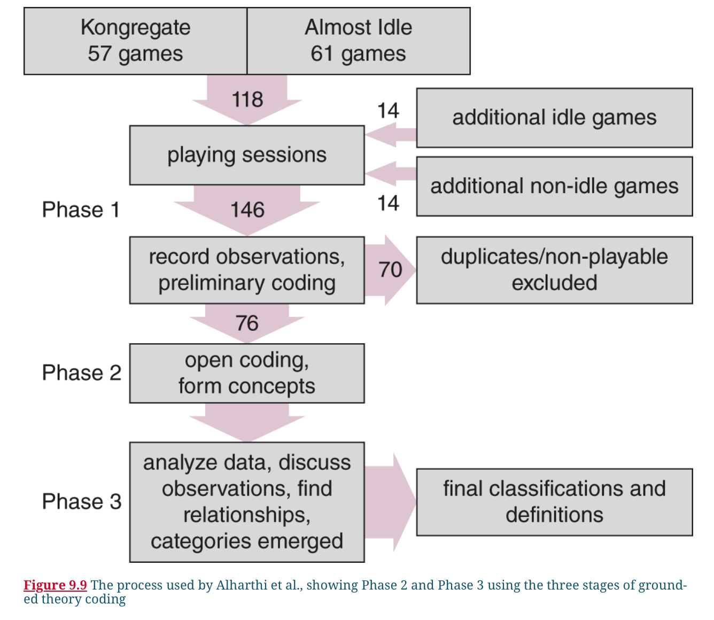
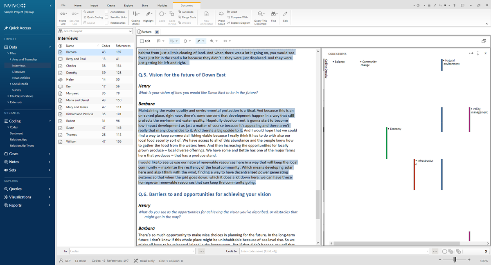
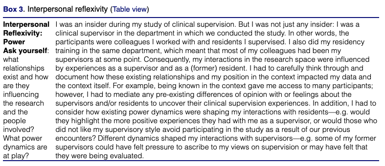

## Announcements

assignment 2 published [on Canvas](https://canvas.anu.edu.au/courses/2781/assignments/11550):

> Your challenge is choose **one existing AI-integrated interactive computer system or interface** and run a user research study with 3--5 participants. 
> You will formulate a research question, collect and analyse data, and present research findings. Your study should involve at least one form of quantitative and one form of qualitative data and analysis.

You need to:

- apply quantitative and qualitative data analysis
- research **other students** in this class (do not research folks outside the class please)
- participant matching part of labs

## Plan for the class

- Analytical frameworks (qualitative analysis)
- Interpreting and presenting findings
- Deep dive on _Reflexive Thematic Analysis_ (needed for the assignment)
- Reflexivity

# Analytical Frameworks

:::::::::::::: {.columns}
::: {.column width="60%"}
- different approaches can guide qualitative analysis 
- **granularity:** from fine-grained detailed analysis to broader scope examinations
- conversation analysis: fine granularity, examines detailed interactions in short conversation fragments
- systems-based frameworks: coarse granularity, broad group or organisation level analysis
- useful depending on the research goals
:::
::: {.column width="40%"}

:::
::::::::::::::

## Conversation Analysis (CA)

:::::::::::::: {.columns}
::: {.column width="60%"}
- **CA:** examines the semantics of conversations, e.g., turn-taking and interaction
- e.g., compare conversations in different settings
- markup with syntax to capture detailed interactions and speech patterns
- **Square brackets [ ]** indicate overlapping talk between speakers
- **Round brackets ( )** show pauses in conversation with timing details (e.g., (1.1) = 1.1 second pause)
- **Physical spacing** represents temporal sequencing to show exactly when things are said in relation to each other
- aims to reveal subtle cues and conversational mechanisms that might otherwise be missed
:::
::: {.column width="40%"}
```
01  SUS i'd like to play beat the intro in a minute
02  LIA   [ oh no: ]
03  SUS [ alexa ][ (1.1)  ] beat the in[tro
04  CAR      [ °yeah°; ]
05  LIA                 [°no:::…°
06  CAR (0.6) it' mother's day? (0.4)
07  SUS it's (   ) yep (.) listen (.) you need to keep
08    on eating your orange stuff (.) liam
09    (0.7)
10  CAR and your green stuff
11  SUS alexa (1.3) alexa (0.5)=
12  CAR             =°and your brown stuff
13  SUS play beat the intro
```

Conversation with family members and Amazon Alexa with markup from [@porcheron-voice-interfaces:2018]
:::
::::::::::::::

## Discourse Analysis

- Analysing dialogue: what is said, how words convey meaning
- Interpreting context, psychological and social aspects of words.
- Language as social reality, open to interpretation
- [**Constructivist approach:**](https://www.open.edu/openlearn/health-sports-psychology/critically-exploring-psychology/content-section-3.1) Language as a constructive tool: analyse the process of world construction
- Identify subtle and implicit meaning between sources

## Content Analysis

:::::::::::::: {.columns}
::: {.column width="60%"}
- Classifies data into categories and studying frequency of occurrences
- Applicable to diverse media formats including text, video, images, etc
- can involve predefined frameworks or classification systems to systematically examine content across specified dimensions
- can be combined with other analytical techniques such as sentiment analysis
:::
::: {.column width="40%"}

:::
::::::::::::::


## Interaction Analysis [@jordan-interaction-analysis:1995]

- investigate human interactions with each other, artifacts, and technologies using video recordings of naturally occurring activities 
- can be teamwork: researchers watch videos together, discuss in real-time 
- coding and annotation through repeated video playing
- hypotheses based on observable participant actions and behaviors
- find patterns inductively by assembling instances of salient events

## Grounded Theory

Grounded Theory (GT) is an _old and important_ qualitative analysis technique [@glaser-strauss-grounded-theory:1967; @corbin-strauss-grounded-theory:2014]

- main idea: identify _categories_ (a kind of theme) through iterative data collection and analysis.
- any kind of data but often ethnographic and interview data
- analysis procedure:
    - _open coding_: categories, properties and dimensions discovered inn data
    - _axial coding_: systematically establishing categories/sub-categories
    - _selective coding_: refine and integrating categories

- _heavier and less flexible in comparison to Reflexive Thematic Analysis_ (not suggested for first-timers)
- @rogers-beyond-hci:2023 claim that GT "uses reflexive thematic analysis", which I guess is accurate.

## Grounded Theory Example: Idle Games

:::::::::::::: {.columns}
::: {.column width="50%"}


GT process for @alharthi-idle-games:2018
:::
::: {.column width="50%"}


Codes and categories.
:::
::::::::::::::

## Systems-Based Frameworks

:::::::::::::: {.columns}
::: {.column width="60%"}
- large projects involve many sources of data and stakeholders
- e.g., hospital, corporation, local council, airport, (or university...)
- need ways to understand how the system works together
- manage complex interdependencies
- common theme of management speak: "systems thinking"
:::
::: {.column width="40%"}

:::
::::::::::::::

## Socio-technical Systems Theory (STS)

- **STS:** technology and people in a work system are interdependent [@klein-sociotechnical:2014]
- treat the whole system as a whole, applied in complex work places.
- More of a philosophy than a methodology, a holistic perspective to address challenges.

### Notable aspects:

1. Task interdependence
2. Socio-technical systems are "open systems": influenced by environmental factors
3. Heterogeneity of system components: subsystems have different technical components
4. Practical contributions: analysing systems, evaluating changes, designing co-optimised systems
5. Fragmentation of design processes


## Distributed Cognition of Teamwork (DiCoT)

- Distributed cognition unpacks how multiple people and technologies interact complete tasks and solve problems.
- DiCoT framework supports this concept with models:
    - **information flow model**
    - **physical model**
    - **artifact model**
    - **social structure model**
    - **system evolution model**
- models have underlying principles, e.g., for physical model:
    - **horizon of observation:** What an individual can see or hear.
    - **perceptual:** How spatial representations aid computation.
    - **arrangement of equipment:** How the physical arrangement of the environment affects access to information.
- may be particularly useful in collaboration contexts, e.g., software development, medicine

## Which Analytical Framework to Use? 

| framework | data | focus | outcomes | granularity |
|---|---|---|---|---|
| conversation analysis | spoken conversation recordings | process of conversations  | how conversations are processed and progress | words or smaller |
| discourse analysis | speech or writing | how words convey meaning | implicit or hidden meanings in text | word, phrase |
| content analysis | written text, video, audio, images | how often something is featured or is spoken about | frequency of items in text | words to artefacts or people |
| interaction analysis | video of activities | interactions between people and artefacts | how knowledge and action are used in an activity | artifact, dialogue, gesture |
| grounded theory | empirical data of any kind | building theory from a phenomenon | theory grounded in data | varying levels |
| systems-based frameworks | large-scale and heterogeneous data | large scale systems of people and technology | organisational insights | macro, organisational level |

adapted from @rogers-beyond-hci:2023 table 9.6

# Interpreting and Presenting Findings

{width=50%}

## Big Research Writing Tip: Cite your methods

- Applies to research projects in this class and at Honours, master, PhD and research-focussed workplace
- Work with supervisors/mentors/managers to choose methodology and analytical frameworks
- Read and understand the framework from (recent) scholarly sources (not just `nngroup.com`)
- Change and evolution is allowed, but understand that there is a wealth of example and established approaches

## Structured Notations

- presenting information through formal notations related to particular domains
- e.g., music applications might involve musical notation or symbolic data formats
- could be related to an analytical framework (e.g., conversation analysis)
- tradeoff between precision and flexibility; structured notation can be precise but potentially less accessible to a reader or limited in scope

## Using Stories

Context of use and examples of user experience can be seen as stories or narratives.

- Participants tell stories during data gathering which can illustrate research findings.
- Observations can be framed as stories
- Stories can be written or in the form of storyboards or videos.
- Can be used to support research findings and provide authenticity.

## Summarising Findings

Overall advice about findings...

- Multi-modal is often good: combine styles such as stories, plots, data excerpts, numerical tables
- Developing plots and visualisations is critical and hard work, just like crafting text. We spend hours getting it right in Python/R!
- Important to balance the weight of a **claimed finding** against supporting evidence; however, doesn't mean that small studies are not useful.
- Reviewers hate over-generalisation: careful with terms like "most," "all," "majority," and "none" without justification
- Statistical claims require care to avoid misleading the reader

# What even is knowledge anyway?

By this stage, you could be excused for being a bit confused about qualitative research in HCI.

- Research is often defined as "knowledge creation", but it's not always clear _what_ that knowledge is.
- E.g., if you create a new app, and then evaluate it, can your evaluation ever be objective? (remember you created the app in the first place!)

## Epistemology

Now we are firmly off topic, but we need to surface some friction about _knowledge_ to properly explain the different approaches in qualitative research.

- **Postivism:** knowledge is true by definition or provable via generalisable methods
- **Post-positivism:** non-generalisable methods ok but emphasise sample size and eliminating bias.
- **Interpretivism:** knowledge can be socially constructed and meaning made by people
- **Critical theory:** examine power structures and hidden inequalities 
- **Constructivism:** knowledge is created and shaped by human experience and social interaction, including with the researcher
- **Pragmatism:** apply frameworks that work best to solve the problem (e.g., mixed methods research)

## What should this mean to you

Some aspects of HCI, e.g., "user experience" aren't well uncovered by (post-)positivist frameworks.

Interpretivist/Constructivist stances more popular in qualitative HCI research.

_but_ this has some implications in terms of how findings are described!

# Thematic analysis

- Let's get into some more detail how to do _thematic analysis_
- Remember that this is a group of techniques!
- I'll introduce _a_ way of doing (reflexive) TA, adapted from @braun-thematic-analysis:2022

## Phases of thematic analysis

:::::::::::::: {.columns}
::: {.column width="50%"}
1. Familiarise yourself with the data
2. Code the data
3. Initial theme generation
4. theme development and review
5. theme refining, defining and naming
6. writing up
:::
::: {.column width="50%"}
![[@braun-thematic-analysis:2006]](img/05_02_thematic_analysis_0.jpg)
:::
::::::::::::::

## Phase 1: Familiarise yourself with your data

- analysis starts as soon as data collection starts
- e.g., after each interview, allow time for reflection on data and method
  - what were the key findings of this interview?
  - what was similar/different to previous interviews?
  - what issues were unexpected or surprising?
  - what would you do differently for the next interview? How would you adjust your interview script?
- note down and mind map any key quotes, examples, or stories from your data

## (Phase 1) Transcribing audio/video recordings

:::::::::::::: {.columns}
::: {.column width="60%"}
- start of data collection
- introductory note/context
- formatting to help distinguish speakers
:::
::: {.column width="40%"}

](img/05_02_thematic_analysis_1.jpg)
:::
::::::::::::::

## (Phase 1) Initial reading

- Immerse yourself in the data: read and re-read transcripts
- Read data in an active way: search for meaning, patterns etc., take notes about ideas for coding.
- But don’t try to code the data yet.

## Phase 2: Generate initial codes

“interacting with data, making comparisons between data, and so on, and in doing so, deriving concepts to stand for those data, then developing those concepts in terms of their properties and dimensions” (Corbin & Strauss 2014)

“emergent coding” (your projects) vs “a priori coding” (Lazar et al. 2017, p.304)

## Phase 2: What is a code?

:::::::::::::: {.columns}
::: {.column width="60%"}
- A code: Short phrase to describe piece of data
- Identify important features to your research aims
- Subject or nature of comment
- Each item can have multiple codes

(Piggott & Lee-Poy, 2015)
:::
::: {.column width="40%"}

:::
::::::::::::::

## (Phase 2) What to look for when coding?

:::::::::::::: {.columns}
::: {.column width="60%"}
- Look for specific items
- Ask questions about the data
- Make comparisons at different levels

:::
::: {.column width="40%"}

:::
::::::::::::::

## (Phase 2) Coding your data: Word/Excel

:::::::::::::: {.columns}
::: {.column width="50%"}
![[@rogers-beyond-hci:2023]](img/05_02_thematic_analysis_4.jpg){width=90%}
:::
::: {.column width="50%"}
![[@rogers-beyond-hci:2023]](img/05_02_thematic_analysis_5.jpg){width=90%}
:::
::::::::::::::

## (Phase 2) Developing codes

- "In-vivo codes" vs "researcher-denoted concepts"
- **In-vivo:** e.g., “hot-rodder,” “old-fashioned guy” (Given 2008)
- **Researcher-denoted:** “My son just sits there and sobs when the computer does not do what he wants. He becomes irritated and keeps pushing the Enter button when the web page loads slowly” e.g. Frustration (Lazar et al. 2017, p.306)

## (Phase 2) Coding your data: NVivo



## (Phase 2) Code book

{width=40%}

## Phase 3: Search for themes

A theme:

> “A theme captures something important about the data in relation to the research question, and represents some level of patterned response or meaning within the data set” (Braun and Clarke 2006, p.82)

How do we find them?

## Themeing

:::::::::::::: {.columns}
::: {.column width="60%"}
In this class: 

1. Use affinity diagrams to arrange codes/data
2. Look for patterned responses/meanings (may help to write higher level codes)
3. Come up with themes that capture "something important"
4. Refine and question your themes, not all themes are well-supported by data.
:::
::: {.column width="40%"}
![[@rogers-beyond-hci:2023, p.322]](img/05_02_thematic_analysis_8.jpg)
:::
::::::::::::::

## Thin vs thick themes

:::::::::::::: {.columns}
::: {.column width="60%"}
There are different types of themes, and a common distinction:

- Themes that categorise groups of codes: bucket themes, semantic themes, _thin_ themes

- Themes that interpret the codes, revealing hidden information: latent themes, _thick_ themes


:::
::: {.column width="40%"}
Number of words heuristic:

> If your theme is <5 words, it _might_ be a bit thin.

Number of themes heuristic:

> If you are proposing >5 themes, they _might_ be a bit thin.

Source: Charles, 2025. 😬
:::
::::::::::::::

## Themes do not emerge

:::::::::::::: {.columns}
::: {.column width="60%"}
Braun and Clarke _insist_ that "themes do not emerge", [@braun-thematic-analysis:2022]

- themes are created by the researcher
- work goes into analysing data and deciding on themes that can be supported
- when folks write "themes emerged", it's as if the themes were either there to begin with or developed themselves.
- this is not a (post-)positivist approach.
:::
::: {.column width="40%"}
{width=50%}
:::
::::::::::::::

## (Phase 3) Example code structure

![[@lazar-research-methods:2017; p.310]](img/05_02_thematic_analysis_9.jpg){width=60%}

## Phase 4: Review themes

- Are themes supported all by the data?
- Can some themes be grouped together?
- Does all the data within the theme describe it?
- Do the themes reflect the overall meaning of the data set?

## Phase 5: Refine and name themes

- Does your theme name reflect its ‘essence’?
- Does the theme contain subthemes?
- Are your theme names descriptive but concise?
- Can you summarise your theme in a couple of sentences?

## Phase 6: Write up a report

:::::::::::::: {.columns}
::: {.column width="60%"}
- Determine the narrative for your themes
- Include quotes and examples from your data
- include analysis: an argument in relation to your research question
- in your user research project: support themes with data
- in your final project: present design implications arising from the themes
:::
::: {.column width="40%"}
![[@ljungblad-what-matters:2021]](img/05_02_thematic_analysis_10.jpg){width=80%}
:::
::::::::::::::

## References

- Corbin, J & Strauss, A 2008,  _Basics of Qualitative Research_  3rd edn, Sage Publications Inc, Thousand Oaks, CA.
- DeCuir-Gunby, JT, Marshall, PL & McCulloch, AW 2011, ‘Developing and Using a Codebook for the Analysis of Interview Data: An Example from a Professional Development Research Project’,  _Field Methods_ , vol. 23, no. 2, pp. 136–155, accessed from <https://doi.org/10.1177/1525822X10388468>.
- Given, L. M. (2008). In vivo coding. In  _The SAGE encyclopedia of qualitative research methods_  (Vol. 1, pp. 473-474). SAGE Publications, Inc., [https://www-doi-org.virtual.anu.edu.au/10.4135/9781412963909.n240](https://www-doi-org.virtual.anu.edu.au/10.4135/9781412963909.n240)
- Piggott, T, Morris, C & Lee-Poy, M 2015, ‘Preceptor engagement in distributed medical school campuses’,  _Canadian medical education journal_ , vol. 6, no. 2, pp. e20–e28, accessed from <https://pubmed.ncbi.nlm.nih.gov/27004073>.

## Reflexive Thematic Analysis Bingo [@braun-thematic-analysis:2022]

A bingo card of potential researcher problems with (R)TA... which make sense so far?

::: {.small-table}

| B | I | N | G | O |
| - | - | - | - | - |
| Mentions inter-coder reliability | Implicitly (post-)positivist TA (not acknowledged) | More than 3 levels of themes | Mention of a lack of (statistical) generalisability | Messy mix of realism and constructionism |
| Unacknowledged social cognitions (e.g., attitude or body image) | Themes are thin - just single idea (a code) | Themes do not have a central organising concept | “Themes emerged” | Data collection stopped at “saturation” |
| Use of passive voice | No reflexivity | **Thematic Analysis** | Only Braun and Clarke 2006 cited | Mention of “bias” |
| Clarke spelled as Clark (no e) | More than 6 themes | No theory of language-treated as a window to truth | Themes are topic summaries | Very few participants quoted / over-quoting of one or more |
| Implicitly realist TA (not acknowledged) | Braun pronounced BRAWN (not Brown) | Mismatch between extracts and analytic claims | Use of a codebook | Data are just paraphrased without interpretation |

:::

# Reflexivity

## What is reflexivity?

:::::::::::::: {.columns}
::: {.column width="60%"}
- turns back on or accounts for the person's self
- analytic attention to the researcher's role in research
- continual dialogue and critical self-evaluation of positionality
- honouring oneself and others through awareness
- thoughtful, conscious self-awareness
- using subjectivity to examine social and psychosocial phenomena
- attending to the context of knowledge production
:::
::: {.column width="40%"}
![[@olmos-vega-reflexivity-qualitative-research:2023]](img/05_01_reflexivity_9.png)
:::
::::::::::::::

## What is reflexivity in HCI?

- researcher is a non-objective instrument! (to detect phenomena such as "user experience", among others)
  - “an individual’s experiences and background make up a unique perspective on the world... influences how they interact with participants” [@liang-tensions-hci-marginalized:2021]
  - “Reflexivity calls upon researchers to self-reflect and understand their own possible biases, their role in power relations, and how these factors might manifest in their work” [@liang-tensions-hci-marginalized:2021]

### Positionality

- “how a researcher’s perspective compares to others’ perspectives” [@liang-tensions-hci-marginalized:2021]
- not necessarily about disclosing your identity
- disclosing, or examining the aspects of the researcher that is relevant to understand their situated context

## What is reflexivity in HCI?

**Burroway’s definition [@rode-reflexivity-digital-anthropology:2011]:**

1. reflexivity, unlike positivism, embraces intervention as a data gathering opportunity
2. reflective texts aim to understand how data gathering impacts the quality of the data itself. This approach “commands the observer to unpack those situational experiences by moving with the participants through their time and space"
3. reflexive practitioners attempt to find structural patterns in what they have observed, and fourth, in doing so they extend theory

## Types of reflexivity 

:::::::::::::: {.columns}
::: {.column width="60%"}
- **Personal Reflexivity:** how are our (_you!_) unique perspectives influencing the research?”
- **Interpersonal Reflexivity:** what relationships exist and how are they influencing the research and the people involved? What power dynamics are at play?
- **Methodological Reflexivity:** How are we making methodological decisions and what are their implications?”
- **Contextual Reflexivity:** How are aspects of context influencing the research and people involved?

[@olmos-vega-reflexivity-qualitative-research:2023]
:::
::: {.column width="40%"}

:::
::::::::::::::

## Statement of Positionality – Example

:::::::::::::: {.columns}
::: {.column width="50%"}
![[@liang-tensions-hci-marginalized:2021]](img/05_01_reflexivity_11.png)
:::
::: {.column width="50%"}
![[@liang-tensions-hci-marginalized:2021]](img/05_01_reflexivity_12.png)
:::
::::::::::::::

## Why should you care about reflexivity?

- Considering researcher's perspective is important part of developing _thick_ themes.
- Needed to address challenges of subjectivity in HCI research.
- Positionality statement and reflexive consideration required for COMP6390 in Final Project!

## Questions: Who has a question?

:::::::::::::: {.columns}
::: {.column width="60%"}
**Who has a question?**

- I can take _cathchbox_ question up until 2:55
- For after class questions: meet me outside the classroom at the bar (for 30 minutes)
- Feel free to ask about **any aspect of the course**
- Also feel free to ask about **any aspect of computing at ANU**! I may not be able to help, but I can listen.

:::
::: {.column width="40%"}

:::
::::::::::::::

# References {.allowframebreaks}
