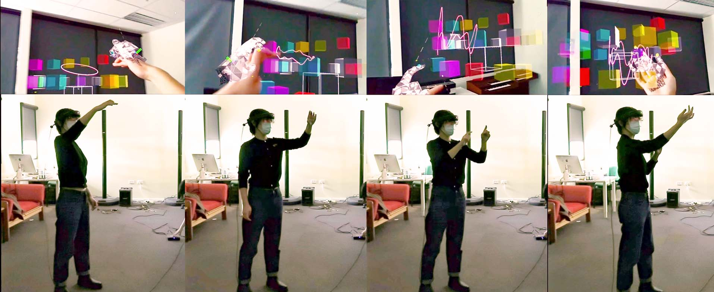

## Announcements

## Plan for the class

- Overview of the diversity of interfaces.
- Outline key design and research considerations for each interface
- Discuss what is meant by a natural user interface
- Consider which interface is best for a given application or activity

# Interface Types

:::::::::::::: {.columns}
::: {.column width="60%"}
How would you describe a computer interface?

- graphical, command, speech, ambient, intelligent, tangible, touchless, or natural, etc.

Some interface types are primarily concerned with a function (for example, to be smart such as *smart* phones);

while others focus on the **interaction style** used (e.g., command, graphical or multimedia), 
the **input/output device** used (e.g., pen-based, speech-based, or gesture-based), 
or the **platform being designed** for (for example, tablet, mobile, PC, or wearable).

now with ML algorithms that are intended to recognise faces, objects, and the like 🤖!
  
:::
::: {.column width="40%"}
{width=60%}
:::
::::::::::::::

## Interface Types ++
Let's talk about some main types of interfaces emerged over the past 45 years, loosely in time order.
 <!-- in terms of when they were developed. -->

:::::::::::::: {.columns}
::: {.column width="50%"}
- Command
- Graphical
- Multimedia
- Virtual reality
- Web
- Mobile
- Appliance
- Voice
- Pen
- Touch
- Touchless
:::
::: {.column width="50%" height="90%"}
- Haptic
- Multimodal
- Shareable
- Tangible
- Augmented reality
- Wearables
- Robots and drones
- Brain-computer
- Smart
- Shape-changing
- Holographic
:::
::::::::::::::

## Command-Line Interfaces

:::::::::::::: {.columns}
::: {.column width="50%"}

Type in abbreviated commands (e.g., `ls`),

pressing certain combinations of keys (e.g., `Ctrl + V`),

fixed from the keyboard (e.g., `delete`, `enter`, `esc`) or user defined.

These interfaces have been largely superseded by graphical interfaces such as menus, icons, keyboard shortcuts and pop-up/predictable text commands as part of an application. 

- Though they continue to be useful in using complex software package (e.g., CAD), scripting batch operations, website, and hacking. 
  
:::
::: {.column width="50%"}
{width=60%}
:::
::::::::::::::

## Command-Line Interfaces

:::::::::::::: {.columns}
::: {.column width="50%"}

Type in abbreviated commands (e.g., `ls`),

pressing certain combinations of keys (e.g., `Ctrl + V`),

fixed from the keyboard (e.g., `delete`, `enter`, `esc`) or user defined.

These interfaces have been largely superseded by graphical interfaces such as menus, icons, keyboard shortcuts and pop-up/predictable text commands as part of an application. 

- Though they continue to be useful in using complex software package (e.g., CAD), scripting batch operations, website, and hacking. 
  
:::
::: {.column width="50%"}
{width=60%}
:::
::::::::::::::

## Command-Line Interfaces

> Research and Design Consideration

Back in 1980s, much research investigated command interfaces' optimisation:

- form of the commands such as the use of abbreviations, full names, and familiar names, 
- syntax (e.g., how best to combine different commands), and organisation (e.g., how to structure options),
are examples of some of the main areas that have been investigated (Shneiderman, 1998). 
- Findings showed no universal optimal methods on command naming!

- **Design principle**: labeling/naming the commands should be chosen to be as *consistent* as possible!

## Graphical User Interfaces

:::::::::::::: {.columns}
::: {.column width="50%"}

Interact with a system which information to be presented and represented within a graphical interface. 

- This includes the use of color, typography, and imagery (reference).

- The original GUI was called a WIMP
    - Windows
    <!-- lecture notes for charles -->
    <!-- overcome physical display constraints; enable concurrent task operations. -->
    - Icons
     <!-- objects as part of desktop metaphor; easier to learn and remember. -->
    - Menus
     <!-- support navigation; different styles such as flat lists, drop-down, pop-up, contextual, etc. -->
    - Pointer

- WIMP is still a basic building block for modern GUI design!
  
:::
::: {.column width="50%"}
{width=60%}
:::
::::::::::::::

## Graphical User Interfaces

> Research and Design Consideration

- Window management.
    - enabling fluid movement and rapid attention shifts between windows and displays without distraction. 
    - e.g., keyboard shortcuts and task bars design; auto-fill in online forms.

- Menu design consideration: decide which terms to use for menu options.

- Icon libraries for developer: e.g., [fontawesome.com](fontawesome.com) or [thenounproject.com](thenounproject.com).

## Multimedia

:::::::::::::: {.columns}
::: {.column width="50%"}
A single interface combines different media such as graphics, text, video, sound, and links them together with various forms of interactivity. E.g., Wikipedia.

- better information presentation.
- facilitate rapid access to multiple representations of information.

:::
::: {.column width="50%"}
![An example of a multimedia learning app designed for tablets. Source: KidsDiscover app “Roman Empire for iPad"]
(){width=60%}
:::
::::::::::::::

## Multimedia

- Multimedia has largely been developed for training, educational, and entertainment purposes.
    - Research examines how multimedia can make learning online more engaging and enjoyable.
    - *To what extent do multimedia interfaces improve learning and play?*
    - *What happens when users have unlimited access to diverse media and simulations?*

> Research and Design Consideration

How to encourage users to interact with all aspects of a multimedia app, especially given the preference for watching videos over reading text?

- provide a diversity of hands-on interactivities and simulations
- employ dynalinking, where information depicted in one window explicitly changes in relation to what happens in another [@rogers1996search].

**Design Consideration**: best combine multiple media to support different kinds of tasks?

# Direct Manipulation and Immersive Environments

[@shneiderman-hci:2018, S7.1]

## What is Direct Manipulation?

1. Continuous representation of objects and actions with visual metaphors
2. Physical actions (i.e., buttons) instead of complex syntax
3. Rapid, incremental, reversible actions with immediate visibility

E.g., drawing with MS Paint vs typing [SVG commands](https://developer.mozilla.org/en-US/docs/Web/SVG/Tutorials/SVG_from_scratch/Basic_shapes):

`<path d="M20,230 Q40,205 50,230 T90,230" fill="none" stroke="blue" stroke-width="5"/>`

## Examples of Direct Manipulation

- Geographical systems (e.g., Google Maps)
- Video games
- Computer-aided design (CAD), and fabrication (e.g., 3D printing)

## 2D and 3D Interfaces

## Teleoperation and Presence

_Studied but less accepted before 2020!_

- telehealth
- robotic surgery
- telepresence robots
- teleconferencing (Zoom)
- virtual co-presence (e.g., Discord, v.s. Gather Town)

## Augmented and Virtual Reality

Interfaces can sit on a spectrum between fully virtual and fully real interaction [@milgram-mr:1994].

- The big middle area includes "mixed reality" (MR) interfaces
- Augmented reality usually closer to "real" reality.
- eXtended reality (XR) is a more recent term.

## Augmented Reality

:::::::::::::: {.columns}
::: {.column width="50%"}

The blending of digital content with the
physical world to create an enhanced real-world experience. 

The concept of the AR can be traced back to 1960s with Ivan Sutherland’s development of the first head-mounted three-dimensional display.

:::
::: {.column width="50%"}
<!-- reference -->
{width=60%}
:::
::::::::::::::

## Augmented Reality
:::::::::::::: {.columns}
::: {.column width="60%"}
Modern AR systems have evolved significantly, particularly in types of visual displays and interaction models they support [@speicher2019mixed;@billinghurst-2015-ar-survey]

- see-through, screen-based, project-based.

Another definition: "Spatial Computing" by Simon Greenwold [@greenwold-2003-spatial-computing].

-  *“human interaction with a machine in which the machine retains and manipulates referents to real objects and spaces."*

-  emphasising not only the augmentation of reality but also the meaningful interaction between digital and physical elements.

:::
::: {.column width="40%"}
{width=70%}
{width=70%}

top: AR smartphone game Pokémon Go.
bottom: AR musical instrument *cube*. Yichen Wang 2022.
:::
::::::::::::::

## Virtual Reality

:::::::::::::: {.columns}
::: {.column width="60%"}

The idea emerged in 1970s with the rise of computer-generated graphical simulations.

Goal: to create user experiences that feel virtually real when interacting with an artificial environment. 

- stereoscopically displayed image
- interact with objects through input devices such a joystick within the field of vision.

:::
::: {.column width="40%"}
{width=70%}
:::
::::::::::::::

## Introduction to Interface Diversity

:::::::::::::: {.columns}
::: {.column width="60%"}
- Default solution for many developers: **smartphone apps** (millions on Apple & Google stores).  
- The **web** remains central for delivering services across many devices & browsers.  
- Interfaces extend beyond apps & web: **voice, touch, gesture, multimodal**.  
- **Input methods**: mouse, touchpad, pen, controllers, joysticks, RFID, gestures, brain–computer.  
- **Output methods**: GUIs, speech, AR/VR, tangible interfaces, wearables, holograms.  
- Goal: **overview of 22 interface types**—from command-based to holographic.  
:::
::: {.column width="40%"}
{width=80%}
:::
::::::::::::::

<!-- boilerplate ending -->

## Questions: Who has a question?

:::::::::::::: {.columns}
::: {.column width="60%"}
**Who has a question?**

- I can take _cathchbox_ question up until 2:55
- For after class questions: meet me outside the classroom at the bar (for 30 minutes)
- Feel free to ask about **any aspect of the course**
- Also feel free to ask about **any aspect of computing at ANU**! I may not be able to help, but I can listen.

:::
::: {.column width="40%"}

:::
::::::::::::::

# References {.allowframebreaks}
