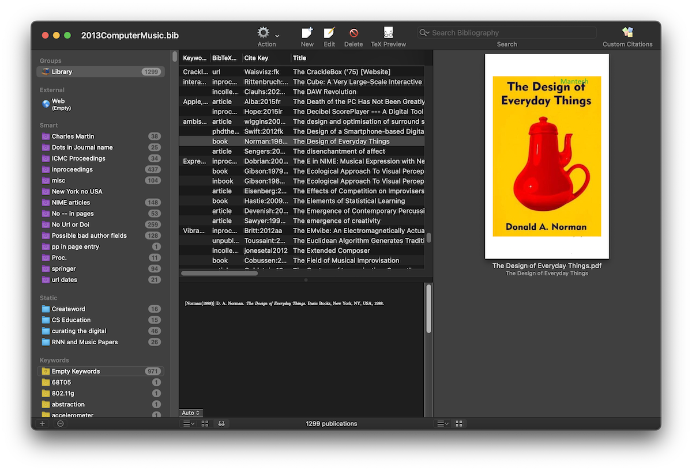
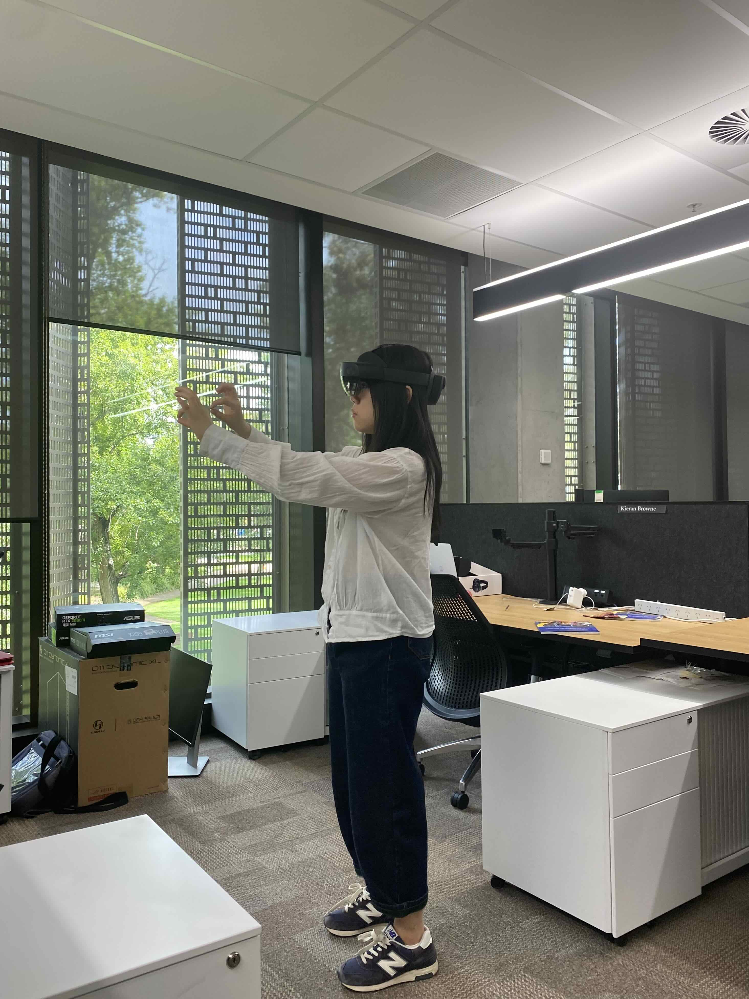
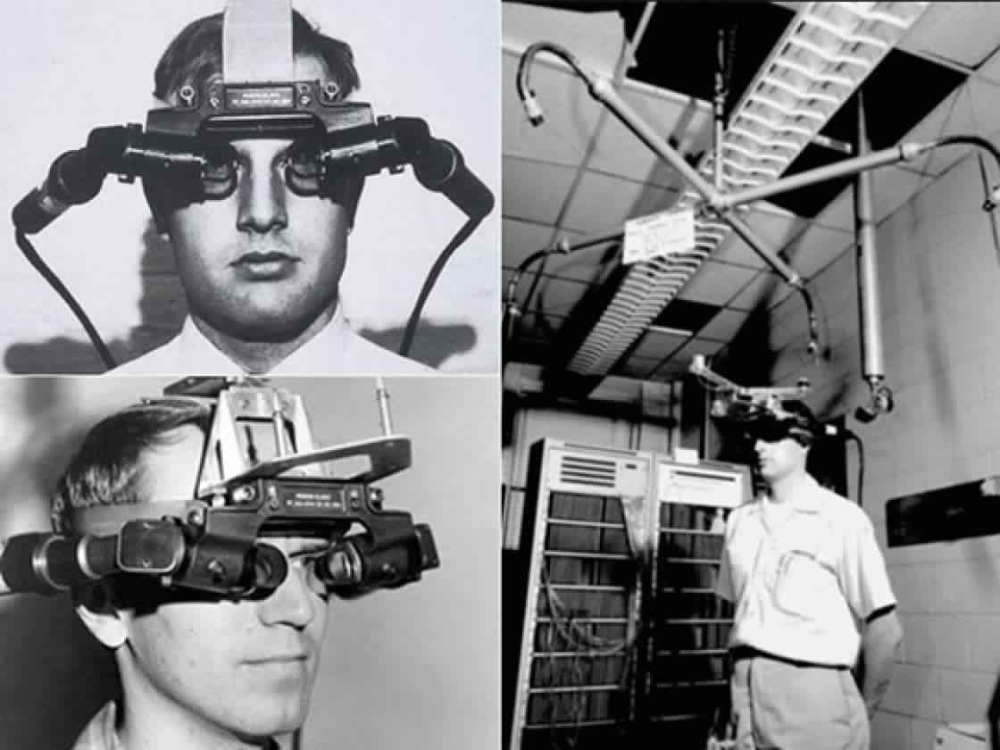
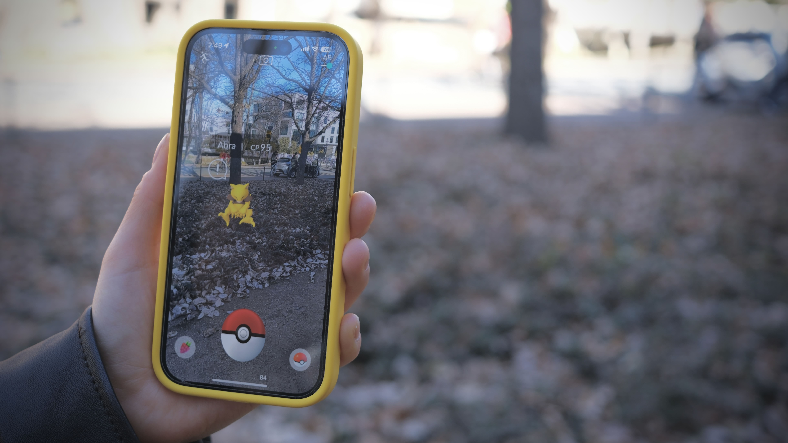
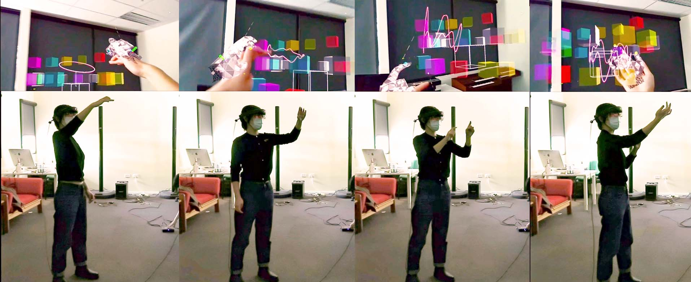

## Announcements

- Assignment 2 template and rubric updated
- Remember 

## Plan for the class

- Research skills (how to use Google Scholar and cite references)
- Overview of the diversity of interfaces.
- Outline key design and research considerations for each interface
- Discuss what is meant by a natural user interface
- Consider which interface is best for a given application or activity

# Research Skills

## Finding a source

## ACM Digital Library

## Citations

## Metadata vs citation format

:::::::::::::: {.columns}
::: {.column width="50%"}
- The metadata for a reference can be used with any citation format.
- Academics often use special tools for storing reference metadata
- Computer scientists tend to use `BibTeX` format
- `BibTeX` is part of the venerable document creation ecosystem (`La`)[`TeX`, originally developed by CS luminary Donald Knuth](https://en.wikipedia.org/wiki/TeX) in the late 70s.
- When using LaTeX to create a document, you can select from different citation for your document (e.g., ACM, IEEE, Chicago, Harvard, APA), and use the same 
:::
::: {.column width="50%"}
```
@inproceedings{adiwangsa-charades:2025,
author = {Adiwangsa, Michelle and Bransky, Karla and Wood, Erika and Sweetser, Penny},
title = {A Game of ChARades: Using Role-Playing and Mimicry with and without Tangible Objects to Ideate Immersive Augmented Reality Experiences},
year = {2025},
isbn = {9798400714863},
publisher = {Association for Computing Machinery},
address = {New York, NY, USA},
url = {https://doi.org/10.1145/3715668.3736382},
abstract = {Using tangible objects for immersive augmented reality (AR) experiences offers various benefits, such as providing a physical means of interacting with virtual objects and enhancing the functionality of everyday objects. However, designing AR experiences with tangible objects presents unique challenges, particularly due to the diverse physical properties that can influence user interactions. In this provocation, we explore effective approaches for ideating such AR experiences, by designing two exergames intended for AR head-mounted displays (HMDs). We found that role-playing and mimicry, both with and without tangible objects, provide valuable benefits in the design of such experiences. Building on this insight, we introduce ChARades, an iterative and playful gamestorming technique that incorporates role-playing and mimicry in both forms, to ideate immersive AR experiences involving tangible objects.},
booktitle = {Companion Publication of the 2025 ACM Designing Interactive Systems Conference},
pages = {440–445},
numpages = {6}
}
```

The metadata entry for @adiwangsa-charades:2025 which is cited using `[@adiwangsa-charades:2025]` in this Markdown document. In LaTeX you would cite it like this: `\cite{adiwangsa-charades:2025}`.
:::
::::::::::::::

## Big BibTeX files

:::::::::::::: {.columns}
::: {.column width="50%"}
Big reference libraries are part of academic work.

- Charles' "main" `.bib` file has ~1300 entries (started in 2013, first year of Charles' PhD!)
- `references.bib` for [this course](https://github.com/smcclab/thirty-nine-hundred-hci/blob/main/references.bib) has about 100 entries.
- Charles uses [BibDesk](https://bibdesk.sourceforge.io) to manage the big file, but usually just VSCode for smaller bibtex libraries.
- Other popular reference managers are Zotero, Mendeley and Endnote.
- Opinion time: Bibdesk is nice because the database is just a text file.
:::
::: {.column width="50%"}

:::
::::::::::::::

## In this class...

:::::::::::::: {.columns}
::: {.column width="60%"}
- Not expecting you to use BibTeX (yet)
- Expecting you to list references in "ACM format".
- ACM format is inspired by APA referencing
    - supports both numerical [1, 2] and author-date (Martin, 2020) referencing.
    - includes _full_ names of authors and publication details for clarity
    - includes DOI as a full URI
- [ACM page](https://www.acm.org/publications/authors/reference-formatting) plain text examples for references to different types of source
- [CSL version](https://github.com/citation-style-language/styles/blob/master/association-for-computing-machinery.csl) (Citation Style Langauge)
- [BST version](https://github.com/borisveytsman/acmart/blob/primary/ACM-Reference-Format.bst) (BibTeX Style)
:::
::: {.column width="40%"}

:::
::::::::::::::

## Rules for this course:

1. all references must exist! (!!!)
2. use ACM format
3. use numerical citation (not author date) -- saves words in your word count
4. all references in your list should be cited in text
5. you have actually read references and that they are relevant to your work
6. at least two references should be _scholarly_ (so not a medium article) and _external_ (so not course lecture notes or textbook)
7. expectation: ✨✨_perfection_✨✨

# Interface Types

:::::::::::::: {.columns}
::: {.column width="60%"}
How would you describe a computer interface?

- graphical, command, speech, ambient, intelligent, tangible, touchless, or natural, etc.

Some interface types are primarily concerned with a function (for example, to be smart such as *smart* phones);

while others focus on the **interaction style** used (e.g., command, graphical or multimedia), 
the **input/output device** used (e.g., pen-based, speech-based, or gesture-based), 
or the **platform being designed** for (for example, tablet, mobile, PC, or wearable).

now with ML algorithms that are intended to recognise faces, objects, and the like 🤖!
  
:::
::: {.column width="40%"}
{width=60%}
:::
::::::::::::::


## Interface Types ++
Let's talk about some main types of interfaces emerged over the past 45 years, loosely in time order.
 <!-- in terms of when they were developed. -->

:::::::::::::: {.columns}
::: {.column width="50%"}
- Command
- Graphical
- Multimedia
- Virtual reality
- Web
- Mobile
- Appliance
- Voice
- Pen
- Touch
- Touchless
:::
::: {.column width="50%" height="90%"}
- Haptic
- Multimodal
- Shareable
- Tangible
- Augmented reality
- Wearables
- Robots and drones
- Brain-computer
- Smart
- Shape-changing
- Holographic
:::
::::::::::::::

## Command-Line Interfaces

:::::::::::::: {.columns}
::: {.column width="50%"}

Type in abbreviated commands (e.g., `ls`),

pressing certain combinations of keys (e.g., `Ctrl + V`),

fixed from the keyboard (e.g., `delete`, `enter`, `esc`) or user defined.

These interfaces have been largely superseded by graphical interfaces such as menus, icons, keyboard shortcuts and pop-up/predictable text commands as part of an application. 

- Though they continue to be useful in using complex software package (e.g., CAD), scripting batch operations, website, and hacking. 
  
:::
::: {.column width="50%"}
{width=60%}
:::
::::::::::::::

## Command-Line Interfaces

> Research and Design Consideration

Back in 1980s, much research investigated command interfaces' optimisation:

- form of the commands such as the use of abbreviations, full names, and familiar names, 
- syntax (e.g., how best to combine different commands), and organisation (e.g., how to structure options),
are examples of some of the main areas that have been investigated (Shneiderman, 1998). 
- Findings showed no universal optimal methods on command naming!

- **Design principle**: labeling/naming the commands should be chosen to be as *consistent* as possible!

## Graphical User Interfaces

:::::::::::::: {.columns}
::: {.column width="50%"}

Interact with a system which information to be presented and represented within a graphical interface. 

- This includes the use of color, typography, and imagery [@mullet1996designing].

- The original GUI was called a WIMP
    - Windows
    <!-- lecture notes for charles -->
    <!-- overcome physical display constraints; enable concurrent task operations. -->
    - Icons
     <!-- objects as part of desktop metaphor; easier to learn and remember. -->
    - Menus
     <!-- support navigation; different styles such as flat lists, drop-down, pop-up, contextual, etc. -->
    - Pointer

- WIMP is still a basic building block for modern GUI design!
  
:::
::: {.column width="50%"}
{width=60%}
:::
::::::::::::::

## Graphical User Interfaces

> Research and Design Consideration

- Window management.
    - enabling fluid movement and rapid attention shifts between windows and displays without distraction. 
    - e.g., keyboard shortcuts and task bars design; auto-fill in online forms.

- Menu design consideration: decide which terms to use for menu options.

- Icon libraries for developer: e.g., [fontawesome.com](fontawesome.com) or [thenounproject.com](thenounproject.com).

## Multimedia

:::::::::::::: {.columns}
::: {.column width="50%"}
A single interface combines different media such as graphics, text, video, sound, and links them together with various forms of interactivity. E.g., Wikipedia.

- better information presentation.
- facilitate rapid access to multiple representations of information.

:::
::: {.column width="50%"}
{width=60%}
:::
::::::::::::::


## Multimedia

- Multimedia has largely been developed for training, educational, and entertainment purposes.
    - Research examines how multimedia can make learning online more engaging and enjoyable.
    - *To what extent do multimedia interfaces improve learning and play?*
    - *What happens when users have unlimited access to diverse media and simulations?*

> Research and Design Consideration

How to encourage users to interact with all aspects of a multimedia app, especially given the preference for watching videos over reading text?

- provide a diversity of hands-on interactivities and simulations
- employ dynalinking, where information depicted in one window explicitly changes in relation to what happens in another [@rogers1996search].

**Design Consideration**: best combine multiple media to support different kinds of tasks?

## Augmented and Virtual Reality

Interfaces can sit on a spectrum between fully virtual and fully real interaction [@milgram-mr:1994].

- The big middle area includes "mixed reality" (MR) interfaces
- Augmented reality usually closer to "real" reality.
- eXtended reality (XR) is a more recent term.

## Augmented Reality

:::::::::::::: {.columns}
::: {.column width="50%"}

The blending of digital content with the
physical world to create an enhanced real-world experience. 

The concept of the AR can be traced back to 1960s with Ivan Sutherland’s development of the first head-mounted three-dimensional display.

:::
::: {.column width="50%"}
{width=60%}
:::
::::::::::::::

## Augmented Reality
:::::::::::::: {.columns}
::: {.column width="60%"}
Modern AR systems have evolved significantly, particularly in types of visual displays and interaction models they support [@speicher2019mixed;@billinghurst-2015-ar-survey]

- see-through, screen-based, project-based.

Another definition: "Spatial Computing" by Simon Greenwold [@greenwold-2003-spatial-computing].

-  *“human interaction with a machine in which the machine retains and manipulates referents to real objects and spaces."*

-  emphasising not only the augmentation of reality but also the meaningful interaction between digital and physical elements.

:::
::: {.column width="40%"}
{width=70%}
{width=70%}

top: AR smartphone game Pokémon Go.
bottom: AR musical instrument *cube*. Yichen Wang 2022.
:::
::::::::::::::

## Virtual Reality

:::::::::::::: {.columns}
::: {.column width="60%"}

The idea emerged in 1970s with the rise of computer-generated graphical simulations.


**Goal**: to create user experiences that feel virtually real when interacting with an artificial environment. 

- stereoscopically displayed image.
- interact with objects through input devices such a joystick within the field of vision.

**Advantage**:

- a higher level of fidelity compared to other graphical interfaces, aka, immersion.
- different viewpoints: first-person perspective, third-person perspective, etc.

:::
::: {.column width="40%"}
{width=70%}
:::
::::::::::::::

## Virtual Reality

:::::::::::::: {.columns}
::: {.column width="60%"}
> Research and Design Consideration

- Support learning and training for numerous skills.

    - driving and pilot training, surgical operations practice.
    — build up skills with lower costs and for potentially dangerous situations.

- Navigation for accessibility, treatment (e.g, mental health) and entertainment.

**Design Consideration**: 

virtual body to enhance the feeling of presence; reduce cybersickness; support natural user experience; the level of realism to target, etc.

:::
::: {.column width="40%"}
{width="100%"}
:::
::::::::::::::

## Website Design


:::::::::::::: {.columns}
::: {.column width="60%"}

Early websites were largely text-based, with hyperlinks to different places or pages of text. 
    
- *"how best to structure information at the interface level to enable users to navigate and access it easily and quickly?"*

It shifts from sole usability to aesthetically pleasing.

- Graphical design becomes critical!

*Fun fact*: 

> Much of the content on a web page is not read. Web designers are “thinking great literature” (or at least “product brochure”), while the viewer's reality is much closer to a “billboard going by at 60 miles an hour”[@krug2014don].


:::
::: {.column width="40%"}
{width="60%"}
:::
::::::::::::::

## Website Design

:::::::::::::: {.columns}
::: {.column width="60%"}
Modern web development toolset:
CSS, HTML, JavaScript, node.js, python, etc.

Key web interface element: breadcrumb navigation - "way finding" on website navigation without losing track.

Design for smartphone or table interaction modality, for smaller-sized displays and for *infinite scrolling*.

> Research and Design Consideration

Three core questions proposed by Keith Instone: *"Where am I? What's here? Where can I go?"* [@veen2000art]


:::
::: {.column width="40%"}
{width="70%"}
{width="100%"}
top: Web Development tools. Source: https://vocal.media/education/web-development-tools.
bottom: A breadcrumb trail on the Best Buy website showing three choices made by the user to get to Smart Lights Source: www.bestbuy.ca
:::
::::::::::::::


## Mobile Device

:::::::::::::: {.columns}
::: {.column width="60%"}
Smartphones, fitness trackers, smartwatches, large-sized tablets on the flight, educational tablets, etc.

These devices have embedded sensors, such as accelerometer for movement detection, thermometer for temperature measurement, and galvanic skin response to measure changes in sweat level.

It can also be a musical instrument such as iPhone magical flute [Ocarina](https://ccrma.stanford.edu/~ge/ocarina/) [@wang2014ocarina]!

A powerful feature of is contextual information access by scanning barcodes in the physical world. It helped a lot during the COVID period.

<!-- I don't understand why this is included in the textbook, feel unnecessary. -->
Another kind of mobile app that has appeared is one that uses customers' online purchasing data.

:::
::: {.column width="40%"}
{width="80%"}

{width="80%"}
:::
::::::::::::::

## Mobile Device

> Research and Design Consideration:

Mobile interfaces require careful design of limited screen and control space, including the selection, placement, and software integration of hardware controls.

Another key concern in mobile display design is ensuring touch targets like buttons and icons are large enough for accurate use by all finger sizes.

A number of other guidelines exist providing advice on how to design interfaces for mobile devices, e.g., [@babich2018mobileux].


## Appliances

:::::::::::::: {.columns}
::: {.column width="60%"}
Machines for everyday use in the home (for example, washing machines, microwave ovens, refrigerators, toasters, bread makers, and smoothie makers).

Some have begun to be connected to the Internet with companion devices, enabling them to be controlled by remote apps.

> Research and Design Consideration

Alan Cooper et al. [@cooper2014face] in their classic book suggest that appliance interfaces require the designer to view them as transient interfaces, where the interaction is short.

Two fundamental design principles: simplicity and visibility. 

:::
::: {.column width="40%"}
{width="50%"}
:::
::::::::::::::

## Voice


## Pen-Based


## Touchscreens

## Touchless

## Haptic Interfaces

## Multimodal

## Shareable

## Tangible

## Wearables

## Robots and Drones

## Brain-Computer Interfaces

## Smart Interfaces

## Shape Changing Interfaces

## Holographic Interfaces

# Natural User Interfaces and Beyond

A natural user interface (NUI) is designed to allow people to interact with a computer in the same way that they interact with the physical world—using their voice, hands, and bodies.


# Which Interface?

> Which one and how do you design it?

- is multimedia better than tangible interfaces for learning? 

- Is voice effective as a command-based interface? 

- Is a multimodal interface more effective than a single media interface? 

- Are wearable interfaces better than mobile interfaces for helping people find information in foreign cities?

-  How does VR differ from AR, and which is the ultimate interface for playing games?  etc.

It depends! 

... the interplay of a number of factors, including type of task, the people using the system, context, reliability, social acceptability, privacy, ethical, and location concerns.


<!-- boilerplate ending -->


## Questions: Who has a question?

:::::::::::::: {.columns}
::: {.column width="60%"}
**Who has a question?**

- I can take _cathchbox_ question up until 2:55
- For after class questions: meet me outside the classroom at the bar (for 30 minutes)
- Feel free to ask about **any aspect of the course**
- Also feel free to ask about **any aspect of computing at ANU**! I may not be able to help, but I can listen.

:::
::: {.column width="40%"}

:::
::::::::::::::

# References {.allowframebreaks}
