## Announcements

- **Assignment 2** is due in two weeks!
- Next **two tutorials** include assignment support baked into the activities.
- Still processing a few queries related to Assignment 1, should be finished soon.
- New **FAQ page** on the course website.
- **Final project** involves thinking about alternative _interfaces_ so this is an important lecture!

**Who has a question about assignment 2?**

## Plan for the class

- Research skills (how to use Google Scholar and cite references)
- Overview of the diversity of interfaces in use and in research!
- A method for looking at any interface: _affordance analysis_ (and you'll try it on your phone)
- Outline key design and research considerations
- A case study: Apple's Newton vs the Palm Pilot (who does the learning?)
- Think about _natural_ user interfaces
- Think about which interface is _best_ for a given application or activity

# Research Skills {background-image="img/2024-seoul-library.jpg" background-size="cover" background-opacity="0.4"}

## Finding a source

- Assignments in this class require you to make independent choices
- Your choices should be backed by a source of knowledge, e.g.,
  - _what_ abilities does a particular animal have?
  - _what_ research plan makes sense for particular interface?
  - _why_ do human-AI interfaces have usability problems?

In scholarly writing, we need to **support** every statement we make.
Support can be: either (1) a citation to a scholarly source _or_ (2) evidence from a study.
**Where do you find these sources?**

## Google Scholar

:::::::::::::: {.columns}
::: {.column width="60%"}

- search engine for scholarly sources
- add more search terms to get more specific
- you can use the "time" selector on the left column to find recent work

::: {.warn-box}
**Careful:**

- Google Scholar indexes anything that _looks_ like scholarly research (e.g., any PDFs on a website in a conference/journal format). Need to use critical thinking to decide whether sources are good quality or not.
- Google Scholar can give you a formatted citation but it may not have all information (e.g., URL, DOI)

:::
:::
::: {.column width="40%"}
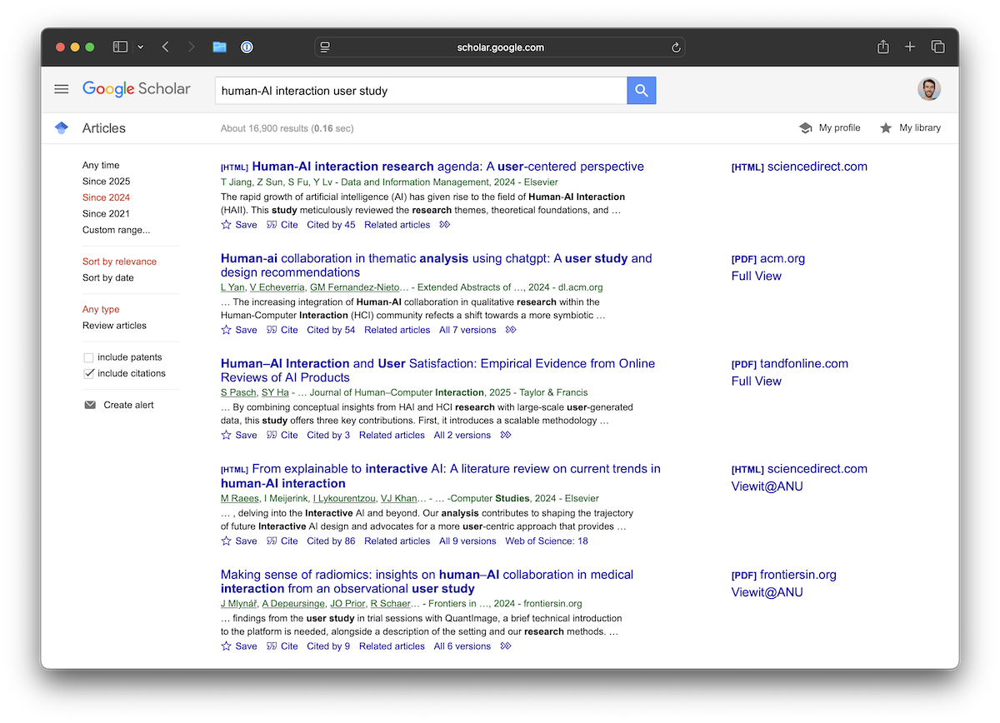
:::
::::::::::::::

## ACM Digital Library

:::::::::::::: {.columns}
::: {.column width="60%"}

- ACM Digital Library archives proceedings of ACM conferences and journals.
- not as good at searching, but will show you only peer-reviewed works

::: {.warn-box}
**Careful:**

- CHI and ACM are centres of HCI research, but there are other non-ACM venues that could be missed.
- ACM DL is open access, some other publishers may require `virtual.anu.edu.au` to access papers.

:::
:::
::: {.column width="40%"}


:::
::::::::::::::

## Citations

In this class, we are going to standardise on numerical citations. When you state something in your text that needs support, you put the citation at the end of the sentence [1].

### References

1. Kazuhiro Wada, Masaya Tsunokake, and Shigeki Matsubara. 2025. Citation-Worthy Detection of URL Citations in Scholarly Papers. Proceedings of the 24th ACM/IEEE Joint Conference on Digital Libraries. Association for Computing Machinery, New York, NY, USA, Article 28, 1–5. <https://doi.org/10.1145/3677389.3702570>

## Writing references in Markdown

Write your reference list as a **numbered Markdown list**, and end every entry with a working link — a DOI written as a URL, or `Retrieved Month Day, Year from <URL>` for web sources:

```markdown
### References

1. Kazuhiro Wada, Masaya Tsunokake, and Shigeki Matsubara. 2025. Citation-Worthy Detection of URL Citations in Scholarly Papers. Proceedings of the 24th ACM/IEEE Joint Conference on Digital Libraries. Association for Computing Machinery, New York, NY, USA, Article 28, 1–5. <https://doi.org/10.1145/3677389.3702570>
```

::: {.warn-box}
**Careful:** don't type `[1]` yourself at the start of a line. `[1]: ...` is Markdown link-definition syntax — the line **vanishes** from the rendered page — and `[1] ...` paragraphs merge together unless you leave blank lines between them. A numbered list avoids both. (A bare `[1]` in your sentences is fine — that's how you cite.)
:::

## Metadata vs citation format

:::::::::::::: {.columns}
::: {.column width="50%"}

- metadata for a reference can be used with any citation format
- academics often use special tools for storing reference metadata
- computer scientists tend to use `BibTeX` format
- `BibTeX` is part of the venerable (`La`)[`TeX` ecosystem originally developed by CS luminary Donald Knuth](https://en.wikipedia.org/wiki/TeX) in the late 70s
- in LaTeX you can select citation format (e.g., ACM, IEEE, Chicago, Harvard, APA)

:::
::: {.column width="50%"}

```
@inproceedings{adiwangsa-charades:2025,
author = {Adiwangsa, Michelle and Bransky, Karla and Wood, Erika and Sweetser, Penny},
title = {A Game of ChARades: Using Role-Playing and Mimicry with and without Tangible Objects to Ideate Immersive Augmented Reality Experiences},
year = {2025},
isbn = {9798400714863},
publisher = {Association for Computing Machinery},
address = {New York, NY, USA},
url = {https://doi.org/10.1145/3715668.3736382},
abstract = {Using tangible objects for immersive augmented reality (AR) experiences offers various benefits, such as providing a physical means of interacting with virtual objects and enhancing the functionality of everyday objects. However, designing AR experiences with tangible objects presents unique challenges, particularly due to the diverse physical properties that can influence user interactions. In this provocation, we explore effective approaches for ideating such AR experiences, by designing two exergames intended for AR head-mounted displays (HMDs). We found that role-playing and mimicry, both with and without tangible objects, provide valuable benefits in the design of such experiences. Building on this insight, we introduce ChARades, an iterative and playful gamestorming technique that incorporates role-playing and mimicry in both forms, to ideate immersive AR experiences involving tangible objects.},
booktitle = {Companion Publication of the 2025 ACM Designing Interactive Systems Conference},
pages = {440–445},
numpages = {6}
}
```

The metadata entry for @adiwangsa-charades:2025 which is cited using `[@adiwangsa-charades:2025]` in this Markdown document. In LaTeX you would cite it like this: `\cite{adiwangsa-charades:2025}`.

:::
::::::::::::::

## Big BibTeX files

:::::::::::::: {.columns}
::: {.column width="50%"}
Big reference libraries are part of academic work.

- Charles' "main" `.bib` file has ~1300 entries (started in 2013, first year of Charles' PhD!)
- `references.bib` for [this course](https://github.com/smcclab/thirty-nine-hundred-hci/blob/main/references.bib) has about 100 entries.
- Charles uses [BibDesk](https://bibdesk.sourceforge.io) to manage the big file, but usually just VSCode for smaller bibtex libraries.
- Other popular reference managers are Zotero, Mendeley and Endnote.
- Opinion time: Bibdesk is nice because the database is just a text file.

:::
::: {.column width="50%"}
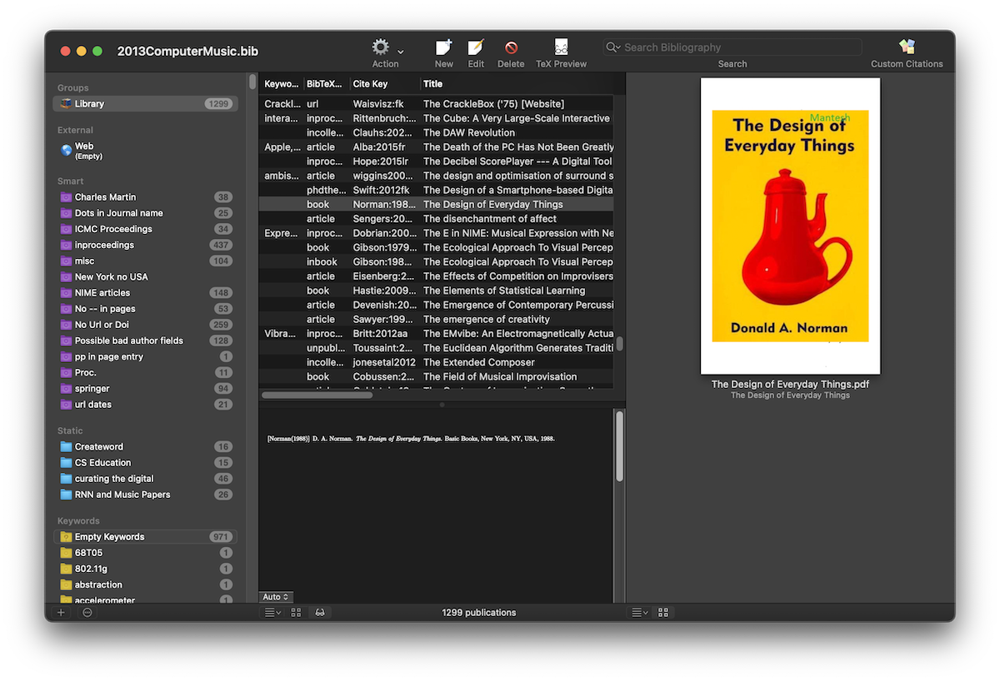
:::
::::::::::::::

## In this class...

:::::::::::::: {.columns}
::: {.column width="60%"}

- Not expecting you to use BibTeX (yet)
- Expecting you to list references in "ACM format".
- ACM format is inspired by APA referencing
  - supports both numerical [1, 2] and author-date (Martin, 2020) referencing.
  - includes _full_ names of authors and publication details for clarity
  - includes DOI as a full URI
- [ACM page](https://www.acm.org/publications/authors/reference-formatting) plain text examples for references to different types of source
- [CSL version](https://github.com/citation-style-language/styles/blob/master/association-for-computing-machinery.csl) (Citation Style Langauge)
- [BST version](https://github.com/borisveytsman/acmart/blob/primary/ACM-Reference-Format.bst) (BibTeX Style)
:::
::: {.column width="40%"}

:::
::::::::::::::

## Rules for this course:

1. all references **must exist!** (!!!) -- every entry ends with a working link (DOI as a URL, or `Retrieved ... from <URL>`) so we can check
2. use ACM format
3. use numerical citation (not author date) -- saves words in your word count
4. write your list as a numbered Markdown list (`1.`, `2.`, ...) under a References heading
5. all references in your list should be cited in text
6. you have actually read references and that they are relevant to your work
7. at least two references should be _scholarly_ (so not a medium article) and _external_ (so not course lecture notes or textbook)
8. expectation: ✨✨*perfection*✨✨

## Who has a question about referencing and finding sources?

::: {.warn-box}
**Careful:** mucking up citations is a risk to lose marks unnecessarily. Easy to do, but looks really bad to markers.
:::

::: {.talk-box}
**Talk:** 🙋🏽‍♀️🤷💁🏻🧠🗣️ Let's clear up some questions now if you have them!
:::

# Understanding Interfaces {background-image="img/interfaces_1_hololens.jpg" background-size="cover" background-opacity="0.35"}

How would you describe a computer interface?

graphical, command, speech, ambient, intelligent, tangible, touch free, natural, etc.

Focus of interface can change:

- **function** e.g., *smart*phones
- **interaction style** used e.g., command, graphical or multimedia
- **input/output device** e.g., pen-based, speech-based, or gesture-based
- **platform** e.g., tablet, mobile, PC, or wearable

## Interaction Types

:::::::::::::: {.columns}
::: {.column width="40%"}
There are many interfaces, but only a handful of ways of _interacting_ with them [@rogers-beyond-hci:2023]:

- Instructing
- Conversing
- Manipulating
- Exploring
- Responding

:::
::: {.column width="60%"}
](img/01_02_conceptualising_interaction_7.jpg){width=30%}
](img/01_02_conceptualising_interaction_8.jpg){width=30%}
](img/01_02_conceptualising_interaction_9.jpg){width=30%}
:::
::::::::::::::

## 45 years of interface types!

:::::::::::::: {.columns}
::: {.column width="50%"}

- Command Line
- Graphical
- Multimedia
- Virtual reality
- Web
- Mobile
- Appliance
- Voice
- Pen
- Touch
- Touchless
:::
::: {.column width="50%"}
- Haptic
- Multimodal
- Shareable
- Tangible
- Augmented reality
- Wearables
- Robots and drones
- Brain-computer
- Smart
- Shape-changing
- Holographic
:::
::::::::::::::

## What does an interface _offer_ you?

:::::::::::::: {.columns}
::: {.column width="55%"}
What are the commonalities of these interfaces? What do they let you do, and how do you know?

- **Affordance**: a relationship between what a person can do and what a thing allows (not _just_ of the interface) [@Norman:2013].
- **Signifier**: the perceivable cue that tells you the affordance is there. Buttons look pressable. A command prompt invites typing. 
- **Constraint**: what the interface stops you doing. Constraints can provide character [@magnusson2010designconstrain] or a specific experience.

:::
::: {.column width="45%"}
@gaver-technology-affordances:1991 organised affordances by whether you can perceive them:

|                   | **possible** | **not possible** |
| ----------------- | ------------ | ---------------- |
| **signified**     | perceptible  | _false_          |
| **not signified** | _hidden_     | (nothing)        |

Hidden: A shortcut you discover.

False: A button that's too small to hit.
:::
::::::::::::::

## Affordance analysis

Pick an interface and a task. Answer five questions:

1. **Interaction type**: are you instructing, conversing, manipulating, exploring or responding? [@rogers-beyond-hci:2023]
2. **Affords**: what does it let you do that other interfaces wouldn't?
3. **Constrains**: what can't you do, or what is it steering you away from?
4. **Hidden**: what's possible but not signified? (What did you only find out by being told?)
5. **False**: what looks possible but isn't? (Things you tried that didn't work?)

Are users responsible for learning and finding affordances, or is the designers job to show them?

This analysis helps us answer "what is the best way for an interface to work?"

## Worked example: the thing in front of me

:::::::::::::: {.columns}
::: {.column width="50%"}
Let's do it live on something easy... 

| Question         | Answer |
| ---------------- | ------ |
| Interaction type |        |
| Affords          |        |
| Constrains       |        |
| Hidden           |        |
| False            |        |
| Who learns?      |        |

:::
::: {.column width="50%"}
::: {.think-box}
**Think:** As I go, think of something you might add to my analysis.  
:::
:::
::::::::::::::

## Activity: one task, three interfaces

:::::::::::::: {.columns}
::: {.column width="60%"}
::: {.push-box}
**Do:** The task is _tell someone you're running late_. Do it three ways on the phone in your hand:

1. **Type** it in your messaging app.
2. **Dictate** it (voice keyboard or assistant).
3. **Choose** it: pick a canned reply, a suggested message, or an emoji from a menu, without writing anything.

In pairs, run the five questions on each. Which was fastest? Which would you choose in a lecture theatre, on a bike, in a hurry, in another language?

Post your most interesting _hidden_ or _false_ affordance to the poll. 15 minutes.
:::
:::
::: {.column width="40%"}
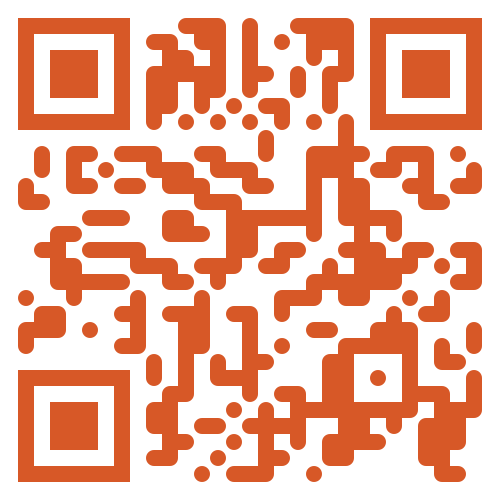
:::
::::::::::::::

## What the activity shows

- The same task is not quite the same task: each interface reshaped what "tell someone" meant (a sentence, a spoken phrase, a location).
- Interaction type predicts a lot: instructing is fast for experts and opaque for novices; manipulating is discoverable and slow; conversing requires a system to know a lot.
- "Best" usually depends on your context and you.

Now the catalogue of interfaces. Every type that follows is a different bundle of affordances and constraints backed by research and design considerations.

## Live demo: one sound engine, three interfaces

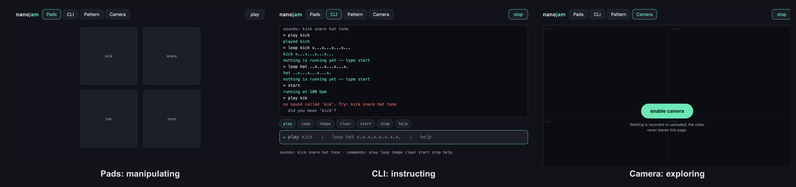{width="100%"}

:::::::::::::: {.columns}
::: {.column width="55%"}
Everything an interface can do is one of six commands to the same engine, so the _only_ thing that changes is the interaction.

- **Pads** (manipulating): tap a sound
- **CLI** (instructing): `loop kick x...x...x...x...`
- **Camera** (exploring): move a hand into a region
:::
::: {.column width="45%"}
::: {.think-box}
**Think:** as each one runs, fill in the five questions. Which is fastest to a first sound? Which is fastest to a _pattern_? What is hidden, and what is false?
:::
:::
::::::::::::::

# The Human-Computer Interface Catalogue

## Command Line Interfaces

:::::::::::::: {.columns}
::: {.column width="50%"}

- Type in commands (e.g., `ls`) or key combos (e.g., `:q!`)
- largely superceded, but useful for complex software (e.g., CAD), scripting, coding
- 1980 research investigated command interfaces' optimisation: 
  - form of the commands (e.g., abbreviations, familiar names)
  - syntax (e.g., how to combine commands), and organisation [@shneiderman-designing-ui:1992].
  - findings showed no universal optimal methods on command naming!

::: {.info-box}
**Design principle:** naming the commands should be as _consistent_ as possible!
:::

:::
::: {.column width="50%"}
{width=100%}
:::
::::::::::::::

## Graphical User Interfaces

:::::::::::::: {.columns}
::: {.column width="50%"}

- Information represented within a graphical interface
- use of color, typography, and imagery [@mullet1996designing]
- interface features abbreviated as WIMP (Windows, Icons, Menus, Pointer)
- window management
  - enabling movement between windows and displays without distraction
  - keyboard shortcuts and task bars design; auto-fill in online forms
- consistent menu design and icon libraries

:::
::: {.column width="50%"}
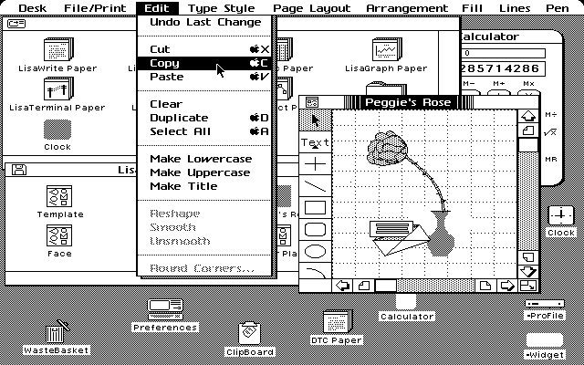{width=90%}
:::
::::::::::::::

## Multimedia

:::::::::::::: {.columns}
::: {.column width="50%"}
One interface combines different media (graphics, text, video, sound...) linked via interactivity

- better information presentation.
- developed for training, educational, and entertainment purposes.

### Research and Design 

- How to encourage interaction with all aspects?
- provide a diversity of hands-on interactivities and simulations
- dynalinking, where changes in one window directly update another [@rogers1996search].
- how to best combine multiple media to support different kinds of tasks?

:::
::: {.column width="50%"}
{width=80%}
:::
::::::::::::::

## Augmented and Virtual Reality

:::::::::::::: {.columns}
::: {.column width="60%"}
Interfaces can sit on a spectrum between fully virtual and fully real interaction [@milgram-mr:1994].

- The big middle area includes "mixed reality" (MR) interfaces
- Augmented reality usually closer to "real" reality.
- eXtended reality (XR) is a more recent term.

### Early AR

- blending of digital content with the physical world to create an enhanced real-world experience
- 1960s: Ivan Sutherland's development of the first head-mounted three-dimensional display

:::
::: {.column width="40%"}
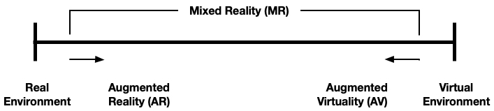


![First augmented reality head-mounted display [@sutherland1967ar].](img/wk11-ivan-sutherland-headset.jpg){width=80%}
:::
::::::::::::::

## Augmented Reality

:::::::::::::: {.columns}
::: {.column width="60%"}

- AR systems have evolved significantly, particularly displays and interaction models [@speicher2019mixed;@billinghurst-2015-ar-survey]
- displays: see-through, screen-based, projection-based.
- "spatial Computing", another way of thinking about it, defined by @greenwold-2003-spatial-computing
  - _“human interaction with a machine in which the machine retains and manipulates referents to real objects and spaces."_
- emphasising not only the augmentation of reality but also the _meaningful_ interaction between digital and physical elements.
:::
::: {.column width="40%"}
  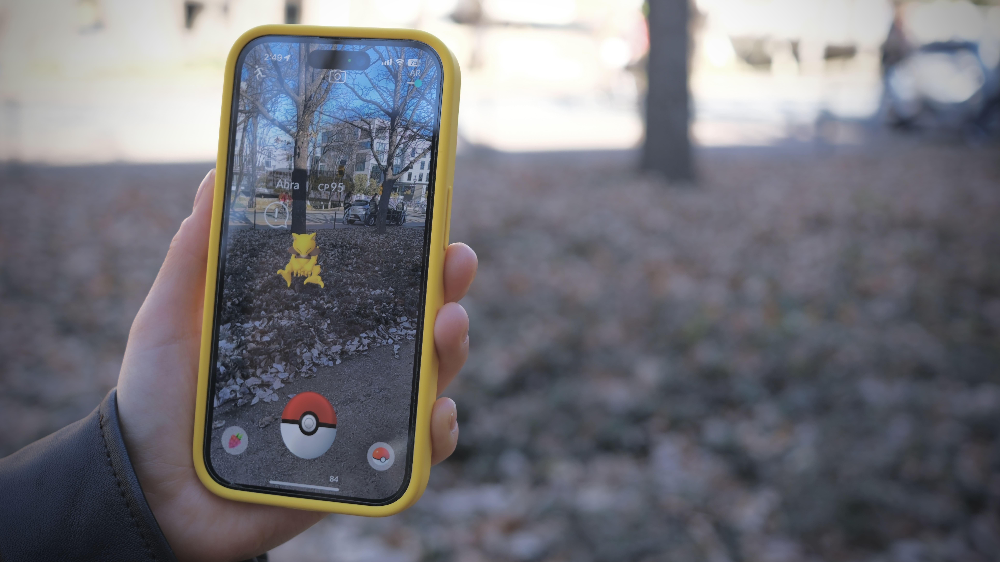{width=80%}

![AR musical instrument [@wang-mobility-space:2023].](img/yichen-cube.jpg){width=80%}
:::
::::::::::::::

## Virtual Reality

:::::::::::::: {.columns}
::: {.column width="60%"}
Emerged in 1970s with computer-generated graphical simulations.

**Goal**: to create user experiences that feel real when interacting with an artificial environment.

- stereoscopically displayed immersive image.
- variety of input devices
- used for: 
  - training (e.g., pilots, medicine, first responders).
  - treatment (e.g, mental health)
  - **entertainment**.

:::
::: {.column width="40%"}
![Avatars for the “We Wait” VR experience [@steed-we-wait:2018]](img/vr-example.png){width=75%}

](img/2024-06-ifire-networked-visualisation-system.png){width="75%"}

:::
::::::::::::::

## Website Design

:::::::::::::: {.columns}
::: {.column width="50%"}

- early websites mainly text-based with hyperlinks (_"how to navigate quickly and easily?"_)
- shift from information usability to aesthetics and visual design.
- breadcrumb nav a key element: helps navigate without losing track
- designs for phones, touch, smaller displays and _infinite scrolling_.
- core questions proposed by Keith Instone: _"Where am I? What's here? Where can I go?"_ [@veen2000art]

> Much of the content on a web page is not read... the viewer's reality is... a “billboard going by at 60 miles an hour” [@krug2014don].

:::
::: {.column width="50%"}
](img/designhistory.jpg){width="50%"}

{width="100%"}

:::
::::::::::::::

## Mobile Device

:::::::::::::: {.columns}
::: {.column width="60%"}
Smartphones, fitness trackers, smartwatches, large-sized tablets on the flight, educational tablets, etc.

- embedded sensors: movement, GPS, bio/fitness sensors.
- affordances led to novel and creative apps e.g.,
  - [Ocarina](https://ccrma.stanford.edu/~ge/ocarina/) [@wang2014ocarina]
  - contextual information access: scanning QR codes
- careful design of limited screen and control space
- touch target size crucial for touch small touch screens
- guidelines exist mobile interface design, e.g., [@babich2018mobileux].

:::
::: {.column width="40%"}
{width="80%"}

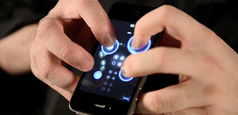{width="80%"}
:::
::::::::::::::

## Appliances

:::::::::::::: {.columns}
::: {.column width="60%"}

- machines for everyday use in the home: washing machines, microwaves, fridges, toasters, blenders
- @cooper2014face: appliance interfaces are _transient_; the interaction is short and infrequent, so nothing can depend on learning
- two design principles: **simplicity** and **visibility**
- compare the two knobs on the microwave with the twenty programs on the washing machine
- internet connections and remote apps: do they help the transient use case, or add a second, hidden interface?
:::
::: {.column width="40%"}
  ](img/microwave-washing-machine-p9RU1DWwasQ-unsplash.jpg){width="70%"}
:::
::::::::::::::

## Smart Interfaces

- not the future: a robot vacuum, a video doorbell and a few smart speakers that (in theory) all talk to each other is an ordinary house in 2026
- context-aware, network-connected, often AI-driven, learning from behaviour (e.g., Nest thermostat)
- the aim is to automate and remove people from the loop (e.g., buildings that manage their own lighting and heating)
- over-automation frustrates: sealed windows, no manual override, an app for everything
- **design question:** should the system _amplify_ what people do, or act _autonomously_ [@landay2019smartinterfaces]? See also human-building interaction [@alavi2019introduction].
- affordance analysis is hard here: most of what a smart home can do is _hidden_

## Voice Interface

:::::::::::::: {.columns}
::: {.column width="60%"}

- interact through spoken language: request information (flight times, weather) or issue commands (play music, set a timer)
- command-based or conversation-based; the system decides how human-like to pretend to be
- design choices: natural conversation vs directed dialogue, can the user interrupt ("barge-in"), synthesised voice or actor, gender, dialect, pronunciation
- dialogue structure, error handling and etiquette are still the core problems [@cohen2004voice]
- early systems earned a reputation for _mishearing_ (still true?)
- almost no perceptible affordances: how do users learn what they can say?
:::
::: {.column width="40%"}
{width="80%"}
:::
::::::::::::::

## Pen-Based

:::::::::::::: {.columns}
::: {.column width="60%"}

- light pens, styluses, or scanners for drawing and writing
- write, draw, select, and move objects on a page or tablet.
- very early use in [CRT displays with lightpen](https://en.wikipedia.org/wiki/Fairlight_CMI)!
- touchscreen versions most common now
- another option: _digital_ paper that scans what you write (IR sensor, special dot pattern on the paper)

_Pens are great!_ We should do more with them.
:::
::: {.column width="40%"}
).](img/pen-based-example.png){width="80%"}
:::
::::::::::::::

## Case Study: Newton vs Palm

:::::::::::::: {.columns}
::: {.column width="60%"}
Two pen-input handhelds, three years apart, with opposite answers.

- **Newton MessagePad (1993):** recognises your ordinary handwriting. The machine learns your style.
- **Palm Pilot (1996):** Graffiti, a one-stroke alphabet from Xerox PARC's Unistrokes [@goldberg-unistrokes:1993]. The user learns a new alphabet.

::: {.talk-box}
**Talk:** 🙋🏽‍♀️🤷💁🏻🗣️ It's 1993. Which design would you go with? What would usability and user experience look like? (2 minutes).
:::
:::
::: {.column width="40%"}
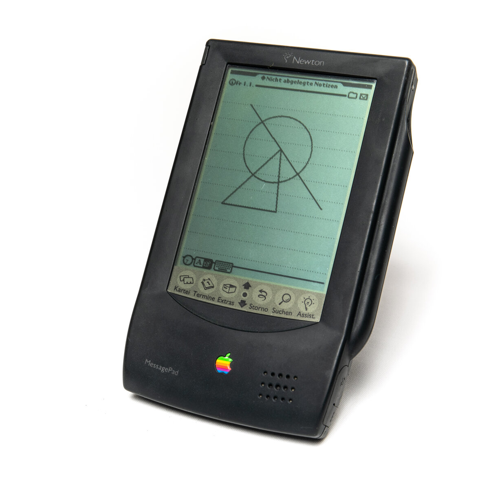{width="46%"} 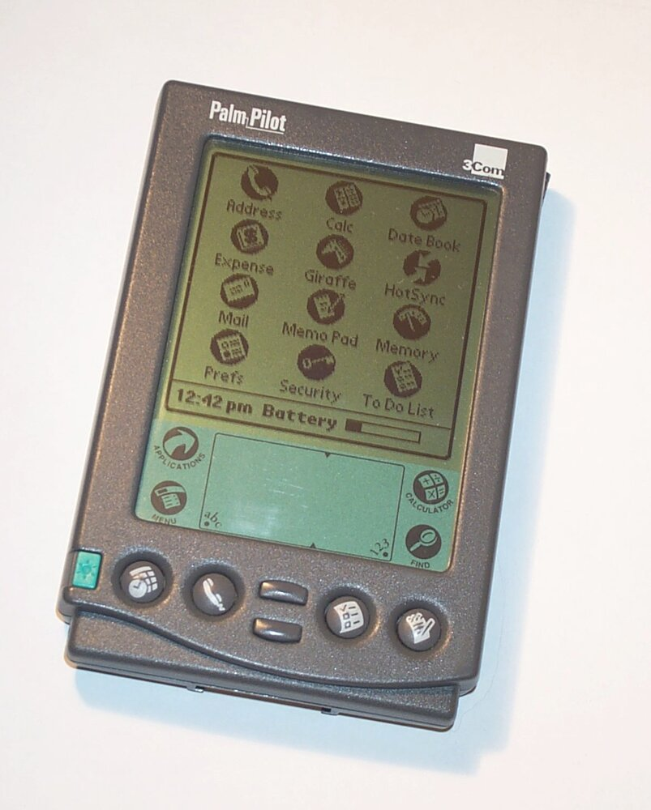{width="40%"}

Newton MessagePad 100 and PalmPilot Professional. Photos: F. Winkelnkemper (CC BY-SA 4.0), Letdorf (CC BY-SA 3.0), Wikimedia Commons.
:::
::::::::::::::

## Newton vs Palm: What Happened

:::::::::::::: {.columns}
::: {.column width="60%"}
Apple's sounds like the better idea, but it's considered a failure.

- Newton misread handwriting often enough to become a joke: a week of Doonesbury ("Catching on?" became "Egg freckles") [@trudeau-doonesbury-newton:1993] and the Simpsons' "Eat up Martha".
- Later models fixed the recognition, but the reputation didn't recover and Apple killed the line in 1998.
- Graffiti: 86% after a minute with the chart, 97% after five minutes, still 97% a week later [@mackenzie-graffiti-usability:1997].

::: {.warn-box}
**Careful:** technical cleverness doesn't always win! Five minutes of learning beat it here.
:::
:::
::: {.column width="40%"}
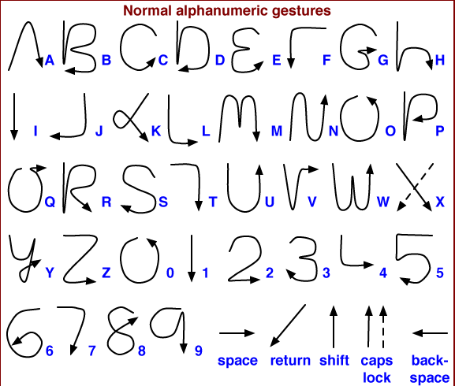{width="68%"}
:::
::::::::::::::

## Newton vs Palm: Concept and Test

::: {.info-box}
**Concept:** "natural" depends on what the user already knows, so it isn't a property of the interface. A bit of learning is fine if it's quick and the result is reliable. 
:::

::: {.success-box}
**Test:** recognition accuracy on unconstrained handwriting measured against user acceptance. A usability test with one dependent variable.
:::

## Touchscreens

:::::::::::::: {.columns}
::: {.column width="60%"}

- common in kiosks, ATMs, checkouts, phones, tablets, computers.
- Now weird to find a _non_ touchscreen.
- **Single-touch** respond to single taps.
- **Multitouch** supports multiple simultaneous touches and gestures like pinching, rotating
- **Multitouch devices** (e.g., smartphones, tablets, tabletops) enable intuitive interactions using one or both hands.
- **Finger gestures** enhance how users interact
- _but_ there are limitations. How do you "undo" on an iPhone?
:::
::: {.column width="40%"}
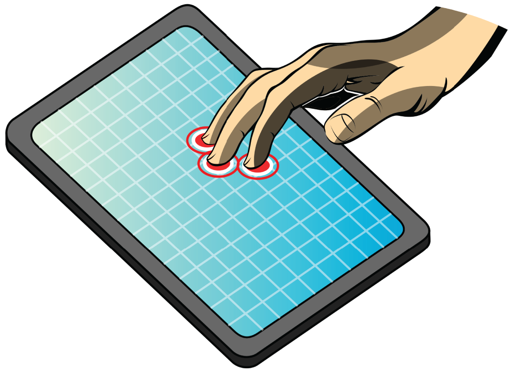{width="80%"}
:::
::::::::::::::

## Touchless

- gestural interaction: moving arms, hands, position to communicate
- track and understand gestures using cameras, sensors and machine learning
- a webcam plus a trained mapping is an instrument: the Wekinator [@fiebrink-wekinator-nime:2009] made that a standard idea.
- Watch David Rose's inspirations for gesture at [vimeo.com/224522900](https://vimeo.com/224522900)

### Research and Design for Touchless Interfaces

- **Gesture recognition challenge:** Systems must detect when a gesture starts and ends, and distinguish intentional gestures (e.g., pointing) from unconscious movements (e.g., hand waving).
- **Gestures as output:** Gestures can also be visualised, such as through avatars mirroring user movements in real time.
- **3D sensing:** Devices with depth cameras (e.g., smartphones, laptops, smart speakers) can capture and respond to gestures in 3D space.
- _Design consideration_: How realistic the avatar or mirrored representation must be for users to feel it's believable and connected to their own gestures?

## Haptic Interfaces

:::::::::::::: {.columns}
::: {.column width="60%"}

- vibration and forces (via actuators) give tactile feedback: phones, watches, game controllers, simulators, clothing
- skill training: the MusicJacket nudges a violinist's bowing arm into position, and _"novice players responded well to vibrotactile cues, adjusting their actions accordingly."_
- remote touch: actuators in clothing can simulate hugs or squeezes
- mid-air haptics: ultrasound creates buttons and sliders that can be felt but not seen (e.g., in-car controls)
- haptic exoskeletons: "Techno Trousers" [@rossiter2018past] that stiffen or relax to assist movement
- perceptible to the hand, invisible to the eye: run the affordance questions on that!
:::
::: {.column width="40%"}
  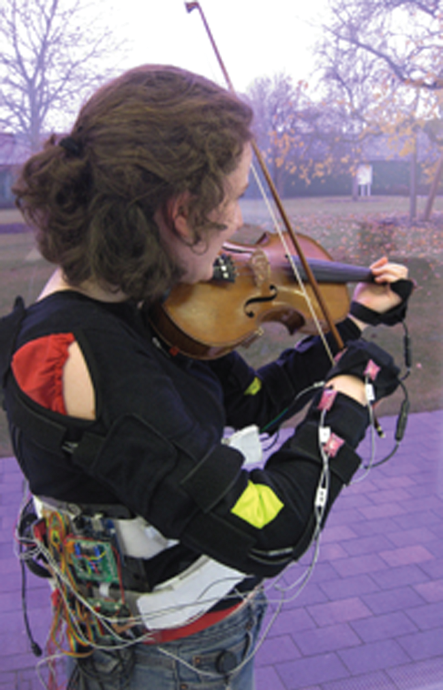{width="50%"}
:::
::::::::::::::

## Multimodal

:::::::::::::: {.columns}
::: {.column width="60%"}

- multiple input/output modalities (e.g., touch, sight, sound, speech) to enhance user interaction [@bouchet2004icare];
- natural, flexible, and expressive interactions, similar the real world interaction experience [@oviatt2017handbook].
- Common combinations: speech and gesture; eye-gaze and gesture; haptic and audio, pen input and speech [@dumas2009multimodal].
- Speech + vision processing is the most common [@deng2004challenges]!
- most researched interaction modes are: speech, gesture, eye-gaze tracking.

Design guidelines, see [@oviatt2017handbook].

:::
::: {.column width="40%"}
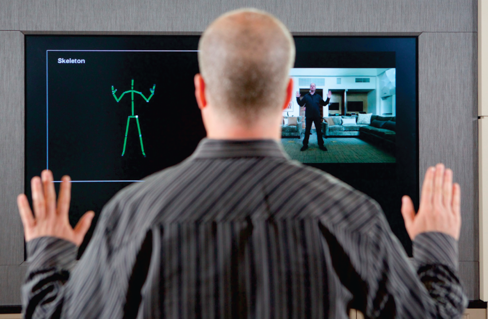{width="90%"}
:::
::::::::::::::

## Shareable

:::::::::::::: {.columns}
::: {.column width="60%"}

Designed for multi-user interaction by co-located groups, unlike single-user PCs, laptops and phones: large wall displays, interactive tabletops.

- everyone can point, touch, and see the same content
- a shared point of reference improves group coordination and participation (Rogers et al., 2009)
- used in museums and galleries; supports group-based learning [@clegg2020community]
- software shareables (Google Docs, Miro) move the same idea to remote collaboration
- **design issues:** display layout, balancing participation, and personal vs shared space
:::
::: {.column width="40%"}
  ![Collaborative Musical Instrument Reactable [@jorda2010reactable]. (source)[https://www.ycam.jp/en/archive/works/reactable/].](img/reactable.jpg){width="80%"}
:::
::::::::::::::

## Tangible

:::::::::::::: {.columns}
::: {.column width="60%"}

- physical objects (bricks, cubes, clay) linked to digital representations through embedded sensors [@ishii1997tangible; @fishkin2004taxonomy]
- manipulating the object triggers sound, light or animation, on the object or around it; or objects on a tabletop drive a simulation (Urp for urban planning)
- artefacts can be lifted, rearranged and handled directly, unlike anything on a screen
- **the design problem is _coupling_:** how does a physical action map to a digital effect, and where does the feedback appear? [@shaer2010tangible; @ullmer2005token]
- prototype with sticky notes and cardboard tokens first
- history and goals: @ullmer2022weaving
:::
::: {.column width="40%"}
![Tangible Bits. [@ishii1997tangible] ](img/tangible-bits.jpg){width="100%"}
:::
::::::::::::::

## Wearables

:::::::::::::: {.columns}
::: {.column width="60%"}

- Digital devices worn on the body -- e.g., smartwatches, fitness trackers, smart glasses, and fashion tech.
- Early wearable computing enabled mobile recording and access to digital info.
- Advances in flexible displays, e-textiles, and physical computing (e.g., Arduino) have made wearables more practical and appealing.
- Items like jackets, jewelry, hats, and shoes have been designed to interact with digital info on the go.
- From convenience design focus to expressive and communicative functions.

:::
::: {.column width="40%"}
![LivingLoom [@zhu2025livingloom].](img/living-loom.jpg){width="80%"}
:::
::::::::::::::

<!-- ## Research and Design for Wearables

- Comfort: Must be light, small, hidden, and wearable without discomfort.
- Hygiene: Should be washable; electronics must be removable and batteries easy to manage.
- Control: Touch, voice, or physical controls need to be intuitive.
- Tech Integration: Combines LEDs, sensors, AR, and more for interactive experiences.
- Stigma Reduction: Fashionable designs help normalize assistive wearables.
- Feedback: Data (e.g., heart rate) must be presented in meaningful, actionable ways—visually, haptically, or multimodally. -->

## Robots and Drones

:::::::::::::: {.columns}
::: {.column width="60%"}
Robots assist in manufacturing, hazardous environments, rescue, and remote exploration with remote controls using cameras and sensors.

Domestic robots help with chores and support elderly or disabled people.

Pet robots like Paro provide companionship and reduce loneliness, especially for dementia patients.

Drones, once military and hobbyist tools, now serve in delivery, entertainment, agriculture, construction, and wildlife monitoring, offering real-time data and automated operations.
:::
::: {.column width="40%"}
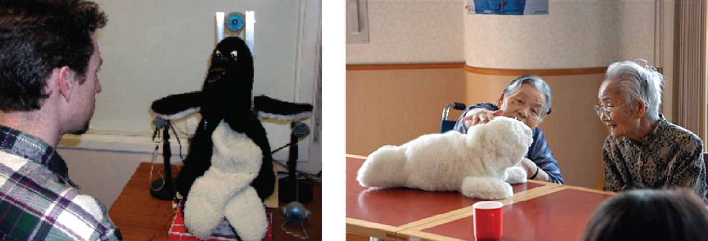{width="100%"}
:::
::::::::::::::

<!-- ## Research and Design with Robots and Drones

- Robots: Ethical questions arise around designing robots with human- or animal-like traits.
- Should they mimic humans emotionally and physically, or clearly appear as machines with functional roles?
- Many prefer “cute pet” robots for their comforting and less unsettling nature. Interaction design also varies between human-like engagement (talking, gesturing) and traditional controls (buttons, dials).
- Drones: Ethical concerns include privacy violations (spying on people or property without consent) and the use of drones as autonomous lethal weapons. There is ongoing debate about banning killer drones to maintain meaningful human control. -->

## Frontier Interfaces

:::::::::::::: {.columns}
::: {.column width="60%"}

Three types where the design knowledge is still forming:

- **Shape-changing:** physical form as input and output [@alexander2018grand]. Do moving rods beat a chart on a screen?
- **Holographic:** the illusion of a 3D person in the room (ABBA Voyage, 2022). How do you interact with a projection, and how do you keep it from being creepy?
- **Brain-computer:** electrodes on the scalp drive a cursor, robot or game; assistive uses (BrainGate) and playful ones (Brainball). Ethics of mind reading get sharper with implants (Neuralink).

More on each in the [interface considerations page](https://smcclab.au/thirty-nine-hundred-hci/resources/06-interface-considerations.html).
:::
::: {.column width="40%"}
  {width="80%"}
:::
::::::::::::::

# Coda {background-image="img/tech-gadget-array-stockcake.jpg" background-size="cover" background-opacity="0.4"}

What makes these interfaces good or bad?

How would you choose what interface to use?

## Natural User Interfaces and Beyond

:::::::::::::: {.columns}
::: {.column width="60%"}
A natural user interface (NUI) is designed to allow people to interact with a computer in the same way that they interact with the physical world—using their voice, hands, and bodies.

- but how natural are NUIs? (the Newton was the "natural" one)

Don Norman [@Norman:2013] argues "natural" depends on a number of factors:

- how much learning is required,
- the complexity of the app or device's interface,
- and whether accuracy and speed are needed.

A gesture may be worth a thousand words; other times a word is worth a thousand gestures. Depends how many functions the system supports.
:::
::: {.column width="40%"}
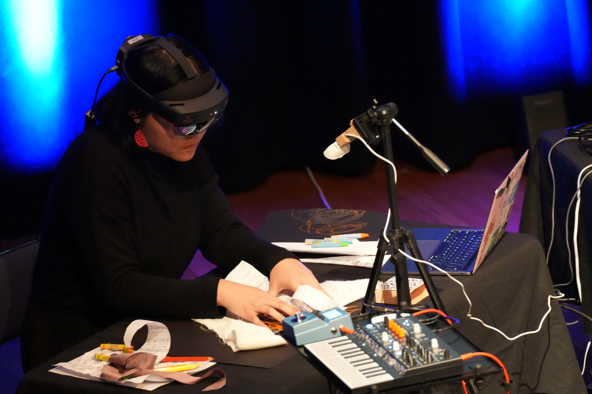{width="100%"}
:::
::::::::::::::

## Which Interface?

Is voice better than touch? Is tangible better than a screen? Is VR the ultimate interface for games?

**It depends!** You already know on what: you ran the five questions on _tell someone you're running late_ and got three different answers from one phone.

- **task:** which one was fastest for you? Would the answer change for a longer message?
- **people:** who has to learn it, and what they already know
- **context:** in a lecture theatre, on a bike, in a hurry, in another language
- **plus** reliability, social acceptability, privacy, ethics, and location

Affordance analysis tells you what an interface _offers_ and to whom. It does not tell you which one is _better_.

::: {.info-box}
**Next week:** which is the better one, and how would we know?
:::

<!-- boilerplate ending -->

## Questions: Who has a question?

:::::::::::::: {.columns}
::: {.column width="60%"}
**Who has a question?**

- I can take _cathchbox_ question up until 2:55
- For after class questions: meet me outside the classroom at the bar (for 30 minutes)
- Feel free to ask about **any aspect of the course**
- Also feel free to ask about **any aspect of computing at ANU**! I may not be able to help, but I can listen.

:::
::: {.column width="40%"}

:::
::::::::::::::

# References {.allowframebreaks}
