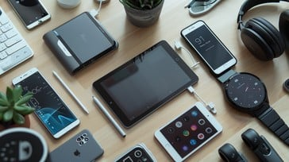
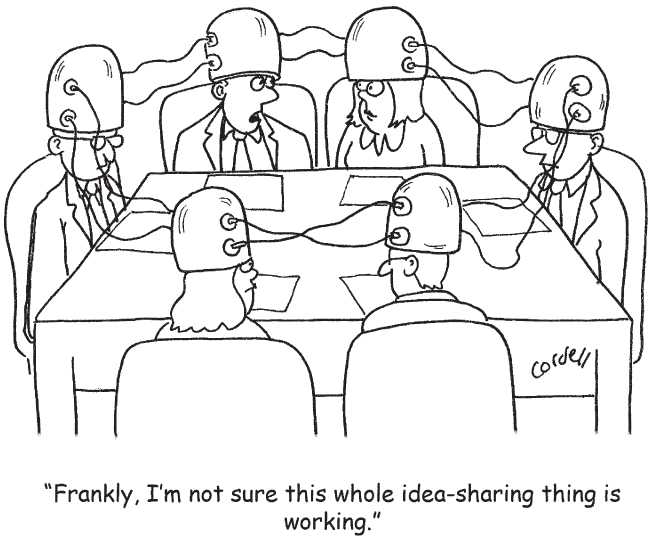
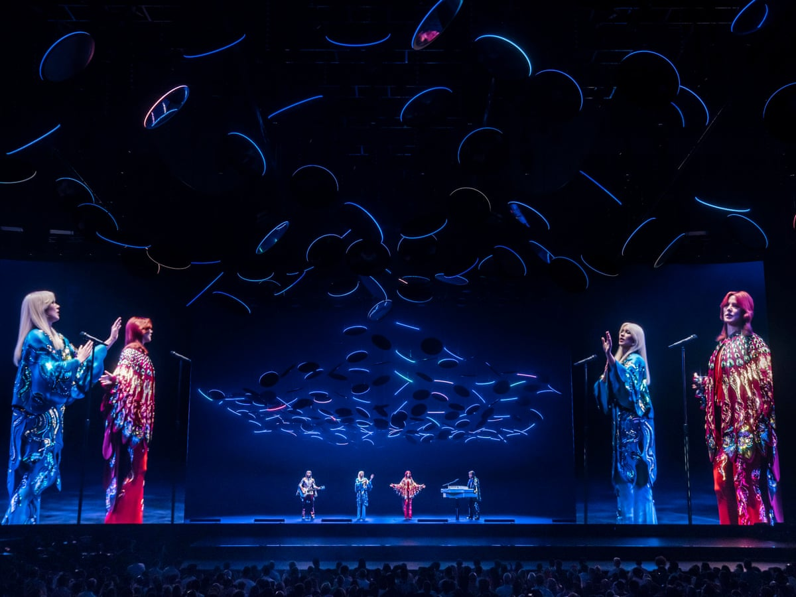

## Announcements

- Assignment 2 template and rubric updated
- Remember 

## Plan for the class

- Research skills (how to use Google Scholar and cite references)
- Overview of the diversity of interfaces.
- Outline key design and research considerations for each interface
- Discuss what is meant by a natural user interface
- Consider which interface is best for a given application or activity

# Research Skills

## Finding a source

## ACM Digital Library

## Citations

## Metadata vs citation format

:::::::::::::: {.columns}
::: {.column width="50%"}
- The metadata for a reference can be used with any citation format.
- Academics often use special tools for storing reference metadata
- Computer scientists tend to use `BibTeX` format
- `BibTeX` is part of the venerable document creation ecosystem (`La`)[`TeX`, originally developed by CS luminary Donald Knuth](https://en.wikipedia.org/wiki/TeX) in the late 70s.
- When using LaTeX to create a document, you can select from different citation for your document (e.g., ACM, IEEE, Chicago, Harvard, APA), and use the same 
:::
::: {.column width="50%"}
```
@inproceedings{adiwangsa-charades:2025,
author = {Adiwangsa, Michelle and Bransky, Karla and Wood, Erika and Sweetser, Penny},
title = {A Game of ChARades: Using Role-Playing and Mimicry with and without Tangible Objects to Ideate Immersive Augmented Reality Experiences},
year = {2025},
isbn = {9798400714863},
publisher = {Association for Computing Machinery},
address = {New York, NY, USA},
url = {https://doi.org/10.1145/3715668.3736382},
abstract = {Using tangible objects for immersive augmented reality (AR) experiences offers various benefits, such as providing a physical means of interacting with virtual objects and enhancing the functionality of everyday objects. However, designing AR experiences with tangible objects presents unique challenges, particularly due to the diverse physical properties that can influence user interactions. In this provocation, we explore effective approaches for ideating such AR experiences, by designing two exergames intended for AR head-mounted displays (HMDs). We found that role-playing and mimicry, both with and without tangible objects, provide valuable benefits in the design of such experiences. Building on this insight, we introduce ChARades, an iterative and playful gamestorming technique that incorporates role-playing and mimicry in both forms, to ideate immersive AR experiences involving tangible objects.},
booktitle = {Companion Publication of the 2025 ACM Designing Interactive Systems Conference},
pages = {440–445},
numpages = {6}
}
```

The metadata entry for @adiwangsa-charades:2025 which is cited using `[@adiwangsa-charades:2025]` in this Markdown document. In LaTeX you would cite it like this: `\cite{adiwangsa-charades:2025}`.
:::
::::::::::::::

## Big BibTeX files

:::::::::::::: {.columns}
::: {.column width="50%"}
Big reference libraries are part of academic work.

- Charles' "main" `.bib` file has ~1300 entries (started in 2013, first year of Charles' PhD!)
- `references.bib` for [this course](https://github.com/smcclab/thirty-nine-hundred-hci/blob/main/references.bib) has about 100 entries.
- Charles uses [BibDesk](https://bibdesk.sourceforge.io) to manage the big file, but usually just VSCode for smaller bibtex libraries.
- Other popular reference managers are Zotero, Mendeley and Endnote.
- Opinion time: Bibdesk is nice because the database is just a text file.
:::
::: {.column width="50%"}

:::
::::::::::::::

## In this class...

:::::::::::::: {.columns}
::: {.column width="60%"}
- Not expecting you to use BibTeX (yet)
- Expecting you to list references in "ACM format".
- ACM format is inspired by APA referencing
    - supports both numerical [1, 2] and author-date (Martin, 2020) referencing.
    - includes _full_ names of authors and publication details for clarity
    - includes DOI as a full URI
- [ACM page](https://www.acm.org/publications/authors/reference-formatting) plain text examples for references to different types of source
- [CSL version](https://github.com/citation-style-language/styles/blob/master/association-for-computing-machinery.csl) (Citation Style Langauge)
- [BST version](https://github.com/borisveytsman/acmart/blob/primary/ACM-Reference-Format.bst) (BibTeX Style)
:::
::: {.column width="40%"}

:::
::::::::::::::

## Rules for this course:

1. all references **must exist!** (!!!)
2. use ACM format
3. use numerical citation (not author date) -- saves words in your word count
4. all references in your list should be cited in text
5. you have actually read references and that they are relevant to your work
6. at least two references should be _scholarly_ (so not a medium article) and _external_ (so not course lecture notes or textbook)
7. expectation: ✨✨_perfection_✨✨

# Interface Types

:::::::::::::: {.columns}
::: {.column width="60%"}
How would you describe a computer interface?

> graphical, command, speech, ambient, intelligent, tangible, touch free, natural, etc.

Focus of interface can change:

- **function** e.g., *smart*phones
- **interaction style** used e.g., command, graphical or multimedia
- **input/output device** e.g., pen-based, speech-based, or gesture-based
- **platform** e.g., tablet, mobile, PC, or wearable

<!-- now with ML algorithms that are intended to recognise faces, objects, and the like 🤖! -->
  
:::
::: {.column width="40%"}
{width=60%}
:::
::::::::::::::


## 45 years of interface types!

:::::::::::::: {.columns}
::: {.column width="50%"}
- Command Line
- Graphical
- Multimedia
- Virtual reality
- Web
- Mobile
- Appliance
- Voice
- Pen
- Touch
- Touchless
:::
::: {.column width="50%"}
- Haptic
- Multimodal
- Shareable
- Tangible
- Augmented reality
- Wearables
- Robots and drones
- Brain-computer
- Smart
- Shape-changing
- Holographic
:::
::::::::::::::

## Command Line Interfaces

:::::::::::::: {.columns}
::: {.column width="50%"}

- Type in commands (e.g., `ls`)
- pressing certain combinations of keys (e.g., `Ctrl + V`)
- fixed from the keyboard (e.g., `delete`, `enter`, `esc`) or user-defined
- largely superseded by graphical interfaces such as menus, icons, predictable text commands 
- still useful for complex software (e.g., CAD), scripting batch operations, coding
- _is chatGPT a CLI?_
  
:::
::: {.column width="50%"}
{width=100%}
:::
::::::::::::::

## Research and Design for CLIs

Back in 1980s, much research investigated command interfaces' optimisation:

- form of the commands such as the use of abbreviations, full names, and familiar names;
- syntax (e.g., how best to combine different commands), and organisation (e.g., how to structure options), are examples of some of the main areas that have been investigated [@scneiderman1992designing].
- Findings showed no universal optimal methods on command naming!

**Design principle**: labeling/naming the commands should be chosen to be as *consistent* as possible!

## Graphical User Interfaces

:::::::::::::: {.columns}
::: {.column width="50%"}

- Information represented within a graphical interface 
- use of color, typography, and imagery [@mullet1996designing]
- interface features abbreviated as WIMP
    - Windows
    <!-- lecture notes for charles -->
    <!-- overcome physical display constraints; enable concurrent task operations. -->
    - Icons
     <!-- objects as part of desktop metaphor; easier to learn and remember. -->
    - Menus
     <!-- support navigation; different styles such as flat lists, drop-down, pop-up, contextual, etc. -->
    - Pointer
- WIMP is still a basic building block for modern GUI design!
  
:::
::: {.column width="50%"}
{width=90%}
:::
::::::::::::::

## Research and Design for GUIs

- Window management.
    - enabling fluid movement and rapid attention shifts between windows and displays without distraction. 
    - e.g., keyboard shortcuts and task bars design; auto-fill in online forms.
- Menu design consideration: decide which terms to use for menu options.
- Icon libraries for developer: e.g., [fontawesome.com](fontawesome.com) or [thenounproject.com](thenounproject.com).

## Multimedia

:::::::::::::: {.columns}
::: {.column width="50%"}
A single interface combines different media such as graphics, text, video, sound, and links them together with various forms of interactivity. E.g., Wikipedia.

- better information presentation.
- facilitate rapid access to multiple representations of information.

:::
::: {.column width="50%"}
{width=80%}
:::
::::::::::::::


## Multimedia

- developed for training, educational, and entertainment purposes. 
- To what extent do multimedia interfaces improve learning and play?
- What happens when users have unlimited access to diverse media and simulations?

### Research and Design Considerations

- How to encourage interaction with all aspects?
- provide a diversity of hands-on interactivities and simulations
- employ dynalinking, where changes in one window directly update another [@rogers1996search].
- how to best combine multiple media to support different kinds of tasks?

## Augmented and Virtual Reality

Interfaces can sit on a spectrum between fully virtual and fully real interaction [@milgram-mr:1994].

- The big middle area includes "mixed reality" (MR) interfaces
- Augmented reality usually closer to "real" reality.
- eXtended reality (XR) is a more recent term.

## Augmented Reality

:::::::::::::: {.columns}
::: {.column width="50%"}
- blending of digital content with the physical world to create an enhanced real-world experience
- 1960s: Ivan Sutherland’s development of the first head-mounted three-dimensional display
:::
::: {.column width="50%"}
![First augmented reality head-mounted display system. Source: [@surtherland1967ar].](img/ivan-sutherland-headset.jpg){width=80%}
:::
::::::::::::::

## Augmented Reality
:::::::::::::: {.columns}
::: {.column width="60%"}
Modern AR systems have evolved significantly, particularly in types of visual displays and interaction models they support [@speicher2019mixed;@billinghurst-2015-ar-survey]

- see-through, screen-based, project-based.

Another definition: "Spatial Computing" by Simon Greenwold [@greenwold-2003-spatial-computing].

-  *“human interaction with a machine in which the machine retains and manipulates referents to real objects and spaces."*

-  emphasising not only the augmentation of reality but also the *meaningful* interaction between digital and physical elements.

:::
::: {.column width="40%"}
{width=80%}
{width=80%}

top: AR smartphone game Pokémon Go.
bottom: AR musical instrument *cube*. Yichen Wang. 2022.
:::
::::::::::::::

## Virtual Reality

:::::::::::::: {.columns}
::: {.column width="60%"}
Emerged in 1970s with the rise of computer-generated graphical simulations.

**Goal**: to create user experiences that feel virtually real when interacting with an artificial environment. 

- stereoscopically displayed image.
- interact with objects through input devices such a joystick within the field of vision.
- higher level of fidelity compared to other graphical interfaces, provides immersion.
- different viewpoints: first-person perspective, third-person perspective, etc.

:::
::: {.column width="40%"}
{width=80%}
:::
::::::::::::::

## Research and Design for Virtual Reality

:::::::::::::: {.columns}
::: {.column width="60%"}
- Support learning and training for numerous skills.
    - driving and pilot training, surgical operations practice.
    - build up skills with lower costs and for potentially dangerous situations.
- Navigation for accessibility, treatment (e.g, mental health) and entertainment.
- virtual body to enhance the feeling of presence; reduce cybersickness; support natural user experience; the level of realism to target, etc.

:::
::: {.column width="40%"}
{width="100%"}
:::
::::::::::::::

## Website Design

:::::::::::::: {.columns}
::: {.column width="60%"}

Early websites were largely text-based, with hyperlinks to different places or pages of text. 
    
- *"how best to structure information at the interface level to enable users to navigate and access it easily and quickly?"*

It shifts from sole usability to aesthetically pleasing.

- Graphical design becomes critical!

*Fun fact*: 

> Much of the content on a web page is not read. Web designers are “thinking great literature” (or at least “product brochure”), while the viewer's reality is much closer to a “billboard going by at 60 miles an hour”[@krug2014don].


:::
::: {.column width="40%"}
{width="50%"}
:::
::::::::::::::

## Website Design

:::::::::::::: {.columns}
::: {.column width="60%"}
Modern web development toolset:
CSS, HTML, JavaScript, node.js, python, etc.

Key web interface element: breadcrumb navigation -- "way finding" on website navigation without losing track.

Design for smartphone or table interaction modality, for smaller-sized displays and for *infinite scrolling*.

> Research and Design Consideration

Three core questions proposed by Keith Instone: *"Where am I? What's here? Where can I go?"* [@veen2000art]

:::
::: {.column width="40%"}
{width="70%"}
{width="100%"}
top: Web Development tools. Source: <https://vocal.media/education/web-development-tools>.
bottom: A breadcrumb trail on the Best Buy website showing three choices made by the user to get to Smart Lights Source: <https://www.bestbuy.ca>.
:::
::::::::::::::


## Mobile Device

:::::::::::::: {.columns}
::: {.column width="60%"}
Smartphones, fitness trackers, smartwatches, large-sized tablets on the flight, educational tablets, etc.

- embedded sensors, such as accelerometer for movement detection, thermometer for temperature measurement, bio/fitness sensors.
- new affordances led to novel and creative apps e.g.,
    - [Ocarina](https://ccrma.stanford.edu/~ge/ocarina/) [@wang2014ocarina]
    - contextual information access: scanning QR codes

:::
::: {.column width="40%"}
{width="80%"}

{width="80%"}
:::
::::::::::::::

## Research and Design: Mobile Interfaces

- careful design of limited screen and control space, including the selection, placement, and software integration of hardware controls.
- ensuring touch targets like buttons and icons are large enough for accurate use by all finger sizes.
- other guidelines exist providing advice on how to design interfaces for mobile devices, e.g., [@babich2018mobileux].


## Appliances

:::::::::::::: {.columns}
::: {.column width="60%"}

- Machines for everyday use in the home (for example, washing machines, microwave ovens, refrigerators, toasters, bread makers, and smoothie makers).
- Some have begun to be connected to the Internet with companion devices, enabling them to be controlled by remote apps.

### Research and Design Consideration

- @cooper2014face suggest that appliance interfaces require the designer to view them as transient interfaces, where the interaction is short.
- Two fundamental design principles: simplicity and visibility. 

:::
::: {.column width="40%"}
{width="50%"}
:::
::::::::::::::

## Voice Interface

:::::::::::::: {.columns}
::: {.column width="60%"}

- lets users interact with apps (e.g., search engines, chatbots, or travel planners) through spoken language
- commonly used to request information (like flight times or weather) or issue commands (e.g., playing music or selecting a movie)
- Voice interfaces rely on command- or conversation-based interaction.
- early speech systems earned a reputation for *mishearing* all too often what a person said (still true?)
:::
::: {.column width="40%"}
{width="60%"}
:::
::::::::::::::

## Applications for Voice Interfaces

- Dictation (e.g., Otter.io, Dragon), faster than typing, accessibility.
- Call routing: Automate customer service; saves costs; needs human fallback when needed.
- Barge-in feature: Lets users interrupt system prompts to speed up interactions.
- Directed dialogue: System asks specific questions; user gives limited responses.
- Flexible input risks: Users may give too much info; guided prompts help keep input manageable.
- Mobile speech apps: Used for voice search, translation (e.g., Siri, Google Translate); enables real-time multilingual conversations.
- Voice assistants: Amazon's Alexa and Google Home offer interactive skills; promote shared family use and entertainment.
- Current limits: Struggles with kids' speech, group speaker recognition, and requires name activation.

## Research and Design for Voice Interaction

:::::::::::::: {.columns}
::: {.column width="60%"}
What conversational mechanisms to use to structure the voice interface and how human-like they should be?

- natural conversation
- system navigation efficiency 
- synthesised voice or voice actor: male, female, neutral, dialect, and pronunciation 

Pros and cons of dialogue structures, error handling, and etiquette remain key for modern voice interfaces [@cohen2004voice].
:::
::: {.column width="40%"}
{width="80%"}
:::
::::::::::::::

## Pen-Based

:::::::::::::: {.columns}
::: {.column width="60%"}
Write, draw, select, and move objects on an interface using light pens or styluses for drawing and writing. 

Appeared in tablets and large displays for item selection, freehand sketching, instead of mouse, touch, or keyboard input. 

It uses infrared light to detect a unique, nonrepeating dot pattern on digital paper, allowing it to identify the page and position, decode movements, and store the data internally.

Handwritten notes can be converted to editable text, making them useful for filling out forms and taking meeting notes.

*Easy and quick annotation just like using paper-based versions!*
:::
::: {.column width="40%"}
{width="80%"}
:::
::::::::::::::

## Touchscreens

:::::::::::::: {.columns}
::: {.column width="60%"}

- **Single-touch** screens are common in kiosks, ATMs, and registers; they detect and respond to single taps.
- **Multitouch** screens support multiple simultaneous touches and gestures like swiping, pinching, and zooming.
- **Multitouch devices** (e.g., smartphones, tablets, tabletops) enable more dynamic and intuitive interactions using one or both hands.
- **Finger gestures** enhance how users interact with digital content—enabling reading, zooming, searching, and content creation.

:::
::: {.column width="40%"}
{width="80%"}
:::
::::::::::::::


## Research and Design for Touchscreens

- Touchscreens are widely used with new ways to interact like swiping, carousels, and virtual keyboards.

- These methods can be less precise or slower than traditional keyboards and mice.

- Multitouch gestures allow more control, like zooming and rotating.

- Gestures can be hard to learn and don’t provide physical feedback.

- Visual and audio cues help make up for the lack of tactile feedback.


## Touchless

- gestural interaction, 
- moving arms and hands to communicate. 
- Research investigates how technology can track and understand gestures using cameras and machine learning.

Watch David Rose's inspirations for gesture at [vimeo.com/224522900](https://vimeo.com/224522900).

Surgical use: Surgeons need sterile, touchless interaction in operating rooms; gesture systems (e.g., using Microsoft Kinect) allow control of medical images without touching surfaces.

Car dashboards: Vehicles like BMW's iDrive use hand gestures (e.g., rotating a finger) for functions like volume control, detected by 3D cameras.

Gesture safety: Gestures in cars are designed and tested to ensure driver safety and minimal distraction.

Touchless Computing: MotionInput is a webcam-based system allowing gesture interaction with a PC using hands, head, or body—no special hardware needed.

Accessibility and simplicity: Unlike earlier systems (e.g., Kinect), MotionInput works with standard laptop webcams and microphones.

## Research and Design for Touchless Interfaces

- Gesture recognition challenge: Systems must detect when a gesture starts and ends, and distinguish intentional gestures (e.g., pointing) from unconscious movements (e.g., hand waving).

- Gestures as output: Gestures can also be visualised, such as through avatars mirroring user movements in real time.

- 3D sensing: Devices with depth cameras (e.g., smartphones, laptops, smart speakers) can capture and respond to gestures in 3D space.

- *Design consideration*: How realistic the avatar or mirrored representation must be for users to feel it's believable and connected to their own gestures?

## Haptic Interfaces

:::::::::::::: {.columns}
::: {.column width="60%"}
Haptic interfaces use vibration and forces (via actuators) to provide tactile feedback, which can be embedded in clothing or mobile devices such as smartphones and watches.

Gaming consoles and driving simulators use haptics to enhance realism.

Vibrotactile feedback can simulate remote physical communication, like hugs or squeezes, using actuators in clothing.

Haptics can also be used for skill training, such as learning musical instruments.
E.g., MusicJacket helps violin learners with posture and bowing by giving vibrational cues.

*novice players responded well to vibrotactile cues, adjusting their actions accordingly.*
:::
::: {.column width="40%"}
{width="50%"}
:::
::::::::::::::

## Haptic Interfaces

:::::::::::::: {.columns}
::: {.column width="60%"}

Ultrahaptics uses ultrasound to create 3D shapes and textures in midair that can be felt but not seen.

- It simulates touch-based interfaces (e.g., buttons, sliders) that appear in midair.

- In automotive interfaces to replace physical controls with invisible, tactile controls: adjust volume or change radio stations.

Haptic Exoskeletons: bedded into wearable exoskeletons, inspired by “Techno Trousers” from *Wallace and Gromit* [@rossiter2018past].

- Graphene parts are used to stiffen or relax the trousers to assist movement.

Application in mobility assistance, fitness.


:::
::: {.column width="40%"}
{width="30%"}
:::
::::::::::::::

## Research and Design for Haptic Interfaces

In gaming, smartphones, and wearables for user experience, stimulating touch, strokes, prods, or buzzes.

Effective in sensory-motor skill training (e.g. sports, musical instruments).

Vibrations on snowboarders led to faster reaction times than verbal instructions [@spelmezan2009tactile].

<!-- - Used in posture trainers and fitness trackers to alert users (e.g. slouching, inactivity). -->

*Design consideration*: actuator placement, type and timing of touch, intensity and frequency of feedback.

*Continuous feedback is ineffective due to annoyance and habituation!*

- Intermittent buzzes is more effective for grabbing attention.

Different buzz patterns can signal different events (e.g. light tap = rain, heavy tap = thunder); e.g., Apple iOS 16 added haptic typing.


## Multimodal

:::::::::::::: {.columns}
::: {.column width="60%"}

Use multiple input/output modalities (e.g., touch, sight, sound, speech) to enhance user interaction [@bouchet2004icare]; for more natural, flexible, and expressive interactions, similar the real world interaction experience [@oviatt2017handbook].

Common combinations: speech and gesture; eye-gaze and gesture; haptic and audio, pen input and speech [@dumas2009multimodal].

Speech + vision processing is the most common [@deng2004challenges]!

Multisensor inputs (e.g., eye gaze, facial expressions) to detect attention or intent; body movement tracking to mimic movements.

E.g., Kinect for Xbox — combined RGB camera, depth sensor, and microphones for real-time gesture and voice recognition.

<!-- Kinect created a real-time avatar by tracking 3D joint positions, allowing users to see themselves and interact through motion. -->

:::
::: {.column width="40%"}
{width="90%"}
:::
::::::::::::::

## Research and Design for Multimodal Interfaces

:::::::::::::: {.columns}
::: {.column width="60%"}

Multimodal systems **must** recognise multiple user behaviors: handwriting, speech, gestures, eye movements, and body movements.

These systems are more complex to build and calibrate than single modality systems.

The most researched interaction modes are: speech, gesture, eye-gaze tracking.

- *What are the actual benefits of combining multiple input/output modalities?*
- Is natural human-like interaction (e.g., talk + gesture) effective when applied to computer interaction?

Design guidelines, see [@oviatt2017handbook].

:::
::: {.column width="40%"}
{width="90%"}
:::
::::::::::::::

## Shareable

:::::::::::::: {.columns}
::: {.column width="60%"}

Designed for multi-user interaction, unlike typical single-user devices (PCs, laptops, phones).

Support multiple simultaneous inputs by co-located groups. E.g., large wall displays (e.g., SmartBoards); interactive tabletops for users to interact using fingertips on a shared surface.

- Charles discusses the example of Reactable.

Advantage:
- A large shared space for group collaboration.

- Allow simultaneous interaction, unlike working on a single PC.

- Users can point, touch, and see the same content.

- This creates a shared point of reference, enhancing group coordination and participation (Rogers et al., 2009).


:::
::: {.column width="40%"}
![Collaborative Musical Instrument Reactable [@jorda2010reactable]. Srouce: <https://www.ycam.jp/en/archive/works/reactable/>.](img/reactable.jpg){width="80%"}
:::
::::::::::::::

## Shareable

:::::::::::::: {.columns}
::: {.column width="60%"}

- tabletop systems used in museums and galleries.
- support interactive, group-based learning [@clegg2020community].
- some shareable interfaces are software platforms for remote collaboration.
- Early example: [ShRedit](https://cacm.acm.org/practice/now-that-we-can-write-simultaneously-how-do-we-use-that-to-our-advantage/) (1990s) – supported shared document editing.
- Google Docs, Microsoft Excel, Miro, Canva, etc.

### Research and Design Consideration

from single-device interactions (e.g.,handwriting) to cross-device collaboration; key design issues around display layout, participation, and balancing personal and shared spaces.
:::
::: {.column width="40%"}
{width="80%"}
:::
::::::::::::::


## Tangible

:::::::::::::: {.columns}
::: {.column width="60%"}
Link physical objects (bricks, cubes, clay) with digital representations through embedded sensors [@ishii1997tangible; @fishkin2004taxonomy] 

Manipulating objects triggers digital effects like sounds, animations, or lights, either on the object or in surrounding media (e.g., Tangible Bits [@ishii1997tangible]).

Some use physical models on digital surfaces (tabletops), where moving objects influences digital events (e.g., Urp for urban planning).

Physical artifacts can be lifted, rearranged, and manipulated directly, distinguishing from purely screen-based or mobile interfaces.


:::
::: {.column width="40%"}
![Tangible Bits. [@ishii1997tangible] ](img/tangible-bits.jpg){width="100%"}
:::
::::::::::::::

## Tangible

Common technologies: RFID tags, embedded sensors, digital tabletops that detect object movement.

Applications include learning, design, play, collaboration (e.g., urban planning tools, Tinkersheets for warehouse logistics).

<!-- Tangible computing involves multiple coordinated devices without fixed input sequences, exploiting object affordances to guide interaction [@dourish2001action]. -->

<!-- Physical and digital can be combined and explored in ways that support creativity, insight, and collaborative problem-solving [@marshall2003conceptualising]. -->

Allow multiple users to work together by physically moving and arranging objects in different ways.

Educational toolkits like SAM Labs, MicroBit, and MagicCubes help children learn STEM by linking physical actions to digital outcomes.

<!-- Research shows these kits foster discovery learning, exploration, and collaboration, including among children with cognitive disabilities . -->

Tools like Code Jumper make programming accessible for children with visual impairments using tactile, physical code blocks [@morrison2020torino].

## Research and Design for Tangible Interfaces

- Conceptual frameworks e.g., [@shaer2010tangible; @ullmer2005token; @fishkin2004taxonomy] identify what makes tangible interfaces unique.
- A main design challenge is deciding how to link physical actions to digital effects - the notion of *coupling*.
- Designers must choose the types and where digital feedback appears (e.g., on the object, beside it, or elsewhere), based on the interface’s purpose. E.g., learning? entertainment?
- Choosing the right physical artifacts (e.g., cubes, tokens)to support natural and hands-on interaction.
- Simple materials like sticky notes or cardboard tokens can be used to link physical actions to digital responses.
- history and goals of tangible interfaces, see: @ullmer2022weaving

## Wearables

:::::::::::::: {.columns}
::: {.column width="60%"}

- Digital devices worn on the body -- e.g., smartwatches, fitness trackers, smart glasses, and fashion tech.
- Early wearable computing enabled mobile recording and access to digital info.
- Advances in flexible displays, e-textiles, and physical computing (e.g., Arduino) have made wearables more practical and appealing.
- Items like jackets, jewelry, hats, and shoes have been designed to interact with digital info on the go.
- From convenience design focus to expressive and communicative functions.

:::
::: {.column width="40%"}
![LivingLoom [@zhu2025livingloom].](img/living-loom.jpg){width="80%"}
:::
::::::::::::::

## Research and Design for Wearables

- Comfort: Must be light, small, hidden, and wearable without discomfort.
- Hygiene: Should be washable; electronics must be removable and batteries easy to manage.
- Control: Touch, voice, or physical controls need to be intuitive.
- Tech Integration: Combines LEDs, sensors, AR, and more for interactive experiences.
- Stigma Reduction: Fashionable designs help normalize assistive wearables.
- Feedback: Data (e.g., heart rate) must be presented in meaningful, actionable ways—visually, haptically, or multimodally.

## Robots and Drones

:::::::::::::: {.columns}
::: {.column width="60%"}
Robots assist in manufacturing, hazardous environments, rescue, and remote exploration with remote controls using cameras and sensors.

Domestic robots help with chores and support elderly or disabled people.

Pet robots like Paro provide companionship and reduce loneliness, especially for dementia patients.

Drones, once military and hobbyist tools, now serve in delivery, entertainment, agriculture, construction, and wildlife monitoring, offering real-time data and automated operations.
:::
::: {.column width="40%"}
{width="100%"}
:::
::::::::::::::

## Research and Design with Robots and Drones

- Robots: Ethical questions arise around designing robots with human- or animal-like traits. 
- Should they mimic humans emotionally and physically, or clearly appear as machines with functional roles? 
- Many prefer “cute pet” robots for their comforting and less unsettling nature. Interaction design also varies between human-like engagement (talking, gesturing) and traditional controls (buttons, dials).
- Drones: Ethical concerns include privacy violations (spying on people or property without consent) and the use of drones as autonomous lethal weapons. There is ongoing debate about banning killer drones to maintain meaningful human control.

## Brain-Computer Interfaces

:::::::::::::: {.columns}
::: {.column width="60%"}

Create a link between brain activity and external devices (e.g., cursor, robot, game controller).

Detect neural signals via electrodes in headsets placed on the scalp.

Assist or augment cognitive and motor functions—especially for people with disabilities (e.g., BrainGate lets paralyzed users type via thought).

...and *entertainment* -- e.g., Brainball, where relaxation controls a ball’s movement.

Aim to transfer mental states (e.g., “focused,” “relaxed”) between people via stimulation.

**Ethical concerns** arise around mind reading and mental state manipulation, especially with companies like Neuralink pursuing direct brain implants.

:::
::: {.column width="40%"}
{width="80%"}
:::
::::::::::::::

## Research and Design Brain-Computer Interfaces

- NextMind developed a noninvasive BCI for real-time device control using thoughts.
- Raises ethical concerns about mental privacy: thoughts could become machine-readable and possibly shared without consent.
- Accuracy concern: systems might misinterpret thoughts or intentions.
- Gaming use is playful, but deep mind reading may feel invasive or socially unacceptable.
- For assistive use, a key design challenge is how to arrange on-screen elements (e.g., letters) to ensure easy and accurate selection.
- AI and predictive text can improve communication efficiency for users with severe motor impairments.

## Smart Interfaces

Smart devices (phones, homes, appliances) are context-aware, often AI-powered, and network-connected, learning from user behavior (e.g., Nest thermostat).

Aim is to automate tasks, improve efficiency, and reduce human error—often by removing humans from the loop (e.g., smart buildings managing lighting/heating).

However, over-automation can frustrate users, limiting control (e.g., sealed windows, restricted manual overrides).

### Research & Design Considerations

Human–Building Interaction (*new idea*) focuses on user experience in smart environments, prioritizing human needs, values, and goals [@alavi2019introduction].

Designers must decide whether smart tech should amplify human actions or act autonomously [@landay2019smartinterfaces].

## Shape Changing Interfaces

:::::::::::::: {.columns}
::: {.column width="60%"}
- Use physical form changes as input/output (e.g., 3D bar charts moving rods to show data) [@alexander2018grand].
- Enable tactile interaction beyond screens (e.g., inFORM’s shape of a car).
- Include data sculptures, tactile maps, and “physicalisations”.
- Make data more relatable by embedding it in everyday contexts (e.g., CO2 spikes during cheering).

### Research and Design Consideration

- Do they improve data understanding and engagement?
- Are they better than 2D/3D digital charts for health monitoring?
- Size of rod grids; number of cubes for easy learning and recognition.
:::
::: {.column width="40%"}
{width="80%"}
:::
::::::::::::::


## Holographic Interfaces

:::::::::::::: {.columns}
::: {.column width="60%"}

Create the illusion of a 3D person being present through taking advantage of the human perceptual system. 

The projection and display technology have achieved some convincing results (e.g., ABBA Voyage in London). 

> Research and Design Consideration

-  A lot research conducted in the tech industry exploringhow to represent people in virtual spaces in ways that feel natural, comfortable, engaging, and not creepy.

- Design considerations include hologram size and how users can interact and communicate with projections in their space.

:::
::: {.column width="40%"}
{width="100%"}
:::
::::::::::::::


# Natural User Interfaces and Beyond

:::::::::::::: {.columns}
::: {.column width="60%"}
A natural user interface (NUI) is designed to allow people to interact with a computer in the same way that they interact with the physical world—using their voice, hands, and bodies.

- but how natural are NUIs?

Don Norman [@Norman:2013] argues "natural" depends on a number of factors:

 - how much learning is required, 

 - the complexity of the app or device's interface, 

 - and whether accuracy and speed are needed. 

A gesture may worth a thousand words; other times a word is worth a thousand gestures. It depends on how many functions the system supports.

:::
::: {.column width="40%"}
{width="100%"}
:::
::::::::::::::

# Which Interface?

> Which one and how do you design it?

- is multimedia better than tangible interfaces for learning? 
- Is voice effective as a command-based interface? 
- Is a multimodal interface more effective than a single media interface? 
- Are wearable interfaces better than mobile interfaces for helping people find information in foreign cities?
-  How does VR differ from AR, and which is the ultimate interface for playing games?  etc.

It depends! 

... the interplay of a number of factors, including type of task, the people using the system, context, reliability, social acceptability, privacy, ethical, and location concerns.


<!-- boilerplate ending -->


## Questions: Who has a question?

:::::::::::::: {.columns}
::: {.column width="60%"}
**Who has a question?**

- I can take _cathchbox_ question up until 2:55
- For after class questions: meet me outside the classroom at the bar (for 30 minutes)
- Feel free to ask about **any aspect of the course**
- Also feel free to ask about **any aspect of computing at ANU**! I may not be able to help, but I can listen.

:::
::: {.column width="40%"}

:::
::::::::::::::

# References {.allowframebreaks}
