 
## Announcements

- assignment 2 due next Monday
- remember to use your tutorial time for meeting research clusters and collecting data.
- remember to follow the step-by-step guide.
- go fork [the repo!](https://gitlab.cecs.anu.edu.au/comp3900/2025/comp3900-2025-user-research)

**Markdown Formatting Check:** There is a CI/CD job that checks your markdown formatting using the [`markdownlint-cli`](https://github.com/igorshubovych/markdownlint-cli) tool. Syntax rules are listed [here](https://github.com/DavidAnson/markdownlint/blob/main/doc/Rules.md) in our script, rules `MD013` and `MD041` are disabled. All other rules are active.

## Plan for the class

- research questions
- about evaluation
- types of evaluation
- planning evaluations
- evaluation by inspection

# Research Questions

For the final project you will have to choose a research question to explore.

This is a clear question (one sentence) that guides the design of your research project. 

RQs have been called [survival beacons](https://lennartnacke.com/how-to-choose-a-good-research-question/#research-questions-are-survival-beacons) because they should guide all aspects of our research plans.

How do we choose a research question and write it clearly?

Important skill for any research activity.

## Four steps to write a research question

:::::::::::::: {.columns}
::: {.column width="60%"}
This framework inspired by Lennart Nacke, [everybody's favourite HCI writing coach on LinkedIn](<https://lennartnacke.com/how-to-choose-a-good-research-question/#research-questions-are-survival-beacons>).

1. Outline a broad area of interest
2. Identify a problem that needs solving
3. Justify solving this problem
4. Write the question

To be clear, a research question starts with a question word (what, how, why, can, do, should) and ends with a question mark. It can just be one sentence.

Seems too easy... let's try it together.
:::
::: {.column width="40%"}
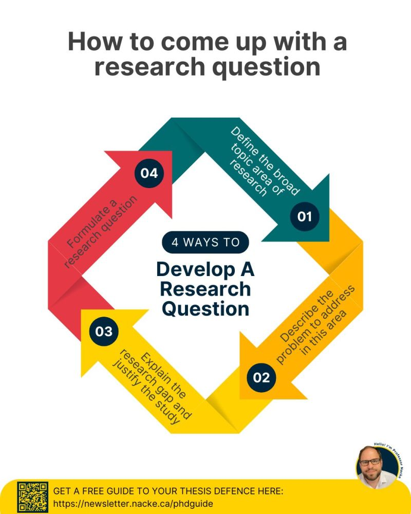{width=70%}
:::
::::::::::::::

## A worked research question example

1. haptic wearable interfaces.
2. keeping focussed in complicated meetings
3. lack of awareness in meeting can lead to poor work performance and embarrassment
4. here we go:

> What effects can a haptic wearable interface have on lack of awareness during meetings and later work performance?

Encodes the broad area, the problem, the justification, the context, etc.

## Research Question Bingo

<!-- Could try a dual spinning wheel research question writing task: https://spinthewheel.io/wheels/wlzQX7r6A5GpkW4MExxW -->

:::::::::::::: {.columns}
::: {.column width="50%"}
**Interfaces:**

1. haptic feedback gloves
2. AR/VR headset
3. e-textile clothing
4. voice assistant
5. gesture recognition
6. smart headphones
7. ambient light display
8. wearable plants
9. eye-tracking interface
10. multi-touch table
:::
::: {.column width="50%"}
**Problems to Solve:**

1. family meal planning
2. language learning while commuting
3. caring for houseplants
4. focus during remote work
5. medication schedules
6. teaching kids about conservation
7. organising hobby collections
8. non-verbal communication
9. practicing music in small spaces
10. tracking community events
:::
::::::::::::::

## Activity: Write a Research Question

:::::::::::::: {.columns}
::: {.column width="60%"}
Let's write a research question!

> Together, let's [Spin the wheels](https://spinthewheel.io/wheels/6QtocP77prRkdHZ66s0hcz0xJmU9MA==) to decide on a broad area and a problem.

Then, decide on a "justification" and write a research question.

Remember that the RQ should include the broad area, the problem, and the justification. 

Use the poll everywhere link to suggest research questions and vote on the best ones.

**Write** for 2-3 minutes, **vote** for 1 minute, then let's discuss.
:::
::: {.column width="40%"}
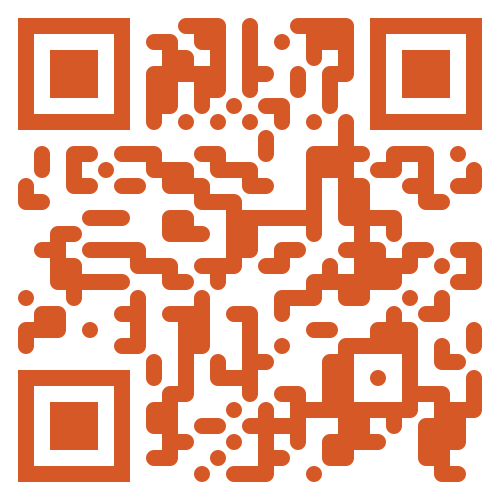
:::
::::::::::::::

# About Evaluation

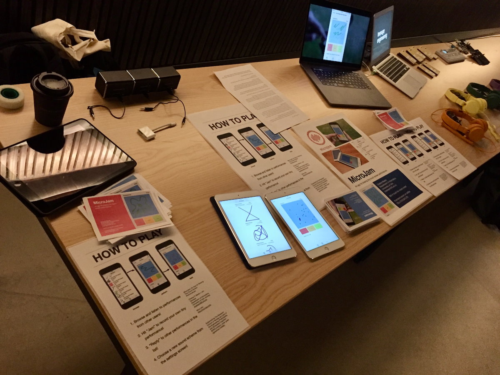{width=50%}

## What is evaluation?

:::::::::::::: {.columns}
::: {.column width="60%"}
- **Evaluation:** collecting and analysing data from user experiences with an artefact.

- **Goal:** to improve the artefact's design.
- **Addresses:** functionality, usability, user experience
- Appropriate for all different kinds of artefacts and prototypes.
- Methods vary according to goals.
:::
::: {.column width="40%"}
![Evaluating iPad apps in 2013 [@martin-exploring-percussive-gesture:2014]](img/evaluation-metatone-2013.jpg)
:::
::::::::::::::

## Why is evaluation important?

:::::::::::::: {.columns}
::: {.column width="50%"}
- **Understanding people**
    - Users may not have the same experiences or perspectives as you do
    - Different users use software differently
- **Understanding designs**
    - Proof that ideas work
    - Understand limitations, affordances, applications
:::
::: {.column width="50%"}
- **Business**
    - Invest in the right ideas
    - Find problems to solve (before production, before next iteration, etc.)
- **Research**
    - Evidence for new interactive systems
    - Empirical proof of hypotheses
    - New knowledge to answer research questions
:::
::::::::::::::

## What should you evaluate/measure?

:::::::::::::: {.columns}
::: {.column width="60%"}
> Does the design do what the users need and want?

Examples:

- **Game App Developers:** Whether young adults find their game fun and engaging compared to other games
- **Government authority:** Whether their online service is accessible to users with a disability
- **Children’s talking toy designers:** Whether six-year-olds enjoy the voice, feel of the soft toy, and can use safely
:::
::: {.column width="40%"}
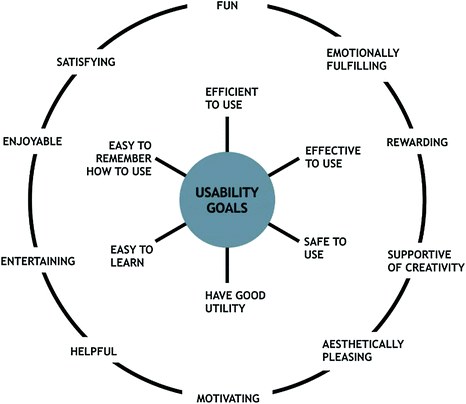{width=100%}
:::
::::::::::::::

## Usability and Usability Goals

:::::::::::::: {.columns}
::: {.column width="60%"}
Six usability goals:

- Effective to use (effectiveness)
- Efficient to use (efficiency)
- Safe to use (safety)
- Having good utility (utility)
- Easy to learn (learnability)
- Easy to remember how to use (memorability)

[@rogers-beyond-hci:2023]
:::
::: {.column width="40%"}
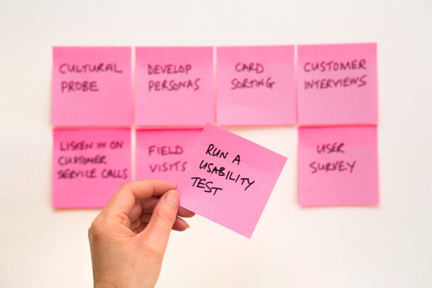{width=100%}
:::
::::::::::::::

## Where should you evaluate your design?

:::::::::::::: {.columns}
::: {.column width="60%"}
Depends on your evaluation goal!

- Lab studies (controlled settings)
- In-the-wild studies (natural settings)
- Remote studies (online behaviour)

:::
::: {.column width="40%"}
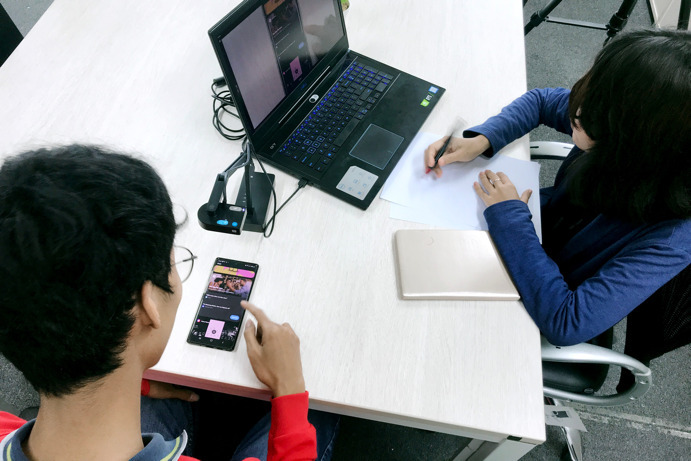
:::
::::::::::::::

## Formative vs Summative Evaluation

:::::::::::::: {.columns}
::: {.column width="60%"}
Evaluation serves different purposes at different stages of the design process

- **Formative evaluation:** 
    - Assessing whether a product continues to meet users’ needs during a design process 
    - Early or late stages
- **Summative evaluation:** 
    - Assessing whether a finished product is successful
    - Feeds into an iterative design process
:::
::: {.column width="40%"}
](img/09_evaluation_foundations_4.png)
:::
::::::::::::::

# Types of Evaluation

## Controlled settings (e.g., Usability testing)

](img/09_evaluation_foundations_5.jpg){width=80%}

A controlled evaluation setting is not the normal place for using a technology or for the user to be.

## Usability Testing

:::::::::::::: {.columns}
::: {.column width="60%"}
- **Measures:** numbers or time (e.g., tasks completed, errors made, time taken)
- **Methods:** mixture of methods (e.g., think aloud, observation, interviews, questionnaires, data logging and analytics)
- **Data:** variety of data depending on the methods (e.g., video, audio, facial expressions, key presses, verbal feedback)
- **Settings:** lab + observation room, mobile usability kit, university classroom
- **Number of participants:** 5-12 baseline but more is better

:::
::: {.column width="40%"}
![A controlled setting at ANU for testing music apps. Interaction data, timing, audio, video, surveys and interviews were recorded [@martin-intelligent-agents:2016]](img/2015-study-observation.jpg){width="100%"}
:::
::::::::::::::

<!-- TODO, other kinds of design? what would they be? -->

## Usability Testing Example

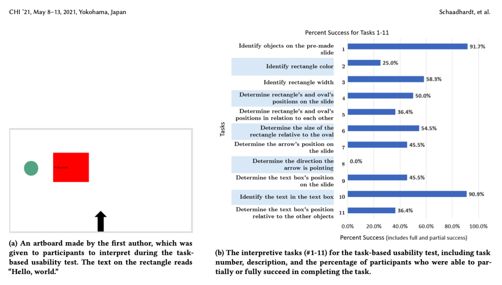

## Natural settings (e.g., Field studies)

:::::::::::::: {.columns}
::: {.column width="60%"}
Evaluating a technology or context of use in the normal setting for the user.

Field studies can:

- Help identify opportunities for new technology
- Establish the requirements for a new design
- Facilitate the introduction of technology or inform deployment of existing technology in new contexts

Helps to establish [ecological validity](https://www.interaction-design.org/literature/book/the-glossary-of-human-computer-interaction/ecological-validity).
:::
::: {.column width="40%"}
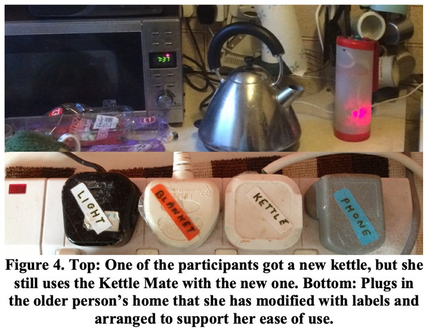
:::
::::::::::::::

## Field Studies

- Goals:
    - Understanding how people interact with technologies in “messy worlds”, how technologies will be integrated into contexts
    - Studying use of existing technologies and impacts of introducing new ones
- Methods: Emphasis on qualitative methods rather than statistical measures e.g., Observations, interviews, diaries, interaction logging
- Duration: No fixed length- can be seconds, months, years
- Paying attention to: Use situations, problems/errors, distractions, patterns of behaviours
- How does your presence and involvement shape engagement? Observation vs participant observation
- Findings: Used for creating thematic analysis, vignettes, narratives, critical incident analysis etc.

## Field Studies Example

:::::::::::::: {.columns}
::: {.column width="50%"}
![Co-Designing with Orangutans: Enhancing the Design of Enrichment for Animals (Sarah Webber, Marcus Carter, Wally Smith, and Frank Vetere) Proc. DIS '20 [@webber-oranguatans:2020]](img/09_evaluation_foundations_8.png)
:::
::: {.column width="50%"}
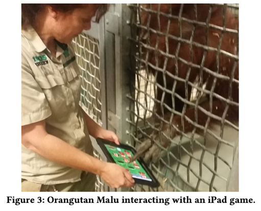
:::
::::::::::::::

## Opportunistic Evaluations

:::::::::::::: {.columns}
::: {.column width="60%"}

- quick feedback about a design idea in the early design process
- confirm whether it’s worth developing an idea into a prototype
- informal and doesn’t require lots of time or resources
- not a replacement for formal evaluation
- **care required** with ethics in research (Hons, Master, PhD). Asking supervisors and colleagues for advice vs collecting data to establish findings.

**E.g.,** designers ask colleagues for design feedback: Yichen Wang's *arMIDI* system early design process with supervisor and colleagues [@wang2025seeingsound].
:::
::: {.column width="40%"}
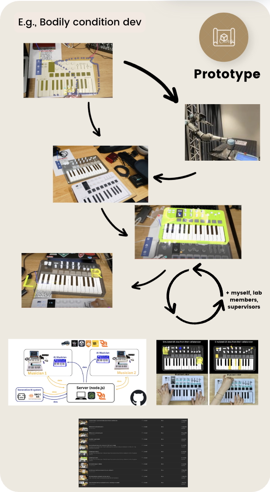{width=50%}
:::
::::::::::::::

## Which methods to choose from?

:::::::::::::: {.columns}
::: {.column width="60%"}

The evaluation setting guides certain dimensions of developed artefacts.

- **Combinations of methods** are used for a richer understanding. E.g., usability testing is combined with observations to identify usability problems and how users use the system.

### Pros and Cons

- **Controlled settings** allow hypotheses testing on specific features for generalised results.
- **Uncontrolled settings** offer unexpected insights into perception and experience of new technologies in daily life and work.

:::
::: {.column width="40%"}
![Lab research on AR co-creative system [@wang2025seeingsound]](img/2024-yichen-studies.jpg)
:::
::::::::::::::

## Activity: Evaluating an interactive toy

:::::::::::::: {.columns}
::: {.column width="60%"}
You're all HCI researchers and we need to evaluate this interactive toy.

We need to choose:

- how we will evaluate the toy?
- in what environment?
- what information do we need and why?
- what _research questions_ are being asked?

Talk for 2-3 minutes and then we will hear some answers 🗣️🎤⭐️
:::
::: {.column width="40%"}
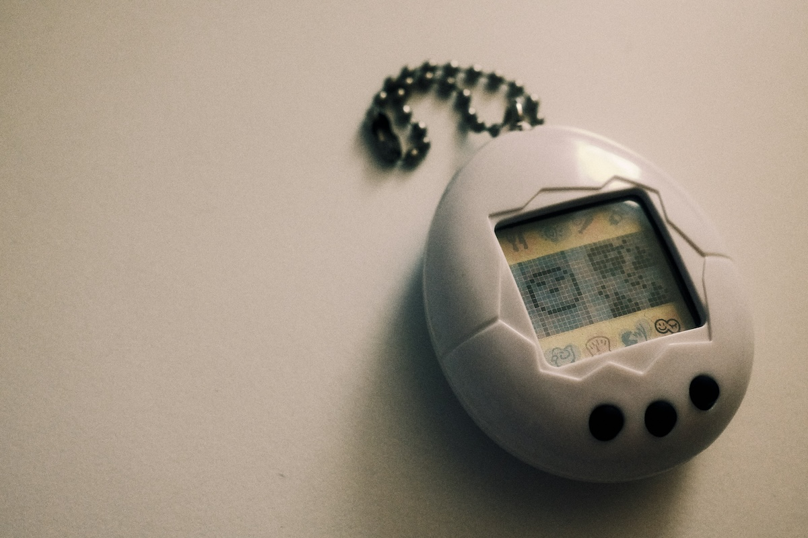
:::
::::::::::::::

# Planning Evaluations

:::::::::::::: {.columns}
::: {.column width="60%"}
What do we need to keep in mind to plan evaluations?
:::
::: {.column width="40%"}
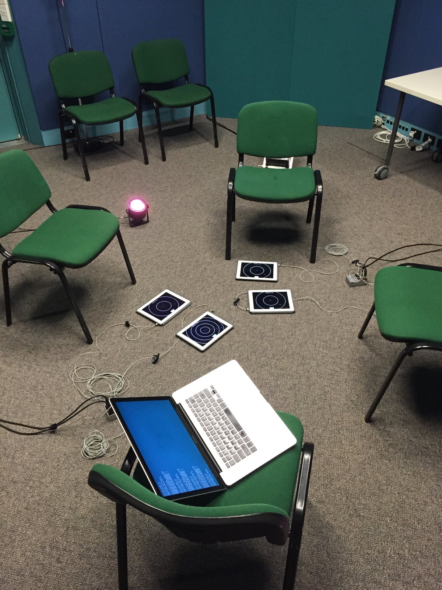{width="60%"}
:::
::::::::::::::

## Design and Conduct Issues

- **Reliability:**  how well it produces the same results on separate occasions under the same circumstances
- **Validity:** whether the evaluation method measures what it intended to measure
- **Ecological validity:** how the environment in which an evaluation is conducted influences or distorts results
- **Bias:** occurs when the results are distorted
- **Scope:** how much of the findings can be generalised

## Ethical Issues

- **Risks:** what are the risks to participants? (e.g., physical harm, reputational risk, distressing conversations, being identified etc)
    - ...and how are risks mitigated...
- **Benefits:** what are the benefits to participants? (e.g., none, helping research, fun experience, getting paid, course credit, etc)
- **Consent:** how is informed consent established? (e.g., a participant information sheet and a written form)
- **Data:** how is data stored and who has access to it? what will happen to it over time?

Universities have [processes](https://services.anu.edu.au/research-support/research-ethics-integrity-compliance/human-ethics) to _approve_ the ethical aspects of research that collects data from humans following established rules [@national-statement-ethical-conduct:2025].

We don't go deeply into research ethics in this course but the four issues above are the core ones.

## Developing an evaluation plan

:::::::::::::: {.columns}
::: {.column width="60%"}
- Evaluation Goal/Aims
- Participants
- Setting
- Data to collect
- Methods
- Ethical Considerations and Consent
- Data capture, recording, storage
- Analysis method
- Output(s) of evaluation process
:::
::: {.column width="40%"}
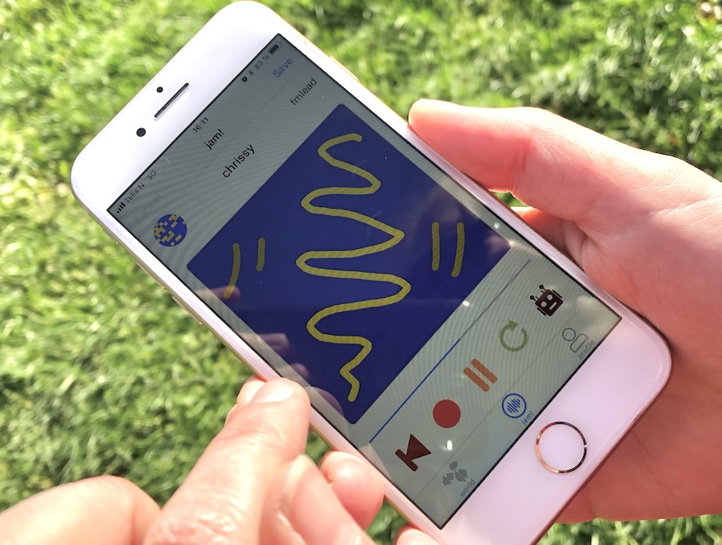
:::
::::::::::::::

## Labs and Equipment

:::::::::::::: {.columns}
::: {.column width="60%"}

- tables, chairs
- places for participants and researchers
- Instructions to participants
- Details, equipment for completing tasks
- Data collection equipment: video, audio recording 
- In-person / Remote
- Zoom (e.g., COVID), online studies
:::
::: {.column width="40%"}
{width="100%"}
:::
::::::::::::::

## Experimental Variables

:::::::::::::: {.columns}
::: {.column width="60%"}
- **Independent variable:** the condition the researcher controls.
- **Dependent variable:** the outcome we are measuring.
- **Independent vars in HCI:** different interfaces, input devices, software, colours, computer type
- **Dependent vars in HCI:** efficiency, accuracy, subjective satisfaction, ease of learning, physical/cognitive demands

### Variables shape your study

- **Tasks:** completing specific tasks, or freely using a technology?
- **Interfaces:** just using one interface, or comparing two (or more!) different styles

:::
::: {.column width="40%"}

:::
::::::::::::::

## Hypothesis Testing

E.g.:

> A blue backround in the user interface leads to faster task completion.

- Examine the relationship between variables (independent vs. dependent)
- Null and alternative hypotheses guide testing
- Careful experimental design is essential

Hypotheses must be falsifiable and can only be dismissed! (A bit different from the more general "research questions").

To dismiss or support a hypothesis we generally need significance testing and quantitative methods.

## Experiment Design

:::::::::::::: {.columns}
::: {.column width="60%"}
Which participants test which conditions?

1. Different-participant design: each participant sees one condition.
2. Same-participant design: everybody sees each condition.
3. Matched-participant design: matched groups of participants with a shared trait put into each group

- **Balanced Ordering** is important to counter learning effects.
- **Design choices** affects validity and reliability
- **Data collection:** think back to week 4 lecture, but often includes task performance, completion time, errors, subjective satisfaction etc.
:::
::: {.column width="40%"}
{width=60%}
:::
::::::::::::::

## Table of Experimental Designs

::: {.small-table}
| Design | Advantages | Disadvantages |
|---|---|---|
| Different participants (between-participants design) | - No order effects | - Requires many participants - Individual differences can affect results - Random assignment helps minimize differences |
| Same participants (within-participants design) | - Eliminates individual differences between conditions | - Requires counterbalancing - Risk of order effects (e.g., learning or fatigue) |
| Matched participants (pair-wise design) | - No order effects - Reduces impact of individual differences | - Time-consuming to find matched pairs - May miss other influential variables |
:::

## In-the-Wild Studies

:::::::::::::: {.columns}
::: {.column width="60%"}

- Natural setting, minimal control over participants
- reflecting real-world use unpredictable and complex
- Ethical and practical challenges are greater, e.g., participant consent, privacy, equipment issues, and environmental factors.

> Reveal insights about actual use and long-term integration that lab studies often miss.

:::
::: {.column width="40%"}
![Overview of performance-led research in the wild. [@benford2013performancewild]](img/benford-performance-led-in-the-wild.jpg){width="100%"}
:::
::::::::::::::

## People are complicated

HCI is hard. To do a study, you usually need to:

- Plan the study
- Find participants
- Manage communication with them
- Figure out what to do if they don’t show up
- Managing a study requires some social skills! It’s hard work!

Is there any way to do evaluation _without_ users?

# Evaluation by Inspection

{width=50%}

## Expert Evaluation

- Conducted by designers and design “experts” rather than with end users
- Inspection methods – expert role plays user
- **Heuristic evaluation:** Researchers evaluate whether aspects design adhere to established usability principles (see over)
- **Cognitive walkthroughs:** Simulating user reasoning and problem solving at each step in an interaction sequence (evidence, availability, accessibility of correct action)
- **Analytics:** Understanding user demographics and tracing activities (e.g., number of clicks, duration of sessions etc.)
- **A/B Testing:** Large number of users assigned Design A or B and compare use to test “variable of interest” (e.g., number of clicks on advertising during test period)

## Heuristic Evaluations of User Interfaces (video)

)](img/09_evaluation_foundations_10.png)

## Nielsen's 10 Usability Heuristics

:::::::::::::: {.columns}
::: {.column width="50%"}
1. **Visibility of system status:** keep the user informed
2. **Match between system and real world:** system uses language and communication familiar to the user, information is natural and logical
3. **User control and freedom:** users make mistakes, there should be "emergency exits" to cancel and return quickly
4. **Consistency and standards:** users should not wonder whether words, situations or actions mean the same thing, follow conventions
5. **Error prevention:** eliminate error-prone conditions, or check with user before they occur
:::
::: {.column width="50%"}
6. **Recognition rather than recall:** make elements, actions, and options visible
7. **Flexibility and efficienty of use:** shortcuts to speed up for experts, allow tailored experiences
8. **Aesthetic and minimal design:** less is more, no unnecessary information
9. **Help users recognise, diagnose and recover from errors:** error messages need plain language, and suggest solutions
10. **Help and documentation:** best if explanation is not needed, if it is, make it good
:::
::::::::::::::

<!-- evaluation of VR interface: https://www.nngroup.com/articles/usability-heuristics-virtual-reality/ -->
<!-- ](img/09_evaluation_foundations_11.png) -->
<!-- ](img/09_evaluation_foundations_12.png) -->

## Web Design Heuristics

:::::::::::::: {.columns}
::: {.column width="60%"}
@budd-web-design:2007 introduces further heuristics focussed on web, here's some from the [list](https://andybudd.com/archives/2007/01/heuristics_for_modern_web_application_de):

- **Clarity:** Make the system as clear, concise and meaningful as possible for the intended audience.
- **Minimise unneccessary complexity and cognitive load:** Make the system as simple as possible for people to accomplish their tasks.
- **Provide context:** Interfaces should provide people with a sense of context in time and space
- **Promote a pleasurable and positive experience:** people should be treated with respect and the design should be aesthetically pleasing and promote a pleasurable and rewarding experience

:::
::: {.column width="40%"}
](img/evaluation-nngroup-heuristic.jpg)
:::
::::::::::::::

## Shneiderman’s Eight Golden Rules of Design

1. Strive for consistency
2. Seek universal usability
3. Offer informative feedback
4. Design dialogs to yield closure
5. Prevent errors
6. Permit easy reversal of actions
7. Keep users in control
8. Reduce short-term memory load

## Analytics: Evaluation at Scale

:::::::::::::: {.columns}
::: {.column width="50%"}
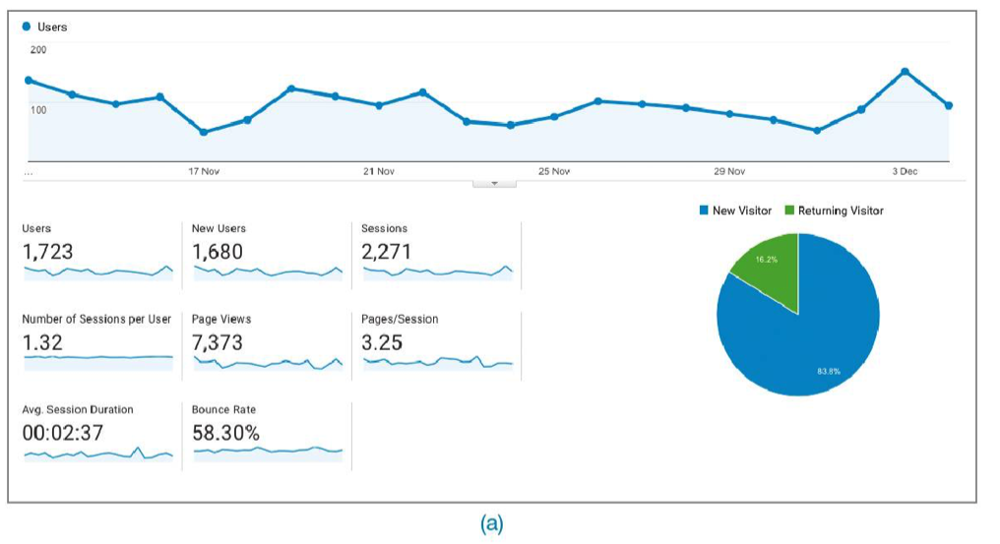

:::
::: {.column width="50%"}
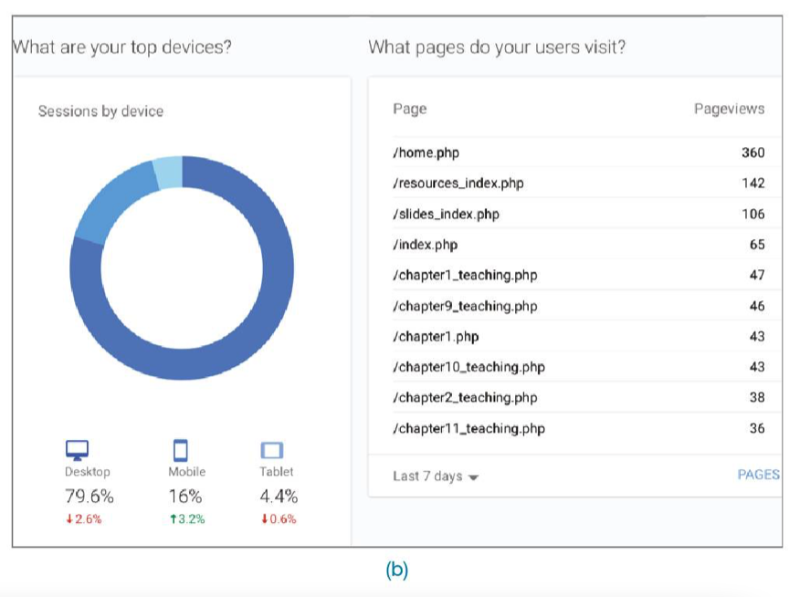
:::
::::::::::::::

## A/B Testing    

:::::::::::::: {.columns}
::: {.column width="60%"}
- Large-scale, online controlled experiment used to compare two designs (A = control, B = new design) by measuring user behavior (e.g., click rates), often without users knowing they are part of a study.
- Between-participants design, randomly assigning users to different versions and analyzing outcomes statistically to determine if observed differences are due to the design and not chance.
- Proper setup is critical — running an A/A test first ensures the testing infrastructure is sound, and careful design is needed to avoid misleading results, as shown in real-world examples like Microsoft Office 2007.
:::
::: {.column width="40%"}
{width="60%"}
:::
::::::::::::::

<!-- Charles: this  Kohavi et al. (2022) reference is cursed; i'll leave you to fix it. -->

## Predictive Models

:::::::::::::: {.columns}
::: {.column width="60%"}
Estimate user performance without needing real users, using formulas to assess task efficiency — useful in early design stages or when testing with users is difficult.

Fitts’ Law [@fitts1954information]:

- predicts how long it takes to point at a target based on its size and distance
- helps designers optimize button placement, size, and spacing on screens and devices.
- applications: input methods (e.g., touch, gaze, tilt),  mobile and VR, simulating interactions for users with motor impairments
:::
::: {.column width="40%"}
 (CC-BY 4.0)](img/sketchplanations-fitts-law.jpg)
:::
::::::::::::::

## Evaluation after deployment: adoption, use, and non-use

:::::::::::::: {.columns}
::: {.column width="60%"}
- Adoption/Appropriation/Design-in-use [@ehn-participation:2008]
- Technology acceptance [@davis1989perceived]
- Non-use [@satchell-beyond-user:2009]
- Technology habitation [@soro-older-users:2016]
- Technology individuation [@ambe-individuation:2017]
:::
::: {.column width="40%"}
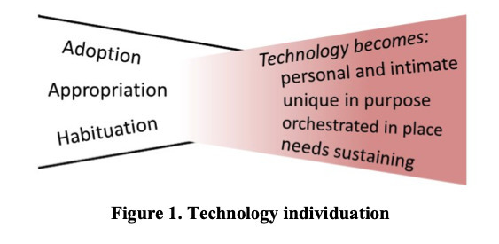
:::
::::::::::::::

# Questions: Who has a question?

:::::::::::::: {.columns}
::: {.column width="60%"}
**Who has a question?**

- I can take _cathchbox_ question up until 2:55
- For after class questions: meet me outside the classroom at the bar (for 30 minutes)
- Feel free to ask about **any aspect of the course**
- Also feel free to ask about **any aspect of computing at ANU**! I may not be able to help, but I can listen.

:::
::: {.column width="40%"}

:::
::::::::::::::

# References {.allowframebreaks}
