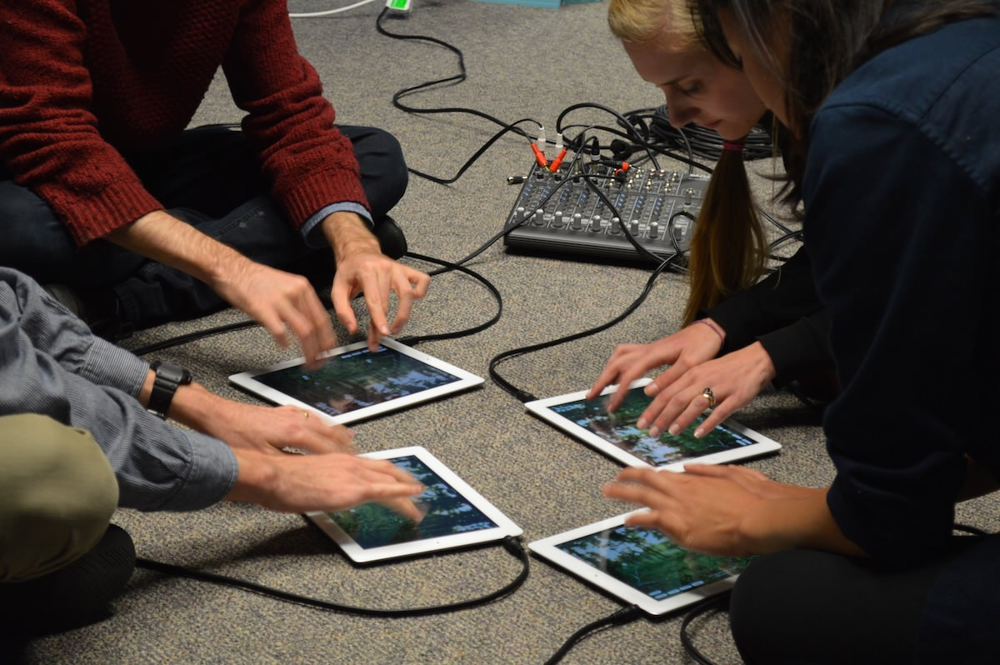
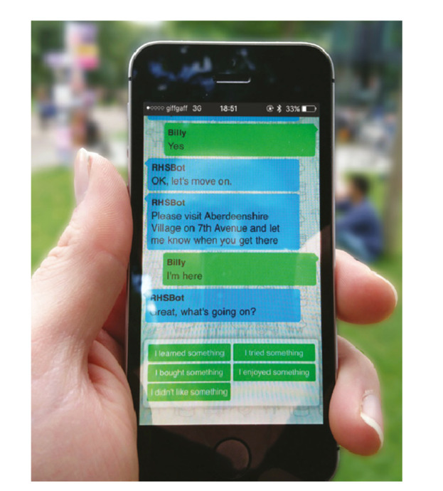

 
## Announcements

## Plan for the class

# Evaluation

Sharp et al. 2019 Textbook: Chapters 14-16

## What is evaluation?

:::::::::::::: {.columns}
::: {.column width="60%"}
- **Evaluation:** collecting and analysing data from user experiences with an artefact

- **Goal:** to improve the artefact's design.
- **Addresses:**
    - functionality
    - usability
    - user experience
- Appropriate for all different kinds of artefacts and prototypes
- Methods vary according to goals.
:::
::: {.column width="40%"}

:::
::::::::::::::

## Why is evaluation important?

:::::::::::::: {.columns}
::: {.column width="50%"}
- **Understanding people**
    - Users may not have the same experiences or perspectives as you do
    - Different users use software differently
- **Understanding designs**
    - Proof that ideas work
    - Understand limitations, affordances, applications
:::
::: {.column width="50%"}
- **Business**
    - Invest in the right ideas
    - Find problems to solve (before production, before next iteration, etc.)
- **Research**
    - Evidence for new interactive systems
    - Empirical proof of hypotheses
    - New knowledge to answer research questions
:::
::::::::::::::

## What should you evaluate/measure?

:::::::::::::: {.columns}
::: {.column width="60%"}
> Does the design do what the users need and want?

Examples:

- **Game App Developers:** Whether young adults find their game fun and engaging compared to other games
- **Government authority:** Whether their online service is accessible to users with a disability
- **Children’s talking toy designers:** Whether six-year-olds enjoy the voice, feel of the soft toy, and can use safely
:::
::: {.column width="40%"}

:::
::::::::::::::

## Usability and Usability Goals

:::::::::::::: {.columns}
::: {.column width="60%"}
Six usability goals:

- Effective to use (effectiveness)
- Efficient to use (efficiency)
- Safe to use (safety)
- Having good utility (utility)
- Easy to learn (learnability)
- Easy to remember how to use (memorability)
:::
::: {.column width="40%"}
{width=100%}
:::
::::::::::::::

## Where should you evaluate your design?

:::::::::::::: {.columns}
::: {.column width="60%"}
Depends on your evaluation goal!

- Lab studies (controlled settings)
- In-the-wild studies (natural settings)
- Remote studies (online behaviour)

:::
::: {.column width="40%"}

:::
::::::::::::::

## Activity: Evaluating an interactive toy

:::::::::::::: {.columns}
::: {.column width="60%"}
You're all HCI researchers and we need to evaluate this interactive toy.

We need to choose:

- how we will evaluate the toy?
- in what environment?
- what information do we need and why?
- what _research questions_ are being asked?

Talk for 2-3 minutes and then we will hear some answers.
:::
::: {.column width="40%"}

:::
::::::::::::::

## When should you evaluate?

:::::::::::::: {.columns}
::: {.column width="60%"}
Evaluation serves different purposes at different stages of the design process

- **Formative evaluation:** 
    - Assessing whether a product continues to meet users’ needs during a design process 
    - Early or late stages
- **Summative evaluation:** 
    - Assessing whether a finished product is successful
    - Feeds into an iterative design process
:::
::: {.column width="40%"}
](img/09_evaluation_foundations_4.png)
:::
::::::::::::::

# Types of Evaluation

## Controlled settings (e.g., Usability testing)

](img/09_evaluation_foundations_5.jpg)

## Usability Testing

- Measures: Can involve numbers and time (e.g., number of task completion, number of errors made, time taken to complete task)
- Methods: Can involve a mixture of methods e.g., think aloud, observation, interviews, questionnaires, data logging and analytics
- Data: Can collect a variety of data depending on the methods used (e.g., video, audio, facial expressions, key presses, verbal feedback)
- Settings: Usability lab + observation room vs mobile usability kit
- Number of participants: 5-12 baseline but more is better
- Read the textbook for other kinds of experimental design

## Usability Testing Example

## Natural settings (e.g., Field studies)

:::::::::::::: {.columns}
::: {.column width="60%"}
Goals of field studies:

- Help identify opportunities for new technology
- Establish the requirements for a new design
- Facilitate the introduction of technology or inform deployment of existing technology in new contexts
:::
::: {.column width="40%"}

:::
::::::::::::::

## Field Studies

- Goals:
    - Understanding how people interact with technologies in “messy worlds”, how technologies will be integrated into contexts
    - Studying use of existing technologies and impacts of introducing new ones
- Methods: Emphasis on qualitative methods rather than statistical measures e.g., Observations, interviews, diaries, interaction logging
- Duration: No fixed length- can be seconds, months, years
- Paying attention to: Use situations, problems/errors, distractions, patterns of behaviours
- How does your presence and involvement shape engagement? Observation vs participant observation
- Findings: Used for creating thematic analysis, vignettes, narratives, critical incident analysis etc.

## Field Studies Example

:::::::::::::: {.columns}
::: {.column width="50%"}
![**Co-Designing with Orangutans: Enhancing the Design of Enrichment for Animals** (Sarah Webber, Marcus Carter, Wally Smith, and Frank Vetere) Proc. DIS '20 [@webber-oranguatans:2020]](img/09_evaluation_foundations_8.png)
:::
::: {.column width="50%"}

:::
::::::::::::::

# Evaluation by Inspection

Skip the "users"! Just evaluate against established principles (heuristics) and standards.

## Expert Evaluation

- Conducted by designers and design “experts” rather than with end users
- Inspection methods – expert role plays user
- __Heuristic evaluation:__ Researchers evaluate whether aspects design adhere to established usability principles (see over)
- __Cognitive walkthroughs:__ Simulating user reasoning and problem solving at each step in an interaction sequence (evidence, availability, accessibility of correct action)
- __Analytics:__ Understanding user demographics and tracing activities (e.g., number of clicks, duration of sessions etc.)
- __A/B Testing:__ Large number of users assigned Design A or B and compare use to test “variable of interest” (e.g., number of clicks on advertising during test period)

## Heuristic Evaluations of User Interfaces (video)

)](img/09_evaluation_foundations_10.png)

## Nielsen's 10 Usability Heuristics

:::::::::::::: {.columns}
::: {.column width="50%"}
1. **Visibility of system status:** keep the user informed
2. **Match between system and real world:** system uses language and communication familiar to the user, information is natural and logical
3. **User control and freedom:** users make mistakes, there should be "emergency exits" to cancel and return quickly
4. **Consistency and standards:** users should not wonder whether words, situations or actions mean the same thing, follow conventions
5. **Error prevention:** eliminate error-prone conditions, or check with user before they occur
:::
::: {.column width="50%"}
6. **Recognition rather than recall:** make elements, actions, and options visible
7. **Flexibility and efficienty of use:** shortcuts to speed up for experts, allow tailored experiences
8. **Aesthetic and minimal design:** less is more, no unnecessary information
9. **Help users recognise, diagnose and recover from errors:** error messages need plain language, and suggest solutions
10. **Help and documentation:** best if explanation is not needed, if it is, make it good
:::
::::::::::::::

<!-- evaluation of VR interface: https://www.nngroup.com/articles/usability-heuristics-virtual-reality/ -->
<!-- ](img/09_evaluation_foundations_11.png) -->
<!-- ](img/09_evaluation_foundations_12.png) -->

## Web Design Heuristics

:::::::::::::: {.columns}
::: {.column width="60%"}
@budd-web-design:2007 introduces further heuristics focussed on web, here's some from the [list](https://andybudd.com/archives/2007/01/heuristics_for_modern_web_application_de):

- **Clarity:** Make the system as clear, concise and meaningful as possible for the intended audience.
- **Minimise unneccessary complexity and cognitive load:** Make the system as simple as possible for people to accomplish their tasks.
- **Provide context:** Interfaces should provide people with a sense of context in time and space
- **Promote a pleasurable and positive experience:** people should be treated with respect and the design should be aesthetically pleasing and promote a pleasurable and rewarding experience

:::
::: {.column width="40%"}
](img/evaluation-nngroup-heuristic.jpg)
:::
::::::::::::::

## Shneiderman’s Eight Golden Rules of Design

1. Strive for consistency
2. Seek universal usability
3. Offer informative feedback
4. Design dialogs to yield closure
5. Prevent errors
6. Permit easy reversal of actions
7. Keep users in control
8. Reduce short-term memory load

## Analytics: What can you learn?

:::::::::::::: {.columns}
::: {.column width="50%"}

:::
::: {.column width="50%"}

:::
::::::::::::::

## Evaluation after deployment: adoption, use, and non-use

:::::::::::::: {.columns}
::: {.column width="60%"}
- Adoption/Appropriation/Design-in-use [@ehn-participation:2008]
- Technology acceptance [@davis1989perceived]
- Non-use [@satchell-beyond-user:2009]
- Technology habitation [@soro-older-users:2016]
- Technology individuation [@ambe-individuation:2017]
:::
::: {.column width="40%"}

:::
::::::::::::::

# Planning Evaluations

## Issues during evaluation

- Ethical dimensions and consent
- Evaluation design and conduct:
    - __Reliability:__  “how well it produces the same results on separate occasions under the same circumstances”
    - __Validity:__ “whether the evaluation method measures what it intended to measure”
    - __Ecological validity:__  “how the environment in which an evaluation is conducted influences or distorts results”
    - __Bias:__ “occurs when the results are distorted”
    - __Scope:__ “how much of the findings can be generalised”

## Developing an evaluation plan

:::::::::::::: {.columns}
::: {.column width="60%"}
- Evaluation Goal/Aims
- Participants
- Setting
- Data to collect
- Methods
- Ethical Considerations/Consent Process
- Data capture/recording/storage
- Analysis method
- Output(s) of evaluation process
:::
::: {.column width="40%"}

:::
::::::::::::::

## Questions: Who has a question?

:::::::::::::: {.columns}
::: {.column width="60%"}
**Who has a question?**

- I can take _cathchbox_ question up until 2:55
- For after class questions: meet me outside the classroom at the bar (for 30 minutes)
- Feel free to ask about **any aspect of the course**
- Also feel free to ask about **any aspect of computing at ANU**! I may not be able to help, but I can listen.

:::
::: {.column width="40%"}

:::
::::::::::::::

# References {.allowframebreaks}
