 
## Announcements

- assignment 2 due next Tuesday (6 October --- Monday is a public holiday)
- remember to use your tutorial time for meeting research clusters and collecting data.
- remember to follow the step-by-step guide.
- go fork [the repo!](https://gitlab.cecs.anu.edu.au/comp3900/2026/comp3900-2026-A2-needs-finding)

**Markdown Formatting Check:** There is a CI/CD job that checks your markdown formatting using the [`markdownlint-cli`](https://github.com/igorshubovych/markdownlint-cli) tool. Syntax rules are listed [here](https://github.com/DavidAnson/markdownlint/blob/main/doc/Rules.md) in our script, rules `MD013` and `MD041` are disabled. All other rules are active.

## Plan for the class

- research questions
- about evaluation: from a question to a yardstick
- types of evaluation
- planning evaluations
- evaluation by inspection, with a case study: the Hawaii false missile alert
- activity: two ways to evaluate nanojam

# Research Questions {background-image="img/kaleidico-3V8xo5Gbusk-unsplash.jpg" background-size="cover" background-opacity="0.35"}

For the final project you will have to choose a research question to explore.

This is a clear question (one sentence) that guides the design of your research project. 

RQs have been called [survival beacons](https://lennartnacke.com/how-to-choose-a-good-research-question/#research-questions-are-survival-beacons) because they should guide all aspects of our research plans.

How do we choose a research question and write it clearly?

Important skill for any research activity.

## Four steps to write a research question

:::::::::::::: {.columns}
::: {.column width="60%"}
This framework inspired by Lennart Nacke, [everybody's favourite HCI writing coach on LinkedIn](<https://lennartnacke.com/how-to-choose-a-good-research-question/#research-questions-are-survival-beacons>).

1. Outline a broad area of interest
2. Identify a problem that needs solving
3. Justify solving this problem
4. Write the question

To be clear, a research question starts with a question word (what, how, why, can, do, should) and ends with a question mark. It can just be one sentence.

Seems too easy... let's try it together.
:::
::: {.column width="40%"}
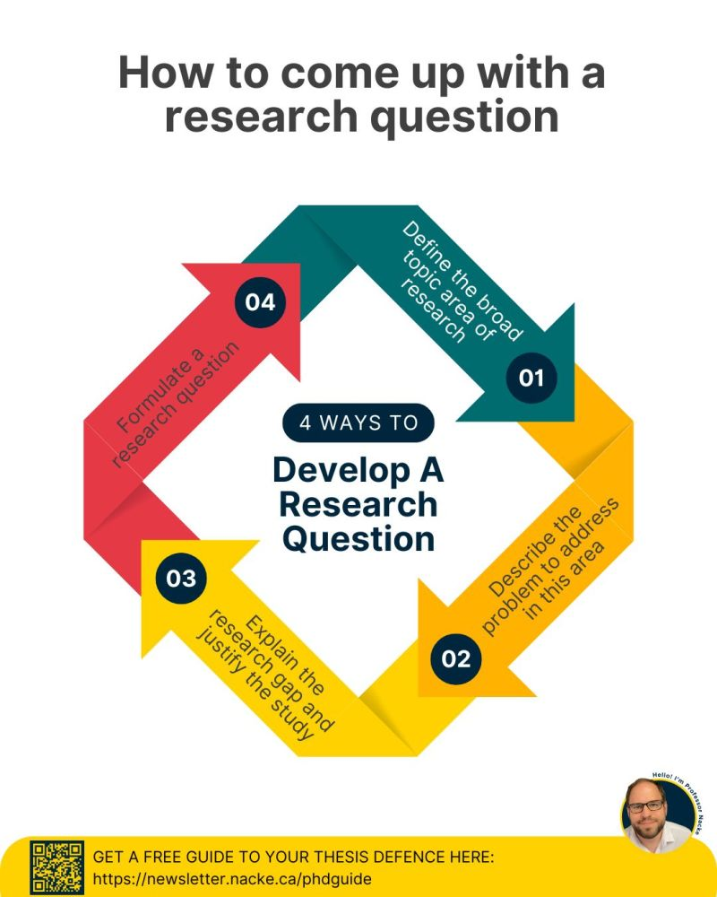{width=70%}
:::
::::::::::::::

## A worked research question example

1. haptic wearable interfaces.
2. keeping focussed in complicated meetings
3. lack of awareness in meeting can lead to poor work performance and embarrassment
4. here we go:

> What effects can a haptic wearable interface have on lack of awareness during meetings and later work performance?

Encodes the broad area, the problem, the justification, the context, etc.

## Is the problem worth solving?

The four steps get you a well-formed question. They don't tell you if it's a question worth asking.

Two useful ways to find a gap [@hornbaek-intro-hci:2025, section 45.2]:

- **Knowledge gap:** what do we not understand yet, given our present understanding?
- **Capability gap:** what are we not able to *do* yet?

Try working backwards: instead of starting with a problem and then asking who cares, start from **what people need to understand or do better**.

> "Good research produces results that improve stakeholders' capacity to solve important problems."

## Three ways a research question goes wrong

**1. Wrong level of abstraction.** Too specific and almost nobody is affected:

> Why do aging users make errors in Microsoft Word 17.3 when sitting near a pool in Belize?

Raise it until it covers many people --- but not so far that it can't be answered in one study.

## Three ways a research question goes wrong (2)

**2. Confounded with a solution.** This one has the method baked in before any thinking has happened:

> What does the *interview method* tell us about children's motivation to use tablets in schools?

Better --- solution-neutral, so the method is still an open choice:

> What motivations do children have for using tablets in schools?

## Three ways a research question goes wrong (3)

**3. Not refutable.** A question that presupposes its own answer isn't a question.

Very easy to do accidentally when you're attached to a pet theory, or want to show your system beats the baseline. Your RQ should allow **more than one** answer --- including one you won't like.

And on novelty:

> "Off-hand comments about a problem being novel are almost always wrong." [@hornbaek-intro-hci:2025, section 45.2]

Nearly every HCI problem has precursors. Finding them is your job, not an optional extra.

## Research Question Bingo

<!-- Could try a dual spinning wheel research question writing task: https://spinthewheel.io/wheels/wlzQX7r6A5GpkW4MExxW -->

:::::::::::::: {.columns}
::: {.column width="50%"}
**Interfaces:**

1. haptic feedback gloves
2. AR/VR headset
3. e-textile clothing
4. voice assistant
5. gesture recognition
6. smart headphones
7. ambient light display
8. wearable plants
9. eye-tracking interface
10. multi-touch table
:::
::: {.column width="50%"}
**Problems to Solve:**

1. family meal planning
2. language learning while commuting
3. caring for houseplants
4. focus during remote work
5. medication schedules
6. teaching kids about conservation
7. organising hobby collections
8. non-verbal communication
9. practicing music in small spaces
10. tracking community events
:::
::::::::::::::

## Activity: Write a Research Question

:::::::::::::: {.columns}
::: {.column width="60%"}
::: {.push-box}
**Do:** Let's write a research question!

> Together, let's [Spin the wheels](https://spinthewheel.io/wheels/6QtocP77prRkdHZ66s0hcz0xJmU9MA==) to decide on a broad area and a problem.

Then, decide on a "justification" and write a research question. Remember that the RQ should include the broad area, the problem, and the justification.

Use the poll everywhere link to suggest research questions and vote on the best ones.

**Write** for 2-3 minutes, **vote** for 1 minute, then let's discuss.
:::

::: {.extension-box}
**Extension:** Before you vote, run the candidates past the three failure modes: is the **abstraction** right, is a **solution** smuggled in, and is it **refutable**?
:::
:::
::: {.column width="40%"}

:::
::::::::::::::

# About Evaluation {background-image="img/microjam-evaluation.jpg" background-size="cover" background-opacity="0.4"}

Where we are in the course, following @rogers-beyond-hci:2023:

- **Week 4:** how to collect data (interviews, questionnaires, observation, think-aloud, logs)
- **Weeks 5 and 6:** how to analyse it
- **This week:** how to design the *study* --- which setting, which kind of study, which variables, and whether you need users in the room at all

Same collection and analysis techniques as needs-finding. What changes is that now there is an artefact, and a question about it.

## What is evaluation?

:::::::::::::: {.columns}
::: {.column width="60%"}
- **Evaluation:** collecting and analysing data from user experiences with an artefact.

- **Goal:** to improve the artefact's design.
- **Addresses:** functionality, usability, user experience
- Appropriate for all different kinds of artefacts and prototypes.
- Methods vary according to goals.
:::
::: {.column width="40%"}
![Evaluating iPad apps in 2013 [@martin-exploring-percussive-gesture:2014]](img/evaluation-metatone-2013.jpg)
:::
::::::::::::::

## Why is evaluation important?

:::::::::::::: {.columns}
::: {.column width="50%"}
- **Understanding people**
    - Users may not have the same experiences or perspectives as you do
    - Different users use software differently
- **Understanding designs**
    - Proof that ideas work
    - Understand limitations, affordances, applications
:::
::: {.column width="50%"}
- **Business**
    - Invest in the right ideas
    - Find problems to solve (before production, before next iteration, etc.)
- **Research**
    - Evidence for new interactive systems
    - Empirical proof of hypotheses
    - New knowledge to answer research questions
:::
::::::::::::::

## What should you evaluate/measure?

:::::::::::::: {.columns}
::: {.column width="60%"}
> Does the design do what the users need and want?

Examples:

- **Game App Developers:** Whether young adults find their game fun and engaging compared to other games
- **Government authority:** Whether their online service is accessible to users with a disability
- **Children's talking toy designers:** Whether six-year-olds enjoy the voice, feel of the soft toy, and can use safely
:::
::: {.column width="40%"}
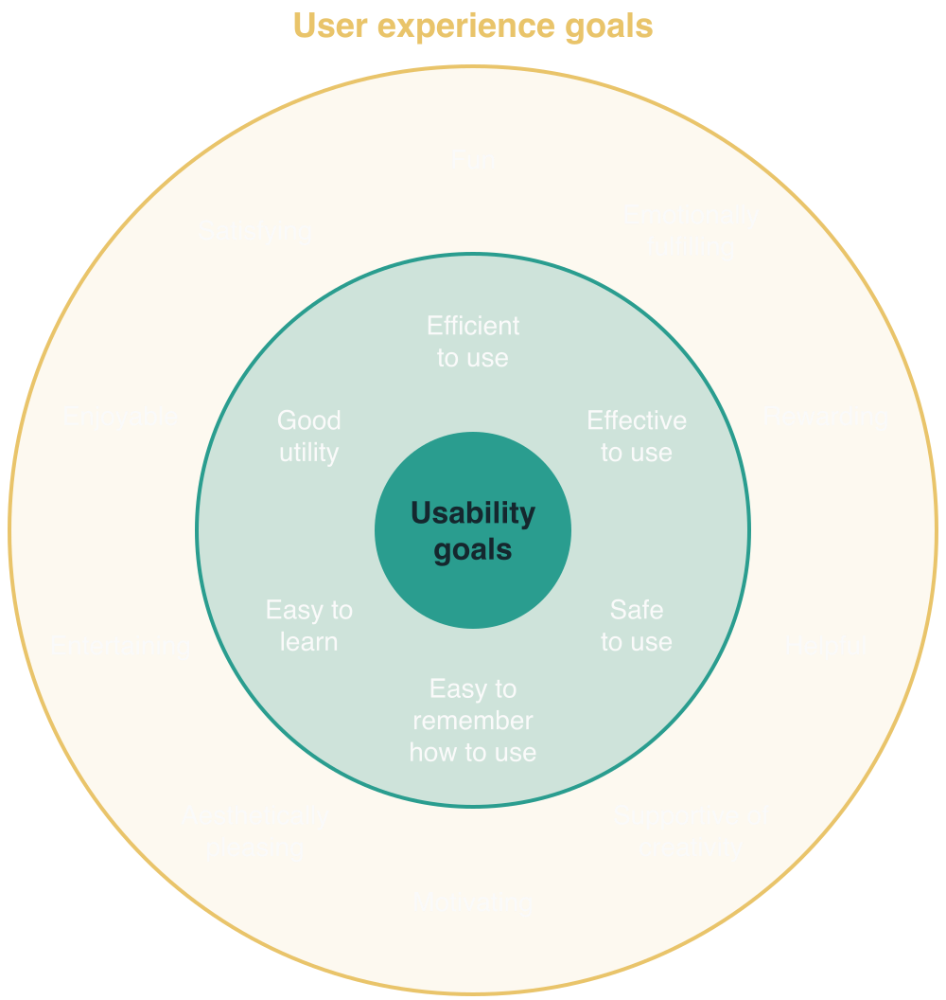{alt="Diagram: six usability goals (efficient, effective and safe to use; easy to remember how to use; easy to learn; good utility) in an inner circle, surrounded by a ring of user experience goals (fun, emotionally fulfilling, rewarding, helpful, supportive of creativity, motivating, aesthetically pleasing, entertaining, enjoyable, satisfying)" width=100%}
:::
::::::::::::::

## Usability and Usability Goals

:::::::::::::: {.columns}
::: {.column width="60%"}
Six usability goals:

- Effective to use (effectiveness)
- Efficient to use (efficiency)
- Safe to use (safety)
- Having good utility (utility)
- Easy to learn (learnability)
- Easy to remember how to use (memorability)

[@rogers-beyond-hci:2023]
:::
::: {.column width="40%"}
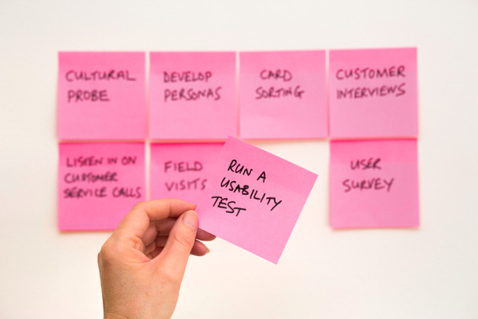{width=100%}
:::
::::::::::::::

## Where should you evaluate your design?

:::::::::::::: {.columns}
::: {.column width="60%"}
Depends on your evaluation goal!

- Lab studies (controlled settings)
- In-the-wild studies (natural settings)
- Remote studies (online behaviour)

:::
::: {.column width="40%"}
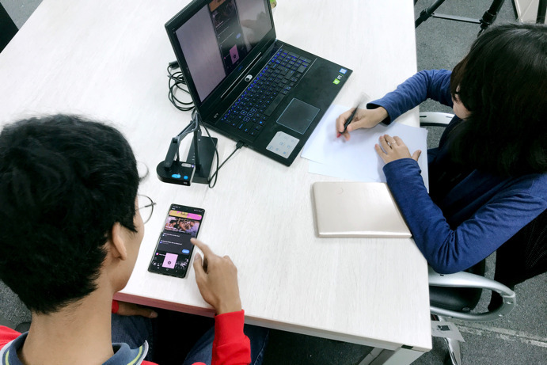
:::
::::::::::::::

## Formative vs Summative Evaluation

:::::::::::::: {.columns}
::: {.column width="60%"}
*When* you evaluate changes what the evaluation is for [@rogers-beyond-hci:2023, section 14.2]:

- **Formative evaluation:** 
    - during design, checking the product still meets users' needs
    - from early sketches to a nearly finished design
    - feeds the next iteration
- **Summative evaluation:** 
    - assessing whether a finished product is successful
    - against a target: a usability goal, a baseline, a standard

For the final project you will almost certainly be doing a **formative** evaluation of a prototype.
:::
::: {.column width="40%"}
](img/09_evaluation_foundations_4.png)
:::
::::::::::::::

## Overview: from a goal to a yardstick to a study

Set the **yardstick** (what counts as "good") first, and the kind of study follows [@hornbaek-intro-hci:2025, table 40.2].

::: {.small-table}
| Yardstick | The system should... | Kind of study |
|---|---|---|
| No critical usability problems | not make users err, get lost, or give up | think-aloud study |
| Comply with guidelines | match known traits of good systems | heuristic evaluation |
| Meet usability goals | hit quantitative targets | summative usability test |
| Compare favourably to X | beat a baseline on some measure | experiment |
| Compatibility with user practices | be adopted into everyday life | field study |
:::

No data-collection column: that was week 4. The yardstick picks the study; the study picks the techniques.

## Example: three questions about one app

:::::::::::::: {.columns}
::: {.column width="65%"}
nanojam (week 7): three questions, three yardsticks, three studies.

1. *Can a first-time user make a repeating pattern in the command line without help?* **No critical usability problems.** Think-aloud in the lab, six people, log where they stall.
2. *Is the pads interface faster to a first pattern than the command line?* **Compare favourably to X.** Experiment, same participants on both, counterbalanced, time to first pattern.
3. *Does anyone keep using it after the lecture?* **Compatibility with user practices.** Deployment, usage logs, follow-up interview.

Each is the right study for *its* question.
:::
::: {.column width="35%"}
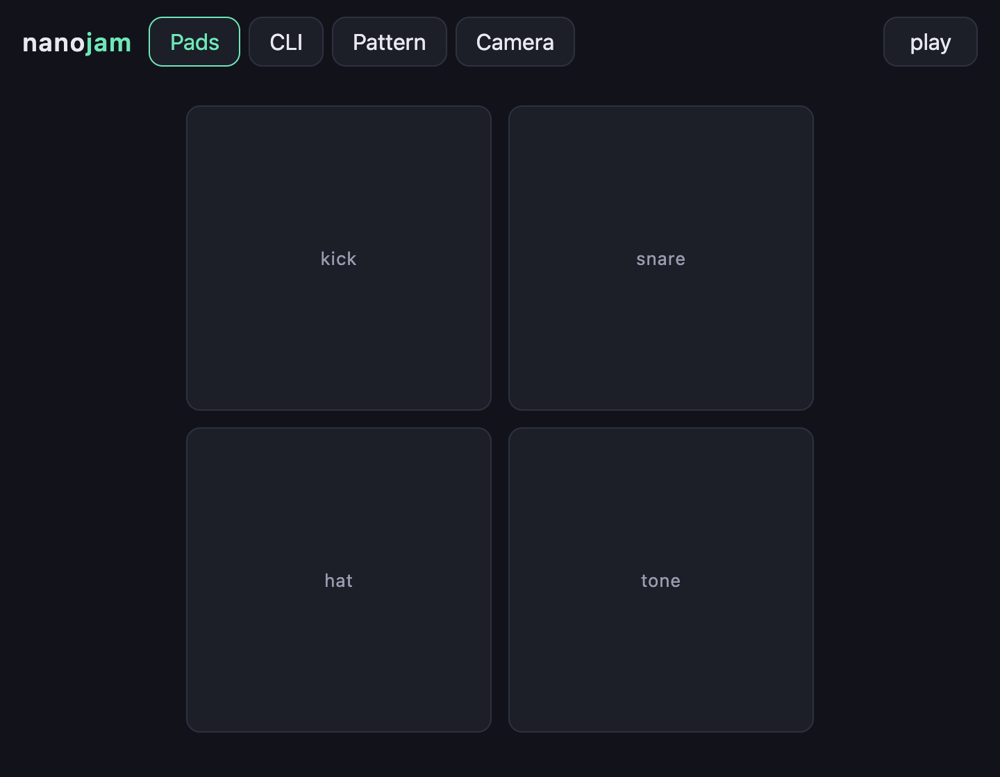{width="100%"}
:::
::::::::::::::

# Types of Evaluation {background-image="img/2015-study-observation.jpg" background-size="cover" background-opacity="0.4"}

## Controlled settings (e.g., Usability testing)

](img/09_evaluation_foundations_5.jpg){width=80%}

A controlled evaluation setting is not the normal place for using a technology or for the user to be.

## Usability Testing

:::::::::::::: {.columns}
::: {.column width="60%"}
- **Measures:** numbers or time (e.g., tasks completed, errors made, time taken)
- **Techniques:** combined from week 4: think-aloud during set tasks, a questionnaire afterwards (SUS, NASA-TLX), then a short interview
- **Data:** variety of data depending on the techniques (e.g., video, audio, facial expressions, key presses, verbal feedback)
- **Settings:** lab + observation room, mobile usability kit, university classroom
- **Number of participants:** 5-12 baseline but more is better
- **What is new this week:** the *tasks* are set by you, and the *setting* is controlled by you

:::
::: {.column width="40%"}
![A controlled setting at ANU for testing music apps. Interaction data, timing, audio, video, surveys and interviews were recorded [@martin-intelligent-agents:2016]](img/2015-study-observation.jpg){width="100%"}
:::
::::::::::::::

<!-- TODO, other kinds of design? what would they be? -->

## Usability Testing Example

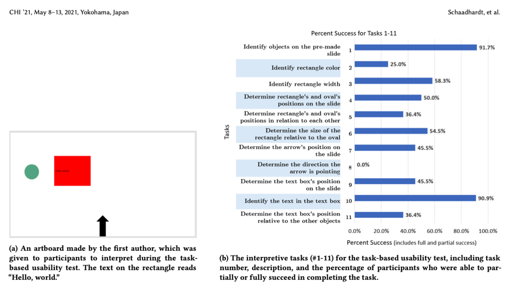

## Natural settings (e.g., Field studies)

:::::::::::::: {.columns}
::: {.column width="60%"}
Evaluating a technology or context of use in the normal setting for the user.

Field studies can:

- Help identify opportunities for new technology
- Establish the requirements for a new design
- Facilitate the introduction of technology or inform deployment of existing technology in new contexts

Helps to establish [ecological validity](https://www.interaction-design.org/literature/book/the-glossary-of-human-computer-interaction/ecological-validity).
:::
::: {.column width="40%"}
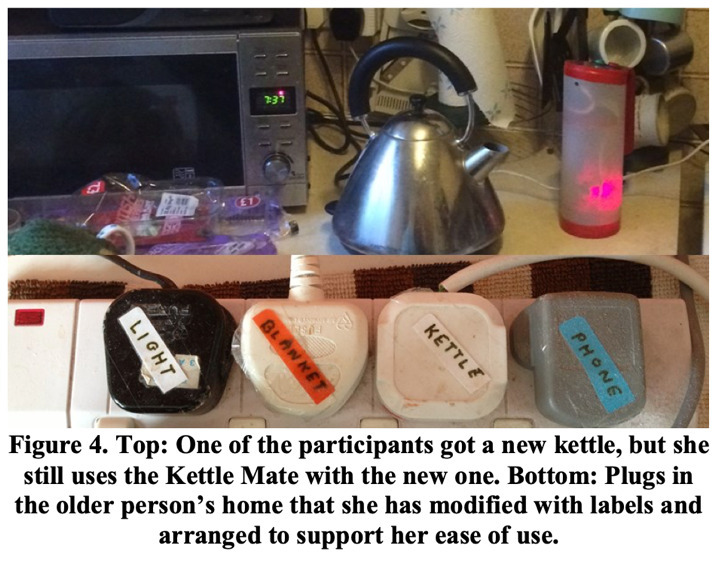
:::
::::::::::::::

## Field Studies

- Goals:
    - Understanding how people interact with technologies in “messy worlds”, how technologies will be integrated into contexts
    - Studying use of existing technologies and impacts of introducing new ones
- Techniques: mostly qualitative (observation, interviews, diaries, interaction logging) rather than set tasks and timings
- Duration: No fixed length- can be seconds, months, years
- Paying attention to: Use situations, problems/errors, distractions, patterns of behaviours
- How does your presence and involvement shape engagement? Observation vs participant observation
- Findings: thematic analysis, vignettes, narratives, critical incident analysis (weeks 5 and 6)

## Field Studies Example

:::::::::::::: {.columns}
::: {.column width="50%"}
![Co-Designing with Orangutans: Enhancing the Design of Enrichment for Animals (Sarah Webber, Marcus Carter, Wally Smith, and Frank Vetere) Proc. DIS '20 [@webber-oranguatans:2020]](img/evaluation_6_orangutans_a.png)
:::
::: {.column width="50%"}
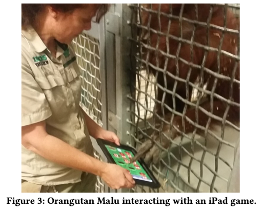
:::
::::::::::::::

## Opportunistic Evaluations

:::::::::::::: {.columns}
::: {.column width="60%"}

- quick feedback about a design idea in the early design process
- confirm whether it's worth developing an idea into a prototype
- informal and doesn't require lots of time or resources
- not a replacement for formal evaluation
- **care required** with ethics in research (Hons, Master, PhD). Asking supervisors and colleagues for advice vs collecting data to establish findings.

**E.g.,** designers ask colleagues for design feedback: Yichen Wang's *arMIDI* system early design process with supervisor and colleagues [@wang2025seeingsound].
:::
::: {.column width="40%"}
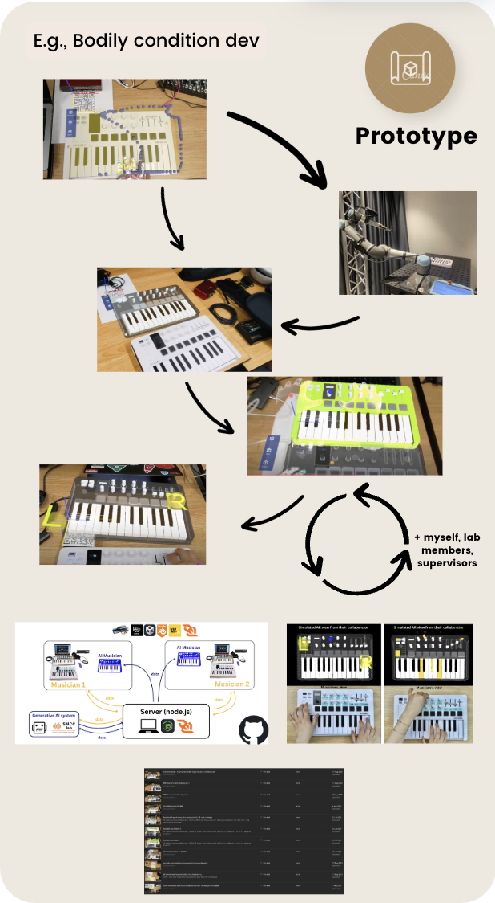{width=50%}
:::
::::::::::::::

## Which methods to choose from?

:::::::::::::: {.columns}
::: {.column width="60%"}

The evaluation setting guides certain dimensions of developed artefacts.

- **Combinations of methods** are used for a richer understanding. E.g., usability testing is combined with observations to identify usability problems and how users use the system.

### Pros and Cons

- **Controlled settings** allow hypotheses testing on specific features for generalised results.
- **Uncontrolled settings** offer unexpected insights into perception and experience of new technologies in daily life and work.

:::
::: {.column width="40%"}
![Lab research on AR co-creative system [@wang2025seeingsound]](img/2024-yichen-studies.jpg)
:::
::::::::::::::

## Activity: Evaluating an interactive toy

:::::::::::::: {.columns}
::: {.column width="60%"}
::: {.talk-box}
**Talk:** 🗣️🎤⭐️ You're all HCI researchers and we need to evaluate this interactive toy.

We need to choose:

- how we will evaluate the toy?
- in what environment?
- what information do we need and why?
- what _research questions_ are being asked?

Talk for 2-3 minutes and then we will hear some answers.
:::
:::
::: {.column width="40%"}
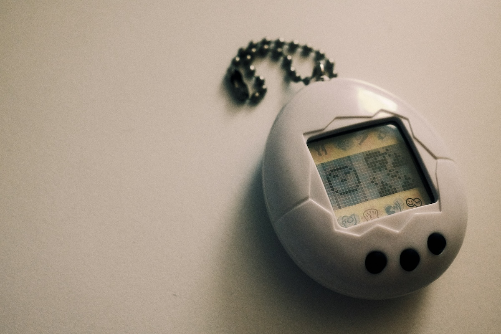
:::
::::::::::::::

# Planning Evaluations {background-image="img/2015-planning-study.jpg" background-size="cover" background-opacity="0.4"}

What do we need to keep in mind to plan evaluations?

## Design and Conduct Issues

- **Reliability:**  how well it produces the same results on separate occasions under the same circumstances
- **Validity:** whether the evaluation method measures what it intended to measure
- **Ecological validity:** how the environment in which an evaluation is conducted influences or distorts results
- **Bias:** occurs when the results are distorted
- **Scope:** how much of the findings can be generalised

## Ethical Issues

- **Risks:** what are the risks to participants? (e.g., physical harm, reputational risk, distressing conversations, being identified etc)
    - ...and how are risks mitigated...
- **Benefits:** what are the benefits to participants? (e.g., none, helping research, fun experience, getting paid, course credit, etc)
- **Consent:** how is informed consent established? (e.g., a participant information sheet and a written form)
- **Data:** how is data stored and who has access to it? what will happen to it over time?

Universities have [processes](https://services.anu.edu.au/research-support/research-ethics-integrity-compliance/human-ethics) to _approve_ the ethical aspects of research that collects data from humans following established rules [@national-statement-ethical-conduct:2025].

We don't go deeply into research ethics in this course but the four issues above are the core ones.

## Developing an evaluation plan

:::::::::::::: {.columns}
::: {.column width="60%"}
- Evaluation Goal/Aims
- Participants
- Setting
- Data to collect
- Methods
- Ethical Considerations and Consent
- Data capture, recording, storage
- Analysis method
- Output(s) of evaluation process
:::
::: {.column width="40%"}
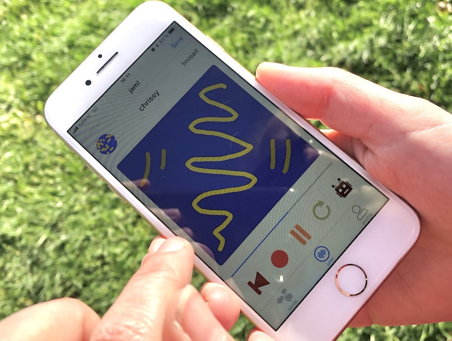
:::
::::::::::::::

## Prepare what you need before the first participant arrives

:::::::::::::: {.columns}
::: {.column width="60%"}

The plan is a document. This is the checklist for the room (or the Zoom call).

- a place for the participant and for you: tables, chairs, power
- the prototype, working, in the state the tasks assume
- printed instructions and task list, so everyone hears the same thing
- data capture ready and tested: video, audio, screen, logs
- consent form and information sheet, signed *before* recording

Then **pilot** it (week 4). Most study failures are "the laptop died" or "we didn't press record".
:::
::: {.column width="40%"}
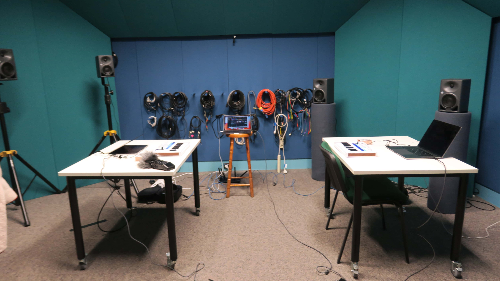{width="100%"}
:::
::::::::::::::

## Experimental Variables

:::::::::::::: {.columns}
::: {.column width="60%"}
- **Independent variable:** the condition the researcher controls.
- **Dependent variable:** the outcome we are measuring.
- **Independent vars in HCI:** different interfaces, input devices, software, colours, computer type
- **Dependent vars in HCI:** efficiency, accuracy, subjective satisfaction, ease of learning, physical/cognitive demands

### Variables shape your study

- **Tasks:** completing specific tasks, or freely using a technology?
- **Interfaces:** just using one interface, or comparing two (or more!) different styles

:::
::: {.column width="40%"}

:::
::::::::::::::

## From a research question to a hypothesis

A hypothesis is a **prediction**: it says what you will change, what you will measure, and which way the result will go.

> RQ: *Is the pads interface faster to a first pattern than the command line?*
>
> H1: *Participants reach a first repeating pattern faster with pads than with the command line.*

- The RQ allows more than one answer. The hypothesis picks one and dares the data to disagree.
- A hypothesis can only be dismissed, never proven: null and alternative guide the test.
- Dismissing one needs a controlled design and significance testing (week 10).

Not every RQ should become a hypothesis. nanojam questions 1 and 3 are better off without one.

## Experiment Design

:::::::::::::: {.columns}
::: {.column width="60%"}
Which participants test which conditions?

1. Different-participant design: each participant sees one condition.
2. Same-participant design: everybody sees each condition.
3. Matched-participant design: matched groups of participants with a shared trait put into each group

- **Balanced Ordering** is important to counter learning effects.
- **Design choices** affects validity and reliability
- **Data collection:** think back to week 4 lecture, but often includes task performance, completion time, errors, subjective satisfaction etc.
:::
::: {.column width="40%"}
{width=60%}
:::
::::::::::::::

## Table of Experimental Designs

::: {.small-table}
| Design | Advantages | Disadvantages |
|---|---|---|
| Different participants (between-participants design) | - No order effects | - Requires many participants - Individual differences can affect results - Random assignment helps minimize differences |
| Same participants (within-participants design) | - Eliminates individual differences between conditions | - Requires counterbalancing - Risk of order effects (e.g., learning or fatigue) |
| Matched participants (pair-wise design) | - No order effects - Reduces impact of individual differences | - Time-consuming to find matched pairs - May miss other influential variables |
:::

## In-the-Wild Studies

:::::::::::::: {.columns}
::: {.column width="60%"}

- Natural setting, minimal control over participants
- reflecting real-world use unpredictable and complex
- Ethical and practical challenges are greater, e.g., participant consent, privacy, equipment issues, and environmental factors.

> Reveal insights about actual use and long-term integration that lab studies often miss.

:::
::: {.column width="40%"}
![Overview of performance-led research in the wild. [@benford2013performancewild]](img/benford-performance-led-in-the-wild.jpg){width="100%"}
:::
::::::::::::::

## People are complicated

HCI is hard. To do a study, you usually need to:

- Plan the study
- Find participants
- Manage communication with them
- Figure out what to do if they don't show up
- Managing a study requires some social skills! It's hard work!

Is there any way to do evaluation _without_ users?

# Evaluation by Inspection

{width=50%}

## Expert Evaluation

- Conducted by designers and design “experts” rather than with end users
- Inspection methods – expert role plays user
- **Heuristic evaluation:** Researchers evaluate whether aspects design adhere to established usability principles (see over)
- **Cognitive walkthroughs:** Simulating user reasoning and problem solving at each step in an interaction sequence (evidence, availability, accessibility of correct action)

Two more ways to evaluate with **nobody in the room**, covered after the case study:

- **Predictive models:** compute the user's performance instead of measuring it (Fitts' law)
- **A/B testing:** thousands of real users, none of whom know they are in a study. Not "without users" so much as without *recruiting* them.

## Nielsen's 10 Usability Heuristics

:::::::::::::: {.columns}
::: {.column width="50%"}
1. **Visibility of system status:** keep the user informed
2. **Match between system and real world:** system uses language and communication familiar to the user, information is natural and logical
3. **User control and freedom:** users make mistakes, there should be "emergency exits" to cancel and return quickly
4. **Consistency and standards:** users should not wonder whether words, situations or actions mean the same thing, follow conventions
5. **Error prevention:** eliminate error-prone conditions, or check with user before they occur
:::
::: {.column width="50%"}
6. **Recognition rather than recall:** make elements, actions, and options visible
7. **Flexibility and efficienty of use:** shortcuts to speed up for experts, allow tailored experiences
8. **Aesthetic and minimal design:** less is more, no unnecessary information
9. **Help users recognise, diagnose and recover from errors:** error messages need plain language, and suggest solutions
10. **Help and documentation:** best if explanation is not needed, if it is, make it good
:::
::::::::::::::

## Activity: Inspect This Interface

:::::::::::::: {.columns}
::: {.column width="42%"}
An internal web app a state emergency agency uses to send public alerts. The officer picks a template, then confirms.

::: {.push-box}
**Do:** You're the expert evaluator. Log every violation of Nielsen's 10 you can see, numbered by heuristic. 3 minutes, then we compare lists.
:::

Decide what's wrong *before* you find out what happened.
:::
::: {.column width="58%"}
![Reconstruction of the alert origination screen, from the FCC report's description [@fcc-hawaii-false-alert:2018].](img/hawaii-alert-menu.png)
:::
::::::::::::::

## Case Study: Hawaii, 13 January 2018

:::::::::::::: {.columns}
::: {.column width="55%"}
- 8:07am, mid-drill: the officer took the drill call for a real one and sent the live template. Same prompt for both, no preview.
- "THIS IS NOT A DRILL" reached 1.4 million phones. No correction template existed; the correction took **38 minutes** [@fcc-hawaii-false-alert:2018].

::: {.success-box}
**The test that would have caught it:** the one you just ran. Heuristics 5 and 9, one evaluator, one hour.
:::
:::
::: {.column width="45%"}
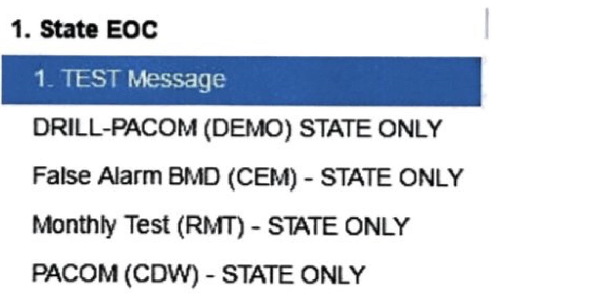
:::
::::::::::::::

## Cheapest first, never cheapest only

::: {.warn-box}
Inspection has a high false-negative rate, and different evaluators find markedly different problems. It "should not be trusted for complex or safety-critical systems" [@hornbaek-intro-hci:2025, section 40.3].
:::

Hawaii's alert system *was* safety-critical. The heuristic pass finds the problems on the face of the screen; it does not find the ones that only appear when a tired officer is mid-drill at 8am.

In Hornbæk's full yardstick table, "comply with guidelines" maps to one method. "Safety" is the row marked *multiple*.

## Shneiderman's Eight Golden Rules of Design

1. Strive for consistency
2. Seek universal usability
3. Offer informative feedback
4. Design dialogs to yield closure
5. Prevent errors
6. Permit easy reversal of actions
7. Keep users in control
8. Reduce short-term memory load

## Activity: Two ways to evaluate nanojam

:::::::::::::: {.columns}
::: {.column width="55%"}
::: {.push-box}
**Do (3 minutes):** open <https://charlesmartin.au/nanojam/#ui.interface=cli> on your own device. You are the expert evaluator. Log every violation of Nielsen's 10 you can find in the command line interface, numbered by heuristic.
:::

::: {.talk-box}
**Watch (3 minutes):** one volunteer, projected, thinks aloud (week 4) while trying to make a repeating pattern on the **pads** interface, no help from me.
:::

Then compare: what did the inspection find that the user never hit? What did the user hit that no heuristic covers?
:::
::: {.column width="45%"}
{width="100%"}

::: {.think-box}
**Think:** which of the three research questions from earlier does each of these studies actually answer?
:::
:::
::::::::::::::

## A/B Testing

:::::::::::::: {.columns}
::: {.column width="65%"}
- An online controlled experiment: users randomly get A (control) or B (new design), usually without knowing. Between-participants, at web scale; week 10 has the statistics.
- **A/A test first:** same page to both groups, so any difference is a setup bug. Office Online's failed because only the treatment was redirected; the delay alone cost page views [@kohavi-online-experimentation-microsoft:2009].
- **Or don't test, and find out later:** Office Online swapped a yes/no feedback question for five stars, lost 80% of responses, and took eight months to notice.
:::
::: {.column width="35%"}
![Bing search ad: control (top) and treatment with a second line of ad text moved into the title (bottom) [@kohavi-trustworthy-experiments:2020]. More in week 10.](img/08_abtest.jpg){width="70%"}
:::
::::::::::::::

## Predictive Models

:::::::::::::: {.columns}
::: {.column width="60%"}
Estimate user performance without needing real users, using formulas to assess task efficiency — useful in early design stages or when testing with users is difficult.

Fitts' Law [@fitts1954information]:

- predicts how long it takes to point at a target based on its size and distance
- helps designers optimize button placement, size, and spacing on screens and devices.
- applications: input methods (e.g., touch, gaze, tilt),  mobile and VR, simulating interactions for users with motor impairments
:::
::: {.column width="40%"}
 (CC-BY 4.0)](img/sketchplanations-fitts-law.jpg)
:::
::::::::::::::

## Evaluation after deployment: adoption, use, and non-use

:::::::::::::: {.columns}
::: {.column width="60%"}
The last yardstick in the table, **compatibility with user practices**, can only be measured after the thing is out in the world. A whole literature asks what "success" means then:

- Adoption/Appropriation/Design-in-use [@ehn-participation:2008]
- Technology acceptance [@davis1989perceived]
- Non-use [@satchell-beyond-user:2009]
- Technology habitation [@soro-older-users:2016]
- Technology individuation [@ambe-individuation:2017]
:::
::: {.column width="40%"}
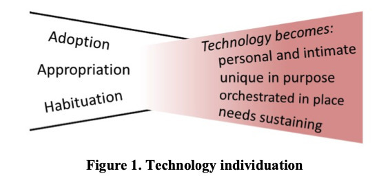
:::
::::::::::::::

# Questions: Who has a question?

:::::::::::::: {.columns}
::: {.column width="60%"}
**Who has a question?**

- I can take _cathchbox_ question up until 2:55
- For after class questions: meet me outside the classroom at the bar (for 30 minutes)
- Feel free to ask about **any aspect of the course**
- Also feel free to ask about **any aspect of computing at ANU**! I may not be able to help, but I can listen.

:::
::: {.column width="40%"}

:::
::::::::::::::

# References {.allowframebreaks}
