## Plan for the class

1. Final Project Details
2. Cognitive Aspects of Interaction
3. Social Interaction
4. Emotional Interaction

# Final Project Details

:::::::::::::: {.columns}
::: {.column width="50%"}
- a complete design and evaluation process for a prototype interactive system.
- design a prototype in response to a real-world problem
- evaluate this system using HCI research methods
- report on the results

**primary submission document: a 5-minute recorded presentation**
:::
::: {.column width="50%"}

:::
::::::::::::::

## Final Project Research Challenge

> **Sustainable living through technology**: You woke up this morning, checked your email, and found that you have a new job---_ANU Student Lead for Sustainable Living_! 

> Your challenge is to help university students adopt sustainable behaviours in their everyday lives guided by the [UN Sustainable Development Goals (SDG)](https://sdgs.un.org/goals) which call for urgent action on climate change, responsible consumption, and sustainable communities. 

> You will need to _choose a focus_ (e.g., energy use, waste reduction, transportation, consumption), _prototype_ and _evaluate_ an interface to make sustainable living more accessible, engaging or effective. Your system should involve a level of non-standard interaction, either through unusual use of standard computer IO hardware, or a novel interface. 

## Final Project Specification

- include documentation of a testable prototype, research question, evaluation plan, data collection, data analysis, and articulation of findings
- include a **video recording** of a presentation which follows the provided headings: `project-presentation.mp4`
- include documentation in `project-documentation.md` which follows the provided headings (**N.B.:** this text may be a transcript of your spoken presentation with references and images, it may also be a slightly different text.)

## Final Project Sections

Your presentation and documentation will have the following sections:

1. **Research Question, Plan, and Conclusions**

2. **Prototype Design and Features**

3. **Research Data, Analysis and Findings**: N.B. you can choose to collect either qualitative, quantitative, or both

4. **COMP6390 Only---Positionality Statement**: critically reflect on your presence and influence within the technology design process in a [statement of positionality](https://smcclab.github.io/thirty-nine-hundred-hci/lectures/06-reflexive-thematic-analysis.html#/reflexivity).

## Video Presentation

:::::::::::::: {.columns}
::: {.column width="50%"}
- clear and concise covering the section headings above
- understandable audio **spoken by you**
- must include **video of your face** while presenting in the presentation
- must include at least 5 but no more than 10 slides
- title slides, personal introductions, tables of contents, reference slides are **not required** (waste of time!)
:::
::: {.column width="50%"}
Suggested recording method: [Microsoft Powerpoint's built-in recording tool](https://support.microsoft.com/en-au/office/record-a-presentation-2570dff5-f81c-40bc-b404-e04e95ffab33)

**no genAI or text-to-speech allowed for the video presentation!**
:::
::::::::::::::

# Cognitive Aspects

{width=50%}

## Cognition

:::::::::::::: {.columns}
::: {.column width="50%"}
A definition from Oxford English Dictionary:

> The action or faculty of knowing taken in its widest sense, including sensation, perception, conception, etc., as distinguished from feeling and volition...
:::
::: {.column width="50%"}
{width=50%}
:::
::::::::::::::

## Cognitive processes

Cognitive processes can change depending on the problem:

- __Experiential Cognition__: 2 + 2 =
- __Reflective Cognition__: 21 x 19 =

## What are cognitive processes?

:::::::::::::: {.columns}
::: {.column width="60%"}
1. Attention
2. Perception
3. Memory
4. Learning
5. Reading, speaking, listening
6. Problem solving, planning, reasoning, decision making

[@eysenck-brysbaert:2023]
:::
::: {.column width="40%"}
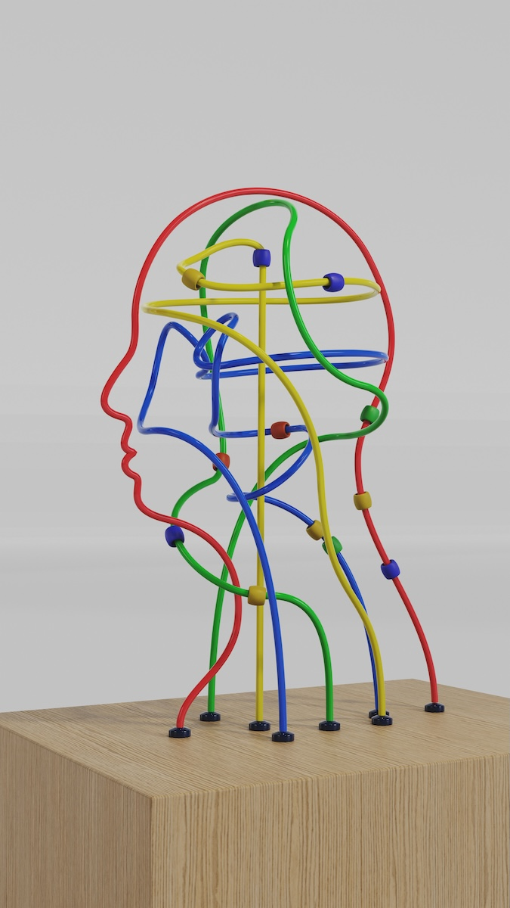{width=50%}
:::
::::::::::::::

## 1. Attention

:::::::::::::: {.columns}
::: {.column width="60%"}
Selecting things to focus on, relevant to our needs,  from possibilities.

- clear goals (directed searching vs browsing)
- information presentation (structure and layout in the interface)
- multitasking and attention
  - depends on individuals and context
  - relevance of distractions
  - effort to task switch
  - designing to support effective multitasking
:::
::: {.column width="40%"}
![Structured text [@rogers-beyond-hci:2023]](img/02_theory_and_concepts_2.png){width=60%}

![Unstructured text [@rogers-beyond-hci:2023]](img/02_theory_and_concepts_3.png){width=60%}
:::
::::::::::::::

## Design Implications for Attention

:::::::::::::: {.columns}
::: {.column width="60%"}
- consider context to make information salient when required
- techniques: animation, colour, ordering, spacing
- avoid clutter
- support switching and returning 
:::
::: {.column width="40%"}
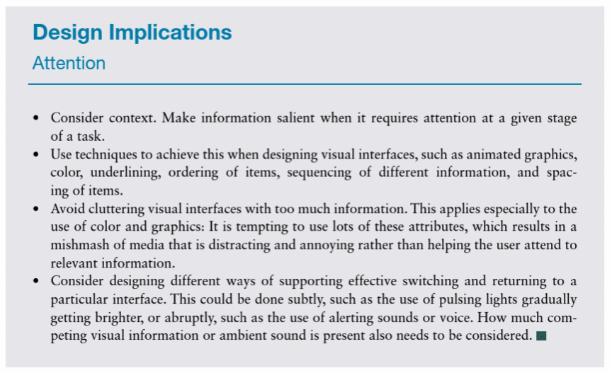
:::
::::::::::::::

<!-- TODO, summarise the image, use a new image -->

## 2. Perception

:::::::::::::: {.columns}
::: {.column width="60%"}
- “how information is acquired from the environment via the five sense organs (vision, hearing, taste, smell, and touch) and transformed into experiences of objects, events, senses, and tastes” (Roth, 1986 in @rogers-beyond-hci:2023 p. 109)
- Proprioception: Awareness of position and movement of body through muscles and joints
- Vision -> hearing -> touch (sighted individuals)
:::
::: {.column width="40%"}
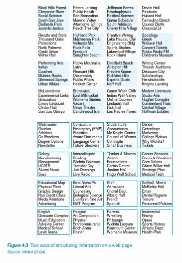

:::
::::::::::::::

<!-- TODO text in image, paraphrase the text. -->

## Design Implications for Perception

:::::::::::::: {.columns}
::: {.column width="60%"}
- design icons and graphics to be distinguished
- white space and separators to group information
- sounds (earcons!) can help distinguish information
- colour contrast is important for perception (and accessibility)
- haptic feedback: use carefully, perhaps in response to user initiated actions
:::
::: {.column width="40%"}
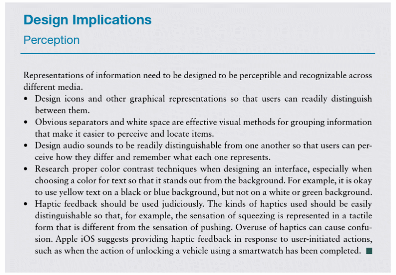
:::
::::::::::::::

<!-- TODO text in image, paraphrase the text. -->

## 3. Memory

:::::::::::::: {.columns}
::: {.column width="60%"}
- brain filters what to remember and what to forget to avoid overload – but not always in the way we want to!
- filtering into memory – depends on encoding process (e.g., active vs passive learning) and context (e.g., seeing someone in a different context)
- people are better at recognition than recall
- relying on technology rather than memory (e.g., car navigation system, “let's ask Claude..”)
- personal information management
- remembering passwords and multifactor authentication
:::
::: {.column width="40%"}
{width=50%}
:::
::::::::::::::

## Design Implications for Memory

:::::::::::::: {.columns}
::: {.column width="60%"}
- avoid long and complex procedures for carrying out tasks
- design interfaces for recognition rather than recall (familiar patterns and consistency)
- provide ways to label digital information for identification
:::
::: {.column width="40%"}
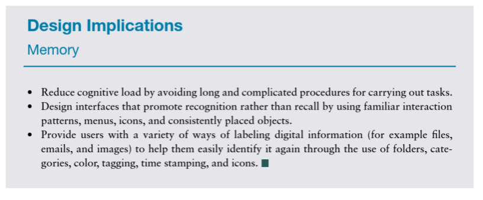

(@rogers-beyond-hci:2023 p.119)
:::
::::::::::::::

<!-- TODO text in image, paraphrase the text. -->

## 4. Learning

:::::::::::::: {.columns}
::: {.column width="60%"}

accumulation of skills and knowledge through memory [@rogers-beyond-hci:2023 p.119]

- incidental learning vs intentional learning
- learning by reading vs learning by doing
- learning through collaboration
- micro-learning
- multimodal learning through new and emerging technologies e.g., augmented reality and virtual reality
:::
::: {.column width="40%"}
![[@hooper-french-kitchen:2012]](img/02_theory_and_concepts_10.jpg){width=50%}

![[@cheng-language-culture:2017]](img/02_theory_and_concepts_11.jpg){width=50%}
:::
::::::::::::::

<!-- TODO text in image, paraphrase the text. -->

## Design Implications for Learning

:::::::::::::: {.columns}
::: {.column width="60%"}
- design to encourage exploration
- design constraints and guide users to appropriate actions
:::
::: {.column width="40%"}
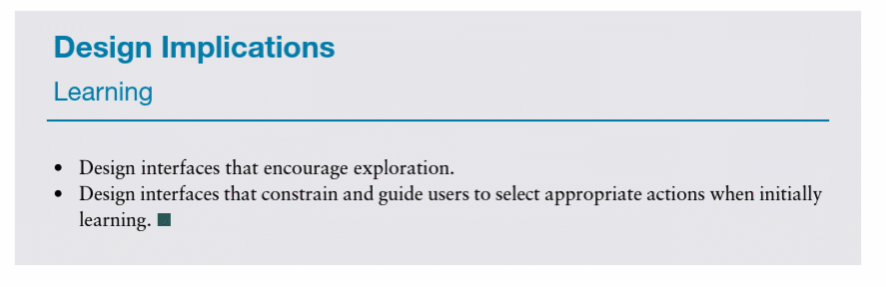
:::
::::::::::::::

<!-- TODO text in image, paraphrase the text. -->

## 5. Reading, Speaking, Listening

:::::::::::::: {.columns}
::: {.column width="60%"}
- communication skills
- meaning the same across modes
- writing is permanent, speaking is transient
- reading quicker than listening
- listening less cognitive effort than reading
- some more grammatical than others
- interactive books, speech technologies, natural language processing, tactile interfaces, assistive technologies
:::
::: {.column width="40%"}
](img/02_theory_and_concepts_12.png){width=50%}

](img/02_theory_and_concepts_13.jpg){width=50%}
:::
::::::::::::::

## Design Implications for Communication

:::::::::::::: {.columns}
::: {.column width="60%"}
- keep length of speech menus to minimum (less than 3-4 options)
- extra intonation on artificial speech
- provide options for making text large
:::
::: {.column width="40%"}
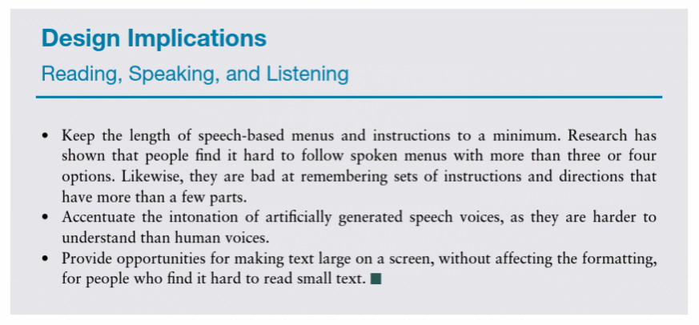
:::
::::::::::::::

<!-- TODO text in image, paraphrase the text. -->

## 6. Problem- Solving, Planning, Reasoning, Decision-Making

:::::::::::::: {.columns}
::: {.column width="60%"}
- Involve “reflective cognition” in relation to actions, choices, consequences
- How do you make purchasing decisions? What role does technology play?

:::
::: {.column width="40%"}
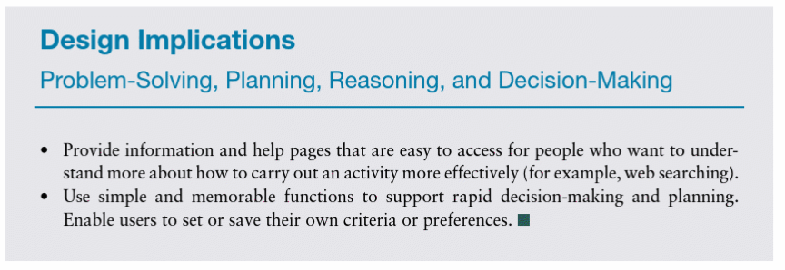

:::
::::::::::::::

<!-- TODO text in image, paraphrase the text. -->

## Activity

<!-- TODO. -->

# Cognitive Frameworks

- Mental models
- **Gulfs of Execution and Evaluation**
- Information Processing
- **External Cognition**
- **Distributed Cognition**
- Embodied Interaction

## Mental Models

<!-- TODO -->

## Gulfs of Execution and Evaluation (Don Norman)

:::::::::::::: {.columns}
::: {.column width="50%"}

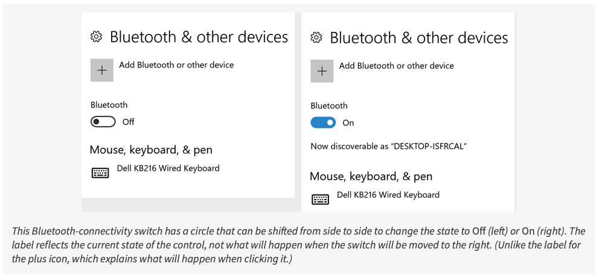
:::
::: {.column width="50%"}
](img/02_theory_and_concepts_19.png)
:::
::::::::::::::

## External Cognition (Scaife and Rogers 1996 in @rogers-beyond-hci:2023

:::::::::::::: {.columns}
::: {.column width="60%"}
- Internal representations (in the head) and external representations (artefacts in the world) and how they interact
- Combined with tools (e.g., pens, calculators, spreadsheets) to support cognitive activities
- External cognition: “the cognitive processes involved when we interact with different external representations” (@rogers-beyond-hci:2023 p.129)
- Reducing memory load, computational offloading, annotating, cognitive tracing
:::
::: {.column width="40%"}

{width=30%}

{width=30%}

{width=30%}
:::
::::::::::::::

## Distributed Cognition

:::::::::::::: {.columns}
::: {.column width="60%"}
- interactions between multiple people and artefacts
- event-driven, systems as the unit of analysis, collective behaviours
- information flows and transformations through the system
- different levels of granularity
- analysis addresses problem solving, communication (verbal and non-verbal), coordination mechanisms, accessing and sharing knowledge
- analysis can inform design implications and decision-making in designing to support distributed cognition

(@rogers-beyond-hci:2023 p.120; @rogers-hci-theory:2012 pp.38-39)
:::
::: {.column width="40%"}
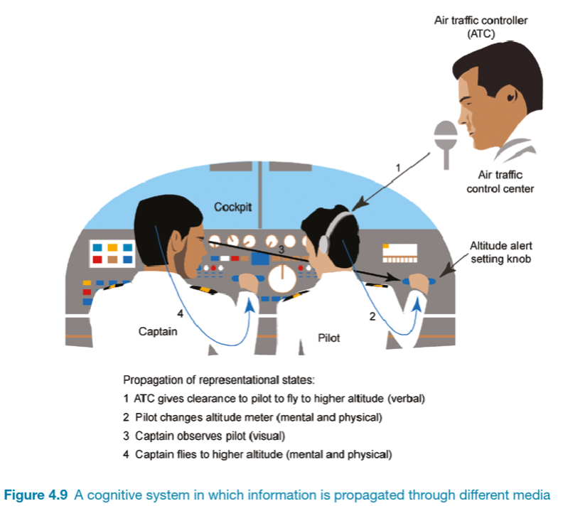
:::
::::::::::::::

# Social Interaction

## Activity: Social human computer interactions

- What are the kinds of situations in which you would phone someone?
- What are the kinds of situations in which you would send someone a text message?
- What leads to the difference?

Introduce yourself to someone nearby, talk for 2-3 minutes, and we'll hear some answers.

<!-- TODO: make this a poll everywhere -->

## Being Social

<!-- TODO -->

## Face-to-Face Conversations

:::::::::::::: {.columns}
::: {.column width="50%"}
Conversational Analysis rules (Sacks 1987):

- Adjacency pairs: setting up an expectation of a response (Schegloff and Sacks 1973)
- Breakdowns and repairs: Breaking rules or missing cues
- Designing conversational user interfaces and to support face-to-face communication

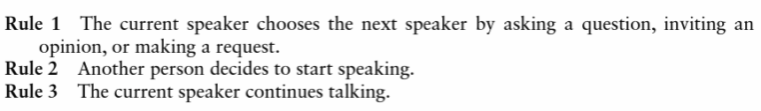
:::
::: {.column width="50%"}
- Collaborative activity involving social skills, rules, norms, and conventions
- Often tacit – people are not actively aware of, or thinking about, following them
- People have different communication styles, backgrounds, and abilities
- Different ways of opening, maintaining, and closing a conversation – implicit and explicit rules

:::
::::::::::::::

## Remote Conversations

:::::::::::::: {.columns}
::: {.column width="60%"}
- phone and video conferencing
- telepresence:  “The perception of being there while physically remote” (@rogers-beyond-hci:2023 p.144)
- telepresence rooms, robots, virtual reality
- features of interaction design can establish a sense of presence and facilitate remote conversation
- social presence: the feeling of _being there_
:::
::: {.column width="40%"}
TODO
:::
::::::::::::::

## Co-Presence

:::::::::::::: {.columns}
::: {.column width="60%"}
supporting people in activities when they are interacting in the same physical space

- supporting effective collaboration
- hand gestures, body language, use of objects
- awareness: knowing what is going on around you, functioning as “close-knit teams”
- shareable interfaces: whiteboards, touch screens
- social translucence: enabling participants and activities to be visible
:::
::: {.column width="40%"}
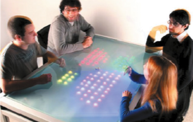{width=50%}

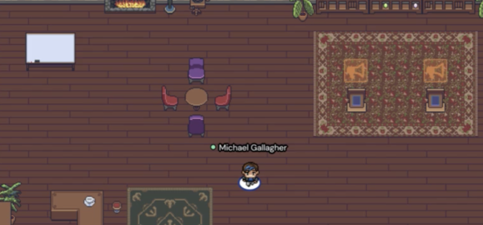{width=50%}
:::
::::::::::::::

## Social Engagement

:::::::::::::: {.columns}
::: {.column width="60%"}
- “Participation in the activities of a social group (Anderson and Binstock, 2012). Often involves some form of social exchange where people give and receive something from others […] voluntary and unpaid” (@rogers-beyond-hci:2023 p.158)
- Connecting people with a common interest – e.g., Twitter battles, viral posts. Digital volunteering – disaster information sharing, citizen science
:::
::: {.column width="40%"}

:::
::::::::::::::

# Emotional Interaction

](img/02_theory_and_concepts_49.jpg){width=50%}

## Emotions and Behaviour

<!-- TODO -->

## A Model of Emotional Design

:::::::::::::: {.columns}
::: {.column width="60%"}
- visceral: look, feel, sound
- behavioural: use (usability)
- reflective: meaning, personal value, culture
:::
::: {.column width="40%"}
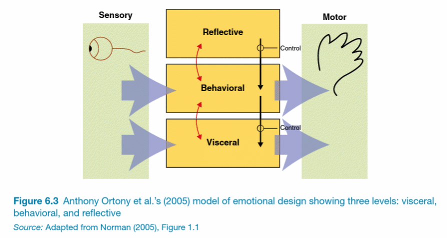{width=100%}
:::
::::::::::::::

## Expressive Interfaces and Emotional Design

:::::::::::::: {.columns}
::: {.column width="60%"}
- design features that seek to create an emotional connection with users or elicit emotional responses in users
- denoting the system state
- expressivity through animated icons, sonofications (sound effects), vibrotactile feedback (e.g., mobile phone or watch buzzing)
- nice looking design affects people’s perceptions of the usability + they are pleasurable to use
- annoying interfaces elicit negative emotional responses (e.g., unable to do the task, feeling patronised, unhelpful, time-consuming to use, intrusive, passive-aggressive)
:::
::: {.column width="40%"}
{width=50%}

{width=50%}
:::
::::::::::::::

## Affective Computing

](img/02_theory_and_concepts_54.png){width=60%}

<!-- TODO what's this about.. -->

## Emotional AI

:::::::::::::: {.columns}
::: {.column width="60%"}
- automating the measurement of feelings and behaviours by using AI technologies
- various sensors and measures
- six fundamental emotions classified by Affdex: Anger, contempt, disgust, fear, joy, sadness
- applications such as improving driver safety (e.g., improving mood and concentration, detecting drowsiness)
- eye-tracking, words and phrases, biometric data (e.g., heart rate)
:::
::: {.column width="40%"}
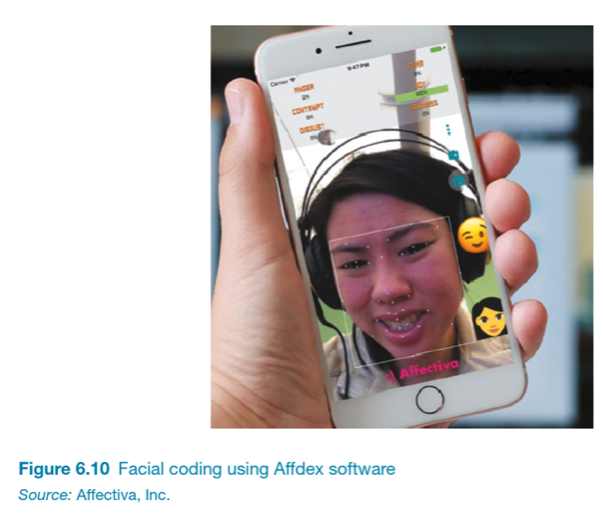
:::
::::::::::::::

## Persuasive Technologies

<!-- TODO -->

## Anthropomorphism

<!-- TODO -->

## Contextual Factors

:::::::::::::: {.columns}
::: {.column width="60%"}
Think about the setting and context in which interaction takes place:

- Who, what, when, where, why, how of your activity
- How technology extends spatial and temporal dimensions
- What the explicit and unwritten rules, norms, conventions, practices are
- How people interact with tools, technologies, and their environment
- How the setting shape the activity and outputs – “situated actions and practices” [@suchman:1987]
:::
::: {.column width="40%"}
](img/02_theory_and_concepts_63.jpg)
:::
::::::::::::::

<!-- TODO does this slide belong here? -->

# Conceptual Design

- Developing a Conceptual Model
- An outline of what people can do and what concepts are needed to understand how to interact
- Need to understand the problem space and users
- Generate ideas based on understanding

## Conceptual Model

- Metaphor, analogies, concepts, relationships, mappings
- How to choose  __interface metaphors__ that will help users understand the product?
- Which  __interaction types__ would best support the users’ activities?
- Do different  __interface types__ suggest alternative design insights or options?

## Interface Metaphors

Choosing metaphors [@erickson-metaphors:1995]

1. Identify functional requirements (what it will do)
2. Which parts are likely to cause users problems?
3. Generate metaphors

Evaluate metaphors: Structure, Relevance, Representation, Understandable, Extensible (Sharp et al., p. 440-441 for example)

## Interaction Types

:::::::::::::: {.columns}
::: {.column width="40%"}
Instructing, conversing, manipulating, exploring, responding

- Which is best, depends on the design
- Most models will include a combination
- Different parts will have different types
:::
::: {.column width="60%"}
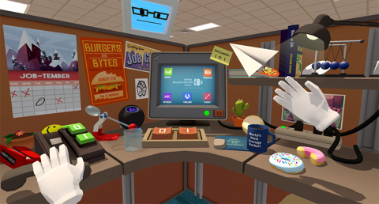{width=100%}
:::
::::::::::::::

## Interface Types

:::::::::::::: {.columns}
::: {.column width="40%"}
- Prompt and support different user experiences / behaviour
- Prototyping will require an interface type or candidates
- Depends on product constraints from requirements
- Input and output modes <- user/context requirements
:::
::: {.column width="60%"}
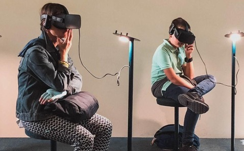{width=100%}
:::
::::::::::::::

## Questions: Who has a question?

:::::::::::::: {.columns}
::: {.column width="60%"}
**Who has a question?**

- I can take _cathchbox_ question up until 2:55
- For after class questions: meet me outside the classroom at the bar (for 30 minutes)
- Feel free to ask about **any aspect of the course**
- Also feel free to ask about **any aspect of computing at ANU**! I may not be able to help, but I can listen.

:::
::: {.column width="40%"}

:::
::::::::::::::

# References {.allowframebreaks}
