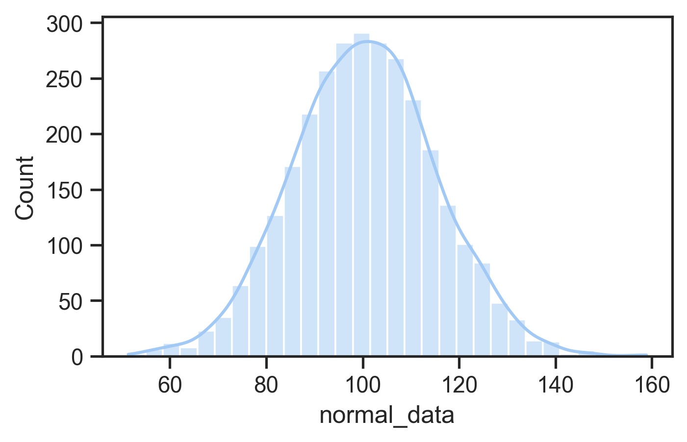
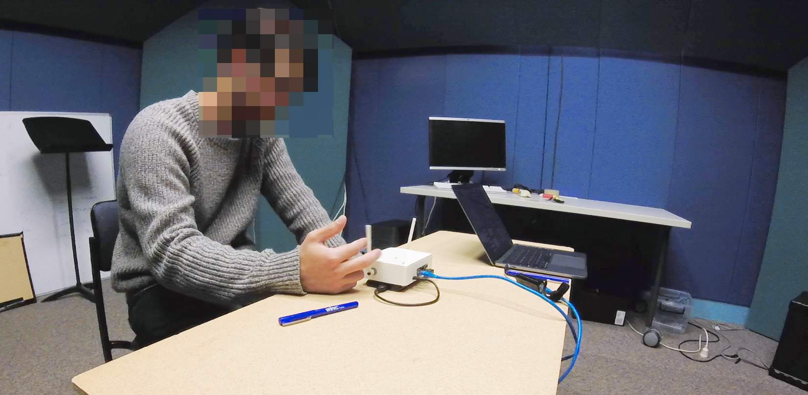

## Announcements

- final project specification available
- final project repo not available yet
- assignment 2: marks out next week.
- week 11: last "tutorial"
- week 12: drop ins (same time) to help with your final project.
- weather is getting nice! go outside! (watch this lecture outside!)

## Plan for the class

1. Performing data analysis in details.
2. Understand the *contexts* of use and *assumptions* of each method.
3. Interpret results *appropriately*.
4. Justify the validity of findings in academic contexts.

Reference book this class is @lazar-research-methods:2017 chapter 4 "Statistical Analysis". This book discusses statistical analysis in the context of HCI (but doesn't show how to do it in Python).

## Preparing Data for Analysis

Week 5 content recap: What data pre-processing do we need to do?

- Manually entered, errors, inconsistent formats.
- Primitive which need higher level coding.
- Specific statistical analysis method or software require layout or format [@delwiche2019little].

## Steps for preparing data

1. Cleaning up data: basic check for manual errors, all data are correctly grouped, remove problematic ones.
2. "Coding" data, sometimes need to manually change data to numerical codes (e.g., Likert scales)
3. Organising data: make sure your data is in sensible formats and can be safely saved for publication or storage.

<!-- Charles does live coding demo -- colab link. -->

## Descriptive Stats Revision

:::::::::::::: {.columns}
::: {.column width="70%"}

- measures of central tendency:
  - describe where most data is clustered, shows the representative characteristic.
  - Mean, median, mode.
- measures of spread:
  - *measuring variability*, tells us how much data values differ from the center.
  - Range, variance, std.
- normal distribution defined by mean and standard deviation
  - Many statistical tests (e.g., t-tests, ANOVAs) assume normality
  - Can use tests or plots to check for normality
  - If not normal: consider data transformation or nonparametric tests

:::
::: {.column width="30%"}
{width=70%}

{width=70%}
:::
::::::::::::::

## Why compare means

:::::::::::::: {.columns}
::: {.column width="60%"}
In an evaluation with two groups or conditions, we want to know whether differences are meaningful or not.

- Between-group design: Different participants in each condition.
- Within-group design: Same participants experience all conditions.

:::
::: {.column width="40%"}

:::
::::::::::::::

## Why Not Just Compare Means?

:::::::::::::: {.columns}
::: {.column width="60%"}
As an example: Is an height difference of 20cm meaningful?

- If talking about adult people, probably yes.
- If talking about mature Eucalyptus trees, probably no.
- Means don’t account for data variance.

So what do we do?

- Significance testing
- Compares explained variance (from independent variable) vs. unexplained variance (random/error).

:::
::: {.column width="40%"}
{width=60%}
:::
::::::::::::::

## What's a _p_-value?

:::::::::::::: {.columns}
::: {.column width="60%"}

- _p_-values are thrown around a lot in some scientific fields
- _p_ is the probability of obtaining a measurement by chance given the existing distribution of measurements.
- low _p_-value = low probability difference occurred by chance: likely a real effect
- low _p_-value is evidence supporting a hypothesis

A typical cut-off for "significance" is $p=0.05$. Is this the best choice?

:::
::: {.column width="40%"}
)](img/p-value.jpg)
:::
::::::::::::::

## What are degrees of freedom?

Significance tests involve estimating probability distributions and a concept called **degrees of freedom (df)** representing the number of independent values that can vary in your analysis while still calculating the statistic you need.

- **how much information you have left** after using some data to estimate parameters. For example, if you know the mean of 10 scores, only 9 can vary freely—the last one is determined.

- **different tests use different df calculations:** for independent samples t-test comparing two groups $df = n_1 + n_2 - 2$

- **few samples leads to low df:** more samples leads to higher df, more complex tests consume more degrees

- **low df leads to higher _p_.** Fewer degrees of freedom requires a stronger test statistic to reach significance because you have less information.

- **df often reported alongside your test statistic** (e.g., $t(28) = 2.45, p < 0.05$) so readers can evaluate analysis and sample constraints

## A Significance Test Menu

| **Test Type**        | **Specific Test**              | **Use Case**                                         |
|----------------------|--------------------------------|------------------------------------------------------|
| **t Test**           | Independent-samples t test     | Between-group comparison (2 groups)                 |
|                      | Paired-samples t test          | Within-group comparison (same participants, 2 conditions) |
| **ANOVA**            | One-way ANOVA                  | 1 independent variable, 3+ groups                    |
|                      | Factorial ANOVA                | 2+ independent variables                            |
|                      | Repeated measures ANOVA        | Same participants across 3+ conditions              |
|                      | Split-plot ANOVA               | Mix of between- and within-subject factors          |

These tests are for _continuous_ (parametric) data, and assume that the data is normally distribution.

## Statistics: _t_-tests

:::::::::::::: {.columns}
::: {.column width="60%"}

- Used in HCI to compare means between two conditions (e.g., menu selection times)
- Include the t-value, degrees of freedom (df), and $p$-value, where df depends on participant numbers, and $p$ indicates the probability the result is due to chance.
- `p < 0.05` (1-in-20 chance of a random result) typically taken as evidence supporting a hypothesis
- smaller p-values (e.g., <0.01) indicating stronger evidence
- independent values: when comparing samples from different participants
- paired values: comparing different observations of the same participants.
:::
::: {.column width="40%"}

```python
from scipy.stats import ttest_ind, ttest_rel

# independent values t-test
t_stat, p_value = ttest_ind(group1, group2, equal_var=False) 
# observations of different participants
print(f"t-statistic: {t_stat:.4f}, p-value: {p_value:.4f}")

# paired-values t-test
t_stat, p_value = ttest_rel(observation1, observation2) 
# different observations of the same participant.
print(f"t-statistic: {t_stat:.4f}, p-value: {p_value:.4f}")
```

:::
::::::::::::::

## Analysis of Variance

:::::::::::::: {.columns}
::: {.column width="60%"}
What if you have more than two groups to compare? (e.g., three+ interface variations?)

What if you have more than one independent variable? (e.g., comparing the individual and combined effects of two separate aspects of an interface)

Analysis of variance (ANOVA) enables these more complicated comparisons.

An ANOVA's output is a statistic called F so sometimes called an _F-test_.
:::
::: {.column width="40%"}
{width=60%}
:::
::::::::::::::

## Different ANOVAs

ANOVAs can be used in lots of situations: between-groups, within-groups, one or multiple independent variables, even multiple dependent variables.

- Need to design experiments carefully for valid statistical analysis.
- Need to take care of the programming API for calling an ANOVA procedure.

Types of ANOVAs:

- One-way ANOVA: comparing means of two or more groups with one independent variable
- Factorial ANOVA: comparing means of two or more groups with multiple independent variables
- Repeated measures ANOVA: comparing means of different observations of one group
- Multivariate ANOVA (MANOVA): comparing multiple means (more than one response variable) of different/same groups

## Assumptions of *t* tests and *F* tests

- Homogeneity of variance: when multiple groups are compared, tests are more accurate if variances of the sample population are nearly equal.
- Use transformation techniques when not.
- Errors should be normally distributed, otherwise highly skewed data result in false results!

## ANOVA examples

One-way ANOVA:

```python
from scipy.stats import f_oneway
import statsmodels.api as sm
from statsmodels.formula.api import ols

# group by 'independent' column and compare dependent column
groups = [group['dependent'].values for _, group in df.groupby('independent')]
f_stat, p_value = f_oneway(*groups)

# create a Model from a formula and dataframe and run anova on that
model = ols('dependent ~ C(independent)', data=df).fit()
anova_table = sm.stats.anova_lm(model, typ=2)
```

Factorial ANOVA:

```python
# factorial anova: example effects of two independent variables and their interaction
# model: tempo ~ key + mode + key:mode
model = ols('dep ~ C(ind_1) + C(ind_2) + C(ind_1):C(ind_2)', data=df).fit()
anova_table = sm.stats.anova_lm(model, typ=2)
```

These examples use the [`statsmodels` package](https://www.statsmodels.org/stable/index.html) which allows more serious statistical modelling for complex experiments.

## Identifying relationships

:::::::::::::: {.columns}
::: {.column width="60%"}
Understand how variables relate to each other (e.g., is age or experience related to performance?)

Correlation:

- Measures the strength and direction of the linear relationship between two variables.
- Most common method: Pearson's $r$: range: −1.00 (negative) to 1.00 (positive). 0 indicates no linear relationship.

Pearson’s $r^2$ (Coefficient of Determination)

- Represents the shared variance between two variables.
- Example: If $r = 0.70$, then $r^2 = 0.49$, meaning 49% of variance in one variable is explained by the other.

:::
::: {.column width="40%"}
Note: correlation not equal to causation!

Imagine an experiment measuring time spent in an online shopping app vs income.

{width="70%"}

E.g., income vs. performance may be correlated due to an intervening variable (e.g., age) rather than directly related.
:::
::::::::::::::

## Regression

Examine the relationship between one dependent variable and one or more independent variables.

Simultaneous (Standard) Regression

- All independent variables entered at once.
- Measures combined influence on the dependent variable.
- Result: $R^2 = \%$ variance explained by all predictors as a group.

Hierarchical Regression

- Variables entered in blocks/steps, based on theory.
- Testing individual predictors after accounting for others (e.g., covariates).
- Controlling for known influences (e.g., age) before testing new variables.

## Nonparametric statistical tests

Many situations where data does not fit the expectations for _t_ or ANOVA tests, e.g.:

- it's categorical
- skewed

Non-parametric tests can help with this data:

- data collected from two independent samples (e.g., between group): Mann-Whitney $U$ test
- two datasets from the same user group - paired-samples t test; otherwise Wilcoxon signed ranks test
- three or more datasets: Kruskal-Wallis one-way ANOVA
  - dependent: Friedman's two-way ANOVA
- Factorial ANOVA: Aligned rank transform ANOVA [@wobbrock-aligned-rank-transform:2011]

## Chi-squared test

:::::::::::::: {.columns}
::: {.column width="60%"}
Helps to analyse categorical data: e.g., a yes/no choice.

Does this look random?

| Group | Yes | No |
| - | - | - |
| A | 5 | 7 |
| B | 11 | 1 |

Results:

- Chi-square statistic: 4.6875
- Degrees of freedom: 1
- _p_-value: 0.0304 ($p < 0.05$)
:::
::: {.column width="40%"}
```python
data = {
    'Group': ['A', 'A', 'A', 'A', 'A', 'A', 'A', 'A', 'A', 'A', 'A', 'A', 'B', 'B', 'B', 'B', 'B', 'B', 'B', 'B', 'B', 'B', 'B', 'B'],
    'Answer': ['Y', 'Y', 'N', 'N', 'Y', 'N', 'Y', 'Y', 'N', 'Y', 'N', 'Y', 'Y', 'N', 'N', 'N', 'N', 'N', 'N', 'N', 'N', 'N', 'N', 'N']
}
df = pd.DataFrame(data)
contingency_table = pd.crosstab(df['Group'], df['Answer'])
print(contingency_table)
chi2, p, dof, expected = chi2_contingency(contingency_table)
print(f"Chi-square statistic: {chi2:.4f}")
print(f"Degrees of freedom: {dof}")
print(f"P-value: {p:.4f}")
```
:::
::::::::::::::

# Case Studies

{width=50%}

## Comparing AI models on a physical musical instrument

:::::::::::::: {.columns}
::: {.column width="60%"}
Research question:

> What effects will different machine learning models and feedback mechanisms have on simple improvised music performances?

"Understanding Musical Predictions with an Embodied Interface for Musical Machine Learning"
@martin-understanding-musical-predictions:2020

:::
::: {.column width="40%"}

:::
::::::::::::::

## IMPSY Experiment Design

:::::::::::::: {.columns}
::: {.column width="50%"}

- 12 participants did a short improvisation with each ML model and with the motor turned on and off.
- Six improvisation for each performer!
- 3 by 2 design
- Used quantitative data to compare the six experiences
- Survey of 8 aspects of the performance
- Measured length of improvisations

:::
::: {.column width="50%"}

|  X       |   Motor off  |   Motor on  |
|----------|--------------|-------------|
|   Human  |   Human/Off  |   Human/On  |
|   Synth  |   Synth/Off  |   Synth/On  |
|   Noise  |   Noise/Off  |   Noise/On  |

:::
::::::::::::::

## Survey Results: ART ANOVA and pairwise t-tests

:::::::::::::: {.columns}
::: {.column width="40%"}

- Change of ML model has significant effect: Q2, Q4, Q5, Q6, Q7
- Human model most "related" and "creative", noise least.
- Noise model not rated badly!

:::
::: {.column width="60%"}

:::
::::::::::::::

## Performance Length

:::::::::::::: {.columns}
::: {.column width="40%"}

- Human and synth: more range of performance lengths with motor on.
- Noise: more range with motor off.

:::
::: {.column width="60%"}

:::
::::::::::::::

## EMPI Takeaways

:::::::::::::: {.columns}
::: {.column width="50%"}

- Studied self-contained intelligent instrument in genuine performance.
- Physical representation could be polarising.
- Performers work hard to understand and influence ML model.
- Constrained, intelligent instrument can produce a compelling experience.
:::
::: {.column width="50%"}

:::
::::::::::::::

## Understanding Touchscreen Music Making

# Questions: Who has a question?

:::::::::::::: {.columns}
::: {.column width="60%"}
**Who has a question?**

:::
::: {.column width="40%"}

:::
::::::::::::::

# References {.allowframebreaks}
