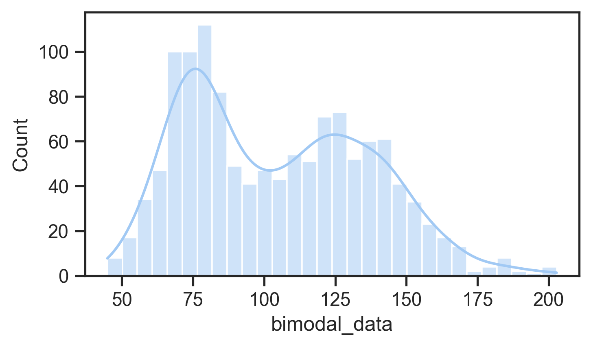

## Announcements

- final project specification available
- final project repo not available yet
- assignment 2: marks out next week.
- week 11: last "tutorial"
- week 12: drop ins (same time) to help with your final project.
- weather is getting nice! go outside! (watch this lecture outside!)

## Plan for the class

1. Performing data analysis in details.
2. Understand the *contexts* of use and *assumptions* of each method.
3. Interpret results *appropriately*.
4. Justify the validity of findings in academic contexts.

## Preparing Data for Analysis

 Week 5 content recap: Why are the needs for data pre-processing?

- Manually entered, errors, inconsistent formats.
- Primitive which need higher level coding.
- Specific statistical analysis method or software require layout or format 
[@delwiche2019little].

## Steps for preparing data

1. Cleaning up data: basic check for manual errors, all data are correctly grouped, remove problematic ones.
2. "Coding" data, sometimes need to manually change data to numerical codes (e.g., Likert scales)
3. Organising data: make sure your data is in sensible formats and can be safely saved for publication or storage.

<!-- Charles does live coding demo -- colab link. -->

## Descriptive Stats Revision

:::::::::::::: {.columns}
::: {.column width="70%"}

- measures of central tendency:
  - describe where most data is clustered, shows the representative characteristic.
  - Mean, median, mode.
- measures of spread:
  - *measuring variability*, tells us how much data values differ from the center.
  - Range, variance, std.
- normal distribution defined by mean and standard deviation
  - Many statistical tests (e.g., t-tests, ANOVAs) assume normality
  - Can use tests or plots to check for normality
  - If not normal: consider data transformation or nonparametric tests

:::
::: {.column width="30%"}
{width=70%}

{width=70%}
:::
::::::::::::::

## Why compare means

:::::::::::::: {.columns}
::: {.column width="60%"}
In an evaluation with two groups or conditions, we want to know whether differences are meaningful or not.

- Between-group design: Different participants in each condition.
- Within-group design: Same participants experience all conditions.

:::
::: {.column width="40%"}

:::
::::::::::::::

## Why Not Just Compare Means?

:::::::::::::: {.columns}
::: {.column width="60%"}
As an example: Is an height difference of 20cm meaningful?

- If talking about adult people, probably yes.
- If talking about mature Eucalyptus trees, probably no.
- Means don’t account for data variance.

So what do we do?

- Significance testing
- Compares explained variance (from independent variable) vs. unexplained variance (random/error).

:::
::: {.column width="40%"}
{width=60%}
:::
::::::::::::::

## What's a _p_-value?

:::::::::::::: {.columns}
::: {.column width="60%"}

- _p_-values are thrown around a lot in some scientific fields
- _p_ is the probability of obtaining a measurement by chance given the existing distribution of measurements.
- low _p_-value = low probability difference occurred by chance: likely a real effect
- low _p_-value is evidence supporting a hypothesis

A typical cut-off for "significance" is $p=0.05$. Is this the best choice?

:::
::: {.column width="40%"}
)](img/p-value.jpg)
:::
::::::::::::::

## A Significance Test Menu

<!-- I like my table more. -->
| **Test Type**        | **Specific Test**              | **Use Case**                                         |
|----------------------|--------------------------------|------------------------------------------------------|
| **t Test**           | Independent-samples t test     | Between-group comparison (2 groups)                 |
|                      | Paired-samples t test          | Within-group comparison (same participants, 2 conditions) |
| **ANOVA**            | One-way ANOVA                  | 1 independent variable, 3+ groups                    |
|                      | Factorial ANOVA                | 2+ independent variables                            |
|                      | Repeated measures ANOVA        | Same participants across 3+ conditions              |
|                      | Split-plot ANOVA               | Mix of between- and within-subject factors          |

## Statistics: _t_-tests

See collab.

- Widely used in HCI to compare means between two conditions (e.g., menu selection times) and test if differences are statistically significant.
- Include the t-value, degrees of freedom (df), and p-value, where df depends on participant numbers, and p indicates the probability the result is due to chance.
- `p < 0.05` typically means the difference is significant, allowing rejection of the null hypothesis, with smaller p-values (e.g., <0.01) indicating stronger evidence.

## Analysis of Variance

See collab.

## Assumption of *t* tests and *F* tests

- Homogeneity of variance: when multiple groups are compared, tests are more accurate if variances of the sample population are nearly equal.
- Use transformation techniques when not.
- Errors should be normally distributed, otherwise highly skewed data result in false results!

## Identifying relationships

:::::::::::::: {.columns}
::: {.column width="60%"}
Understand how variables relate to each other (e.g., is age or experience related to performance?)

- Correlation
  - Measures the strength and direction of the linear relationship between two variables.
  - Most common method: Pearson's r: range: −1.00 to 1.00 (negative, positive, no linear).
- Pearson’s r² (Coefficient of Determination)
  - Represents the shared variance between two variables.
  - Example: If r = 0.70, then r² = 0.49, meaning 49% of variance in one variable is explained by the other.

Note: Correlation ≠ Causation
E.g., income vs. performance may be correlated due to an intervening variable (e.g., age).
:::
::: {.column width="40%"}
{width="70%"}
:::
::::::::::::::

## Regression

Examine the relationship between one dependent variable and one or more independent variables.

- Simultaneous (Standard) Regression
  - All independent variables entered at once.
  - Measures combined influence on the dependent variable.
  - Result: R² = % variance explained by all predictors as a group.
- Hierarchical Regression
  - Variables entered in blocks/steps, based on theory.
  - Testing individual predictors after accounting for others (e.g., covariates).
  - Controlling for known influences (e.g., age) before testing new variables.

## Nonparametric statistical tests

See collab.

## Chi-square test

See collab.

## Others

- Data collected from two independent samples (e.g., between group).
    - Consider Mann-Whitney U test/Wald-Wolfowitz run test.
- Two datasets from the same user group - paired-samples t test; otherwise Wilcoxon signed ramks test.
- Three or more datasets: Kruskal-Wallis one-way ANOVA.
    - dependent: Friedman's two-way ANOVA.

# Case Studies

## Comparing iPad Performances

## Understanding Touchscreen Music Making

## Questions: Who has a question?

:::::::::::::: {.columns}
::: {.column width="60%"}
**Who has a question?**

:::
::: {.column width="40%"}

:::
::::::::::::::

# References {.allowframebreaks}
