## Announcements

- User Research marks and feedback out later this week (goal is Wednesday)
- [Gitlab Template now available for final project](https://gitlab.cecs.anu.edu.au/comp3900/2025/comp3900-2025-research-project)
- Final project due: **2025-10-27 23:59 AEST**
- Remember: main deliverable in the assignment is your presentation video `project-presentation.mp4`
- Demo at end of lecture on [recording a video in Powerpoint](https://support.microsoft.com/en-au/office/record-a-slide-show-with-narration-and-slide-timings-0b9502c6-5f6c-40ae-b1e7-e47d8741161c#OfficeVersion=2013%2C_2016&officeversion=newer_versions).

## Plan for the class

**Should we talk more on study results?**

# Conceptualising Expressive Interactions

why? expressive, artistic experiences can be drivers for HCI.

:::::::::::::: {.columns}
::: {.column width="50%"}
![First head-mounted AR display system [@surtherland1967ar].](img/wk11-ivan-sutherland-headset.jpg){width="70%"}
:::
::: {.column width="50%"}
![Virtual Reality in 1987: The Sound of One Hand performance [@lanier1993sound], [video at Moogfest 2016](https://youtu.be/ItaPqJaUypY?si=VYXOslgb822hMwl0).](img/wk11-jaron-lanier-virtual-hand.jpg){width="100%"}
:::
::::::::::::::

## Supporting Creativity

:::::::::::::: {.columns}
::: {.column width="60%"}
Movement towards studying tools to **support creativity**.

> there is a move from routine work and productive concerns to human and creative ones." [@edmonds-art-of-interaction:2018]

Expression and creativity let us get _inside_ the process of an interaction. People are _interested_ in expressive experiences, leading to critique and understanding.
:::
::: {.column width="40%"}
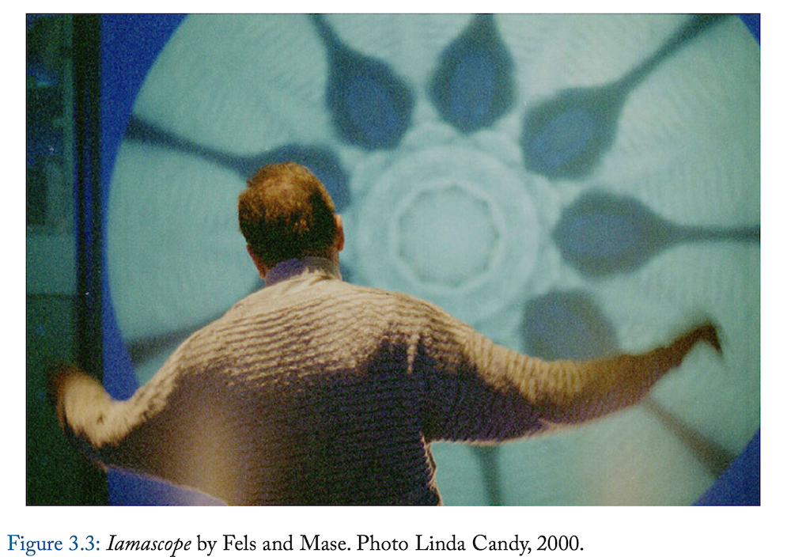
:::
::::::::::::::

## Principles for Creativity Support Tools (CSTs)

@shneiderman-creativity-support-tools:2007 posits principles for developing CSTs

:::::::::::::: {.columns}
::: {.column width="50%"}

1. Support exploration.
2. Low threshold, high ceiling, and wide walls.
3. Support many paths and many styles.
4. Support collaboration.
5. Support open interchange.
6. Make it as simple as possible—and maybe even simpler.

:::
::: {.column width="50%"}

7. Choose black boxes carefully.
8. Invent things that you would want to use yourself.
9. Balance user suggestions with observation and participatory processes. 
10. Iterate, iterate—then iterate again.
11. Design for designers.
12. Evaluate your tools.

:::
::::::::::::::

## Artists as Power Users

Artists are "creative power users" (Linda Candy in @shneiderman-creativity-support-tools:2007).

Artists show us the **boundaries** of human-computer interaction

Studying interactive art gives us insight into the **potential** of creativity support tools in the hands of **experts**.

This translates into findings about "everyday creativity" [@edmonds-art-of-interaction:2018]

> there are three levels of design: standard spec, military spec and artist spec... the third, artist spec, is the hardest (and most important) [@buxton-artists-luthier:1997]

## What is an expressive interaction?

:::::::::::::: {.columns}
::: {.column width="60%"}

Mapping sensed **gestures** to an expressive output that is fed back to the user.

- **gestures:** the use of motions by the limbs or body as a means of expression
- can be unintentional, control, or ancillary gestures
- from non-human actors (e.g.,the movement of a leaves on a branch of a tree)
- *"any sort of motion, that may be understood as an expression of something"*

The interaction itself is expressive, and the output is an expression as well. We consult Composing Interactions [@baalman2022composing] as a resource.
:::
::: {.column width="40%"}
![Sensing movement and touch to create music, Atau Tanaka performing in 2010 [@tanaka-mapping-out-instruments:2010] ](img/virtuoso-atau2010.jpg)
:::
::::::::::::::

## Mapping from Gesture to Output

:::::::::::::: {.columns}
::: {.column width="60%"}
Why is mapping an important consideration?

> Considering a performer performing making gestures on a stage, which gestures effect changes in the output medium of sound, which can be heard by the performer and audience in the real, physical environment.

:::
::: {.column width="40%"}
![The connection between a gesture in the environment to output media [@baalman2022composing].](img/mapping.jpg){width="80%"}
:::
::::::::::::::

## Steps in Mappings

:::::::::::::: {.columns}
::: {.column width="60%"}

@baalman2022composing expands the mapping process into a cycle.

- A gesture is performed in the environment;
- This is captured by a sensor that translates the gesture is processed by an electronic circuit, often to digitalise it;
- Next, the signal enters some sort of computational model that translates the data to parameters;
- These parameters control an output medium such as sound, light, video, or mechatronics.

how is output from one connected to input? what happens in each step?
:::
::: {.column width="40%"}
![Steps in the mapping process [@baalman2022composing]](img/step-in-mapping.jpg){width="90%"}
:::
::::::::::::::

<!-- ## Why are we talking about this?

- expression is a complex HCI design and research problem
- not _just_ for creative applications, expressive interaction is applicable in other devices
- expressive interactions -->

# Drawing Interaction

Surface Drawing system [@schkolne2001organicshape]

- Drawing (hands), moving, scaling, erasing (a pair of kitchen tongs).

:::::::::::::: {.columns}
::: {.column width="40%"}
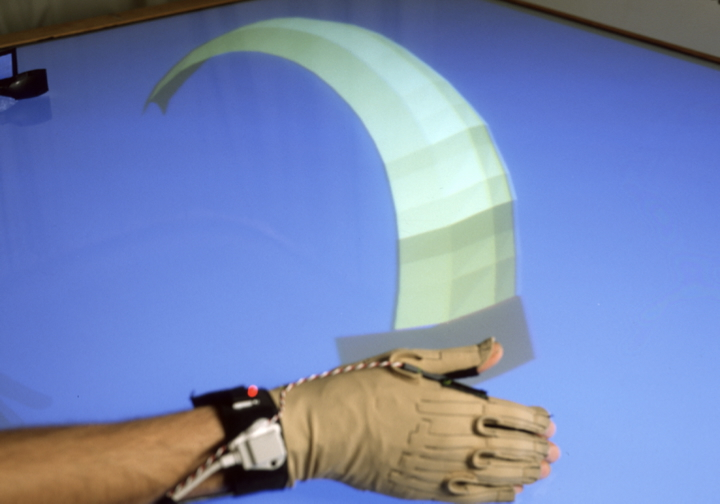{width="40%"}

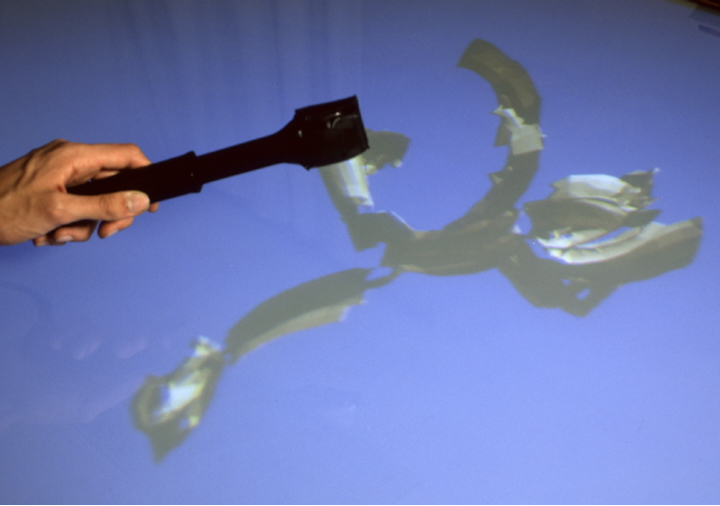{width="40%"}
:::
::: {.column width="60%"}
![A variety of shapes created with Surface Drawing [@schkolne2001organicshape].](img/3d-organicshapes.jpg){width="40%"}
:::
::::::::::::::

## Drawing Interaction

:::::::::::::: {.columns}
::: {.column width="60%"}

- [AirPens: Musical Doodling](https://nime2025.org/proceedings/166.html) 
- Make music with mark-making.
- Use IMU sensors to convert movement into sound; explore different mappings between movement and sound.

:::
::: {.column width="40%"}
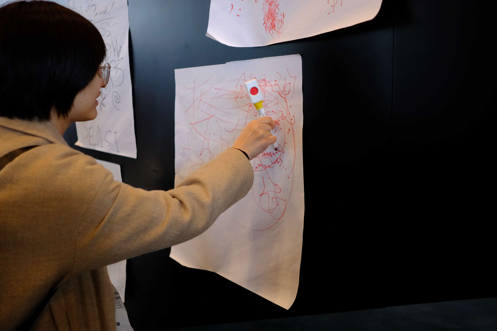{width="100%"}
:::
::::::::::::::

# Music Interaction

:::::::::::::: {.columns}
::: {.column width="60%"}
The [New Interface for Musical Expression (NIME)](https://nime.org) research community.

- Research into musical instrument design that explores how technological innovation can enable new musical expression, enhance performer control and intimacy, and shape the musician–instrument relationship.
- Digital Musical Instruments(DMIs): digital piano, drum pad.
- Augmented instruments: magnetic resonator piano (grand piano -> string instruments).
- Novel instrument: [lady's glove](https://sonami.net/portfolio/items/ladys-glove/), magnetic AI instrument *thales* [@privato2023thales], percussive instrument [PhaseRings](https://charlesmartin.au/projects/phaserings/) [@martin2018phaserings], AR instrument *cube* [@wang-cubing-sound:2022].

:::
::: {.column width="40%"}
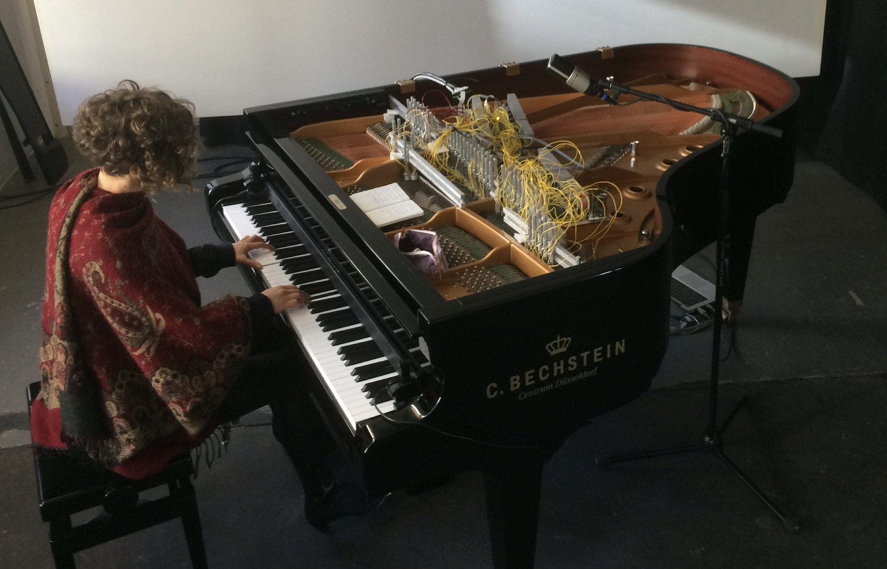{width="80%"}
:::
::::::::::::::

## Music Interaction

:::::::::::::: {.columns}
::: {.column width="70%"}
Design novel gestures for guitar-like instruments.

- When is a Guitar not a Guitar? [@harrison2018guitar]: novel instruments and controllers resemble traditional instruments.
- Four guitar-derivative DMIs design (fixed string sound):
    -  Overall form (guitar-shaped vs. tabletop); Interaction modality (plucked strings vs. touch sensor).
- All was strong for the 'congruent' strings guitar and touch sensor tabletop group.
- Less parity across and between groups for the 'incongruent' touch sensor guitar and strings tabletop group.
- Guitarists prefer technical familiarity of stringed instrument (guitarists).  
- Non-musicians prefer touch-interface: ease of use, cultural load of the guitar form.
:::
::: {.column width="30%"}
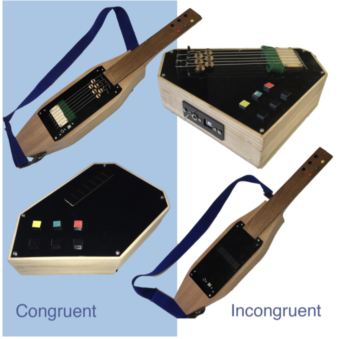{width="80%"}
:::
::::::::::::::

## Music Interaction

:::::::::::::: {.columns}
::: {.column width="60%"}
Design novel expression with technology affordance.

*cube* system: authentic design for a head-mounted AR musical instrument [@wang-cubing-sound:2022]

- Autobiographical design [@desjardins2021firstpersontochi].
- Yichen chose to create an AR interface for frequency modulation synthesis.
    1. Physical Interface: slow accurate manipulation due to hand tracking.
    2. Spatial Interaction: emerged from bodily movement allowing ease of use.
    3. Flexible Freehand Interaction: allow multiple notes to be played simultaneously, taking advantage of the full-hand tracking affordance in the AR headset.
:::
::: {.column width="40%"}
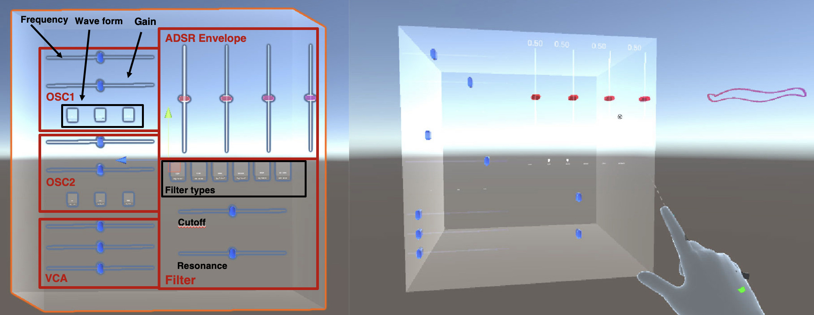{width="80%"}
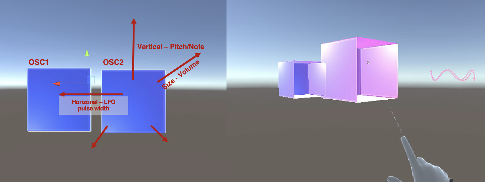{width="80%"}
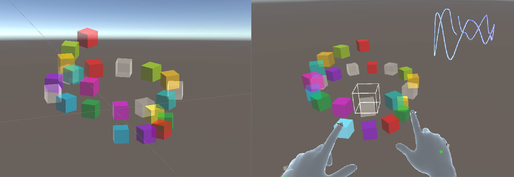{width="80%"}

The system design process.
:::
::::::::::::::

## Music Interaction

:::::::::::::: {.columns}
::: {.column width="60%"}

The gesture-sound mapping.

- Decompose DMI system into the mapping between input actions, sound production and feedback [@wessel2002problems;@mirandawanderley2006dmi].
- Enable novel forms of musical expression through expanded control over sound timbre and texture, leading to a richer and more diverse musical experience [@wessel2002problems;@magnusson2010designconstrain].
- Issues of control intimacy due to mediated gesture and sound relation [@wessel2002problems], a limit on machine-centre approach[@pigrem2018we].
- Call for a dynamic and fluid framework which performer and instrument engage in a mutually influential relationship during the design process [@mcpherson2024mappingnew].

:::
::: {.column width="40%"}

![A common DMI model presenting the separation of a musician’s input action captured by the controller, the mapping engine bridg-
ing the input interface and sound engine [@magnusson2010designconstrain].](img/mapping-model.jpg){width="80%"}

:::
::::::::::::::

# Dance Interaction

From gestures to body (embodied) movements.

CO/DA System [@coda2022chi]:
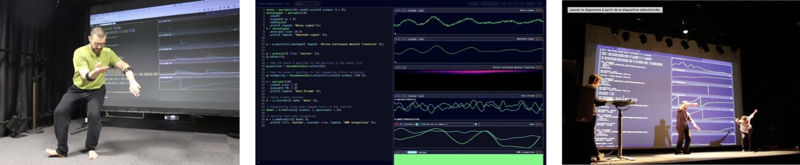{width="70%"}

- Support real-time manipulation of continuous streams of the dancers’ motion data for interactive sound synthesis.
- Enable novel dance improvisations through live coding.
- Live coding: interactively programming musical or visual processes as performance.

## Dance Interaction

<!-- Novelty in terms of expressivity. -->
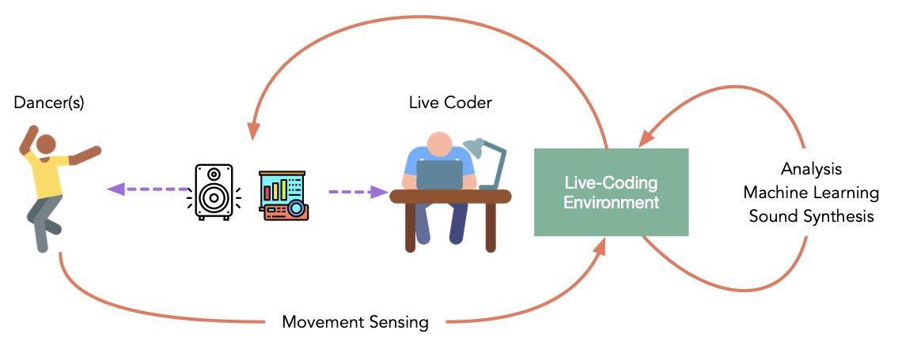{width="60%"}

- Movements are measured using motion sensors, and the live coder processes motion signals to generate feedback in real-time.
- Enable a multitude of feedback loops: sound feedback -> movement improvisation -> the coder alters the relationships between movement and sound.
- Dynamic improvisation that stimulates novel movements' exploration.

# Installed Interactions

:::::::::::::: {.columns}
::: {.column width="60%"}

[Dinosaur Choir: Adult Corythosaurus](https://nime2025.org/assets/preprints/nime2025_music_preprint_270.pdf)

- Singing dinosaur skull musical instruments.
- Aim to realise dinosaur vocalisation:  inspired by recent research to base dinosaur vocal anatomy on the bird syrinx, despite dinosaur vocal organs are still an actively debated question in paleontology.
- Use microphone to capture the voice by users, feeding into a computational vocal model and resonating the sound through a 3D printed replica of the dinosaur’s nasal cavities and skull.
- Change the pitch and timbre of the vocalisation by changing the shape of the mouths, like trumpet player. 
:::
::: {.column width="40%"}
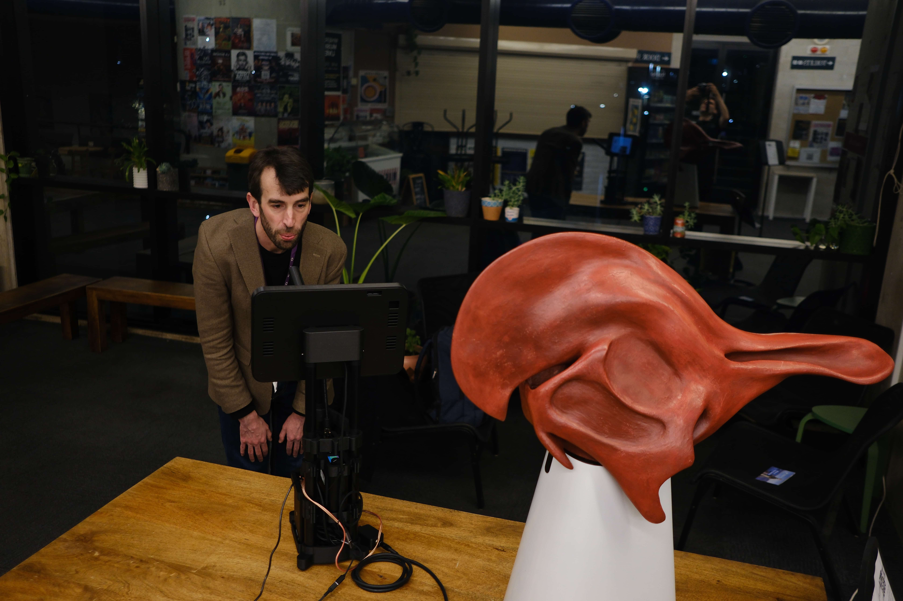{width="100%"}
:::
::::::::::::::

# Playful Interaction

:::::::::::::: {.columns}
::: {.column width="60%"}
> Have you imagined a breath-controlled amusement rides?

- Inspired by robotic technologies for control of individual seats on rollercoasters and other thrill rides.

- How about using breath instead?

- Enhanced bucking bronco ride that balances realism for breadth control and practicability in cost, tourability and safety.

:::
::: {.column width="40%"}
![Falling off the Broncomatic[@marshall2011chi]](img/breath-controlled-rides.jpg){width="60%"}
:::
::::::::::::::

## Playful Interaction

:::::::::::::: {.columns}
::: {.column width="60%"}

- A straightforward mapping: the rider’s breathing to the horizontal rotation of the ride.
    - Inhale: spins clockwise; exhale: spins anti-clockwise.
    - Breathing speed controls rotation speed: fast breathing faster spin; holding breath stops spinning.
    - Difficulty levels.
- The program is a game in which the player scores more points the more that they breathe: a physical challenge vs reward dynamic.
    - More breathing for faster ride but harder to stay on. To score high, you must breathe more, but this makes the ride tougher.
- *Blast theory if Charles you want to talk about it.*

:::
::: {.column width="40%"}
![Falling off the Broncomatic [@marshall2011chi]](img/broncomatic-system-design.jpg){width="70%"}
:::
::::::::::::::

# Human-AI Creative Interaction

:::::::::::::: {.columns}
::: {.column width="60%"}

> Why introduce artificial intelligence?

Computational creativity helps create new ideas in three ways [@boden1998computational]

- Produce novel combinations of familiar ideas;
- Explore the potential of conceptual spaces;
- Make transformations that enable the generation of previously impossible ideas.

Creativity and technology: a sociotechnological perspective [@bown2021beyondcreative].

- The social nature of human behaviour.
- Artistic behaviour is social in nature (is it?)

:::
::: {.column width="40%"}
![Beyond the Creative Species Making Machines That Make Art and Music. [@bown2021beyondcreative] [open-access link](https://direct.mit.edu/books/oa-monograph/5026/Beyond-the-Creative-SpeciesMaking-Machines-That)](img/beyond-creative-species.jpg){width="50%"}
:::
::::::::::::::

## Human-AI Creative Interaction
:::::::::::::: {.columns}
::: {.column width="50%"}
Cobbie system [@lin2020cocreativerobots]

- *Motivation*: Co-creative partner can reason about user's intention and stably present novel ideas with the user initiative, which are hindered in human team due to social loafing or a resolute partner otherwise.
- Take turns to draw ideas, give the dominant position to the user, and use movements and sound feedback for communication.

- Three human-robot interaction:
    - It is your turn
    - Pause and Draw again
    - Progressing with feedback

:::
::: {.column width="50%"}
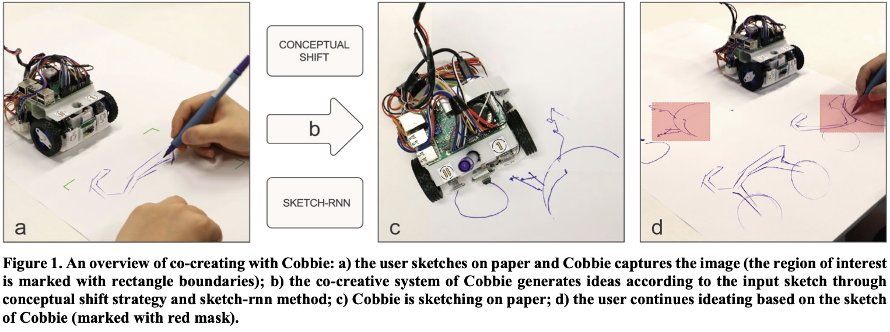{width="100%"}
:::
::::::::::::::

# Human-AI Creative Interaction

:::::::::::::: {.columns}
::: {.column width="60%"}
When AI meets holographic pepper’s ghost:

- Co-creative public dancer [@trajkova2023holographicai;@trajkova2024dance;@long2019lumi]
- Explore the design of the modular AI agent to creatively collaborate with a dancer.
- A Kinect motion capture device to detect the user's motion, visualised as a virtual shadow on a projection screen.
- The humanoid agent shadow dances by analysing the user's movement and responding with a movement that it deems to be similar in terms of parameters such as energy, tempo, or size.
- Study results showed in-the-moment influences, self, partner, environment[@trajkova2024dance].
<!-- charles can read the paper and talks more. -->
:::
::: {.column width="40%"}

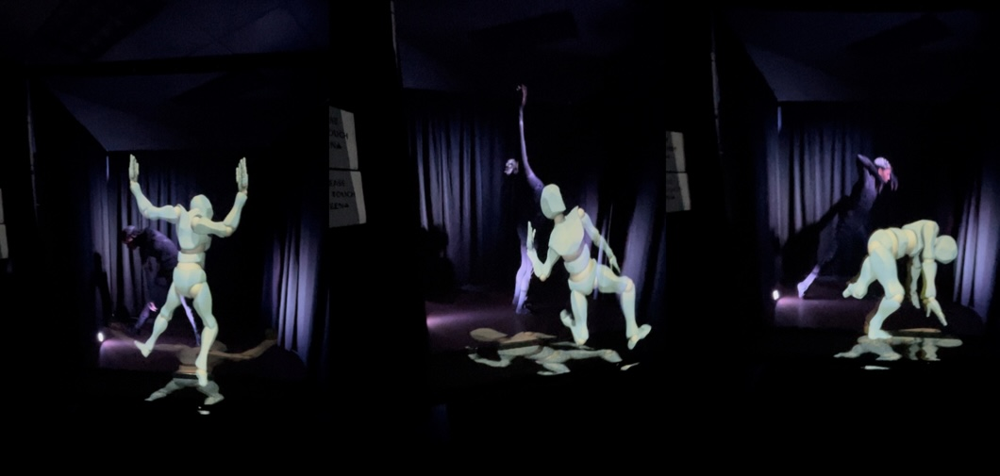{width="90%"}

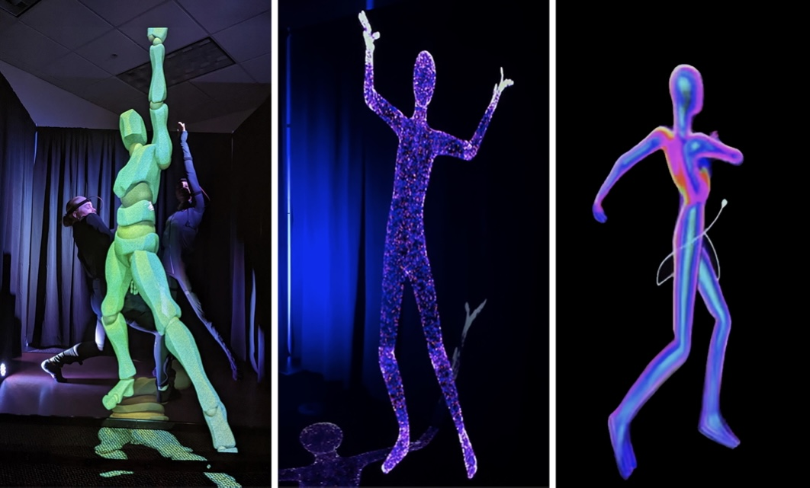{width="90%"}

:::
::::::::::::::

# Recording a video in Powerpoint

:::::::::::::: {.columns}
::: {.column width="50%"}
For the final project you need to record an upload a presentation video. The specification is:

- must be no longer than 5.5 minutes (330 seconds)
- must be no larger than 1920 x 1080 pixels.
- must be narrated with your voice
- must show video of you speaking

You can do this easily with [Powerpoint](https://support.microsoft.com/en-au/office/record-a-slide-show-with-narration-and-slide-timings-0b9502c6-5f6c-40ae-b1e7-e47d8741161c#OfficeVersion=2013%2C_2016&officeversion=newer_versions), so let's give it a try.
:::
::: {.column width="50%"}
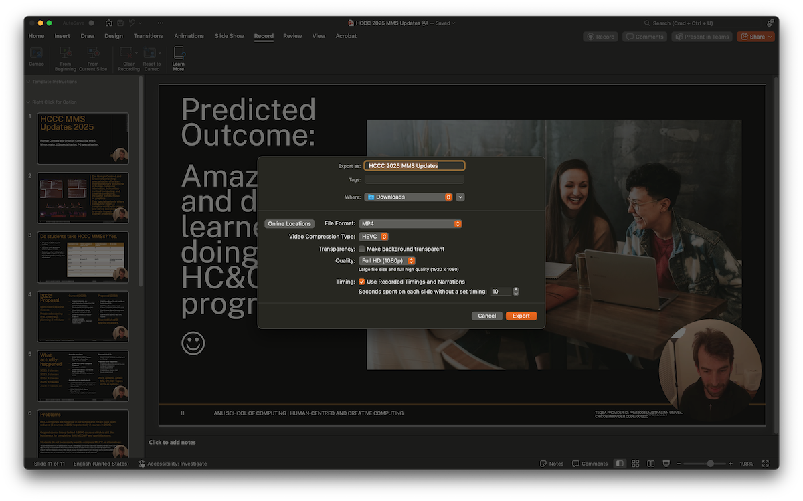
:::
::::::::::::::
 

## Questions: Who has a question?

:::::::::::::: {.columns}
::: {.column width="60%"}
**Who has a question?**

- I can take _cathchbox_ question up until 2:55
- For after class questions: meet me outside the classroom at the bar (for 30 minutes)
- Feel free to ask about **any aspect of the course**
- Also feel free to ask about **any aspect of computing at ANU**! I may not be able to help, but I can listen.

:::
::: {.column width="40%"}

:::
::::::::::::::

# References {.allowframebreaks}
