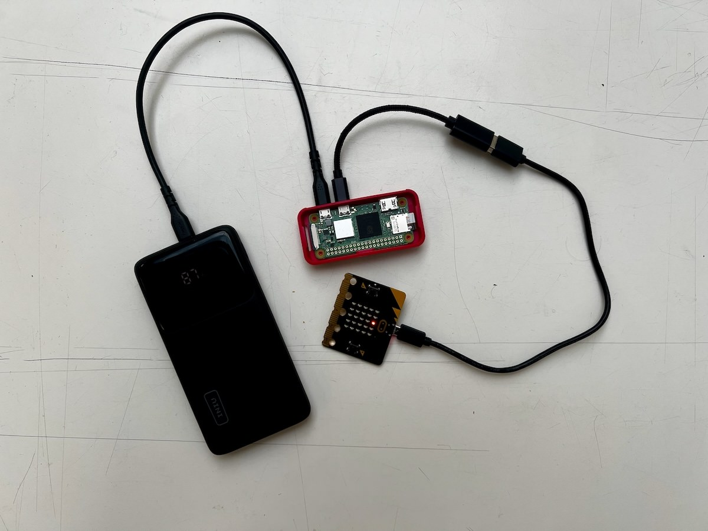

## Announcements

- one week left for your final project
- 

## Plan for the class

- a few notes wrapping up the course
- human-centred AI --- research and design challenge for the future [@shneiderman-human-centered-ai:2022]
- revision on key ideas

## Course Stats:

:::::::::::::: {.columns}
::: {.column width="60%"}
- Max of 330 students (down to ~295) --- **biggest ever HCI class at ANU**.
- Git Commits: 362
- Slides: 550 slides, 36200 words, 368 images
- Tutorials: 10 new tutorials, 11283 words
- Forum:
  - 3K threads, 363 answers, 858 comments.
  - 185K views, biggest viewer viewed 7035 threads (???) (I only viewed 4095!)
  - Charles answered 180+ questions

Takeaway: we wrote the equiv of a PhD thesis this semester (yikes!) 😦
:::
::: {.column width="40%"}

:::
::::::::::::::

# Course Wrap-up

What was this course about again?

:::::::::::::: {.columns}
::: {.column width="50%"}
{width=100%}
:::
::: {.column width="50%"}

:::
::::::::::::::

## core concepts, design, and evaluation


## stakeholders and perspectives

|  | designer | programmer | business manager | researcher |
|---|---|---|---|---|
| **concepts and knowledge** | "what concepts are the basis for my decisions?" | "which parts of software are exposed to user?" | "what heuristics will ensure success?" | "can established knowledge be challenged?" |
| **designing interactions** | "what processes should I follow?" | "how will requirements be established?" | "how can I iterate or pivot to success?" | "how can I find solutions to my research problem?" |
| **evaluating interactions** | "how do I know the user's needs?" | "how can I test user success and experience?" | "what signals tell me if users will buy?" | "how to balance detailed and valid knowledge?" |

Researcher has a hard job here... needs to be a designer, programmer, and business manager where the market is intellectual as well as financial.

## HCI history: The "wave" theory

- First wave: Human Factors in Computing (1980-1992) [@chignell-evolution-hci:2023]
  - Optimising/measuring efficiency, cognitive psychology approach, studying individual users. Lab setting.
- Second wave: Cognitive revolution — mind and computer coupled (1992-2006) [@kaptelinin-postcognitivist-hci:2003]
  - Optimise interactions, hypothesis testing, affordances, activity theory, user-centred design. Work environments.
- Third wave: Situated perspectives [@boedker-third-wave:2015] (2006-)
  - Consumer tech, participation and sharing, pervasive computing, AR, tangible interaction, home environments,
- Fourth wave: Entanglement HCI [@frauenberger-entanglement-hci:2019] (2019-)
  - Computer and humans entangled in society: focus on values, accessibility, diversity, policy, law, ethics, individuals’ and society’s responsibilities

## Usability Goals (Interaction Design, Beyond HCI)

:::::::::::::: {.columns}
::: {.column width="50%"}

- Effective to use (effectiveness)
- Efficient to use (efficiency)
- Safe to use (safety)
- Having good utility (utility)
- Easy to learn (learnability)
- Easy to remember how to use (memorability)

This version from: [@rogers-beyond-hci:2023]
:::
::: {.column width="40%"}
{width=100%}
:::
::::::::::::::

## Design Stages

:::::::::::::: {.columns}
::: {.column width="40%"}

1. _Discover_: understand the problem and the people affected
2. _Define_: define the problem clearly so that it can be addressed
3. _Develop_: create ideas, prototypes, sketches, etc, that might address the problem
4. _Deliver_: test potential solutions to find promising directions, and iterate

:::
::: {.column width="60%"}
![The double diamond model of design [adapted from @double-diamond-model]](img/hci-design-double-diamond.png){width=100%}
:::
::::::::::::::

## What is a sketch?

:::::::::::::: {.columns}
::: {.column width="60%"}

- quick
- timely
- inexpensive
- disposable
- plentiful
- clear vocabulary
- distinct gesture
- minimal detail
- appropriate degree of refinement
- suggest and explore rather than confirm

(@buxton-sketching:2007, p.111-113)
:::
::: {.column width="40%"}
{width=80%}
:::
::::::::::::::

## What is a prototype

:::::::::::::: {.columns}
::: {.column width="60%"}
- _"primitive form"_
- the form that comes before... something.
- in this context: 
  - a _testable_ form
  - a form we can _experience_
- enables evaluation and iteration
- _primitive_: should be somehow rough or limited
:::
::: {.column width="40%"}

:::
::::::::::::::

## Data Gathering: Interviews and Questionnaires

:::::::::::::: {.columns}
::: {.column width="60%"}

- **Interview techniques:** structured, semi-structured, open
- **Questionnaires:** closed, open, rating scale questions
- **Established questionnaires:** Software Usability Survey (SUS), NASA Task Load Index (TLX), Creativity Support Index (CSI)
- **DIY questionnaires** can be tricky to do well!
- All useful, but need to be justified
- Require different types of analysis, both can involve quantitative and qualitative.

:::
::: {.column width="40%"}

:::
::::::::::::::

## Basic Quantitative Analysis

:::::::::::::: {.columns}
::: {.column width="60%"}

- **descriptive statistics**
    - minimum, maximum
    - lower and upper quartile
    - median and mean
    - number of data points (count)
- **plot distribution**
    - **scatter plot:** see all the data! good for checking outliers and comparing aspects of data
    - **boxplot:** useful to compare distributions clearly **charles approved plot!**

These approaches may be enough to make clear research findings!
:::
::: {.column width="40%"}

| stat  | interactive activities |
|-------|------------------------|
| min   | 1                      |
| 25%   | 2                      |
| 50%   | 3                      |
| 75%   | 4                      |
| max   | 5                      |

{width=70%}
:::
::::::::::::::

## Basic Qualitative Analysis: Thematic Analysis

:::::::::::::: {.columns}
::: {.column width="60%"}
Lots of qualitative techniques but our focus is (Reflexive) Thematic Analysis (RTA) [@braun-thematic-analysis:2022], a well-known and accessible methodology.

1. familiarise with the data
2. coding (short labels, multiple rounds)
3. generating initial themes (higher level than codes)
4. developing, reviewing, and refining themes

Your themes become the findings of your qualitative analysis.
:::
::: {.column width="40%"}
's thematic analysis (2025)](img/reflexive-thematic-analysis-yichen-wang-miro-2025.png)
:::
::::::::::::::

## Thin vs thick themes

:::::::::::::: {.columns}
::: {.column width="60%"}
There are different types of themes, and a common distinction:

- Themes that categorise groups of codes: bucket themes, semantic themes, _thin_ themes
- Themes that interpret the codes, revealing hidden information: latent themes, _thick_ themes

Charles (2025; i.e., these slides!) suggests that **4** is a key heuristic for assessing theme thickness. (Disclaimer: may be revised in future!)

:::
::: {.column width="40%"}
Number of words heuristic:

> If your theme is <4 words, it _might_ be a bit thin.

Number of themes heuristic:

> If you are proposing >4 themes, they _might_ be a bit thin.

Source: Charles, 2025. 😬
:::
::::::::::::::

## 45 years of interface types!

:::::::::::::: {.columns}
::: {.column width="50%"}

- Command Line
- Graphical
- Multimedia
- Virtual reality
- Web
- Mobile
- Appliance
- Voice
- Pen
- Touch
- Touchless

:::
::: {.column width="50%"}

- Haptic
- Multimodal
- Shareable
- Tangible
- Augmented reality
- Wearables
- Robots and drones
- Brain-computer
- Smart
- Shape-changing
- Holographic

:::
::::::::::::::

## Cognitive, Social, Emotional Interaction

:::::::::::::: {.columns}
::: {.column width="50%"}
Cognitive Processes [@eysenck-brysbaert:2023]:

1. Attention
2. Perception
3. Memory
4. Learning
5. Reading, speaking, listening
6. Problem solving, planning, reasoning, decision making

:::
::: {.column width="50%"}
Social and Emotional aspects

- conversation (face-to-face vs remote)
- co-presence
- Emotions and behaviour relate
- Models of emotional design
- Affective Computing and Emotional AI
- Persuasive Technologies
- Anthropomorphism

:::
::::::::::::::

## Developing an evaluation plan

:::::::::::::: {.columns}
::: {.column width="60%"}

- Evaluation Goal/Aims
- Participants
- Setting
- Data to collect
- Methods
- Ethical Considerations and Consent
- Data capture, recording, storage
- Analysis method
- Output(s) of evaluation process

:::
::: {.column width="40%"}

:::
::::::::::::::

## Statistical Analysis and Signficance Testing?

:::::::::::::: {.columns}
::: {.column width="50%"}

- going beyond descriptive statistics...
- **significance testing:** quantifying differences in mean
    - $t$-tests: for comparing two means
    - ANOVA: for comparing 3+ means, incl. repeated measures
    - non-parametric alternatives: Mann-Whitney $U$, Wilcoxon signed ranks
    - $\chi^2$ test: comparing categorical data
- correlation analysis
- regression

:::
::: {.column width="50%"}
One-way ANOVA:

```python
from scipy.stats import f_oneway
import statsmodels.api as sm
from statsmodels.formula.api import ols

# group by 'independent' column and compare dependent column
groups = [group['dependent'].values for _, group in df.groupby('independent')]
f_stat, p_value = f_oneway(*groups)

# create a Model from a formula and dataframe and run anova on that
model = ols('dependent ~ C(independent)', data=df).fit()
anova_table = sm.stats.anova_lm(model, typ=2)
```

Factorial ANOVA:

```python
# factorial anova: example effects of two independent variables and their interaction
# model: tempo ~ key + mode + key:mode
model = ols('dep ~ C(ind_1) + C(ind_2) + C(ind_1):C(ind_2)', data=df).fit()
anova_table = sm.stats.anova_lm(model, typ=2)
```
:::
::::::::::::::

## What is an expressive interaction?

:::::::::::::: {.columns}
::: {.column width="60%"}

Mapping sensed **gestures** to an expressive output that is fed back to the user.

- **gestures:** the use of motions by the limbs or body as a means of expression
- can be unintentional, control, or ancillary gestures
- from non-human actors (e.g.,the movement of a leaves on a branch of a tree)
- *"any sort of motion, that may be understood as an expression of something"*

The interaction itself is expressive, and the output is an expression as well. We consult Composing Interactions [@baalman2022composing] as a resource.
:::
::: {.column width="40%"}
![Sensing movement and touch to create music, Atau Tanaka performing in 2010 [@tanaka-mapping-out-instruments:2010] ](img/virtuoso-atau2010.jpg)
:::
::::::::::::::

## Key challenges of HCI research

1. **problem finding:** computers are ubiquitous and everybody[^1] seems to get along with them ok, so where are the problems? Where can we make impact to help people?
2. **design processes:** need them to lead to new contributions, not clones of existing designs. If you are making something new, how do you know what the requirements are? At any scale, design and prototyping is expensive.
3. **evaluation:** working with people is time-consuming and uncertain. Data analysis can easily take months for a research paper.
4. **communication:** after doing _all this work_ (see above), there can be a lot of explain in a paper! Clear communication is a huge challenge. Reviewers love to poke holes in any and all aspect of a design and evaluation process.

Conclusion: HCI research is kinda hard!

[^1]: everybody to some value of people we know about

# What is Human-Centered AI (HCAI)?

{width=50%}

## HCAI

@shneiderman-human-centered-ai:2022 proposes combining human-centred thinking with AI-based algorithms to create HCAI

- increase chance of AI empowering rather than replacing people
- give equal attention to human users and other stakeholders when developing AI systems
- HCAI developers would value meaningful human control
- serve human values: rights, justice, dignity
- goals: self-efficacy, creativity, social connection

## Why is this important?

- AI is the transformational technology of our time _(Charles, 2025)_
- Applying AI well is a _massive_ HCI challenge, probably bigger than any before
- We don't have good enough frameworks to understand HCAI

Evidence:

- lots of AI papers involving humans wrongly sent to CHI conference, frustrating reviewers
- AI collaboration technology currently at the level of CLI (chatGPT) or confusing magical tools (agentic coding, e.g., copilot in VSCode)
- _So many_ research questions in this area.

## How is HCAI different to AI?

@shneiderman-human-centered-ai:2022 points to two differences between AI and HCAI:

1. Process: HCAI builds on user experience design methods (e.g., data gathering, stakeholder engagements, etc.) in use of systems that employ AI and ML
2. Product: HCAI systems supposed to be _supertools_ that amplify, augment, empower and enhance human performance

Critical points here:

- Research methods for AI/ML, primarily statistical/logical modelling, very quant, much different than design methods.
- HCAI _supertools_ emphasise human control and the enhancement of the human's capability and experience, not the AI/ML algorithms capability.
- Examples of _supertools_: digital cameras, navigation systems

## White Robot vs Supertool

:::::::::::::: {.columns}
::: {.column width="60%"}

AI reporting frequently applies simplistic tropes for AI systems.

- "white robot" (technoutopianism)
- "terminator" (technopessimism)
- These tropes mirror people, not computer systems. White robots are naive but noble people (but can be applied badly), terminators are evil people (but can be redeemed)
- Works for stories (about people, not technology) but unhelpful for design

### Supertool

- Shneiderman's "supertool" enables us to consider how AI fits into existing tool use.
- Not a complete solution, still lots of questions and unknowns!

:::
::: {.column width="40%"}
TODO a picture.
:::
::::::::::::::


## Human-Centred AI Structure

:::::::::::::: {.columns}
::: {.column width="50%"}
Three big ideas:

- HCAI framework: guide human-centric thinking for creative design
- design metaphors: practical ideas for designing HCAI systems _(not white robots)_
- governance structures: practice steps to realise ethical principles

Support:

- design aspirations
- individual goals
- human values (most important!)
:::
::: {.column width="50%"}

:::
::::::::::::::

## Foundations in Rationalism and Empiricism

## People and Computers

## Automation, AI, Robots, and Employment

# HCAI frameworks

## Rising above levels of automation

## Defining Reliable, Safe, Trustworthy Systems

## Two Dimensional HCAI Framework

## Design Guidelines

# Design Metaphor

<!-- INTRO / Overview -->
- Reflect on both science and innovation goals.
- Four pairs of design metaphors.
- Balance between automation and human control for reliability.

<!-- Notes for Charles -->
 <!-- key is to combine designs that take an automated approach for tasks that can be carried out reliably, and a user-controlled approach for tasks that users want to manage.
 <!--  -->

## History on Artificial Intelligence:

<!-- can machines think? -->
<!--  a picture of turing test -->
- Charles briefly explains turing test.
- Computers to do what humans do, matching or exceeding human perceptual cognitive, and motor abilities. 
- Pattern recognition such as images, speech, MLP; robotics; emotion recognition; and games (e.g., Alpha Go).
- Statistical approach: GANs, CNN, RNN, and IRL. <!-- inverse reinforcement learning  -->
- Criticisms: brute-force computation; less successful knowledge-based expert systems over engineered rule-based systems; DL approaches.
- **AI is in its early days.**
- **Make AI products with more transparency and human control over the algorithms.**

## Science and Innovation Goals

:::::::::::::: {.columns}
::: {.column width="40%"}
- Understand human perceptual, cognitive, and motor abilities so as to build computers that perform tasks as well as or better than humans. 
    - social robots, common-sense reasoning, affective computers, machine consciousness, and artificial general intelligence (AGI).
- Develop widely-used products and services by applying HCAI methods.
    - supertools, telebots, etc.
<!-- Notes for Charles -->
<!-- Maybe you can discuss these two goals' differences.  More see Printed page 11 in green highlights.-->

:::
::: {.column width="60%"}
{width="100%"}
:::
::::::::::::::

## Examples

:::::::::::::: {.columns}
::: {.column width="60%"}
Autonomous social robots

- Science goals: a general purpose robot elders, parcel delivery, etc.
- Innovation goals: tune solution for each context of use.
<!-- Notes for Charles -->
<!-- More see Printed page 11 in yellow highlights; just think it's good to discuss an example.-->

Online meeting services

- Science: devices / software support collaboration.
- Innovation: Microsoft Teams, Zoom, Google meet.
:::
::: {.column width="40%"}
{width="50%"}
:::
::::::::::::::

## Intelligent Agents and Supertools

Early Perceptions of Computers

- 1940s–1950s: Computers were labeled "awesome thinking machines" and "electronic brains".
- Dianne Martin: Argues that such myths slowed workplace acceptance and created unrealistic expectations[@martin1933myth].
- Alan Turing (1950):
    - Introduced "Can Machines Think?" [@turing1950computing].
    - Proposed the Turing Test (aka the imitation game).
    - Envisioned machines competing with humans in intellectual fields.
- Debate: a deceptive metaphor rather than a meaningful test[@natale2021deceitful].

## Various Perspectives

Human–Computer Symbiosis (1960) [@licklider1960man]

- Computers and humans as collaborative partners.
- Humans make decisions; computers handle routine tasks.

AI Language & Metaphors

- Terms like smart, intelligent, thinking have influenced public perception.
- AI described using neuroscience metaphors (e.g., neural networks).
- IBM Watson: Marketed under "cognitive computing", later shifted to "augmented intelligence" for clarity.
- Google PAIR: Focus on People and AI Research, emphasising human-centered design.

## Pop Culture Influence

:::::::::::::: {.columns}
::: {.column width="60%"}
Media & Popular Culture Influences

- Journalists & magazines (e.g., Newsweek, Time) popularised ideas of thinking machines and robots replacing jobs.
- Graphic art & Hollywood films (e.g., 2001: A Space Odyssey, The Terminator, Her, Ex Machina) reinforced human-like AI images.

Human-Centered Perspectives

- Portrayed as independent actors or agents (“who”).
- Warn again terms such as know, read, explain, but to **empower**, not replace humans[@rusdaniela2020].

:::
::: {.column width="40%"}
.](img/hal-9000.jpg){width="100%"}
:::
::::::::::::::

## Towards Good Design

Human–AI Design Debate: automation vs direct user control [ref]
<!-- - Shneiderman: Emphasised user control via direct manipulation (buttons, sliders, etc.).
- Maes: Advocated for proactive software agents that anticipate user needs. -->

Industry Design Guidelines on user control, flexibility, accessibility.
<!-- Guidelines from Apple, IBM, Microsoft: -->
<!-- User Control: “People—not apps—are in control.”
Flexibility: Users need fine-grained control.
Accessibility success story: A blind woman using a laptop to do professional work on a flight. -->

AI in Conferences & Applications:

- Science Goal (AI researchers): Automated performance (e.g., self-driving cars, reading x-rays).
- Innovation Goal (HCAI researchers): Promote human-supervised tools (e.g., SIGCHI, UXPA, Augmented Humans conferences) such as digital cameras.

> Combine intelligent agents with human-controlled tools to ensure trust, usability, and control


## Teammates and Tele-bots

Emotional and social traits are desirable, inspired by human–human interaction: 

*Consider* tele-bots (human-controlled, tool-like systems) over human-like social "teammate" [ref].

-  Unmet expectation to disappointment.
- False beliefs about robot autonomy/responsibility.
- Emotional attachment can mislead usage.

Ten realistic challenges to making machines as human teammates [ref].

## Design for Tele-bots

Responsibility

- Robots are not morally or legally responsible agents.
- Human operators remain accountable.
- E.g., unmanned autonomous/aerial vehicles to remotely piloted vehicles in the military. NASA Mars Rovers.
<!-- controlled by large human teams despite autonomy. -->

Distinctive capabilities

- Leverage what machines do better, don't copy humans.
- Use:
    - Visualisations (e.g., color-coded 3D echocardiograms).
    - Data dashboards (e.g., Bloomberg Terminals).
    - Responsive controls (e.g., DaVinci surgical system),

## Design for Tele-bots cont.

Human creativity

- Tools should support human innovation, not replace it.
- Enable users to fix, personalise, provide feedback for future design iterations.

Key takeaway:
Combine human control, automation AI assistance (e.g., recommendations, sensors) for more effective tele-bots design.

## Assured Autonomy and Control Centers

> Supervised autonomy and control centers offer a more reliable, safe, and trustworthy design path, over computer autonomy.

What is Autonomy?

- Delegation of a decision to an authorised entity to take action within specific boundaries” [ref].
- Not automation.
<!-- Systems governed by prescriptive rules that permit no deviations are automated, but they are not autonomous. -->
- Not a solution to any problem and always involves human supervision.

Real Risks Examples

- Billion-dollar crashes from high-speed financial trading.
- Tesla Autopilot crash[ref].
- Boeing 737 MAX crashes 
<!-- (2018–2019) from MCAS system acting “without even informing the pilots.” -->

## The Ironies of Autonomy
<!-- image -->

- Workload increased.
    - Have you experienced that when using genAI in your life?
- Users must remain vigilant yet are unsure of what the computer will do.
- De-skilling occurs when need to take over operations.

## Consider Supervised Autonomy!
<!-- image -->
Implement

- Control panels and remote control centers.
- Visual monitoring, audit trails, and feedback.
- Retrospective analysis of failure data.

Examples:

- Aviation: pilots, co-pilots, TRACON, ARTCC, FAA certification, NASA Rovers.
- Healthcare: ICU monitoring.
- Social media / e-commerce: alerts, feedback, interlocks.

... and *Parallel Autonomy* which humans are in control… the computer will act to prevent accidents.

## Social Robots and Active Appliances
<!-- KEY TAKEAWAY -->
- Comparison of social (anthropomorphic) robots and active appliances.
- The history, design challenges, and market success/failure.
- Practicality over novelty.

## Historical Roots & Cultural Fascination

- Human-like figures dates back to ancient myths (e.g., Golem, Frankenstein), early automata, literature.
- Typically, humanoid face, arms, legs, voice to be emotive and engaging for children.
- Repeated failures: gimmicky, unrealistic addressing real needs.
<!-- Found a fun example picture. -->
<!-- Microsoft BOB and Clippy – overly intrusive and annoying
Postal Buddy, Tillie the Teller – rejected by users
Asimo (Honda), Sophia (Hanson Robotics) – great media stunts, little commercial impact
Jibo, Anki, Mayfield Robotics – shut down due to unsustainable business models -->

## Animal Robots
E.g., Sony AIBO, PARO. 

- Emotional connection without overpromising intelligence.
- Simpler, clearer use cases (e.g., therapy, companionship).
- Avoids ethical concerns tied to humanoid robots.

## Practical Robots in Daily Life

Devices that perform household tasks with some autonomy: dishwashers, pool cleaners, security systems.

- Integration of sensors, automation, and machine learning.
- Improved user interfaces (e.g., smartphone apps, touchscreens)
- Increasingly “robot-like” without anthropomorphic form.

<!-- Picture: Roomba -->

Challenges:

- Lack of standardised controls across devices.
- Poor interface consistency, especially for: setting timers, health monitoring devices.
<!-- this one is so werid, Charles, I don't get it. -->
- Opportunity for improvement in user control, feedback, and error reporting

## The Future of Social Robots

Over-optimism about social robots.

Academic reports are mixed: user satisfaction and sometimes
delight; preference for tool-like designs.

Fear of Autonomous Robots and AI [reference]: 20.1% minor issue & 18.5% for serious over 1489 participants.

Uncanniness: near-human designs often feel unsettling or untrustworthy.

Predictable, user-controlled systems [apple]

Design for real and practical needs, domains in voice virtual assistants, low error chatbots, 

*"There is no good reason for robots to have humanoid form … they represent a form of dishonesty"*

*Long-term studies to understand what solutions remain appealing and useful over time.*

# Governing Structure
<!-- fun image -->
We need actionable governance, ethical principles are not enough.

AI misinformation and misuse.

Require multi-level governance—team, organisation, industry, and government.

Four Levels of Governance for HCAI:

- Reliable systems through software engineering teams
- Safety culture in organisations
- Trustworthy certification via industry oversight
- Regulation by government agencies


## How to bridge the gap from ethics to practice? 

:::::::::::::: {.columns}
::: {.column width="60%"}
> What we need to govern is the human application of technology, and what we need to oversee are the human processes of development, testing, operation, and monitoring. [ref]

Design and evaluation methods in HCAI are essential tools for addressing these dangers and realising the benefits.

Charles explains the figure. 
:::
::: {.column width="40%"}
{width="100%"}
:::
::::::::::::::

## Traditional AI vs. Human-Centered 

| **Traditional AI** | **Human-Centered AI (HCAI)** |
|--------------------|------------------------------|
| Build AI algorithms and systems, stressing the autonomy of machines | Emphasises human autonomy through well-designed user interfaces |
| Research human behaviour study and emulation | Build on AI foundations to amplify, augment, and enhance human performance |
| Benchmarks on algorithm performance | Elevates human performance and satisfaction |
| Less engagement with end users in early design phases | Advocates user-centered participatory design by engaging diverse stakeholders |
| Success defined by technical functionality | Success defined by how well systems support human goals, activities, and values |
| Priority on machine intelligence and control | Ensures meaningful human control and values customer and consumer needs |


## Reliable Systems Based on Sound Software Engineering Practices

Clarify human responsibility.

Improved software engineering workflows tuned to the tasks and application domain.

Testing, user experience design for explainable interface.

- Audit trials and analysis tools
- Software engineering workflows: attune to AI-specific testing and validation.
- Verification and validation testing: strengthen what users expect over unexpected harms.
- Bias testing to enhance fairness: algorithms on opacity, scale and harm.
- Explainable user interfaces:  
    - prevent the need for explanations.
    - visual design.

## Safety Culture through Business Management Strategies    

Preparing for failure:

- Normal accident theory [Charles Perrow].
- High reliability organisations.
- Resilience Engineering [David Woods].
- Safety Cultures: promote safety mindset and open management strategies.

Five Management Actions:

1. Leadership Commitment to Safety
2. Hiring and Training Oriented to Safety
3. Extensive Reporting of Failures and Near Misses
4. Internal Review Boards
5. Alignment with Industry Standard Practices


## Charles, do you want to discuss a real-world example?

Tesla’s reported fatalities


## Trustworthy Certification by Independent Oversight

:::::::::::::: {.columns}
::: {.column width="60%"}

Independent oversight for safety, reliability and public acceptance.

Assign liability to who are involved in the design, operation, and maintenance of AI systems.

Methods:

1. Planning Oversight: Review systems before deployment.
2. Continuous Monitoring: Ongoing inspection and evaluation.
3. Retrospective Analysis: Post-failure reviews.
:::
::: {.column width="40%"}
{width="100%"}
:::
::::::::::::::

## Use Cases

- Accounting firms conduct external audits for HCAI Systems: big four are positioned to lead the work.
- Insurance companies compensate for failures, e.g., industry-specific insurance models.
- Non-Governmental Organizations (NGOs), e.g., [Algorithmic Justice League](https://www.ajl.org).
- Professional organisations and academic institutions: [IEEE P7000 series standard](https://standards.ieee.org/ieee/7000/6781/), ACM, AAAI, Oxon, University of Cambridge, Stanford, etc.


## Questions: Who has a question?

:::::::::::::: {.columns}
::: {.column width="60%"}
**Who has a question?**

- I can take _cathchbox_ question up until 2:55
- For after class questions: meet me outside the classroom at the bar (for 30 minutes)
- Feel free to ask about **any aspect of the course**
- Also feel free to ask about **any aspect of computing at ANU**! I may not be able to help, but I can listen.

:::
::: {.column width="40%"}

:::
::::::::::::::

# References {.allowframebreaks}
