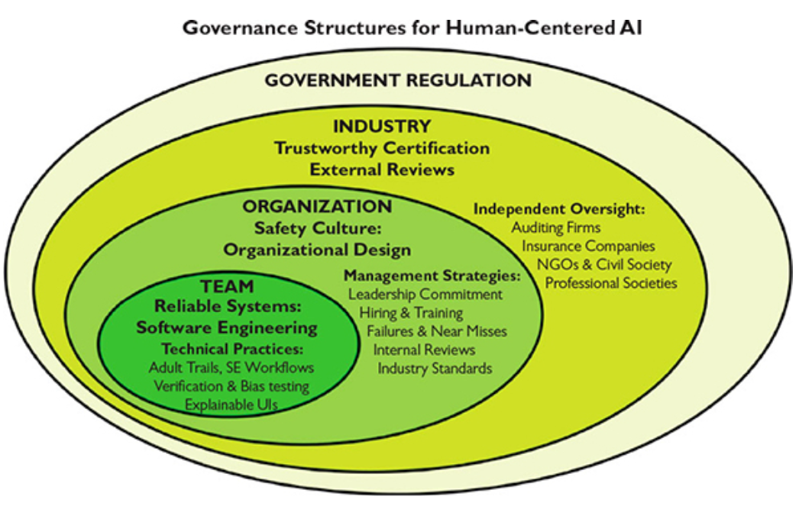
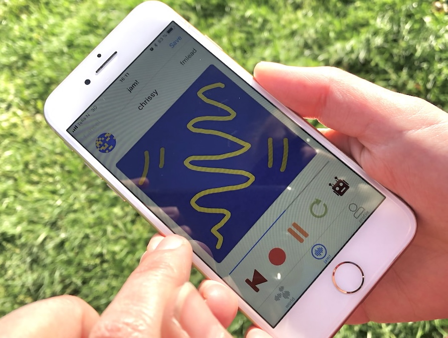

## Announcements

- all tutorial marks have been entered.
- congrats to those (107) legends who **maxed** out 100% on tutorials!
- [SELT](https://services.anu.edu.au/learning-teaching/education-data/student-experience-of-learning-teaching-selt/information-for-students) should be open this Week (??) --- fill in your SELT!
- Your SELT is a gift to future students, and gives me confidence to advocate for good practice!

### Final Project

- brings all skills from the course together
- idea is that these are mini HCI-research papers
- prepare you for further research, exploration in HCI and assess all skills in the course
- **one week left for your final project**
- let's look at the forking numbers for the [assignment repo](https://gitlab.cecs.anu.edu.au/comp3900/2025/comp3900-2025-research-project)

## Plan for the class

:::::::::::::: {.columns}
::: {.column width="60%"}
- a few notes wrapping up the course
- human-centred AI --- research and design challenge for the future [@shneiderman-human-centered-ai:2022]
  - basically covering the content of this book, available for free via library and online.
- revision on key ideas
:::
::: {.column width="40%"}
{width=70%}
:::
::::::::::::::

## Course stats

:::::::::::::: {.columns}
::: {.column width="60%"}
- Max of 330 students (down to ~295) --- **biggest ever HCI class at ANU**.
- Git Commits: >370
- Slides: 565 slides, 38185 words, 386 images
- Tutorials: 10 new tutorials, 11283 words
- Forum:
  - 3K threads, 363 answers, 858 comments.
  - 185K views, biggest viewer viewed 7035 threads (???) (I only viewed 4095!)
  - Charles answered 180+ questions

Takeaway: we wrote the equiv of a PhD thesis (~50K words) this semester---yikes! 😦
:::
::: {.column width="40%"}

:::
::::::::::::::

# What is Human-Centered AI (HCAI)?

{width=50%}

## HCAI

@shneiderman-human-centered-ai:2022 proposes combining human-centred thinking with AI-based algorithms to create HCAI

- increase chance of AI empowering rather than replacing people
- give equal attention to human users and other stakeholders when developing AI systems
- HCAI developers would value meaningful human control
- serve human values: rights, justice, dignity
- goals: self-efficacy, creativity, social connection

## Why is this important?

- AI is the transformational technology of our time _(Charles, 2025)_
- Applying AI well is a _massive_ HCI challenge, probably bigger than any before
- We don't have good enough frameworks to understand HCAI

Evidence:

- lots of AI papers involving humans wrongly sent to CHI conference, frustrating reviewers
- AI collaboration technology currently at the level of CLI (chatGPT) or confusing magical tools (agentic coding, e.g., copilot in VSCode)
- _So many_ research questions in this area.
- news preoccupation with risks of AI taking over, not capacity of actual products

## How is HCAI different to AI?

@shneiderman-human-centered-ai:2022 points to two differences between AI and HCAI:

1. **process:** HCAI builds on user experience design methods (e.g., data gathering, stakeholder engagements, etc.) in use of systems that employ AI and ML
2. **product:** HCAI systems supposed to be _supertools_ that amplify, augment, empower and enhance human performance

Critical points here:

- Research methods for AI/ML, primarily statistical/logical modelling, very quant, much different than design methods.
- HCAI _supertools_ emphasise human control and the enhancement of the human's capability and experience, not the AI/ML algorithms capability.
- Examples of _supertools_: digital cameras, navigation systems

## White Robot vs Supertool

:::::::::::::: {.columns}
::: {.column width="60%"}

AI reporting frequently applies simplistic tropes for AI systems.

- "white robot" (technoutopian)
- "terminator" (technodystopian)

These tropes mirror people, not computer systems. White robots are naive but noble people (can be turned to evil), terminators are evil people (can be redeemed)

### Supertool

- Shneiderman's "supertool" enables us to consider how AI fits into existing tool use.
- Not a complete solution, still lots of questions and unknowns!

:::
::: {.column width="40%"}
{width=60%}
:::
::::::::::::::

## Human-Centred AI Structure

:::::::::::::: {.columns}
::: {.column width="50%"}
Three big ideas:

- HCAI framework: guide human-centric thinking for creative design
- design metaphors: practical ideas for designing HCAI systems _(not white robots)_
- governance structures: practice steps to realise ethical principles

Support:

- design aspirations
- individual goals
- human values (most important!)
:::
::: {.column width="50%"}

:::
::::::::::::::

## People and Computers

:::::::::::::: {.columns}
::: {.column width="60%"}

@shneiderman-human-centered-ai:2022 argues against AI goals that equate computers with people.

- people are already good at lots of things (celebrate that)
- argues to change from simulating human behaviour to enhancing it.
- As an example:
  - people are good at emotions, and sensitive to them.
  - people can be disturbed by emotional simulations in robots

Rather than anthropomorphic systems: argues for Creativity Support Tools (CSTs) (see _Expressive Interaction_), direct manipulation interfaces (see _Interfaces_)
:::
::: {.column width="40%"}

:::
::::::::::::::

# HCAI frameworks

{width=50%}

## Why start with a framework?

Interaction designers love good frameworks.

Two good reasons to investigate a framework for HCAI.

1. Understand different capabilities of present and near future systems.
2. See opportunities (gaps) for new design ideas, or different versions of the same idea.

## Rising above levels of automation

:::::::::::::: {.columns}
::: {.column width="40%"}

- @shneiderman-human-centered-ai:2022 critiques standard models of autonomy/automation by computers.
- e.g., @parasuraman-automation-model:2000 model of levels of autonomy.
- typically, autonomy is seen as 1D spectrum
- so if the computer is autonomous, the human does nothing.

What if both computer and human can have autonomy?
:::
::: {.column width="60%"}

:::: {.small-table}

| level | the computer... |
|---|---|
| 10 | (High) decides everything and acts autonomously, ignoring the human |
| 9 | informs the human only if the computer decides to |
| 8 | informs the human only if asked |
| 7 | executes automatically, then necessarily informs the human |
| 6 | allows the human a restricted time to veto before automatic execution |
| 5 | executes the suggestion, if the human approves |
| 4 | suggests one alternative |
| 3 | narrows the selection down to a few |
| 2 | offers a complete set of decision-and-action alternatives |
| 1 | (Low) offers no assistance; the human must take all decisions and actions |

::::

:::
::::::::::::::

## Reverse Centaurs and Bad Kinds of Automation

[Cory Doctorow recently writes about "reverse centaurs"](https://doctorow.medium.com/https-pluralistic-net-2025-09-11-vulgar-thatcherism-there-is-an-alternative-f1428b42a8fd) as a [model for bad kinds of automation](https://doctorow.medium.com/https-pluralistic-net-2025-09-11-vulgar-thatcherism-there-is-an-alternative-f1428b42a8fd).

The idea is:

- **a centaur:** a powerful steed (the horse) with the head of an (intelligent and knowledgeable) person.
- a **reverse centaur:** a person's (slow and weak) body with the head of a (much lower intelligence) animal.

Examples:

- freelance writer put under ridiculous deadlines acting as an "accountability sink" for chatGPT.
- vibe-coding a whole app: "checking" for bugs is slow and hard and puts responsibility on the vibe-coder to find problems

## Defining Reliable, Safe, Trustworthy Systems

:::::::::::::: {.columns}
::: {.column width="60%"}

- **reliable:** produce expected responses when needed
  - comes from good _engineering_, verification, validation
  - technical audit trails when things go wrong
- **safe:** social/cultural commitment
  - reporting failures and near misses
  - review of problems and solutions
- **trustworthy:** what _people_ want from a system
  - independent oversight (certification, regulation, insurance)
  - (communication and understandable context)

:::
::: {.column width="40%"}

:::
::::::::::::::

## Two Dimensional HCAI Framework

:::::::::::::: {.columns}
::: {.column width="50%"}


- existing 1D framework poses an unhelpful zero-sum tradeoff in automation
- **problem:** full automation seems like the only goal
- **2D framework:** computer and human control can both be useful in different contexts
- helps understand existing systems, and find dangerous areas

:::
::: {.column width="50%"}

:::
::::::::::::::

## Eight Design Guidelines for HCAI

Shneiderman, famous for the _Eight Golden Rules for Design_ proposes a new set!

:::::::::::::: {.columns}
::: {.column width="50%"}

1. Overview first, zoom and filter, then details-on-demand
2. Preview first, select and initiate, then manage execution
3. Steer by way of interactive control panels
4. Capture history and audit trails from powerful sensors

:::
::: {.column width="50%"}

5. People thrive on human-to-human communication
6. Be cautious when outcomes are consequential
7. Prevent adversarial attacks
8. Incident reporting websites accelerate refinement

:::
::::::::::::::

## Processes

- **Overview first, zoom and filter, then details-on-demand:**
  - give users agency over information abstraction, make sure the details are available! 
  - Relates to visualisation in particular, but many other kinds of information.

- **Preview first, select and initiate, then manage execution:**
  - for automated processes, users should have a preview of all steps, ways to select a plan, and to manage the execution. - works for navigation, parking, cameras (how about MS Copilot?)

- **Steer by way of interactive control panels:**
  - give users ways to steer processes. "control panels" can be joysticks, sliders, gestural controls. 
  - this may be a good place for _expressive interaction_ knowledge to help map simple controls to complex outcomes.
  - evisages AR/VR as good way to assist here.

## History, Sharing, and Hazards

- **Capture history and audit trails from powerful sensors:**
  - Cars and aeroplanes capture lots of data about usage to help diagnose issues when things go wrong, so can apps.
  - Problem: could this lead to excessive data collection and privacy issues.
- **People thrive on human-to-human communication:**
  - people like to share content and experiences
  - collaborative work makes us better.
  - consider: buzz about chatGPT relates to gurus/power-users sharing tips.
- **Be cautious when outcomes are consequential:**
  - humility is a good attribute for designers
  - thorough evaluation and continuous monitoring more important with high risk
  - (how do LLMs manage this? poorly so far!)

## Responsibliity and Feedback

- **Prevent adversarial attacks:**
  - failures from vandals or baddies disrupt normal use and cause badness in the world.
  - how can we prevent these issues? Security and governance but also design.
- **Incident reporting websites accelerate refinement:**
  - openness to feedback leads to technology improvement
  - something like "bug bounties" for HCAI systems

# Design Metaphors

:::::::::::::: {.columns}
::: {.column width="60%"}
Metaphors useful for clarifying design ideas.

- Steve Jobs famously called computers "bicycles for the mind"
- @shneiderman-human-centered-ai:2022 looks for metaphors to dig further into the two dimensions of the HCAI framework
- starting point are _science_ and _innovation_
  - **science:** understand principles that make intelligent behaviour possible in a computer
  - **innovation:** create computers that amplify human abilities

:::
::: {.column width="40%"}
{width="100%"}
:::
::::::::::::::

## Science vs Innovation Goals

:::::::::::::: {.columns}
::: {.column width="60%"}
Science and innovation goals can come into conflict. Significant amounts of design sometimes needed to turn a scientific output into a product.

**Autonomous social robots**

- Science goals: a general purpose robot elders, parcel delivery, etc.
- Innovation goals: tune solution for each context of use.

**Online meeting services**

- Science: devices / software support collaboration.
- Innovation: Microsoft Teams, Zoom, Google meet.
:::
::: {.column width="40%"}
{width="50%"}
:::
::::::::::::::

## Intelligent Agents and Supertools

:::::::::::::: {.columns}
::: {.column width="60%"}

- early computers were labeled "thinking machines" and "electronic brains".
- @martin1933myth argues that such myths slowed workplace acceptance and created unrealistic expectations
- @turing1950computing asked "Can Machines Think?"
    - Envisioned machines competing with humans in intellectual fields
- debate: a deceptive metaphor rather than a meaningful test [@natale2021deceitful]
- pop culture influence of powerful thinking machines and robots

:::
::: {.column width="40%"}
](img/hal-9000.jpg){width="100%"}
:::
::::::::::::::

## Towards supertool designs

> combine intelligent agents with human-controlled tools to ensure trust, usability, and control

- human-computer sybiosis explored from 60s: humans make decisions; computers handle routine tasks [@licklider1960man]
- human–AI design debate: automation vs direct user control [@shneiderman1997maes].
- Maes: Advocated for proactive software agents that anticipate user needs.

AI in conferences & applications:

- science Goal (AI researchers): automated performance (e.g., self-driving cars, reading x-rays).
- innovation Goal (HCAI researchers): promote human-supervised tools (e.g., SIGCHI, UXPA, Augmented Humans conferences)

## Teammates and Tele-bots

:::::::::::::: {.columns}
::: {.column width="60%"}

- **Teammates:** modelling human-robot interaction after human-human interaction
- **Telebots:** remote-controlled systems with high degrees of automation but ultimately human control

Teammate approach has many challenges [@klien2004ten]:

- Unmet expectation to disappointment.
- False beliefs about robot autonomy/responsibility.
- Emotional attachment can mislead usage.

:::
::: {.column width="40%"}
{width="50%"}
:::
::::::::::::::

## Designs for Tele-bots

:::::::::::::: {.columns}
::: {.column width="60%"}

- Human operators remain accountable (e.g., remote surgery)
- Leverage what machines do better, don't copy humans
- Responsive controls (e.g., DaVinci surgical system)
- Enable users to fix, personalise, provide feedback for future design iterations
- incorporating human creativity
  - tools should support human innovation, not replace it.
  - enable users to fix, personalise, provide feedback for future design iterations.

:::
::: {.column width="40%"}


**Question:** is agentic coding AI (e.g., CoPilot) a telebot or teammate?
:::
::::::::::::::

## Assured Autonomy and Control Centers

:::::::::::::: {.columns}
::: {.column width="60%"}

**Autonomy**: delegation to an authorised entity to take action within specific boundaries [@david2016defense]

- autonomous systems are hard and interesting to design
- but when autonomy falls short, frustration is enhanced
- problems can include: reduction in human attention and awareness
- ironically, workload can **increase**, more vigilance is required

**Assured Autonomy**

- "assured" with HCAI, formal methods for proving correctness, testing and certification
- so far, a human operator is still ultimately responsible

:::
::: {.column width="40%"}

.](img/tesla-autopilot-crash.jpg){width="100%"}

:::
::::::::::::::

## Control centres and supervised autonomy

:::::::::::::: {.columns}
::: {.column width="60%"}
- Control panels and remote control centers.
- Visual monitoring, audit trails, and feedback.
- Retrospective analysis of failure data.

Examples:

- Aviation: pilots, co-pilots, TRACON, ARTCC, FAA certification, NASA Rovers.
- Healthcare: ICU monitoring.
- Social media / e-commerce: alerts, feedback, interlocks.
:::
::: {.column width="40%"}

:::
::::::::::::::

## Social Robots and Active Appliances

:::::::::::::: {.columns}
::: {.column width="60%"}

What kind of AI systems should we live with?

- Human-like figures from stories and myths (e.g., golem, Frankenstein's creation)
- Repeated failures: gimmicky, unrealistic addressing real needs.
- Animal robots (e.g., Sony AIBO) offer emotional connection without promising intelligence
- Simpler, clearer use cases (e.g., therapy, companionship).
- Avoids ethical concerns tied to humanoid robots.

:::
::: {.column width="40%"}
.](img/aibo.jpg){width="100%"}
:::
::::::::::::::

## Practical Robots in Daily Life

:::::::::::::: {.columns}
::: {.column width="60%"}

Good example of a successful household robot: **washing machine.**

- dishwashers, pool cleaners, security systems
- integration of sensors, automation, and machine learning.
- improved user interfaces (e.g., smartphone apps, touchscreens)
- increasingly robot-like without anthropomorphic form

**Challenges:**

- lack of standardised controls across devices.
- interface consistency, especially for: setting timers, health monitoring devices.

:::
::: {.column width="40%"}

:::
::::::::::::::

# Governing Structure

:::::::::::::: {.columns}
::: {.column width="60%"}
> What we need to govern is the human application of technology, and what we need to oversee are the human processes of development, testing, operation, and monitoring. [@bryson2020artificial]

- Reliable systems through software engineering teams
- Safety culture in organisations
- Trustworthy certification via industry oversight
- Regulation by government agencies

:::
::: {.column width="40%"}
{width="100%"}
:::
::::::::::::::

## Traditional AI vs. Human-Centered 

| **Traditional AI** | **Human-Centered AI (HCAI)** |
|--------------------|------------------------------|
| Build AI algorithms and systems, stressing the autonomy of machines | Emphasises human autonomy through well-designed user interfaces |
| Research human behaviour study and emulation | Build on AI foundations to amplify, augment, and enhance human performance |
| Benchmarks on algorithm performance | Elevates human performance and satisfaction |
| Less engagement with end users in early design phases | Advocates user-centered participatory design by engaging diverse stakeholders |
| Success defined by technical functionality | Success defined by how well systems support human goals, activities, and values |
| Priority on machine intelligence and control | Ensures meaningful human control and values customer and consumer needs |

## Takeaways from Human-Centred AI 

:::::::::::::: {.columns}
::: {.column width="60%"}

- tensions between the scientific goals of AI/ML and innovation goals of HCI community
- possible to bring together scientific and innovation goals to develop new designs
- autonomy does not have to be a zero-sum 1D spectrum
- pop-culture reflects us, not always a good predictor for best ideas

Alan Kay (designed first windowed UI at Xerox PARC) said:

> the best way to predict the future is to invent it

so go do that!

:::
::: {.column width="40%"}

:::
::::::::::::::


# Course Wrap-up and Revision

What was this course about again?

:::::::::::::: {.columns}
::: {.column width="50%"}
{width=100%}
:::
::: {.column width="50%"}

:::
::::::::::::::

## core concepts, design, and evaluation


## stakeholders and perspectives

|  | designer | programmer | business manager | researcher |
|---|---|---|---|---|
| **concepts and knowledge** | "what concepts are the basis for my decisions?" | "which parts of software are exposed to user?" | "what heuristics will ensure success?" | "can established knowledge be challenged?" |
| **designing interactions** | "what processes should I follow?" | "how will requirements be established?" | "how can I iterate or pivot to success?" | "how can I find solutions to my research problem?" |
| **evaluating interactions** | "how do I know the user's needs?" | "how can I test user success and experience?" | "what signals tell me if users will buy?" | "how to balance detailed and valid knowledge?" |

Researcher has a hard job here... needs to be a designer, programmer, and business manager where the market is intellectual as well as financial.

## HCI history: The "wave" theory

- First wave: Human Factors in Computing (1980-1992) [@chignell-evolution-hci:2023]
  - Optimising/measuring efficiency, cognitive psychology approach, studying individual users. Lab setting.
- Second wave: Cognitive revolution — mind and computer coupled (1992-2006) [@kaptelinin-postcognitivist-hci:2003]
  - Optimise interactions, hypothesis testing, affordances, activity theory, user-centred design. Work environments.
- Third wave: Situated perspectives [@boedker-third-wave:2015] (2006-)
  - Consumer tech, participation and sharing, pervasive computing, AR, tangible interaction, home environments,
- Fourth wave: Entanglement HCI [@frauenberger-entanglement-hci:2019] (2019-)
  - Computer and humans entangled in society: focus on values, accessibility, diversity, policy, law, ethics, individuals’ and society’s responsibilities

## Usability Goals (Interaction Design, Beyond HCI)

:::::::::::::: {.columns}
::: {.column width="50%"}

- Effective to use (effectiveness)
- Efficient to use (efficiency)
- Safe to use (safety)
- Having good utility (utility)
- Easy to learn (learnability)
- Easy to remember how to use (memorability)

This version from: [@rogers-beyond-hci:2023]
:::
::: {.column width="40%"}
{width=100%}
:::
::::::::::::::

## Design Stages

:::::::::::::: {.columns}
::: {.column width="40%"}

1. _Discover_: understand the problem and the people affected
2. _Define_: define the problem clearly so that it can be addressed
3. _Develop_: create ideas, prototypes, sketches, etc, that might address the problem
4. _Deliver_: test potential solutions to find promising directions, and iterate

:::
::: {.column width="60%"}
![The double diamond model of design [adapted from @double-diamond-model]](img/hci-design-double-diamond.png){width=100%}
:::
::::::::::::::

## What is a sketch?

:::::::::::::: {.columns}
::: {.column width="60%"}

- quick
- timely
- inexpensive
- disposable
- plentiful
- clear vocabulary
- distinct gesture
- minimal detail
- appropriate degree of refinement
- suggest and explore rather than confirm

(@buxton-sketching:2007, p.111-113)
:::
::: {.column width="40%"}
{width=80%}
:::
::::::::::::::

## What is a prototype

:::::::::::::: {.columns}
::: {.column width="60%"}
- _"primitive form"_
- the form that comes before... something.
- in this context: 
  - a _testable_ form
  - a form we can _experience_
- enables evaluation and iteration
- _primitive_: should be somehow rough or limited
:::
::: {.column width="40%"}

:::
::::::::::::::

## Data Gathering: Interviews and Questionnaires

:::::::::::::: {.columns}
::: {.column width="60%"}

- **Interview techniques:** structured, semi-structured, open
- **Questionnaires:** closed, open, rating scale questions
- **Established questionnaires:** Software Usability Survey (SUS), NASA Task Load Index (TLX), Creativity Support Index (CSI)
- **DIY questionnaires** can be tricky to do well!
- All useful, but need to be justified
- Require different types of analysis, both can involve quantitative and qualitative.

:::
::: {.column width="40%"}

:::
::::::::::::::

## Basic Quantitative Analysis

:::::::::::::: {.columns}
::: {.column width="60%"}

- **descriptive statistics**
    - minimum, maximum
    - lower and upper quartile
    - median and mean
    - number of data points (count)
- **plot distribution**
    - **scatter plot:** see all the data! good for checking outliers and comparing aspects of data
    - **boxplot:** useful to compare distributions clearly **charles approved plot!**

These approaches may be enough to make clear research findings!
:::
::: {.column width="40%"}

| stat  | interactive activities |
|-------|------------------------|
| min   | 1                      |
| 25%   | 2                      |
| 50%   | 3                      |
| 75%   | 4                      |
| max   | 5                      |

{width=70%}
:::
::::::::::::::

## Basic Qualitative Analysis: Thematic Analysis

:::::::::::::: {.columns}
::: {.column width="60%"}
Lots of qualitative techniques but our focus is (Reflexive) Thematic Analysis (RTA) [@braun-thematic-analysis:2022], a well-known and accessible methodology.

1. familiarise with the data
2. coding (short labels, multiple rounds)
3. generating initial themes (higher level than codes)
4. developing, reviewing, and refining themes

Your themes become the findings of your qualitative analysis.
:::
::: {.column width="40%"}
's thematic analysis (2025)](img/reflexive-thematic-analysis-yichen-wang-miro-2025.png)
:::
::::::::::::::

## Thin vs thick themes

:::::::::::::: {.columns}
::: {.column width="60%"}
There are different types of themes, and a common distinction:

- Themes that categorise groups of codes: bucket themes, semantic themes, _thin_ themes
- Themes that interpret the codes, revealing hidden information: latent themes, _thick_ themes

Charles (2025; i.e., these slides!) suggests that **4** is a key heuristic for assessing theme thickness. (Disclaimer: may be revised in future!)

:::
::: {.column width="40%"}
Number of words heuristic:

> If your theme is <4 words, it _might_ be a bit thin.

Number of themes heuristic:

> If you are proposing >4 themes, they _might_ be a bit thin.

Source: Charles, 2025. 😬
:::
::::::::::::::

## 45 years of interface types!

:::::::::::::: {.columns}
::: {.column width="50%"}

- Command Line
- Graphical
- Multimedia
- Virtual reality
- Web
- Mobile
- Appliance
- Voice
- Pen
- Touch
- Touchless

:::
::: {.column width="50%"}

- Haptic
- Multimodal
- Shareable
- Tangible
- Augmented reality
- Wearables
- Robots and drones
- Brain-computer
- Smart
- Shape-changing
- Holographic

:::
::::::::::::::

## Cognitive, Social, Emotional Interaction

:::::::::::::: {.columns}
::: {.column width="50%"}
Cognitive Processes [@eysenck-brysbaert:2023]:

1. Attention
2. Perception
3. Memory
4. Learning
5. Reading, speaking, listening
6. Problem solving, planning, reasoning, decision making

:::
::: {.column width="50%"}
Social and Emotional aspects

- conversation (face-to-face vs remote)
- co-presence
- Emotions and behaviour relate
- Models of emotional design
- Affective Computing and Emotional AI
- Persuasive Technologies
- Anthropomorphism

:::
::::::::::::::

## Developing an evaluation plan

:::::::::::::: {.columns}
::: {.column width="60%"}

- Evaluation Goal/Aims
- Participants
- Setting
- Data to collect
- Methods
- Ethical Considerations and Consent
- Data capture, recording, storage
- Analysis method
- Output(s) of evaluation process

:::
::: {.column width="40%"}

:::
::::::::::::::

## Statistical Analysis and Signficance Testing?

:::::::::::::: {.columns}
::: {.column width="50%"}

- going beyond descriptive statistics...
- **significance testing:** quantifying differences in mean
    - $t$-tests: for comparing two means
    - ANOVA: for comparing 3+ means, incl. repeated measures
    - non-parametric alternatives: Mann-Whitney $U$, Wilcoxon signed ranks
    - $\chi^2$ test: comparing categorical data
- correlation analysis
- regression

:::
::: {.column width="50%"}
One-way ANOVA:

```python
from scipy.stats import f_oneway
import statsmodels.api as sm
from statsmodels.formula.api import ols

# group by 'independent' column and compare dependent column
groups = [group['dependent'].values for _, group in df.groupby('independent')]
f_stat, p_value = f_oneway(*groups)

# create a Model from a formula and dataframe and run anova on that
model = ols('dependent ~ C(independent)', data=df).fit()
anova_table = sm.stats.anova_lm(model, typ=2)
```

Factorial ANOVA:

```python
# factorial anova: example effects of two independent variables and their interaction
# model: tempo ~ key + mode + key:mode
model = ols('dep ~ C(ind_1) + C(ind_2) + C(ind_1):C(ind_2)', data=df).fit()
anova_table = sm.stats.anova_lm(model, typ=2)
```
:::
::::::::::::::

## What is an expressive interaction?

:::::::::::::: {.columns}
::: {.column width="60%"}

Mapping sensed **gestures** to an expressive output that is fed back to the user.

- **gestures:** the use of motions by the limbs or body as a means of expression
- can be unintentional, control, or ancillary gestures
- from non-human actors (e.g.,the movement of a leaves on a branch of a tree)
- *"any sort of motion, that may be understood as an expression of something"*

The interaction itself is expressive, and the output is an expression as well. We consult Composing Interactions [@baalman2022composing] as a resource.
:::
::: {.column width="40%"}
![Sensing movement and touch to create music, Atau Tanaka performing in 2010 [@tanaka-mapping-out-instruments:2010] ](img/virtuoso-atau2010.jpg)
:::
::::::::::::::

## Key challenges of HCI research

1. **problem finding:** computers are ubiquitous and everybody[^1] seems to get along with them ok, so where are the problems? Where can we make impact to help people?
2. **design processes:** need them to lead to new contributions, not clones of existing designs. If you are making something new, how do you know what the requirements are? At any scale, design and prototyping is expensive.
3. **evaluation:** working with people is time-consuming and uncertain. Data analysis can easily take months for a research paper.
4. **communication:** after doing _all this work_ (see above), there can be a lot of explain in a paper! Clear communication is a huge challenge. Reviewers love to poke holes in any and all aspect of a design and evaluation process.

Conclusion: HCI research is kinda hard!

[^1]: everybody to some value of people we know about

## So long, and thanks for the all the fish!

:::::::::::::: {.columns}
::: {.column width="60%"}
We got through a lot this semester!

Thanks for coming on this journey with me!

Good luck with your final projects and your other assessments this semester!
:::
::: {.column width="40%"}

:::
::::::::::::::

# References {.allowframebreaks}
