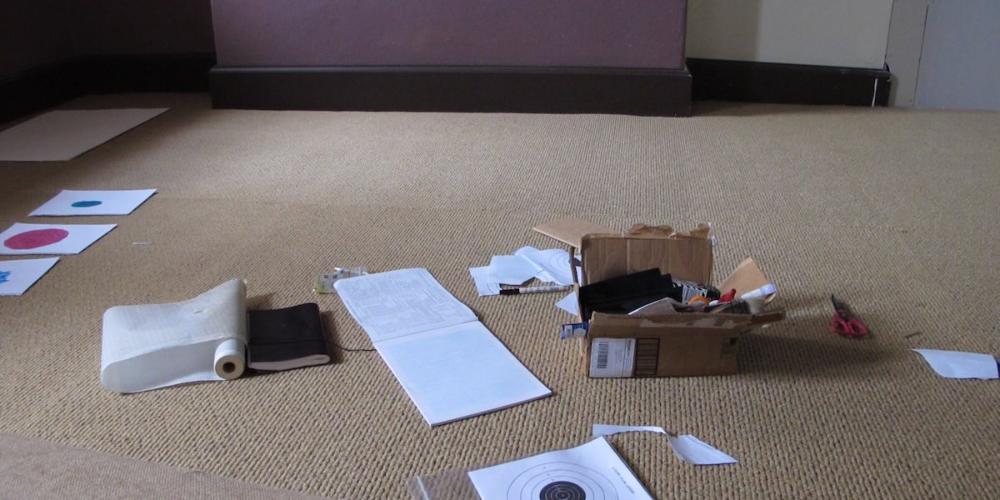

# Making

This week we are going to start thinking about user experience and the meaning that computer systems have for us. Your pre-class task is going to start the process of reflecting on our own interests and patterns of computer use. In-class we will discuss and express our personal computing journeys through making.

While doing arts-and-crafts in a 3000-level computing course has been called _"a choice"_, it's a good way to slow down out thinking and start to consider what _experience_ means in computing.

## Pre-Class Tasks

**You must complete this task before the start of your tutorial.**

Choose a computer or digital technology that played an important role in your early life. It could be a device, an application, or a website. Upload an image of this technology on the forum. You can upload a photo, sketch, or an image found online (remember to provide a reference).

Write a reflective post (100-200 words) about this technology using these prompts:

- What is this device and when did you first encounter it?
- What specific memories do you associate with it?
- How did it shape your relationship with computing?
- What emotions does thinking about it bring up now?

## Plan for the Class

In this class you will:

1. talk about an interactive technology that is meaningful to you
2. think and talk about usability and user experience
3. do some arts and crafts to reflect on this and start off the semester

## In-Class Tasks

Your tutor will guide you through the three tasks over the tutorial. You need to be prepared to participate in group discussions and to speak to the class when asked by your tutor. Remember that completing the in-class tasks well (including participating in discussions) is how we decide on your mark for the week.

### 0. Introductions and pre-class tasks

Your tutor will introduce themselves and start to look through pre-class tasks on the forum. If your pre-class task is in the wrong category, change it now so the tutor can find it easily.

### 1. Reflecting on Meaningful Technologies

Going beyond the technicalities of how we may facilitate human-computer interaction, let's consider how computers have already interacted with us in our lives. Today's lab is all about reflecting on our experiences with computers and how that impacts the work we do with computers and what we may create in future. 

Reflection is a cyclic and integral part of the creative process. There are many different frameworks of reflection for different use cases. [Driscoll’s “What?” Model](https://reflection.ed.ac.uk/reflectors-toolkit/reflecting-on-experience/what-so-what-now-what) was developed in the mid-1990s [@reflection-toolkit-driscoll], creating a cycle of the following three questions:

- What?
- So what?
- Now what?

It's important to reflect on the technology you chose in the pre-class tasks. Consider how it interacts with concepts of "usability" and "user experience" from the lecture.

In groups, discuss the following questions:

- What was your meaningful technology?
- Why was it important? What part of your user experience stands out?
- How does this impact the technologies you want to create?

As a class, find themes in the group discussions. What are the main experiences and ambitions of the tutorial group?

### 2. Thinking about User Experience

Now we'll be doing a blind drawing activity.

Draw the computer or digital technology that played an important role in _someone else's life_. Do this without looking at the paper while you draw (you can peek when you're done!). Think about how their experience shaped their perception of the system.

This isn’t about being a great artist — it's a way to loosen up and engage with user experience before we dive into more reflective making.

Once you've finished your drawing, take a few minutes to write about:

- What is this technology?
- What role did it play?
- How do _you_ feel about it?

How do your answers align with the user experience goals from the textbook ([Interaction Design Beyond HCI](https://quicklink.anu.edu.au/kv9b)) [@rogers-beyond-hci:2023, section 1.9.2] as discussed in the lecture? Do some of the "desirable and undesirable aspects of user experience" appear?

### 3. Making to Express Experience and our Journeys

For the second half of the tutorial, we’ll make a small reflective zine.

A zine (short for magazine) is a small, self-published booklet often used for artistic or personal expression. Today, you'll make an 8-page zine that captures your personal journey with computing.

Your zine might include:

- A title page
- Drawings, diagrams, or comics
- Your reflections from earlier in the class
- A page about your coding process
- A page about interactive systems you have made
- Thoughts on usability vs user experience
- A short piece about how your relationship with computers has changed
- Anything else you want to add!

You can make this by folding and cutting a single A3 sheet (We'll show you how), or by stapling pages together if you prefer. If you want to follow the instructions yourself for folding, you can find them here: <https://www.42ndstreet.org.uk/support/read/how-to-make-your-own-zine/>. You can also watch [a video about how to do the folding](https://www.youtube.com/watch?v=Sz0BXlqa7dc).

Take your time with this — it's not about making something perfect, but something meaningful. We've brought in different materials you're welcome to use to create your responses. 

## References