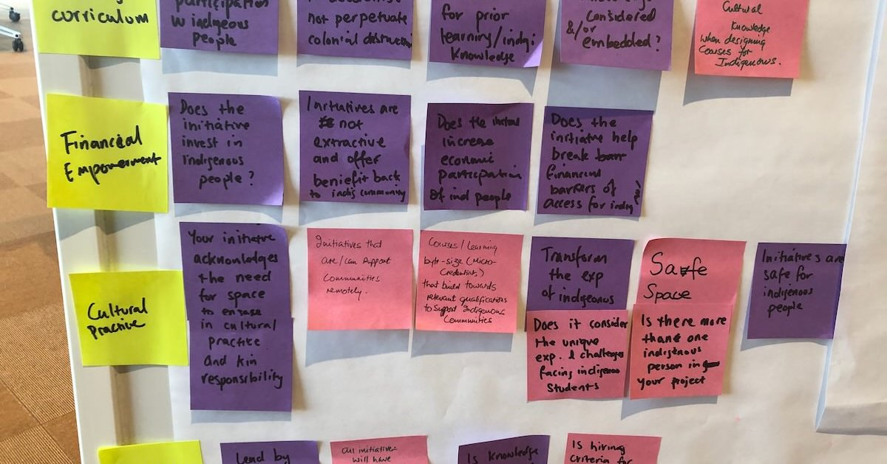

# Personas and Scenarios to Evaluate Designs

This week, you’ll learn how to create a persona and scenario, and use scenario-mapping to generate and evaluate design ideas. 

## Pre-Class Tasks

- Read this resource: <https://www.nngroup.com/articles/scenario-mapping-personas/> 
- and watch this short video: <https://www.youtube.com/watch?v=dmlFRCZI9gQ&ab_channel=NNgroup/>

Observe someone you know (a friend or family member) using a digital product or service (e.g., an app, website, or device) in a real-life context. Write a 100-200 forum post answering these questions:

1. Who is the user? What is their goal?
2. What interactive product or service are they using, and in what situation?
3. What steps do they take, and where do they seem successful or frustrated?
4. What does this observation tell you about how the product could be improved?

## Plan for the Class

In this class, you will:

1. Create a persona (15 minutes)
2. Create a scenario (25 minutes)
3. Engage in scenario-mapping for ideation (40 minutes)

## In-Class Tasks

### 0. Discuss pre-class responses (10 minutes)

The tutor will bring up the pre-class responses on the big screen and lead you in a discussion. Some questions might be:

- What sort of users did we discuss?
- What were the typical products and services considered?
- What goals and pain-points were observed?

### 1. Create a Persona (15 minutes)

Your tutor will put you into groups of 5-6 students. 
In your group, choose an activity involving a digital product or service that a university student might do in their spare time (e.g. planning a trip, learning a new skill, managing finances, gaming, etc.).

Create a fictional, but realistic persona who engages in the chosen activity.
Include relevant information, such as name, age, university background (e.g., course, year level), personality traits, goals, and frustrations.
Draw a simple sketch of this persona.

For more on personas, consider these resources: @carden-personas:2023; @persona-creation-nsw:2025; @dam-personas:2025 (see reference list below)

### 2. Create a Scenario (25 minutes)

Choose one aspect of this activity and create a scenario.
Your scenario should include these elements:

- an actor (your persona)
- a motivator
- an intention or intent
- an action
- a resolution

Ensure that your scenario includes the right amount of details (enough, but not too much). 
Refer back to the pre-class reading to see examples.

### 3. Engage in Scenario-mapping for Ideation (40 minutes)

Scenarios can be powerful tools for generating ideas. In this activity, you'll engage in scenario-mapping to generate ideas.
Each group should take four different coloured sticky notes from the tutor.

#### Break down the scenario (5 minutes)  

Choose one colour of the sticky notes.
Break your scenario down to 4-6 sticky notes. Place it on a wall horizontally.

#### Brainstorm design ideas (15 minutes)  

Designate a different colour of sticky note for three different categories.

1. Design ideas: Any good ideas or suggestions
2. Questions: Any questions you might have that you want to resolve later?
3. Comments or considerations: Any comments or considerations?

Each group member should take 15 minutes to individually brainstorm relevant design ideas, questions, or comments and considerations in line with each section of the scenario posted on the wall. 
Put your sticky notes up on the wall as you go. Your questions and comments and considerations can be in response to another group member's idea.

#### Review the wall (20 minutes)

At the end of this activity, you will see a wall full of ideas for discussions. Spend 5 minutes by yourself to review this wall.
As a group, review each idea and quickly decide which ones should be explored further and which one should not. Make sure to go through each sticky note, acknowledging it, and discussing it, but discussions should be quick.

During this discussion, you can move the sticky notes around to:

- cluster similar ideas into topics
- 'park' discussions that cannot be resolved quickly to revisit later 
- take ideas off the wall that are not feasible or questions that have been answered

Take a photo of the wall.

## References

