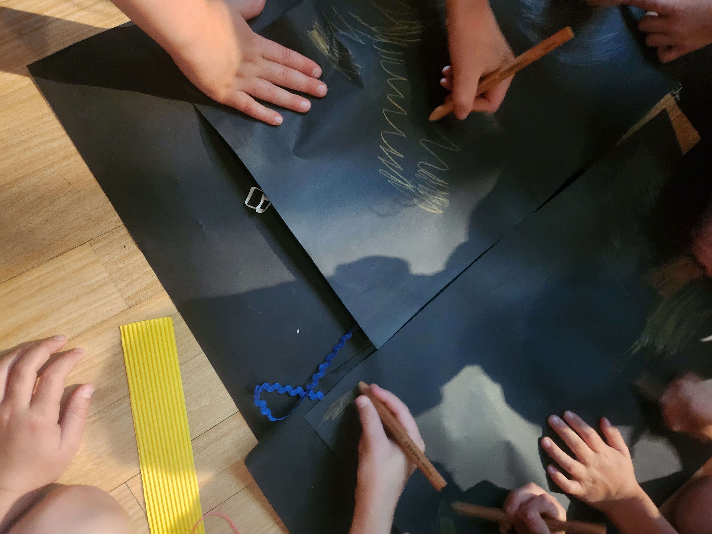

The purpose of this tutorial is to give you hands-on experience in low-fidelity prototyping, which is a key task in the assignment.

> "A prototype is one manifestation of a design that allows stakeholders to interact with it and to explore its suitability" [@rogers-beyond-hci:2023]

## Pre-Class Tasks

 **You must complete these tasks before the start of your tutorial.**

1. Read **Chapter 12 Design, Prototyping, and Construction** in [@rogers-beyond-hci:2023]. Available as an e-book through the library.

2. Read this resource: <https://www.nngroup.com/articles/ux-prototype-hi-lo-fidelity/>

3. Post a forum post following the instructions below. 

Choose one object/interface that you have come across in your life that you think has a _bad_ design. Consider its use cases, functionalities, forms, and overall design features.

**Sketch**[^sketch] and annotate the bad design, and upload it with your forum post (100-200 words) about this object/interface using these prompts:

- Briefly introduce your chosen object/interface and how you came across it.
- What is its core functionality? What form of interaction is it designed for? 
- Why is it bad? What would you do to improve the design?

Bring your sketch and/or the object/interface in to class this week if possible for discussion.

[^sketch]: This is a good chance to practice the _sketching_ skills discussed in the lecture. Make sure your sketch has the important elements of a sketch that we talked about.

## Plan for the Class

The tutorial will follow this structure:

0.  Discuss pre-class tasks 
1.  Ideation 
2.  Paper Prototypes 
3.  Discussion 

## In-Class Tasks

### 0. Discuss pre-class tasks (10 mins)

As a class or in groups of 4-5, introduce your chosen objects/interfaces to each other and consider the following prompts:

- What is its intended functionality? 
- In what context or situation might someone need this functionality? 
- Who are the actors (personas) using this object/interface?
- What is motivating these actors in the scenario?
- What specific intention do they have in this situation?
- What action do these actors take with the object/interface?
- What is the resolution or outcome of this interaction?

Responding to those will help construct one scenario we will be ideating and prototyping based on today.

### 1. Rapid Brainstorming (20 mins)

In groups, we will do some rapid brainstorming to generate design ideas. Guided by your discussion above, choose **one object or interface to redesign**. You may want to come up with changes to the existing interface, or come up with a completely new solution. Our only request here is that your solution should be computer-based. This doesn't have to be just a desktop/mobile application or website, it could be a tangible interface, a hardware product, a robot, a smart home appliance, etc. Whatever it is, the interaction should be facilitated by a computer in some way.

One methodology often used in design thinking is called "Crazy 8's" where you have 8 minutes to sketch out 8 ideas. [@google-crazy8] The ideas can be as good or bad as you want them to be. Your main objective is to come up with eight distinct ideas. The sketches don't have to be perfect, as long as they communicate your idea. 

- Each person will get one A3 piece of paper, and they will fold it into 8 sections. 
- Your tutor will start an 8 minute timer for you to begin sketching your ideas.
- Individually, each person will sketch one idea in each of the 8 rectangles. Sketches can be either drawn or written (or both!). 
- When the timer is up, all pens down. 

After you finish, lay out all your ideas and walk around to read each of your other group members' ideas. Give yourself a few minutes to understand everyone's ideas. Now it's time to vote on your best idea. 

- Each person will get 3 votes.
- You vote by drawing a star in the idea's rectangle, you can vote for an idea more than once if you think it deserves two or all three of your votes. 
- Come back together and finalise your best design.

### 2. Sketch out storyboards based on scenarios (10 mins)

We will now work towards creating a lo-fi paper prototype of the sketch with the most votes. 

In your group, create a story board of the proposed interaction in the winning sketch. You should have at least 5 but no more than 8 steps. Think through the steps that might be involved in the scenario and the personas involved, and draw up rough sketches to illustrate each step. Consider all moving parts discussed above, and try and decide on the key steps. 

You'll only have 10 minutes so these do not have to be perfect in any way. The idea here is to break down the out the steps for interacting with your design/idea.

### 3. Paper prototyping (40 mins)

> "By their very nature, prototypes involve compromises. The intention is to produce something quickly to test an aspect of the product" [@rogers-beyond-hci:2023]

In your groups, create a paper prototype of the system as illustrated in your storyboard. This should be a tangible version that walks someone through the storyboard you have developed. Materials will be provided.

When creating your prototype, consider:

- What are the key components that your user or stakeholder needs to see and interact with in order to understand your design?
- What is the main purpose of this paper prototype? Which specific aspect(s) of your design are you aiming to test or demonstrate?
- How can you effectively convey your design using only paper as your material? How can you simulate interaction, feedback, or flow using paper elements?
- Would you be able to run a "Wizard of Oz"[^oz] evaluation using this prototype?

[^oz]: If you have forgotten what a "Wizard of Oz" evaluation is, look back at the lecture, the text book or this resource [@porcheron-wizard:2020].

### 4. Present and discuss (10 mins)

As a group, present your prototype to the class and discuss:

1. Does your prototype match your storyboard and design concept?
2. Is your prototype _testable_?
3. What design decisions were made at the sketching, storyboarding, and prototyping stages?

## Resources

- Low vs High-fidelity: <https://www.nngroup.com/articles/ux-prototype-hi-lo-fidelity/>

## References
