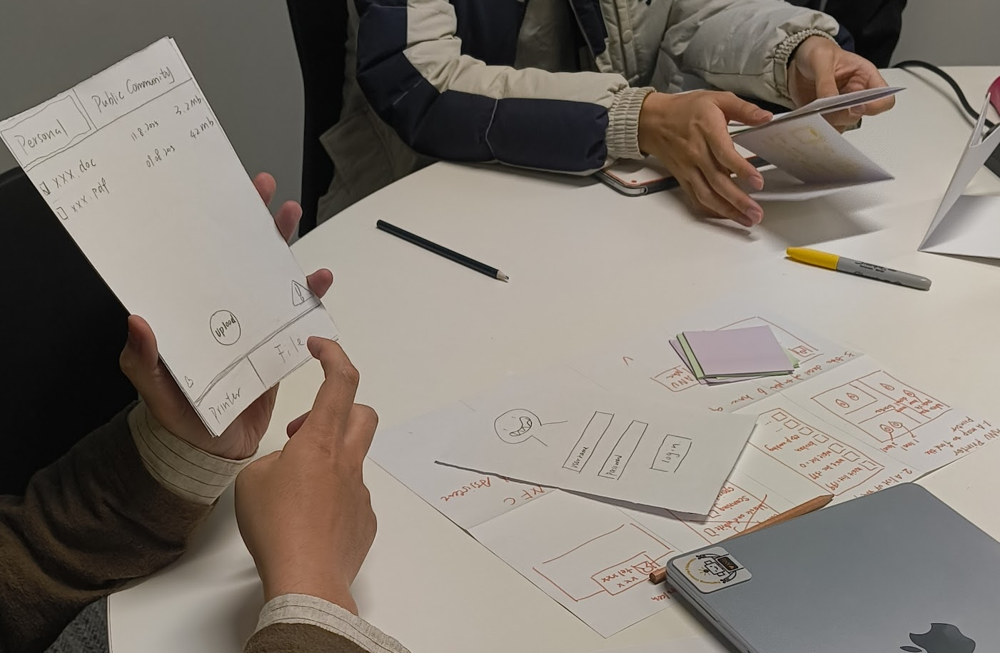

The purpose of this tutorial is to help you to design and conduct an evaluation activity.

The intended learning outcomes for this tutorial are to:

- Develop design evaluation goals
- Design evaluation activities using qualitative and quantitative methods
- Understand how to facilitate an evaluation activity with technology users
- Critically reflect on which evaluation methods can address particular kinds of evaluation goals and research questions

## Pre-Class Tasks

You should complete the following activities prior to attending your tutorial:

1.  Review the lecture content on **Evaluation**

2.  Read the following chapters from *Interaction Design: Beyond Human-Computer Interaction* **Chapter 14 Introducing Evaluation**, **Chapter 15 Evaluation Studies: From Controlled to Natural Settings** [@rogers-beyond-hci:2023].

3. Write a forum post (100-200 words) summarising your research plan in preparation for [Assignment 2](https://canvas.anu.edu.au/courses/2781/assignments/11550). In your post, name the AI-integrated interface you have chosen to study, and explain why you selected it. Then briefly outline your research plan, including your strategies for data collection and the analysis framework(s) you intend to use. You must also include at least two references from relevant HCI literature---these could relate to prior studies in similar areas, research methodologies, conceptual frameworks, or other scholarly resources relevant to your topic.

Following on from the assignment work last week you should have:

1. joined a group to complete your mini user studies
2. chosen an AI-integrated interface to study

For this week's tutorial you need to **create a plan for your study**. Use your [research skills](https://scholar.google.com) to find examples of studies into human-AI interfaces (e.g., at CHI) and use them to help plan your study. Make sure your study plan is realistic.

Remember, for your study plan you need to collect quantitative and qualitative data so that you can report on an analysis of each type of data. You can choose what form that data is, e.g., quantitative data could be rating scale questionnaire questions, timed task completions, or number of clicks to complete a task. Qualitative data could be interviews, written reflections, images, videos, sounds, observations. For more ideas, see the lectures and the textbook!

## Plan for the Class

0.  Discuss pre-class tasks (10 mins)
1.  Plan your evaluation (50 mins)
2.  Meet with your group to discuss evaluation (30 mins)

## In-Class Tasks

### 0. Discuss pre-class tasks (10 mins)

Your pre-class task asked you to describe your planned study for Assignment 2. 

Recall that the research question you will investigate is:

> "How do users' mental model of the AI system align with the behaviour of the system and what usability issues arise from any misalignments?"

As a class, discuss the following questions: 

- How does your study plan address this research question? 
- How have you ensured your study plan is feasible within the time constraints?
- Why does your chosen interface make sense for this research question?

### 1. Planning an evaluation (30 mins)

This section of the tutorial is dedicated to articulating an evaluation plan. You can choose to discuss your study plan from the pre-class task, or choose another type of user interface to evaluate.

In groups, spend 10 minutes discussing each of the following aspects of an evaluation plan. Use a sticky note for each aspect. Make sure that everybody in your group has completed a stick note for each aspect!

#### Evaluation Goal

Consider the goal of your evaluation and a task that your might ask users to complete.

- Choose a particular feature of your chosen AI interface that you wish to evaluate, that can facilitate a task for the user to complete.
- Choose one user experience AND one usability evaluation goal to focus on.
- Choose a task for the user to complete that would address your evaluation goals.

#### Data Collection

Now it's time to consider your data collection. Recall that we are expecting both quantitative and qualitative data collection and analysis.

- How will you collect your data? Why have you chosen these methods? 
- Write up your means of data gathering. Consider what data you are trying to gather and how it contributes to your evaluation goal.
- What kind of data will you be collecting? Will this involve identifiable information from participants?
- What analysis methods will you use on your data? Why are these appropriate within your research context.

#### Analysis Methods

After you have gathered your data, it's time to analyse it.

- What kind of analysis will you do for each type of data you collect? 
- Are your chosen analysis methods appropriate within the context of your research?
- Would any [personal or sensitive data](https://www.oaic.gov.au/privacy/your-privacy-rights/your-personal-information/what-is-personal-information) be stored as part of your analysis? Read the link to make sure you know what those terms mean!

### 2. Considering Ethics (20 mins)

As makers/learners/developers/academics/humans, it's important to consider the ethical implications of any of our work. 
The key ethical questions for an HCI evaluation with human participants are [@national-statement-ethical-conduct:2025]:

1. What is the research activity that the participant will do?
2. Does this activity have any risks or benefits?
3. How will the participant provide informed consent for the activity?

Note that "risks" in HCI, are usually not of physical harm, but could be related to privacy of the data collected or risk of being identified as a participant. Small studies often do not benefit the researcher very much, but it has been argued that we should expect more benefits to flow to vulnerable participants [@brown-ethical-hci:2016].

Informed consent for participation is a cornerstone of research on humans [@national-statement-ethical-conduct:2025]. For some kinds of HCI research, the concept of consent is complicated [@benford-ethical-implications:2015], but in your work, you may wish to obtain consent in written form, or verbally. The idea is to ensure that participants understand what the study involves and clearly agree to participate given that knowledge.

In pairs, discuss how your study plan for the assignment aligns with these questions:

1. What are the risks of your study? What will you do to mitigate risks?
2. What are the benefits to the participant?
3. What would your process be for gaining consent?

Summarise your ethical considerations in 4-5 sentences and post it on the forum. Your tutor will create a thread for your tutorial.

### Research cluster meeting (30 mins)

The last 30 minutes of this workshop is dedicated to meeting with your group and working out the logistics of completing your evaluations. 

As a group you should: 

- Talk through your overall assignment research plans with your group, and make sure to address any concerns your participants might have. You don’t need to go into the details of your specific data collection questions (that will come during the actual mini study), but be clear about what you’ll be asking participants to do and what their involvement will look like.
- Decide on the time and place when you will conduct your data gathering. Remember that every tutorial in the course is followed by a 30 minute drop-in --- this means the room is booked and free to use for this course! 
- Do your user research! If you have time and are prepared, you might like to take turns to conduct and participate in your assignment research activities in pairs. 

## Resources

- ANU Resources on Human Ethics: <https://services.anu.edu.au/research-support/research-ethics-integrity-compliance/human-ethics>
- The National Statement on Ethical Conduct in Human Research (2025): <https://www.nhmrc.gov.au/about-us/publications/national-statement-ethical-conduct-human-research-2025> [@national-statement-ethical-conduct:2025]
- Data Gathering Lecture: <https://smcclab.github.io/thirty-nine-hundred-hci/lectures/04-data-gathering.html>
- Data Analysis Lecture: <https://smcclab.github.io/thirty-nine-hundred-hci/lectures/05-data-analysis.html/>
- Thematic Analysis Lecture: <https://smcclab.github.io/thirty-nine-hundred-hci/lectures/06-reflexive-thematic-analysis.html/>

## References
