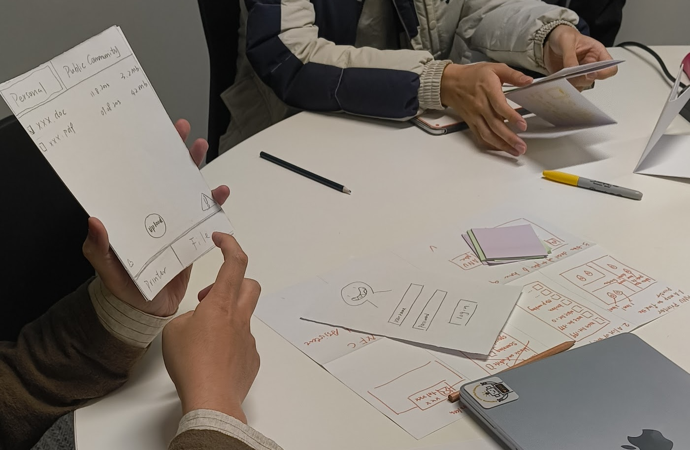

<!--
2027 TODO: rework this workshop so it is about planning a NEEDS-FINDING study,
and does not mention evaluation at all.

Background: in 2026 A2 changed from an evaluation to a needs-finding study, but
this workshop was only partially updated (commit 869a0f3 made the evaluation
activity "hypothetical" rather than removing it). Tutor feedback from the 2026
run: "Students were a bit confused between the hypothetical evaluation plan
activity and then having to switch back to their own needs-finding study plan."
The session currently switches context three times: A2 plan -> hypothetical
evaluation -> A2 ethics -> A2 logistics. Evaluation planning already has its
own home in workshop 8 (Tasks 2-3) where it serves A3, so nothing is lost by
removing it here.

Proposed shape for 2027 (timings unchanged, 90 mins):
  0. Discuss pre-class tasks (10 mins)              -- keep as is
  1. Plan your needs-finding study (30 mins)        -- sticky-note exercise
     applied to the group's ACTUAL A2 plan, not a hypothetical tool
  2. Consider ethics (20 mins)                      -- keep as is
  3. Research cluster meeting (30 mins)             -- keep as is

Also: rename the file/title (e.g. 07-study-planning.md, "Planning a
Needs-Finding Study"), update the ILOs, and check the Makefile / index for
anything keyed on the old filename. Suggested replacement text is drafted in
comments at each section below.
-->

# Planning Evaluations

The purpose of this tutorial is to help you to design and conduct an evaluation activity.

The intended learning outcomes for this tutorial are to:

- Develop design evaluation goals
- Design evaluation activities using qualitative and quantitative methods
- Understand how to facilitate an evaluation activity with technology users
- Critically reflect on which evaluation methods can address particular kinds of evaluation goals and research questions

<!--
2027 DRAFT replacement for the purpose + ILOs above:

The purpose of this tutorial is to help you plan and carry out the
needs-finding study for Assignment 2.

The intended learning outcomes for this tutorial are to:

- Articulate the goal of a needs-finding study and connect it to a research question
- Design data collection using qualitative and quantitative methods
- Understand how to facilitate a study activity with technology users
- Consider the ethical implications of a study with human participants
-->

## Pre-Class Tasks

You should complete the following activities prior to attending your tutorial:

1.  Review the lecture content on **Evaluation**

2.  Read the following chapters from *Interaction Design: Beyond Human-Computer Interaction* **Chapter 14 Introducing Evaluation**, **Chapter 15 Evaluation Studies: From Controlled to Natural Settings** [@rogers-beyond-hci:2023].

<!--
2027 TODO: items 1 and 2 point at evaluation material. Replace with the
lectures/chapters that actually support a needs-finding study plan, e.g. the
data gathering lecture (week 4), the data analysis / thematic analysis
lectures (weeks 5-6), and Rogers et al. chapters on data gathering and
analysis (ch. 8 and 9 in the 6th ed.; check numbering). The evaluation
chapters 14-15 belong in workshop 8's pre-class tasks. Item 3 (forum post
summarising the A2 plan) is fine as is.
-->

3. Write a forum post (100-200 words) summarising your research plan in preparation for Assignment 2. In your post, name the AI use context you have chosen to investigate, and explain why you selected it. Then briefly outline your research plan, including your strategies for data collection and the analysis framework(s) you intend to use. You must also include at least two references from relevant HCI literature---these could relate to prior studies in similar areas, research methodologies, conceptual frameworks, or other scholarly resources relevant to your topic.

Following on from the assignment work last week you should have:

1. joined a group to complete your mini user studies
2. chosen an AI use context to investigate

For this week's tutorial you need to **create a plan for your study**. Use your [research skills](https://scholar.google.com) to find examples of needs finding studies and studies of how people use AI tools (e.g., at CHI) and use them to help plan your study. Make sure your study plan is realistic.

Remember, for your study plan you need to collect quantitative and qualitative data so that you can report on an analysis of each type of data. You can choose what form that data is, e.g., quantitative data could be rating scale questionnaire questions, timed task completions, or number of clicks to complete a task. Qualitative data could be interviews, written reflections, images, videos, sounds, observations. For more ideas, see the lectures and the textbook!

## Plan for the Class

0.  Discuss pre-class tasks (10 mins)
1.  Plan an evaluation (30 mins)
2.  Consider ethics (20 mins)
3.  Meet with your group to plan your needs-finding study (30 mins)

<!--
2027 DRAFT:
0.  Discuss pre-class tasks (10 mins)
1.  Plan your needs-finding study (30 mins)
2.  Consider ethics (20 mins)
3.  Meet with your group to organise your needs-finding study (30 mins)
-->

## In-Class Tasks

### 0. Discuss pre-class tasks (10 mins)

Your pre-class task asked you to describe your planned study for Assignment 2.

Recall that the research question you will investigate is:

> "What are the unmet needs, frustrations, and desired capabilities that students experience when using AI tools in a specific context of their life?"

As a class, discuss the following questions:

- How does your study plan address this research question?
- How have you ensured your study plan is feasible within the time constraints?
- Why does your chosen AI use context make sense for this research question?

<!--
2027 TODO: replace the whole of section 1 below with the draft needs-finding
version that follows. The sticky-note format (one note per person per aspect)
worked and should stay; what changes is that the group plans its OWN A2 study
rather than a hypothetical evaluation of an AI tool. Drop the
"different kind of study from the needs-finding" sentence entirely -- the
contrast it draws is what confused students, and workshop 8 covers evaluation.

### 1. Planning your needs-finding study (30 mins)

This section of the tutorial is about turning your Assignment 2 idea into a
concrete study plan. Work with your research cluster. The research question
you are all addressing is the same:

> "What are the unmet needs, frustrations, and desired capabilities that
> students experience when using AI tools in a specific context of their life?"

In groups, spend 10 minutes discussing each of the following aspects of your
study plan. Use a sticky note for each aspect. Make sure that everybody in
your group has completed a sticky note for each aspect!

#### Study Goal

Consider what you want to learn from your participants and what you will ask
them to do.

- Which AI use context has your group chosen, and what do you already suspect
  about students' needs and frustrations in it?
- What activity will participants do during the study (e.g., a short task
  with the AI tool, a walkthrough of how they last used it, a reflection)?
- How does that activity help you surface needs rather than just opinions?

#### Data Collection

Now it's time to consider your data collection. Recall that Assignment 2
expects both quantitative and qualitative data.

- How will you collect each kind of data? Why have you chosen these methods?
- Write up your means of data gathering. Consider what data you are trying to
  gather and how it contributes to answering the research question.
- Will this involve identifiable information from participants?

#### Analysis Methods

After you have gathered your data, it's time to analyse it.

- What kind of analysis will you do for each type of data you collect
  (e.g., descriptive statistics for ratings, thematic analysis for interview
  notes)?
- How will the analysis lead you to needs statements rather than a summary of
  what participants said?
- Would any personal or sensitive data
  (https://www.oaic.gov.au/privacy/your-privacy-rights/your-personal-information/what-is-personal-information)
  be stored as part of your analysis? Read the link to make sure you know what
  those terms mean!
-->

### 1. Planning an evaluation (30 mins)

This section of the tutorial is about articulating an evaluation plan, which is a different kind of study from the needs-finding you're doing for Assignment 2: instead of asking what people need, an evaluation asks how well a particular interface meets a need. As a group, pick **one** AI tool to evaluate. This could be a tool from one of your Assignment 2 use contexts (e.g., ChatGPT for study planning, Copilot for coding), or any other AI interface your group uses regularly.

In groups, spend 10 minutes discussing each of the following aspects of an evaluation plan. Use a sticky note for each aspect. Make sure that everybody in your group has completed a sticky note for each aspect!

#### Evaluation Goal

Consider the goal of your evaluation and a task that you might ask users to complete.

- Choose a particular feature of your chosen AI interface that you wish to evaluate, that can facilitate a task for the user to complete.
- Choose one user experience AND one usability evaluation goal to focus on.
- Choose a task for the user to complete that would address your evaluation goals.

#### Data Collection

Now it's time to consider your data collection. Recall that we are expecting both quantitative and qualitative data collection and analysis.

- How will you collect your data? Why have you chosen these methods?
- Write up your means of data gathering. Consider what data you are trying to gather and how it contributes to your evaluation goal.
- What kind of data will you be collecting? Will this involve identifiable information from participants?

#### Analysis Methods

After you have gathered your data, it's time to analyse it.

- What kind of analysis will you do for each type of data you collect?
- Are your chosen analysis methods appropriate within the context of your research?
- Would any [personal or sensitive data](https://www.oaic.gov.au/privacy/your-privacy-rights/your-personal-information/what-is-personal-information) be stored as part of your analysis? Read the link to make sure you know what those terms mean!

<!--
2027 TODO: section 2 is already about the A2 study and can stay. Two small
edits: the first sentence says "HCI evaluation with human participants" --
change to "HCI study with human participants". And "In pairs" can become
"In your research cluster" so students stay in the same group across
sections 1-3 and the session doesn't reshuffle them.
-->

### 2. Considering Ethics (20 mins)

As makers/learners/developers/academics/humans, it's important to consider the ethical implications of any of our work.
The key ethical questions for an HCI evaluation with human participants are [@national-statement-ethical-conduct:2025]:

1. What is the research activity that the participant will do?
2. Does this activity have any risks or benefits?
3. How will the participant provide informed consent for the activity?

Note that "risks" in HCI, are usually not of physical harm, but could be related to privacy of the data collected or risk of being identified as a participant. Small studies often do not benefit the researcher very much, but it has been argued that we should expect more benefits to flow to vulnerable participants [@brown-ethical-hci:2016].

Informed consent for participation is a cornerstone of research on humans [@national-statement-ethical-conduct:2025]. For some kinds of HCI research, the concept of consent is complicated [@benford-ethical-implications:2015], but in your work, you may wish to obtain consent in written form, or verbally. The idea is to ensure that participants understand what the study involves and clearly agree to participate given that knowledge. For Assignment 2, a natural part of this process is asking each participant to write down their uid and name for your *Participants* section (`- u1234567 Firstname Lastname`) — consenting to be named in your submission is part of what they are agreeing to, and it's how participation is verified.

In pairs, discuss how your study plan for the assignment aligns with these questions:

1. What are the risks of your study? What will you do to mitigate risks?
2. What are the benefits to the participant?
3. What would your process be for gaining consent?

Summarise your ethical considerations in 4-5 sentences and post it on the forum. Your tutor will create a thread for your tutorial.

### Research cluster meeting (30 mins)

The last 30 minutes of this workshop is dedicated to meeting with your group and working out the logistics of completing your needs-finding studies.

As a group you should:

- Talk through your overall assignment research plans with your group, and make sure to address any concerns your participants might have. You don't need to go into the details of your specific data collection questions (that will come during the actual mini study), but be clear about what you'll be asking participants to do and what their involvement will look like.
- Decide on the time and place when you will conduct your data gathering. Remember that every tutorial in the course is followed by a 30 minute drop-in --- this means the room is booked and free to use for this course!
- Do your user research! If you have time and are prepared, you might like to take turns to conduct and participate in your assignment research activities in pairs.

## Resources

- ANU Resources on Human Ethics: <https://services.anu.edu.au/research-support/research-ethics-integrity-compliance/human-ethics>
- The National Statement on Ethical Conduct in Human Research (2025): <https://www.nhmrc.gov.au/about-us/publications/national-statement-ethical-conduct-human-research-2025> [@national-statement-ethical-conduct:2025]
<!--
2027 TODO: resources are fine (none of them are evaluation-specific). Consider
adding a link to the A2 spec and one or two example needs-finding papers from
CHI to replace the "use your research skills" pointer in the pre-class tasks.
-->
- Data Gathering Lecture: <https://smcclab.github.io/thirty-nine-hundred-hci/lectures/04-data-gathering.html>
- Data Analysis Lecture: <https://smcclab.github.io/thirty-nine-hundred-hci/lectures/05-data-analysis.html/>
- Thematic Analysis Lecture: <https://smcclab.github.io/thirty-nine-hundred-hci/lectures/06-reflexive-thematic-analysis.html/>

## References
