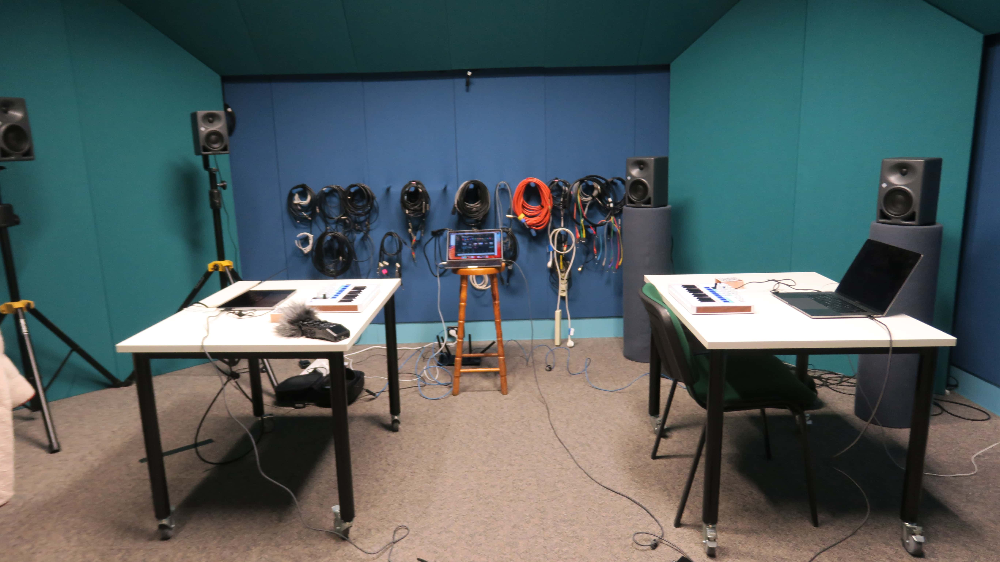

# Research Design

This tutorial will guide you through the process of designing a research project. You will learn how to identify real-world problems, recognise research gaps, and frame a strong research question. These skills connect directly to your final project. 

As a pre-class task, you will analyse an existing evaluation study. In the in-class tasks, you will collaboratively discuss evaluation analyses, develop research questions, and plan an evaluation, along with an overall reflection.

## Pre-Class Tasks

<!-- clones the evaluation activity on p546 in the text book, "In-depth Activity" end of chapter 14. -->

### Analyse an evaluation from the HCI literature

Choose an example of a evaluation study from either [CHI](https://dl.acm.org/conference/chi/proceedings) or [DIS](https://dl.acm.org/conference/dis/proceedings) (use [the ACM Digital Library](https://dl.acm.org/) to search for relevant papers, or browse through the proceedings). Read through the study and answer the following questions:

1. Name of the study or system/app
2. How controlled was the study?
3. Which methods were used?
4. What kind of data was collected?
5. how was the data analysed?
7. Did the evaluation focus on usability goals or user experience goals? (which ones)
8. Were there any notable issues?

### Post on the forum:

1. An image of the paper's first page or of the system/app analysed.
2. A clear citation to the paper you have analysed (in ACM format)
3. The answers to the above questions
4. Make sure you have studied [the lecture notes from week 8 (evaluation)](https://smcclab.github.io/thirty-nine-hundred-hci/lectures/08-evaluation.html)

## Plan for the Class

0. Review the pre-class tasks together (10m)
1. Discuss the evaluation analyses in groups (20m)
2. Develop research questions in groups (20m)
3. Plan an evaluation for the research in groups (20m)
4. Share and discuss the plans together (20m)

## In-Class Tasks

### Task 1: Discuss the evaluation analyses (20m)

In this task, you will work in groups using a shared document provided by your tutor. The analyses you complete here will serve as references for the later tasks this week, helping you create research questions and plan the subsequent evaluations.

- You will complete one row of the table in the shared document, starting with the name of the paper you found in the pre-class task and then filling in each column with your answers.
- Once you have entered your analysis, you will discuss your findings with peers in your group, highlighting any interesting insights.

### Task 2: Develop Research Questions (20m)

Research questions have been called [survival beacons](https://lennartnacke.com/how-to-choose-a-good-research-question/#research-questions-are-survival-beacons) because they should guide all aspects of our research plans. You shouldn't start an evaluation process without a clear research question.

We will re-do the activity from the lecture in groups to develop RQs and set out a clear evaluation plan.

Remember [the steps for writing a research question](https://smcclab.github.io/thirty-nine-hundred-hci/lectures/08-evaluation.html#/four-steps-to-write-a-research-question):

1. Outline a broad area of interest
2. Identify a problem that needs solving
3. Justify solving this problem
4. Write the question

As a small group, [Spin the wheels](https://spinthewheel.io/wheels/6QtocP77prRkdHZ66s0hcz0xJmU9MA==) to **randomly find a broad area and a problem**.

Then, you will need to come up with a justification (no wheels for that...) and write the question. The RQ should include the broad area, the problem, and the justification. Remember that a research question starts with a question word (what, how, why, can, do, should) and ends with a question mark. It can just be one sentence.

Iterate on your question until you feel it will help you plan an evaluation.

**Tips:**

- If your question isn't working or is too general, try a different question word to change the focus.
- Check if your question will be answerable. Unsolveable questions are unhelpful as RQs.
- Check if you question is obvious. Research is (by definition) an activity to generate non-obvious knowledge.

### Task 3: Plan an Evaluation (20m)

Create an evaluation plan based on [this slide](https://smcclab.github.io/thirty-nine-hundred-hci/lectures/08-evaluation.html#/developing-an-evaluation-plan), focusing on the research questions you created. Your tutor will let you know whether to write your plan in a shared document or on paper.

The activity can be divided into two parts:

- Define the overall evaluation goals, decide on suitable participants, select appropriate methods and settings, and identify the data you will collect and analyse.
- Refine your plans further, including ethical considerations and consent, strategies for capturing and storing data, and the expected outputs of the evaluation process. 

Work with your group to go through each aspect, using the lecture slide for guidance. Your goal is to create an evaluation plan that clearly addresses your research questions.

### Task 4: Share and Discuss evaluation plans (20m)

In this task, you will share your evaluation plans with the whole class and receive comments and insights from others. As a group, you will present your plan by walking through the aspects from the lecture slide and showing how it connects to your research questions.

You may use the format below as a guide (but you are not limited to it):

- First, present your research questions, outlining them with the four steps.
- Next, explain your evaluation plan and show how it links to your questions.
- Finally, invite comments, questions, or feedback from your peers and tutor.

## Resources

- CHI proceeding: <https://dl.acm.org/conference/chi/proceedings>
- DIS proceeding: <https://dl.acm.org/conference/dis/proceedings>
- How to choose a research question: <https://lennartnacke.com/how-to-choose-a-good-research-question/#research-questions-are-survival-beacons>
- Four steps to write a research question: <https://smcclab.github.io/thirty-nine-hundred-hci/lectures/08-evaluation.html#/four-steps-to-write-a-research-question>
- Spin the wheels for an HCI research project: <https://spinthewheel.io/wheels/6QtocP77prRkdHZ66s0hcz0xJmU9MA==>
- Developing an evaluation plan: <https://smcclab.github.io/thirty-nine-hundred-hci/lectures/08-evaluation.html#/developing-an-evaluation-plan>
  
## References
