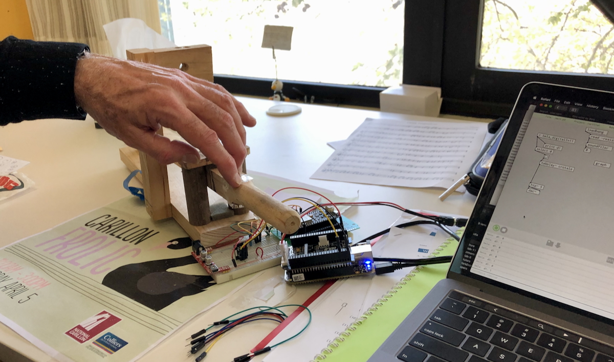

This tutorial will guide you in building prototypes that move beyond expressing a design concept and are prepared for evaluation. We will particularly focus on what makes a prototype testable and criteria that you might apply to prototypes you create for your final project.

## Pre-Class Tasks

1. Read @houde1997prototypes "What do prototypes prototype?",

2. Choose a user interface described in a [UIST](https://dl.acm.org/conference/uist) or [CHI](https://dl.acm.org/conference/chi) paper

3. Post a forum post (100–200 words) answering:

   - **What is the system and what does it do?**
   - **Which parts of the interface are interactive?** How does the user engage with the system?  
   - **What steps/tasks did participants do in the user study?**  
   - **If you made a prototype of this interface, what would you need to include to test it?**  
   - Include **one image or sketch** to illustrate the interface (figure from paper, screenshot, or your annotated sketch highlighting key interactive components).

N.B., for this task, make sure you choose a paper from CHI or UIST that actually describes a novel interface. If your answer to "what is the system" is "this paper did not introduce a system" then you did not choose an appropriate paper!

## Plan for the Class

1. Task 1: Understand the Concept of Testable Interactions (10m)
2. Task 2: Build a Testable Prototype (50 min)  
3. Task 3: Prototype Showcase and Peer Feedback (30 min)  

## In-Class Tasks

### Task 1: Understand the Concept of Testable Interactions (10 minutes)

In this task, you will think about **what makes a prototype testable** and apply these criteria to a prototyping plan.

A prototype is testable if it lets you **observe and learn from real user interactions**. Below, we have set out some criteria for a testable prototype that we developed within the tutors. While these criteria aren't identical to others found in HCI literature [e.g., @houde1997prototypes; @lim-prototypes:2008; @odom-research-prototype:2016], we feel that our criteria work for the context of this class and the needs of our assessment.

Read through the criteria, and keep them in mind for the activity below:

1. **Interactive:** Can users actually perform the steps or tasks you’re trying to test? (even if simulated)
   - Users must be able to take action and see a response, even if it’s simulated.
   - Examples: pressing a paper button triggers a screen change, dragging a card moves it to a new location, or speaking a command triggers a response.
   - Ask: “Can someone unfamiliar with this prototype actually perform the task I want to test?”
   - _Tip: A static sketch is not enough---the user must act on the prototype._
2. **Clear:** Can users understand what the system is, what to do, and how it works?
   - Make the system’s state and feedback obvious.
   - Examples: highlighting selections, showing confirmation messages, or providing visual cues for next steps.
   - Ask: “Will a new user generally know what to do next without explanation?” 
3. **Evaluative:** Can you observe users, gather feedback, or identify what works and what doesn’t?
   - Decide what success looks like and what errors or hesitation mean.
   - Examples: did the user complete the action correctly? Did they get confused or hesitate?
   - Ask: “What can I measure or observe that tells me if this interaction is effective?”  
4. **Focused:** Are you including only what’s needed to test the intended interaction or task?
   - Include the elements needed to test the key task; less focus on aesthetics or extra features.
   - Ask: “Does every part of this prototype help answer my testing question, or can something be removed?”

Now, complete this **activity**:

1. In your group, look at the pre-class forum posts.  
2. Choose **the most interesting system or interface** posted by a group member.  
3. Discuss:  
   - Which part of the system could you prototype?  
   - What is the key interaction?  
   - What feedback would make it **clear** to users?  
   - How could you **observe success**?
   - Would your prototype meet the **four criteria** above?

### Task 2: Build a Testable Prototype (50 mins)

Now you're going to try building a quick low-fidelity prototype that can help test a specific problem and interaction. Your prototype can be made with paper, click-through slides, or another super quick method of assembling a testable prototype.
In groups, your tutor will give you a **random user problem**. Focus on **one key interaction**.

| #  | Scenario | Task (Key Interaction to Prototype) |
|----|---------|-------------------------------------|
| 1  | **Cat Cafeteria**: Patrons interact with digital feeders to dispense snacks to cats. | Prototype **one interaction** for choosing a cat and triggering a response from the feeder. |
| 2  | **Alien Plant Gardener**: Manage a garden of alien plants. | Prototype **one interaction** for taking an action that affects the plant’s state. |
| 3  | **Ghostly Museum Guide**: Friendly ghosts guide visitors via AR projections. | Prototype **one interaction** for a visitor to communicate or elicit a response from the ghost. |
| 4  | **Intergalactic Grocery Store**: Shopping in zero gravity with floating items. | Prototype **one interaction** for selecting or moving a floating item. |
| 5  | **Robo-Barista**: Robot makes drinks based on user input. | Prototype **one interaction** for specifying or changing a drink order. |
| 6  | **Secret Spy Office**: Hide/reveal documents using a smart desk. | Prototype **one interaction** for revealing or moving a confidential file. |
| 7  | **Pet Translator**: Device translates pet sounds into messages. | Prototype **one interaction** for capturing a pet signal and generating a readable output. |
| 10 | **Mini-Magic Keyboard**: Typing triggers tiny illusions. | Prototype **one interaction** for creating an effect based on user input. |

Here's the activity:

1. In your group, **identify the key interaction** you want to focus on testing.  
2. **Sketch and build a testable prototype** based on that key interaction.
3. Build your prototype!
4. Assess whether your prototype is _interactive_, _clear_, _evaluative_, and _focused_ (you can use the mapping table below to help structure your responses). If it isn't, change it until it is!

A few prototyping notes:

- Focus only on the **essential elements needed to test the interaction** — do not worry about polish or aesthetics.  
- Materials can include **paper, printed screens, simple click-through slides, or other low-fidelity tools**.  
- Use a **Wizard of Oz** approach if needed to simulate system responses [@porcheron-wizard:2020].

#### Mapping Table

| Scenario | Key Interaction | Interactive (User Action) | Clear (Feedback) | Evaluative (Observable Success) | Focused (Essential Elements) |
|----------|----------------|---------------------------|-----------------|--------------------------------|-----------------------------|
| …        | …              | …                         | …               | …                              | …                           |

### Task 3: Prototype Showcase & Peer Feedback (30 mins)

Groups will **present and demonstrate their testable prototypes** to the class, allowing peers to interact and provide feedback. The focus is on **observing real user interactions**, not just explaining how the prototype works. Follow these steps:  

1. **Group Demo (1–2 min per group)**  
   - Introduce the **scenario and user problem**.  
   - Highlight the **key interaction**.  

2. **Peer Interaction (2–3 min per group)**  
   - Each **other group** tries the interaction.  
   - Observers record **one positive observation** and **one question or point of confusion** about the interaction.  
   - Use a **feedback sheet** or notebook to capture responses.

3. **Group Reflection (1–2 min per group)**  
   - Each presenting group reads aloud **the one positive and one question** received from peers.  
   - Discuss briefly how they might **improve the prototype** based on this feedback.

## Resources

- "What do prototypes prototype?" [@houde1997prototypes], available online [here](https://hci.stanford.edu/courses/cs247/2012/readings/WhatDoPrototypesPrototype.pdf)
- "The anatomy of prototypes: Prototypes as filters, prototypes as manifestations of design ideas" [@lim-prototypes:2008]
- "From Research Prototype to Research Product" [@odom-research-prototype:2016]
- [Week 3 lecture on prototyping (link)](https://smcclab.github.io/thirty-nine-hundred-hci/lectures/03-prototype.html#/title-slide)
- [NNgroup: Paper Prototyping 101](https://www.nngroup.com/videos/paper-prototyping-101/)
- [NNgroup: Paper prototyping article](https://www.nngroup.com/articles/paper-prototyping/)
- [NNgroup: the Goldilocks principle for prototyping](https://www.nngroup.com/videos/goldilocks-principle/)

## References
